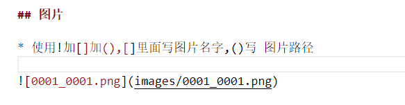

# MarkDown语法

## 什么是MarkDown

* MarkDown是一种编辑标记语言,通过简单的标记,可以使普通文本内容具有一定的格式.

# MarkDown学习

## 标题

* 使用#+空格 设置标题等级,一个#就是一级标题,两个##就是二级标题,一次递增,最高6级

### 三级标题测试

#### 四级标题测试

##### 五级标题测试

###### 六级标题测试


## 字体

* **粗体** 两边各加两个* 号

* *斜体* 两边各加一个* 号

* ***粗斜体***  两边各加三个* 号

* ~~删除线~~ 两边各加两个~号

* ~~**删除粗体**~~  两边各加两个~号,两个**号

* *~~斜体删除~~*  两边1个*,两边两个~~

* <font size=7>我是变大的字</font>

## 引用

* 使用>号,引用,可以嵌套,最多三级引用

* > 这个是引用

* >> 二级引用

* >>> 三级引用

## 分割线

* 三个 --- 减号,设置分割线

---

* 三个 *** 号,也可以设置分割线

***

## 图片

* 使用!加[]加(),[]里面写图片名字,()写 图片路径



## 超链接

* 使用[]加()设置超链接,[]写超链接名字,()里写入超链接地址

[谢连雄网址](https://starmenxie.top)

[百度网址](https://www.baidu.com)


## 列表

### 有序列表


#### 输入数字1.加空格自动输出有序列表,删除自动减1

1. 第一个
1. 第二个
1. 第三个

### 无序列表
##### 输入-,或者*,+,号加空格,无序列表
- 第一个
* 第二个
+ 第三个

### 列表嵌套

1. 第一点
    * a.小点
    * b.小点
1. 第二点
    * a.小点
    * b.小点

1. 第三点
    * a.小点
    * b.小点


## 表格

* 通过||输入表格,|---|区分表头

* 使用 :-左对齐, -:右对齐,:-:居中对齐 


|名字|性别|生日|
|:--|:--:| --:|
| 张三| 男| 1月1日|
| 李四| 女| 2月2日|
| 欧五| 女| 3月3日|

## 换行

* 两个enter键,换行

第一行,内容是1234578.

第二行,内容是87654321.

## 数学公式

* 两个$$中间表示行内公式, $E=mc^2$

* 两个\$\$开头,两个\$\$结尾,表示整行公式

$$ f(x_1,x_2,\ldots,x_n) = x_1^2 + x_2^2 + \cdots + x+n^2 $$


## 代码

* 两个\`\` 之间表示行内代码, 这是一行c语言代码, `printf()`

* 用两个\`\`\` \`\`\`表示代码块

```
//注释
/*注释*/
#include <stdio.h>
int main(void){
    if(true)
        printf("hello word");
    else
        printf("ok word");
}
```