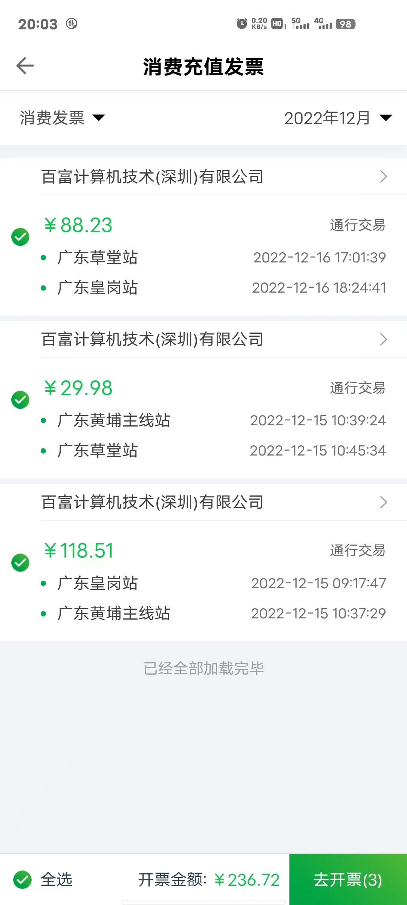
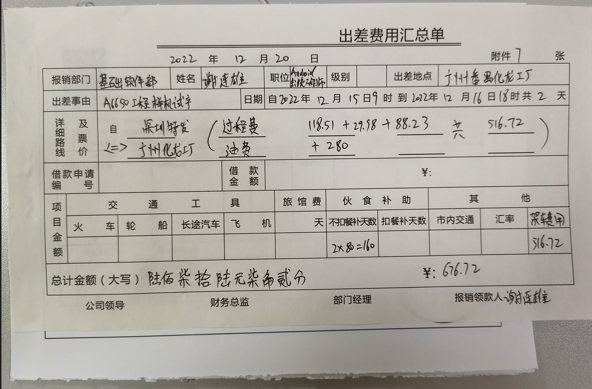

# README
这是报销模板

# 大写数字

**壹、贰、叁、肆、伍、陆、柒、捌、玖 零**

**亿、万、仟、佰、拾、元、角、分、零、整**

# 填单

* 打开app, E-Serve 联合电服 ,开具发票
    * 电子发票 -> 我要开票 -> 消费充值发票 -> 我要开票 -> 输入电话号码登录
    * 选择车牌号码的ETC,选择对应日期的发票

    

    * 输入电子邮箱接收发票

* 纸质表格

* 可以才用附件work表格做模板,打印电子发票

# 签字

最后找对应领导签字

