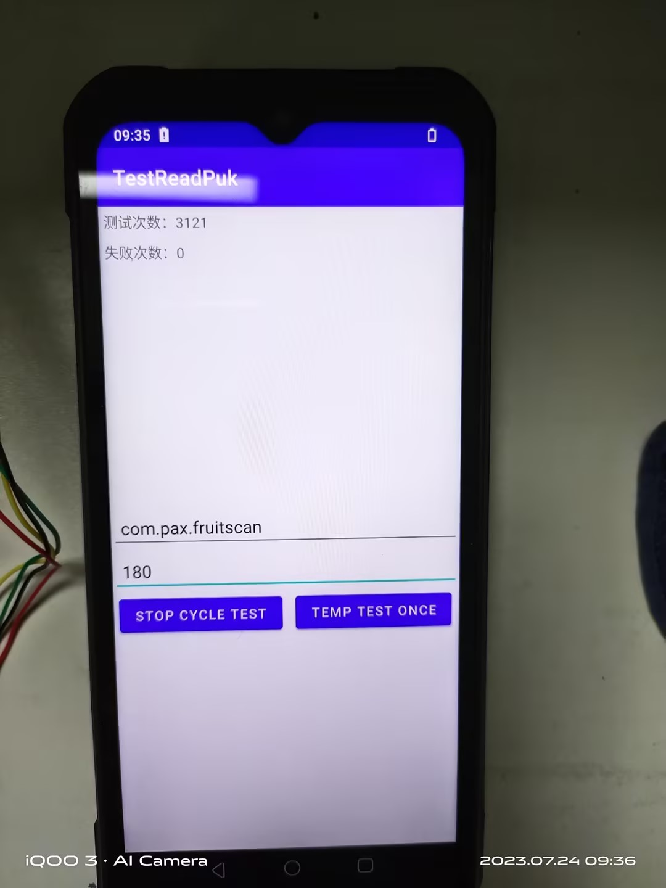
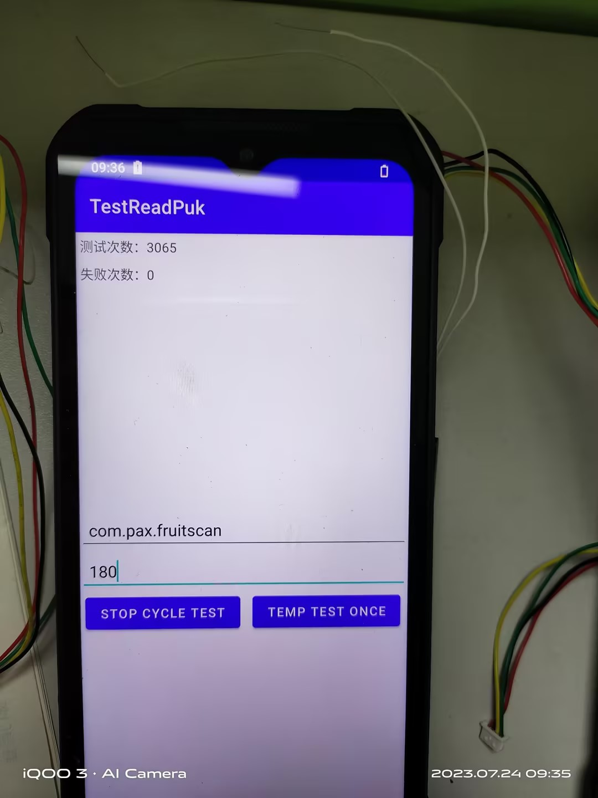
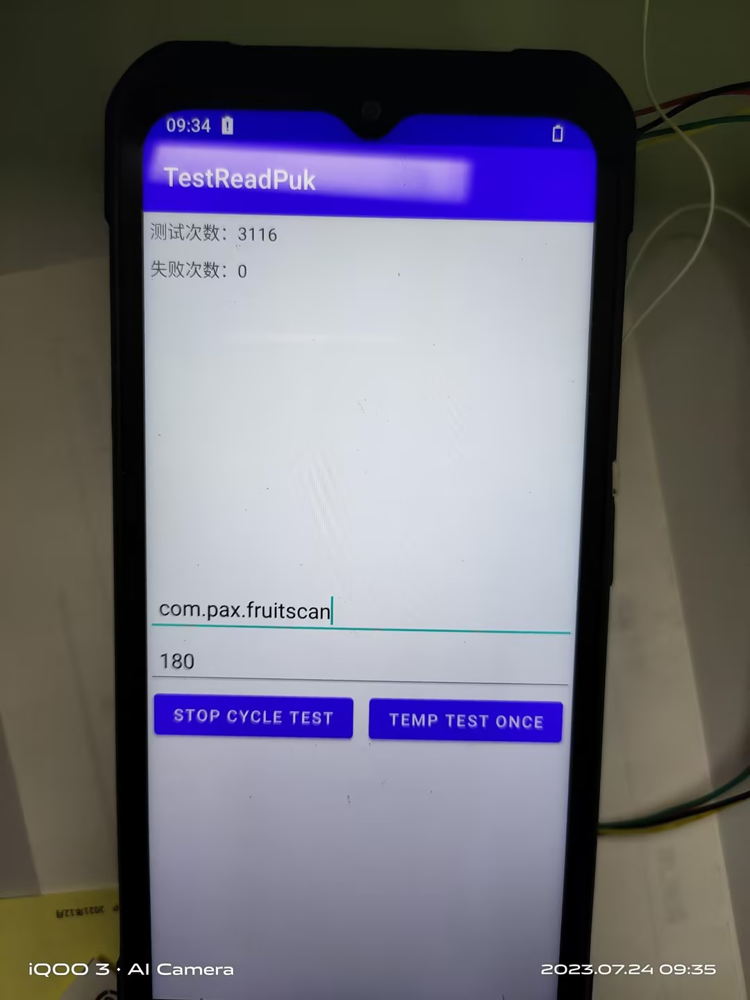

# 2023年 第30周

## 2023年7月24日周1

### A6650

* wiki周报

* 晓瑞log分析

* nfc问题分析,跟进

* read puk 压力测试通过,上周一,测试到这周一,3000多次都没有问题

    

    

    

## 2023年7月25日周2

### A6650

* nfc timeout问题分析

* nfc 充值分析,Mifare S70卡,MifareClassic_FUN3 测试用例

## 2023年7月26日周3

### A6650

* nfc 文件极客不能分享文件分析

* nfc 充值分析,Mifare S70卡,MifareClassic_FUN3 测试用例

## 2023年7月27日周4

### A6650

* nfc 充值分析,Mifare S70卡,MifareClassic_FUN3 测试用例

* 测试用例回复

* ce认证,蓝牙耳机问题,更新可以连接蓝牙耳机的user版本

## 2023年7月28日周5

### A6650

* CE 认证EM机器,重新发送版本.

* nfc B卡 timeout分析