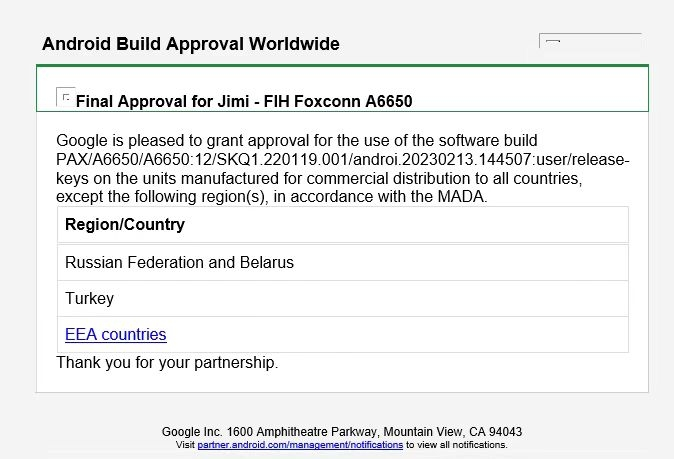
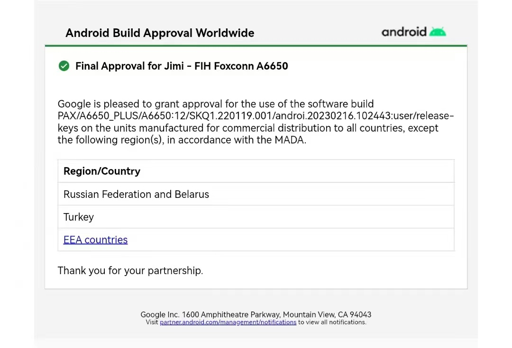
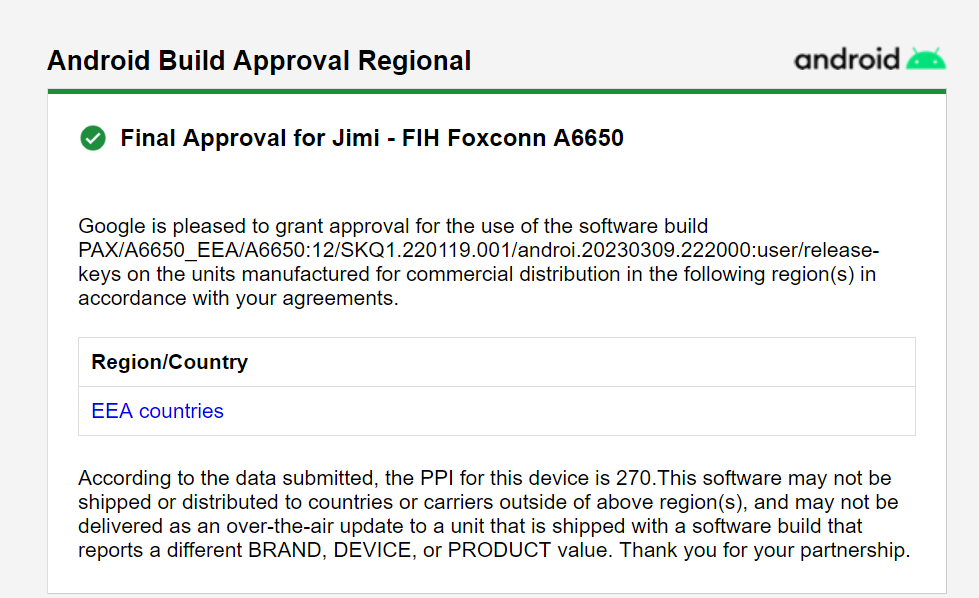

# A6650

项目里程碑

# 20220601

* 软件使用移远开发板进行开发

# 20220919

* 原型机装机,带了10台机器,软件分配

# 20221031

* 提交第一轮软件测试

# 20221213

* 工程样机试产,17台机器寄回来

* 15台给九洲

* 17台机器,多种功能不行

# 20230104

* 第二批次 工程样机试产

* 带回去给软件用15台机器，8台EM，7台NA

* 给了8台NA的机器,九洲,3pl两个项目一起跑

# 20230113

* 寄出4台机器到德国Euroshop展会
    > 刷了PayDroid_12.0.0_Ginkgo_V23.1.00T0_20230113_Release.paydroid,本地编译的,更新luancher logkit问题

# 20230119

* 第二轮软件测试提测

# 20230217

* gms提交3pl测试

# 20230224

* 第一个gms认证取得

# 20230227

* 第2个gms认证取得,A6650_PLUS

# 20230322

* 第3个gms认证取得,A6650_EEA,PAX/A6650_EEA/A6650:12/SKQ1.220119.001/androi.20230309.222000:user/release-keys

