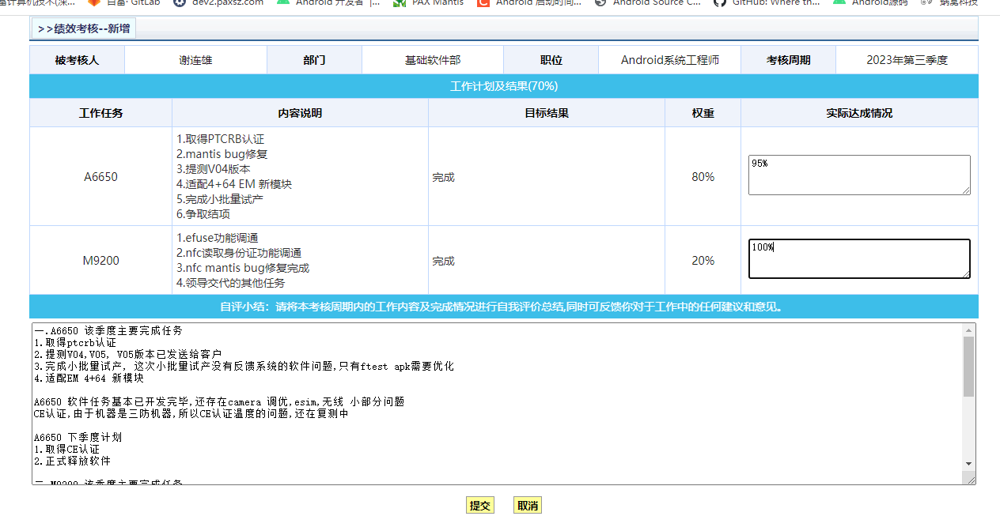

# 概要

每个季度都要写总结,总结一个季度模板

# 模板

* title

该季度主要完成工作

* 认证类

    * 1.取得ptcrb认证

* 软件发布或者提测

    * 2.提测V04,V05软件,V05已发送给客户

* 试产量产相关

    * 3. 完成小批量量产,这次小批量软件,没有反馈软件问题

* 其他具体工作

    * 适配4+64EM新模块

* 整体性总结

    * 1.软件任务基本已经开发完毕,还存在camera的调优,esim,无线小部分问题.CE认证由于温度问题,还在处理.

* 下季度计划

1.取得CE认证,正式释放软件

# 实际模板



```
一.A6650 该季度主要完成任务
1.取得ptcrb认证
2.提测V04,V05, V05版本已发送给客户
3.完成小批量试产, 这次小批量试产没有反馈系统的软件问题,只有ftest apk需要优化
4.适配EM 4+64 新模块

A6650 软件任务基本已开发完毕,还存在camera 调优,esim,无线 小部分问题
CE认证,由于机器是三防机器,所以CE认证温度的问题,还在复测中

A6650 下季度计划
1.取得CE认证
2.正式释放软件

二.M9200 该季度主要完成任务
1.调通efuse功能
2.完成其他任务

M9200 负责的模块任务,已完成.身份证功能暂时不需要,所以没有调试.

三.展锐AF6项目
季度末的时候,做了AF6一些前期操作

AF6 下季度计划
1.提测功能完善的V01版本.
```