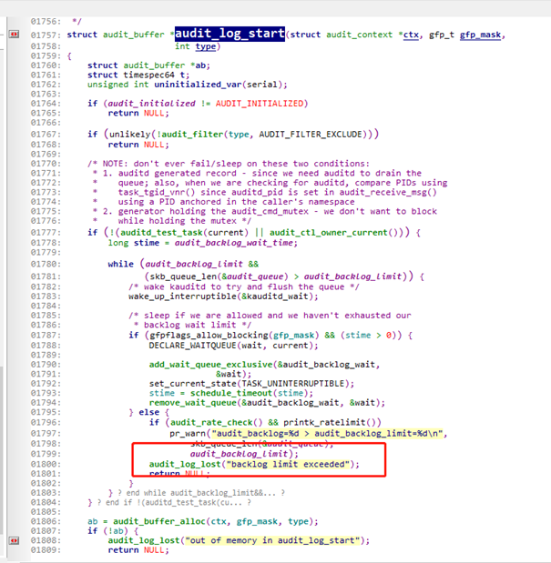
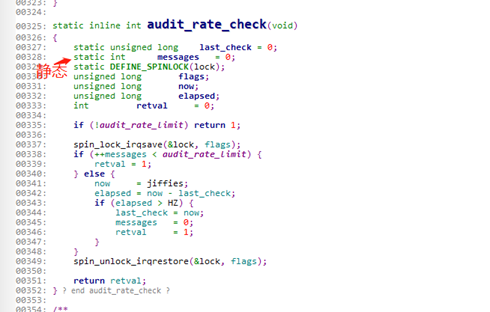

# README

selinux的一些配置 使用方法

# 配置selinux ioctl具体命令

* allow paxservice device:chr_file { read write open ioctl getattr };

* allowxperm paxservice device:chr_file ioctl { PCD_SET_CONF PCD_CARRIER_OPEN PCD_WAITER };

# log没有报具体selinux报错的解决方法

## log

```
01-31 16:07:50.023  2898  2923 W Util    : It took 29(ms) to exeCmd aapt r /tmp/whole.apk  META-INF/ISOSIGNV1.SGN
01-31 16:07:50.024  2898  2923 W System.err: java.io.IOException: Permission denied
01-31 16:07:50.024  2898  2923 W System.err: 	at sun.nio.ch.FileChannelImpl.map0(Native Method)
01-31 16:07:50.024  2898  2923 W System.err: 	at sun.nio.ch.FileChannelImpl.map(FileChannelImpl.java:984)
01-31 16:07:50.024  2898  2923 W System.err: 	at com.paxdroid.util.ByteConverter.fileToByteArray(ByteConverter.java:94)
01-31 16:07:50.024  2898  2923 W System.err: 	at com.paxdroid.verify.customer.PaxCertVerify.realVerify(PaxCertVerify.java:54)
01-31 16:07:50.024  2898  2923 W System.err: 	at com.paxdroid.verify.customer.CustomerPaxCert.verifyPackage(CustomerPaxCert.java:12)
01-31 16:07:50.024  2898  2923 W System.err: 	at com.paxdroid.verify.customer.CustomerPaxsz.verifyPackage(CustomerPaxsz.java:80)
01-31 16:07:50.024  2898  2923 W System.err: 	at com.paxdroid.verify.PkgVerifier.verifyPackage(PkgVerifier.java:46)
01-31 16:07:50.024  2898  2923 W System.err: 	at com.paxdroid.verify.IPkgVerifier$Stub.onTransact(IPkgVerifier.java:128)
01-31 16:07:50.024  2898  2923 W System.err: 	at android.os.Binder.execTransactInternal(Binder.java:1184)
01-31 16:07:50.024  2898  2923 W System.err: 	at android.os.Binder.execTransact(Binder.java:1143)
01-31 16:07:50.024  2898  2923 W PaxCertVerify: paxsz parse sign result = 0
```

## 源码

    ```
    if (!prepareFiles()){
        return PackageManager.INSTALL_FAILED_VERIFICATION_FAILURE;
    }

    byte[] signData = ByteConverter.fileToByteArray(APKSIGN_FILE_PATH);//log对应这句
    PaxCertParser p = new PaxCertParser();
    int parseSignResult = p.parse(signData);
    Log.w(TAG, "paxsz parse sign result = " + parseSignResult);

    if (parseSignResult == 1) {
    ```

## 处理方法

由于log看不清楚是否selinux 权限报错,不清楚是哪一方面的权限问题.

所以可以先把selinux权限放开,捉取log,并且看测试结果.

* setenforce0 后,log显示如下

    ```
    01-31 16:39:53.467  2898  2923 W Util    : It took 28(ms) to exeCmd aapt r /tmp/whole.apk  META-INF/ISOSIGNV1.SGN
    01-31 16:39:53.463  2898  2898 I Binder:2898_3: type=1400 audit(0.0:48025): avc: denied { map } for path="/pax/tmp/META-INF/APKSIGNV1.SGN" dev="mmcblk0p82" ino=25609 scontext=u:r:system_app:s0 tcontext=u:object_r:cache_file:s0 tclass=file permissive=1
    01-31 16:39:53.469  2898  2923 W PaxCertVerify: paxsz parse sign result = 1
    ```

* 放开selinux权限后,明显没有看到相关报错了.并且 selinux哪个报错也提示了,所以解决相关的selinux权限报错

# 查看selinux 属组

* ls -Z /dev/block/by-name/pax_nvram -> block_device

```
M9200:/ # ls -Z /dev/block/by-name/pax_nvram
u:object_r:block_device:s0 /dev/block/by-name/pax_nvram
M9200:/ #
```

> 修改没效,估计pax_nvram是link文件,需要restorecon /dev/block/by-name/pax_nvram一下
> restorecon -Rv,自动修正selinux上下文

```
M9200:/ # ls -lZ /dev/block/by-name/pax_nvram
lrwxrwxrwx 1 root root u:object_r:pax_nvram_device:s0  21 1970-01-01 15:25 /dev/block/by-name/pax_nvram -> /dev/block/mmcblk0p55
M9200:/ #
```

* link文件一些特殊修改

relabelfrom 从现有类型改变安全上下文  SELinux特定许可
relabelto   改变新类型的安全上下文    SELinux特定许可

```
+++ b/QSSI.12/system/sepolicy/prebuilts/api/31.0/private/init.te
@@ -79,6 +79,8 @@ allow init ota_metadata_file:dir lock;
 # Allow init to restore contexts of vd_device(/dev/block/vd[..]) when labeling
 # /dev/block.
 allow init vd_device:blk_file relabelto;
+allow init block_device:lnk_file relabelfrom;
+allow init pax_nvram_device:lnk_file relabelto;
```

# selinux属组某些原因没有改变

可以再init.rc里面,通过配置restorecon -R /（对应权限目录）去改变属组

# 基本命令分析

/system/bin/modemtool u:object: modemtool_exec:s0

* /system/bin/modemtool：系统中具体资源，如服务名、设备名、文件目录等

* u: selinux中唯一的用户

* object_r:描述资源类型。r为进程资源，object_r非进程资源

* modemtool_exec：资源在权限规则中所属代表

* s0：selinux中权限级别，一般使用s0

# log不打印 selinux log

log 有 rate limit exceeded 打印,最终分析是avc 打印太多,所以限制了每秒打印次数.

```
04-24 17:32:16.639 E/audit   (    0): rate limit exceeded
```





* auditctl -r 20

可以通过执行auditctl -r 20来设置每秒钟打印avc日志大小

* auditctl –r 0

设置auditctl –r 0来不控制avc限流

* 如果audictrl不行的话,可以直接打印cat /proc/kmsg,或者dmesg -w

    因为logcat 不报selinux log有可能是logcat丢了. selinux log是从kernel直接打印的.所以可以直接打印kernel log

# 确认selinux编译生效

可以打开out目录下的*sepolicy.cil 文件,看看是否生效,不过要注意是qssi,system,system_ext,还是UM/vendor,一般都是空间占用最大的文件

* QSSI.12/out/target/product/qssi/system/etc/selinux/plat_sepolicy.cil

* QSSI.12/out/target/product/qssi/system_ext/etc/selinux/system_ext_sepolicy.cil

* QSSI.12/out/target/product/qssi/product/etc/selinux/product_sepolicy.cil

* UM.9.15/out/target/product/bengal/vendor/etc/selinux/vendor_sepolicy.cil

# 设置属性属组

* property_contexts -> vendor/paxsz/sepolicy/private/property_contexts

```
pax.                            u:object_r:pax_ctrl_prop:s0
pax.ctrl.                       u:object_r:pax_ctrl_prop:s0
pax.soc.                        u:object_r:pax_ctrl_prop:s0
com.pax.                        u:object_r:pax_ctrl_prop:s0
pax.sp.                         u:object_r:pax_ctrl_prop:s0
persist.pax.                    u:object_r:pax_ctrl_prop:s0
persist.pax.ctrl.               u:object_r:pax_ctrl_prop:s0
ro.epay.serial                  u:object_r:pax_ctrl_prop:s0
ro.ums.manufacturer.info        u:object_r:pax_ctrl_prop:s0
pax.sys.                        u:object_r:pax_ctrl_prop:s0
pax.sdk.                        u:object_r:pax_ctrl_prop:s0
pax.persist.                    u:object_r:pax_ctrl_prop:s0
pax.param.                      u:object_r:pax_ctrl_prop:s0
ro.pax.                         u:object_r:pax_ctrl_prop:s0
persist.system.                 u:object_r:pax_ctrl_prop:s0
```