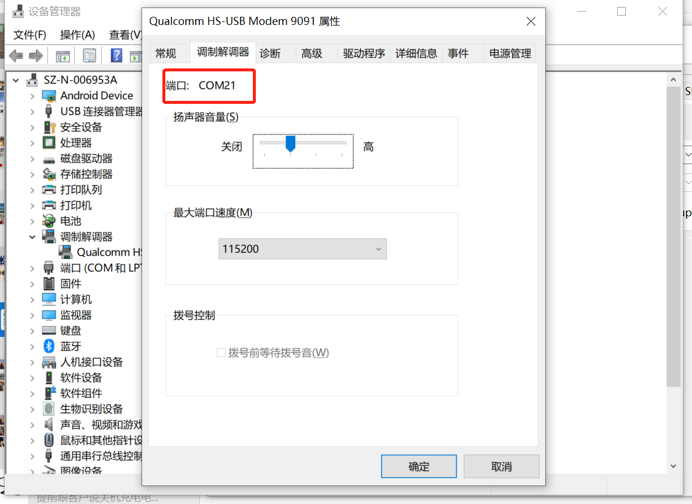
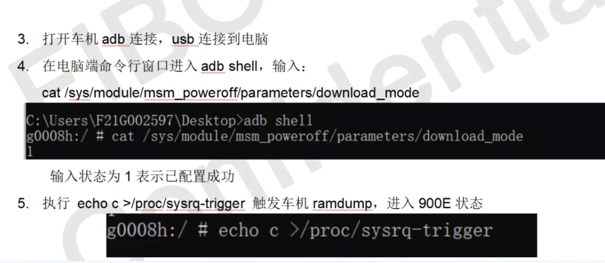
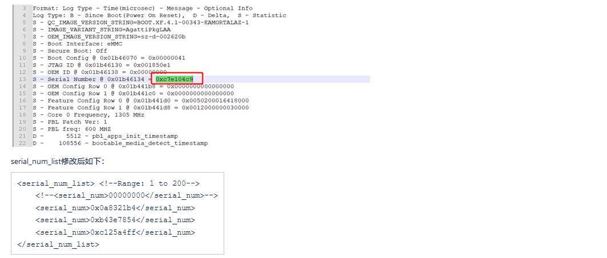
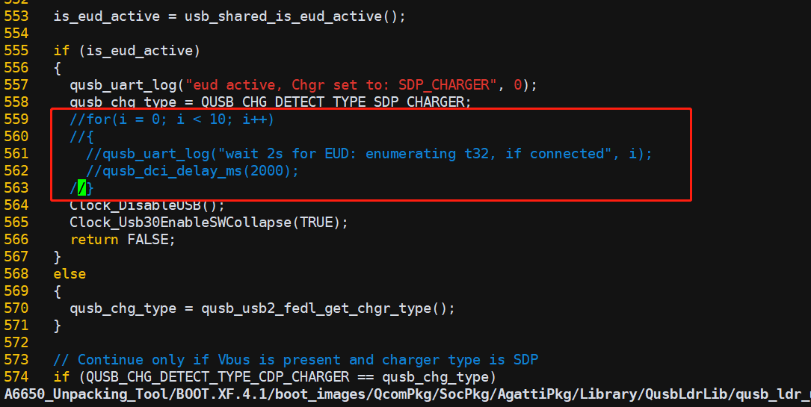
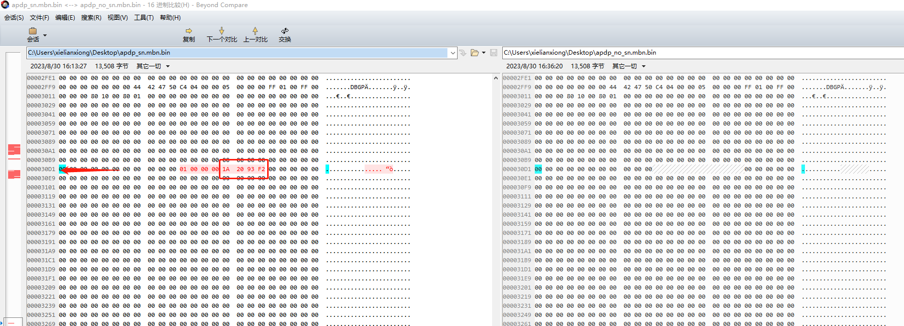

# 高通平台死机dump log

## 移远

* 需要打开高通的调制解调器 
    * setprop sys.usb.config diag,serial_cdev,rmnet,adb

* 打开电脑的设备管理器,调制解调器,属性,如下图,端口21



* 使用 QCOM_V1.6.exe 输入命令 at+qcfg="dumpenable",1 ,, 打开死机dump功能

    * at+qcfg="dumpenable" 查询是否开启dump功能
    * at+qcfg="dumpenable",0  //0表示死机后直接开机
    * at+qcfg="dumpenable",1  //1表示死机后进入dump

    * 用at命令写入的是保存在fsc分区, 可以预置fsc分区,然后fastboot flash fsc fsc.bin
        > 代码里面,读取的是,A6650_Unpacking_Tool/BOOT.XF.4.1/boot_images/QcomPkg/SocPkg/Library/XBLLoaderLib/sbl1_mc.c
        ```
        int sbl1_check_dump_enable_nvdata1 (void)
        {
            int result=0;
            boot_boolean success = FALSE;
            boot_flash_trans_if_type *trans_if = NULL;
            static uint8 nvdata1_buffer[16];
            boot_flash_configure_target_image(nvdata1_partition_id);
            trans_if = boot_flash_dev_open_image(GEN_IMG);

            /* Verify ddr training data size is valid */
            BL_VERIFY( trans_if != NULL, BL_ERR_NULL_PTR_PASSED|BL_ERROR_GROUP_BOOT );

            success = quec_boot_flash_trans_read_enable_dump(trans_if,
                                                            (void *) nvdata1_buffer,
                                                            0x10,
                                                            16,  
                                                            IMAGE_BODY_TYPE);

            BL_VERIFY(success, BL_ERR_FLASH_READ_FAIL|BL_ERROR_GROUP_BOOT);

            /* close parition */
            boot_flash_dev_close_image(&trans_if);

            if (strstr((const char *)nvdata1_buffer, "enabledump") != NULL) {
                boot_log_message("enable_dump");
                return 1;
            } else {
                boot_log_message("disable_dump");
                boot_hw_reset(BOOT_HARD_RESET_TYPE);
                return 0;
                }

            return result;

        }
        ```

* 打开 QPST Configuration Application, 插上usb,自动导出log,配合vmlinux,  捉到的log在help 可以看到目录


* 输入echo c > /proc/sysrq-trigger 可以测试死机

## 广和通

* 跟移远相差应该不大,但是有些具体命令,如下图

* cat /sys/module/msm_poweroff/parameters/download_mode



# sysrq-trigger

/proc/sysrq-trigger 文件用于在Linux系统中触发紧急操作，例如立即重启、关闭计算机，以及导出内存分配、CPU寄存器和标志位、线程状态等信息。

具体来说，通过写入以下命令到该文件，可以触发不同的操作：

* echo "b" > /proc/sysrq-trigger：立即重启计算机。

* echo "o" > /proc/sysrq-trigger：立即关闭计算机。

* echo "m" > proc/sysrq-trigger：导出内存分配的信息，可以在 /var/log/message 文件中查看输出结果。

* echo "p" > proc/sysrq-trigger：导出当前CPU寄存器信息和标志位的信息。

* echo "t" > proc/sysrq-trigger：导出线程状态信息。

* echo "c" > proc/sysrq-trigger：触发crash,进入dump

# 烧录efuse后,dump失败

机器烧录efuse后,手动触发crash,机器直接重启,不进入dump

解决方法

* QCM2290.LA.2.0/common/sectools/config/agatti/agatti_debugpolicy.xml

    *   value值 全部写1

    ```
    <flags>
                <flag> <bit_pos>0</bit_pos> <value>1</value> </flag> <!--DP_ENABLE_ONLINE_CRASH_DUMPS-->
                <flag> <bit_pos>1</bit_pos> <value>1</value> </flag> <!--DP_ENABLE_OFFLINE_CRASH_DUMPS-->
                <flag> <bit_pos>2</bit_pos> <value>1</value> </flag> <!--DP_ENABLE_JTAG-->
                <flag> <bit_pos>3</bit_pos> <value>1</value> </flag> <!--DP_ENABLE_LOGS-->
                <flag> <bit_pos>4</bit_pos> <value>1</value> </flag> <!-- DP_ENABLE_MODEM_INV_DEBUG -->
                <flag> <bit_pos>5</bit_pos> <value>1</value> </flag> <!-- DP_ENABLE_MODEM_NINV_DEBUG -->
                <flag> <bit_pos>6</bit_pos> <value>1</value> </flag> <!-- DP_ENABLE_DEBUG_INV -->
                <flag> <bit_pos>7</bit_pos> <value>1</value> </flag> <!-- DP_ENABLE_DEBUG_LEVEL -->
                <flag> <bit_pos>8</bit_pos> <value>1</value> </flag> <!-- DP_ENABLE_DEBUG_LEVEL -->
                <flag> <bit_pos>24</bit_pos> <value>1</value> </flag> <!--DP_ENABLE_NONSECURE_CRASH_DUMPS-->
                <flag> <bit_pos>25</bit_pos> <value>1</value> </flag> <!--DP_ENABLE_APPS_ENCRYPTED_MINI_DUMPS-->
                <flag> <bit_pos>26</bit_pos> <value>1</value> </flag> <!--DP_ENABLE_MPSS_ENCRYPTED_MINI_DUMPS-->
                <flag> <bit_pos>27</bit_pos> <value>1</value> </flag> <!--DP_ENABLE_LPASS_ENCRYPTED_MINI_DUMPS-->
                <flag> <bit_pos>28</bit_pos> <value>1</value> </flag> <!--DP_ENABLE_CSS_ENCRYPTED_MINI_DUMPS-->
                <flag> <bit_pos>29</bit_pos> <value>1</value> </flag> <!--DP_ENABLE_ADSP_ENCRYPTED_MINI_DUMPS-->
                <flag> <bit_pos>30</bit_pos> <value>1</value> </flag> <!--DP_ENABLE_CDSP_ENCRYPTED_MINI_DUMPS-->
                <flag> <bit_pos>31</bit_pos> <value>1</value> </flag> <!--DP_ENABLE_WLAN_ENCRYPTED_MINI_DUMPS-->
            </flags>
    ```

    * 填入 要开dump的机器的serial num

        xbl abl 都会打印这个serial num,xbl小写,abl大写

        ```
        [2023/8/30 16:35:30] Format: Log Type - Time(microsec) - Message - Optional Info
        [2023/8/30 16:35:30] Log Type: B - Since Boot(Power On Reset),  D - Delta,  S - Statistic
        [2023/8/30 16:35:30] S - QC_IMAGE_VERSION_STRING=BOOT.XF.4.1-00343-KAMORTALAZ-1
        [2023/8/30 16:35:30] S - IMAGE_VARIANT_STRING=AgattiPkgLAA
        [2023/8/30 16:35:30] S - OEM_IMAGE_VERSION_STRING=ubuntu2145
        [2023/8/30 16:35:30] S - Boot Interface: eMMC
        [2023/8/30 16:35:30] S - Secure Boot: On
        [2023/8/30 16:35:30] S - Boot Config @ 0x01b46070 = 0x00000041
        [2023/8/30 16:35:30] S - JTAG ID @ 0x01b46130 = 0x001850e1
        [2023/8/30 16:35:30] S - OEM ID @ 0x01b46138 = 0x00000000
        [2023/8/30 16:35:30] S - Serial Number @ 0x01b46134 = 0xf293201a

        [2023/8/30 16:35:52] Platform Init  [22420] BDS
        [2023/8/30 16:35:52] UEFI Ver   : 5.0.230829.BOOT.XF.4.1-00343-KAMORTALAZ-1
        [2023/8/30 16:35:52] Platform           : IDP
        [2023/8/30 16:35:52] Chip Name          : QCM_AGATTI
        [2023/8/30 16:35:52] Chip Ver           : 1.0
        [2023/8/30 16:35:52] Chip Serial Number : 0xF293201A
        ```

        

    ```
        <serial_num_list> <!--Range: 1 to 200-->
            <!--<serial_num>00000000</serial_num>-->
        </serial_num_list>
    ```

    * A6650_Unpacking_Tool/BOOT.XF.4.1/boot_images/QcomPkg/SocPkg/AgattiPkg/Library/QusbLdrLib/qusb_ldr_utils.c

        烧录了apdp.mbn后,APDP Image Loaded，xbl会有20秒的EUD log打印，需要去掉

        这个去不去掉都可以,去掉就避免延迟20秒

        

    * 编译apdp

        apdp分区,默认是空的,没有写入

        QCM2290.LA.2.0$ python common/sectools/sectools.py debugpolicy -i dbgp_ap --sign_id=dbgp_ap -p agatti -g -s

        编译的文件在QCM2290.LA.2.0/common/sectools/debugpolicy_output/apdp.mbn
        
        用fastboot或者qfil单独升级apbp分区，重启即可

        sn是保存在apdp.mbn分区的0x000030D1 这一行的位置, 串口log,`Serial Number @ 0x01b46134 = 0xf293201a`

        

* 后面经过跟高通沟通,说填入机器的serial num 这一步可以忽略,验证也是可以的

# 注意

若开了熔丝后，没有开debugpolicy，测试出来RMPB Key status: RPMB_KEY_PROVISIONED_AND_OK (0)，

说明在熔丝之前有些emmc的rpmb，用的是test key，会导致熔丝后不开机，不开机的log如下

```
QseeLoadServiceImageSyscall Failed
Keymaster failed to load! Status = 0x1
Unable to load Keymaster using label Status:14
```

解决方法是换flash，或者针对熔丝后不开机的机器打开 debugpolicy
后续量产的机器要求先烧熔丝，再写rpmb key（rpmb key只能写一次）