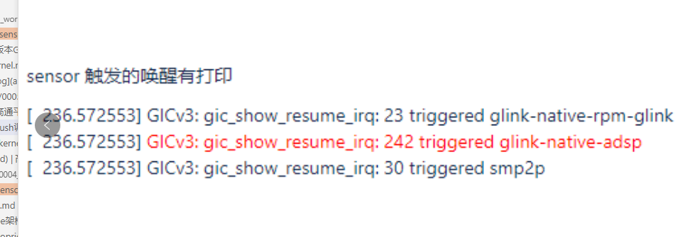

# 高通android 12,see架构sensor修改验证

* 配置int1或者int2,上报模式用polling 等修改

    * 修改UM.9.15/vendor/qcom/proprietary/sensors-see/registry/config/bengal/agatti_qmi8658_0.json源文件

# 验证
```
adb remount
adb push .\agatti_qmi8658_0.json /vendor/etc/sensors/config/
adb shell
rm mnt/vendor/persist/sensors/registry/registry/*
reboot
```

# adb 删除sensor,验证功耗sensor是否漏电,关闭sensor

Case#2. disable sensor core by removing sensor json file, SLPI will running and sensor driver will 
init fail due to no registry file exist .

* 少于P version
```
adb root
adb wait-for-device
adb remount
adb shell rm -rf /persist/sensors/registry/registry
adb shell rm -rf /persist/sensors/registry/config
adb shell rm -rf /vendor/etc/sensors/config
adb shell sync
adb reboot
```

* P+ version, A6650

```
for android P version, the sensors path has been changed, please use below command:
adb root
adb wait-for-device
adb remount
adb shell rm /vendor/etc/sensors/config/*.json
adb shell rm /mnt/vendor/persist/sensors/registry/config/*.json
adb shell rm /mnt/vendor/persist/sensors/registry/registry/*
adb shell sync
adb reboot
```

```
rm /vendor/etc/sensors/config/agatti_qmi8658_0.json
rm -rf /mnt/vendor/persist/sensors/registry/registry/*8658*
```

# 高通sensor,抬手亮屏log

* echo 8 > /proc/sys/kernel/printk

* echo 1 > /sys/module/msm_show_resume_irq/parameters/debug_mask

* 捉串口log

* 机器休眠的时候,动一下sensor,看一下是否有以下打印

    

*