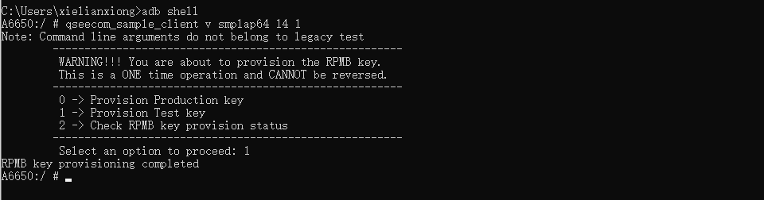

# README
* 谷歌key 相关

# 写入google key

## 高通平台

* adb root

* adb push keybox.xml /data/

* adb shell

* qseecom_sample_client v smplap64 14 1
    * 选择 1
    

* LD_LIBRARY_PATH=/vendor/lib/hw KmInstallKeybox /data/keybox100.xml PAXA6650000060 true

```
Brand: PAX
Device: A6650
Product: A6650
SerialNum: cd2dfa1d
Manufacturer: QUALCOMM
Model: Bengal for arm64
Imei: 868635060322769
Meid: A10000247C9EE1
Number of keyboxes 100
myDeviceID: PAXA6650000061
keyboxCtx.device_id.data: PAXA6650000001
-------
myDeviceID: PAXA6650000061
keyboxCtx.device_id.data: PAXA6650000061
KeyMaster Attestation Key Provisioning success for KeyIDPAXA6650000061
TEE done
InstallKeybox is done!
```

# 查询谷歌key是否OK

## 高通平台

* 还有问题移远正在处理