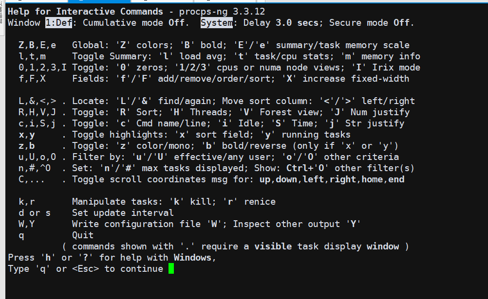

# README

常用Linux命令备注

# split

切割文件命令

* split -b 5m -d --verbose binder_1009_2.txt binder_1009_2_

    > 5m每个文件,数字结尾,切割文件

# lsof

lsof（list open files）是一个列出当前系统打开文件的工具

* lsof | grep文件名

* lsof `which httpd`        //查看哪个进程在使用apache的可执行文件

* lsof /etc/passwd          //查看哪个进程在占用/etc/passwd

* lsof /dev/hda6            //查看哪个进程在占用hda6

* lsof /dev/cdrom           //查看哪个进程在占用光驱

* lsof -c sendmail          //查看sendmail进程现在打开的文件

* lsof -c courier -u ^zahn  //显示出哪些文件被以courier打头的进程打开，但是并不属于用户zahn

* lsof -p 30297             //列出进程id为30297的进程所打开的文件

* lsof -D /tmp              //显示所有在/tmp目录下打开文件的进程
 
* lsof -u1000               //查看uid是1000的用户的进程的文件使用情况

* lsof -utony               //查看用户tony的进程的文件使用情况

* lsof -u^tony              //查看不是用户tony的进程的文件使用情况(^是取反的意思)

* lsof -i                   //显示所有已经打开的端口

# git

* 生成patch

    * git format-patch -1 <r1>

    * git format-patch -1 5f0b0972d987e8caf16edd3312aa5e3151b8dc38 -o ~/cve/CVE-2023-20966

        生成如下

        ```
        ~/cve/CVE-2023-20966/0001-Title-CVE-2023-20966.patch
        ```

* 应用patch

    * git am 0001-limit-log-function.patch

* 生成patch,不带commit信息

    * git diff 2a2fb4539925bfa4a141fe492d9828d030f7c8a8  89aebfcc73bdac8054be1a242598610d8ed5f3c8 > patch.diff

* 应用不带commit的diff patch

    * git apply pn5190_suspend_close_clock.patch

* git am 与 apply区别

git apply用于应用直接差异(例如来自git diff),

git am 应用与git format-patch

git am带提交注释

git apply 不带提交注释

# git tag

* 查看tag, git tag

* checkout某一个tag, git checkout tag_name -b new_branch_name

# git log

* git log --since="2023-04-01" --until="HEAD"

* git log --since="1 week ago" --until="now"

* git log --no-merges --since="2023-01-01" --until="HEAD" > ~/A6650.txt

* git log --since="2023-01-01" --until="2023-12-21"

* lns = log --name-status
* lpf = log --pretty=fuller
* lnm = log --no-merges

# find

* 忽略某个路径查找

    * find . ! -path "./out/*" -name "*\.mk"

* 查找两个

    * find -name *.c -or -name *.h

* 删除找到的目录

find . -name .svn -exec rm -rvf {} \;

* 统计文件个数

    * find . -type f | wc -l

* 统计文件个数当前文件个数

    * find . -maxdepth 1 -type f | wc -l

# grep

* 找到一条就停止

    * grep -m 1

# sed

* sed -e "/grep/d" -e "/gpt/d"

    > -e表示多个指令，
    > /grep/表示匹配到grep的行
    > d表示删除
    > 上命令表示，删除带grep gpt的行

# dump_stack

* 内核 dump_stack();  linux堆栈,linux打印堆栈

# patch

* patch合入 补丁 diff补丁

* patch -p[n] < test.patch

    > --- src/a/b/c/d/file
    > +++ src_new/a/b/c/d/file

    * 使用p0 表示在当前目录下查找src/a/b/c/d/file
    * 使用p1 表示在当前目录下查找a/b/c/d/file
    * 使用p2 表示在当前目录下查找b/c/d/file
    * 使用p3 表示在当前目录下查找c/d/file
    * 使用p4 表示在当前目录下查找d/file
    * 使用p5 表示在当前目录下查找file
    * 不使用pn表示忽略所有斜杠，在当前目录下查找file

# dd

* if = 文件名：输入文件名，缺省为标准输入。即指定源文件

* of = 文件名：输出文件名，缺省为标准输入。即指定目的文件。 < of = output file >

* ibs = bytes：一次读入bytes个字节，即指定一个块大小为bytes字节

* obs = bytes：一次输出bytes个字节，即指定一个块大小为bytes字节

* bs = bytes：同时设置读入/输出的块大小为bytes个字节。

* cbs = bytes：一次转换bytes个字节，即指定转换缓冲区的大小

* skip = blocks：从输入文件开头跳过blocks个块后再开始复制

    > 注意：通常只用当输出文件是磁盘或磁带时才有效，即备份到磁盘或磁带时才有效。

* count = blocks：仅拷贝blocks个块，块大小等于 ibs 指定的字节数。

* conv = conversion：用指定的参数转换文件。

    * ascii：转换ebcdic为ascii；

    * ebcdic：转换ascii为ebcdic；

    * ibm：转换ascii为alternate ebcdic；

    * block：把每一行转换为长度为cbs，不足部分用空格填充；

    * unblock：使每一行的长度都为cbs，不足部分用空格填充；

    * lcase：把大写字符转换为小写字符；

    * ucase：把小写字符转换为大写字符

    * swab：交换输入的每对字节；

    * noerror：出错时不停止；

    * notrunc：不截短输出文件；

    * sync：将每个输入块填充到ibs个字节，不足部分用空（NUL）字符补齐。

* 输出100KB ,全是0的 zero_100k.bin

    * dd if=/dev/zero of=zebo_100k.bin bs=1024 count=100
    * dd if=/dev/zero bs=8192 count=5000000 of=/sdcard/40Gb.file

* 输出100KB,全是0xff 的 ff_100.bin

    * tr '\000' '\377' < /dev/zero | dd of=fall_0xff.bin bs=1024 count=100

        > 把输入的/dev/zero  \000,替换成 \377, tr命令是替换
        > 然后dd到 of=fall_0xff.bin
        > \000 是 三位8进制,就是0
        > \377 是三位8进制 = 16进制的FF

# tr

Text Replacer,用于进行文本替换,tr 只能进行字符的替换、缩减和删除，不能用来替换字符串

* tr -c -d -s ["string1_to_translate_from"] ["string2_to_translate_to"] file

    * -c 用字符串1中字符集的补集替换此字符集，要求字符集为ASCII。

    * -d 删除字符串1中所有输入字符。

    * -s 删除所有重复出现字符序列，只保留第一个；即将重复出现字符串压缩为一个字符串。

* 去除oops.txt里面的重复的小写字符 （ # -s会保留第一个字符）

    ```
    [root@localhost ~]# cat oops.txt
    ddddfffabccccc
    lerrrrdddd
    [root@localhost ~]# tr -s "a-z" < oops.txt > result.txt
    [root@localhost ~]# cat result.txt
    dfabc
    lerd
    ```

* 删除空行(除了第一行)

    ```
    [root@localhost ~]# cat oops.txt
    ddddfffabccccc
    lerrrrdddd
    [root@localhost ~]# tr -s "\012" < oops.txt > result.txt
    [root@localhost ~]# cat result.txt
    ddddfffabccccc
    lerrrrdddd
    ```

* 删除所有行结束符

    ```
    [root@localhost ~]# cat oops.txt
    ddddfffabccccc
    lerrrrdddd
    [root@localhost ~]# tr -d "\012" <oops.txt > result.txt
    [root@localhost ~]# cat result.txt
    ddddfffabccccclerrrrdddd
    ```

* 小写到大写

```
[root@localhost ~]# cat oops.txt
ddddfffabccccc
errrrdddd
[root@localhost ~]# cat oops.txt | tr "a-z" "A-Z" > result.txt
[root@localhost ~]# cat result.txt
DDDDFFFABCCCCC
ERRRRDDDD
```

* 删除指定的字符（# -d 与 -s 不同，-d会全部删除，但-s会保留第一个）

```
[root@localhost ~]# cat oops.txt
ddddfffabccccc
errrrdddd
[root@localhost ~]# cat oops.txt | tr -d "bd" > result.txt
[root@localhost ~]# cat result.txt
fffaccccc
errrr
[root@localhost ~]# cat oops.txt | tr -s "bd" > result.txt
[root@localhost ~]# cat result.txt
dfffabccccc
errrrd
```

* 替代指定的字符（#一对一的替代）

```
[root@localhost ~]# cat oops.txt
ddddfffabccccc
errrrdddd
[root@localhost ~]# cat oops.txt | tr "bd" "BD" > result.txt
[root@localhost ~]# cat result.txt
DDDDfffaBccccc
errrrDDDD
```

# /dev/null

* 2>/dev/null

    意思就是把错误输出到“黑洞”

* 2>&1 >/dev/null

    意思就是把错误输出2重定向到标准出书1，也就是屏幕，标准输出进了“黑洞”，也就是标准输出进了黑洞，错误输出打印到屏幕

* >/dev/null 2>&1

    默认情况是1，也就是等同于1>/dev/null 2>&1。意思就是把标准输出重定向到“黑洞”，还把错误输出2重定向到标准输出1，也就是标准输出和错误输出都进了“黑洞”

* Linux系统预留可三个文件描述符：0、1和2，他们的意义如下所示：

    0——标准输入（stdin）
    1——标准输出（stdout）
    2——标准错误（stderr）

# tee

用途----显示程序的输出并将其复制到一个文件中。

tee [-ai][--help][--version][文件...]

* -a或--append 　附加到既有文件的后面，而非覆盖它．

* -i或--ignore-interrupts 　忽略中断信号。

* --help 　在线帮助。

* --version 　显示版本信息。

*  使用指令"tee"将用户输入的数据同时保存到文件"file1"和"file2"中，输入如下命令：

    * tee file1 file2                   #在两个文件中复制内容 

* 如果想同时打印到屏幕和文件里，可以这么写

    * ls -l | tee -a lsls.log

* 如果想把错误输出也同时打印到屏幕和文件，可以这么写：

    * ls -l not_find_runoob 2>&1 | tee -a lsls.log

# awk

## awk '{pattern + action}' <file>

* awk '{print $2, $4, $6}' log

    

## 分隔符

* awk -F ':|,' '{print $2, $4, $6}' log

    

## awk 的内置变量

* $0：表示当前整行，$1表示第一个字段，$2表示第二个字段，$n 表示第n个字段；

* NR：表示当前已读的行数；

* NF：表示当前行被分割的列数，NF表示最后一个字段，NF-1 表示倒数第二个字段；

* FILENAME：表示当前文件的名称

* BEGIN：表示在awk程序开始前执行一次

* END：表示在awk程序结束后执行一次。

* 在每一行前加上文件名、行号、每行列数，命令如下：

    

## 条件判断

* awk '$2 < 5.0 {print $0}' log

    

## 统计值的计算

* vel 的最大值,awk -F ':|,' 'BEGIN {max=0} {if($2>max) max=$2} END {print "max vel:", max}' log

    

*  acc 的最小值,awk -F ':|,' 'BEGIN {min=10} {if($4 < min) min=$4} END {print "min acc:", min}' log

    

* 计算 steer 的平均值,awk -F ':|,' 'BEGIN {sum=0} {sum+=$6} END {print "mean steer:", sum/NR}' log

    

## print和printf

* print：其参数可以是变量、数值或字符串，字符串必须用双引号，参数用逗号分开；

* printf：其用法与C语言的printf相似，可以格式化输出。

* 通过printf指定显示两位小数

    

# quota

Linux quota命令用于显示磁盘已使用的空间与限制。

执行quota指令，可查询磁盘空间的限制，并得知已使用多少空间。

* -g 列出群组的磁盘空间限制。

* -q 简明列表，只列出超过限制的部分。

* -u 列出用户的磁盘空间限制。

* -v 显示该用户或群组，在所有挂入系统的存储设备的空间限制。

* -V 显示版本信息。

* quota -uvs xielx

```
xielx@u295:~/ssdCode/a6650_1$ quota -uvs xielx
quota: Cannot open quotafile /SAS-LV/aquota.user: Permission denied
quota: Cannot open quotafile /SAS-LV/aquota.user: Permission denied
quota: Cannot open quotafile /SAS-LV/quota.user: No such file or directory
Disk quotas for user xielx (uid 1001): 
     Filesystem   space   quota   limit   grace   files   quota   limit   grace
/dev/mapper/ubuntu--vg-ubuntu--lv
                   612G    700G    763G           7173k       0       0        
/dev/mapper/SSD--VG-SSD--LV
                  1510G*  1431G   1526G   6days  13284k       0       0       
```

# top

## -d secs 指定进程列表的刷新速度，单位秒。

* top -d 5(每隔五秒刷新一次进程列表)

## -n max 指定进程列表的刷新次数，到达指定次数后 top 退出。

* top -n 3(在刷新3次进程列表后退出)

## -u user 只显示指定用户启动的进程

* top -u root(只显示以root用户启动的进程)

## -p pid 只显示指定 pid 的进程信息

* top -p 1(只显示PID=1的进程)

## -o fld 指定使用那一列来对进程进行排序，默认以CPU负载情况倒序排序

* top -o -PID(使用 PID 字段降序排序)

* top -o -USER

* top -o 就是使用默认的cpu负载

* 有以下选项

    * PID       = Process Id
    * USER      = 用户
    * NI        = Nice Value
    * VIRT      = Virtual Image (KiB)
    * RES       = Resident Size (KiB)
    * SHR       = Shared Memory (KiB)
    * S         = Process Status
    * CPU       = CPU负载,默认

## -b ,以批处理的方式打印数据,可以配合重定向> 输出到文件,或者配合 -n 打印几次后推出

* top -b

top 命令的批处理模式(Batch-mode)可以区别于正常使用的交互模式(Interactive-mode),在批处理模式下top 只会不断打印系统状态，无法接受其他交互模式下的命令。这种状态有点类似于 ping命令，如果配合-n 选项指定刷新次数的话就更像了，我们可以通过批处理模式将系统状态不断打印到日志中，实现实时监控的效果。


## -i ,不显示任何闲置 (idle) 或无用 (zombie) 的进程

* top -i

## top 交互模式

在上面我们提到了一个交互模式的概念，其实正常输入 top 命令不带任何参数进入的一个terminal 界面就是了。我们在这个模式下可以通过交互命令(Interactive Command)实现一些更加高级的操作，同时上面的top选项也可以在交互模式下通过交互命令实现配置。

* 交互模式,-h 可以出现help菜单



* 敲e,可以切换内存显示单位

* 敲s,可以改变刷新速度

* m 切换内存使用量的显示样式

* n 设置进程的显示数量

* b 高亮排序列

* H 显示线程

* i 切换是否显示空闲进程

* k 结束指定进程

* V 命令显示进程的树状结构

* F 命令指定字段过滤


* o 命令执行过滤,复杂,就不说了

# vim

* :%s/\/android\//\/QSSI.12\//g

    把整个文件的/android/替换成 /QSSI.12/

# wc

wc - print newline, word, and byte counts for each file

* -l：统计文件的行数。

* -w：统计文件的单词数（默认情况下，wc命令将空格、制表符和换行符视为单词分隔符）。

* -c：统计文件的字节数。

* -m：统计文件的字符数（包括空格和标点符号）。

* -L：只统计文件的总行数，而不统计单词数或字节数。

* -o：指定输出格式，可以使用逗号分隔的列表形式或自定义格式。

# rar

* rar x test.rar

解压文件