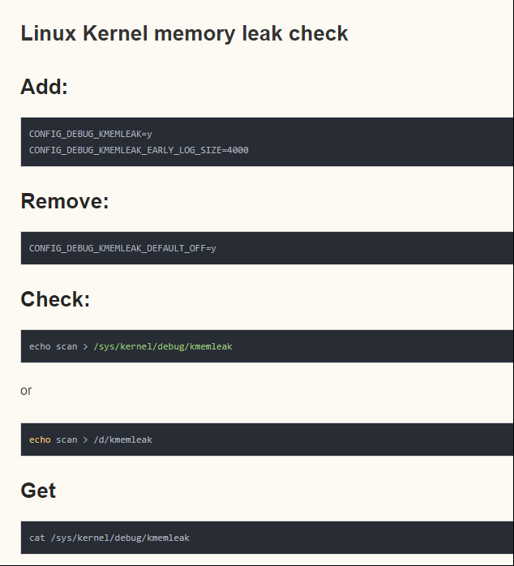

# README

使用kmemleak 排查内核是否漏内存

# 使用步骤

* 清除kmemleak的历史信息，以便记录新数据

    * echo clear > /sys/kernel/debug/kmemleak

* 加载需要测试的内核模块，并执行相关测试用例

    * ismod ***.ko

* 使能kmemleak进行内存泄漏扫描

    * echo scan > /sys/kernel/debug/kmemleak

* 查看分析扫描结果

    * cat /sys/kernel/debug/kmemleak

# 软件配置

* CONFIG_DEBUG_KMEMLEAK=y

* CONFIG_DEBUG_KMEMLEAK_EARLY_LOG_SIZE=4000

* CONFIG_DEBUG_KMEMLEAK_DEFAULT_OFF=y  这句是默认关闭,,需要删掉这一句

    > 不删除这一句的话,通过命令行,也可以打开 kmemleak=on

