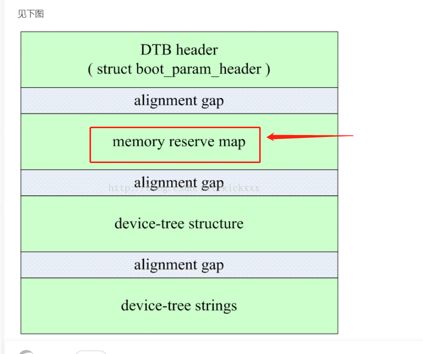
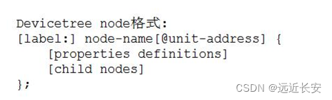
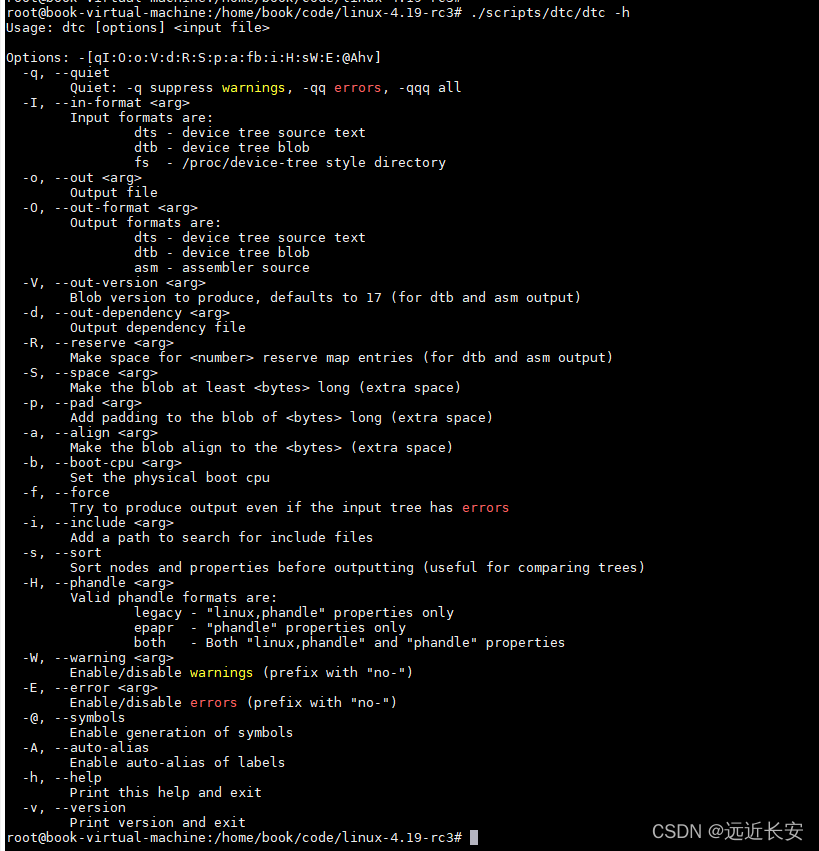
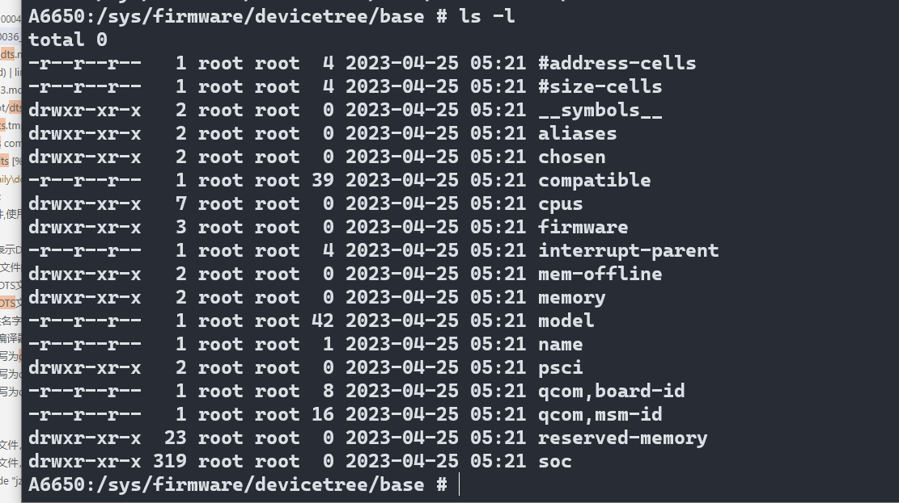

# README

linux dts 设备树介绍,dtb,dtc

使用设备树,需要编写dts文件,使用dtc编译,编译成dtb文件

# 规范

## dts文件格式


```
/dts-v1/;                         // 表示DTS文件的版本
/memreserve/ 0x40000000 0x01000000            // 保存的内存区域 格式为： /memreserve/ <address> <length>;
/ {
    [property definitions]
    [child nodes]
};

```

* 第一行 /dts-v1/; 表示的是DTS文件的版本。

* 第二行 [memory reservations],dtb的头中,指定了一个区域,表明了,内存保留地址,并且还有size



* 接下来是 / { ... };，其中 / 是根，是设备树的起点。

* 对于每一个设备树，我们需要一些属性来描述这颗树，就是 [property definitions]；

* 同样，一颗树有很多树干，很多分支，一颗设备树同样也有很多子节点，子节点中又可以包含子节点，就是 [child nodes]。

### 属性

属性的格式有两种，一种是没有值的空属性，一种是有值的属性。

```
Property格式1:
[label:] property-name = value;
 
Property格式2(没有值):
[label:] property-name;
```

* 特殊属性,名字规定,例如 bootargs是用来设置启动指令

```
chosen {
        bootargs = "rcupdate.rcu_expedited=1 rcu_nocbs=0-7 kpti=off";
    };  
```

* 属性值写法

    * 用尖括号括起来 <xx xx xx ...>，例如<1 0x3 0x123>，每个成员都是32bit数据，称为arrays of cells；

    * 用双引号括起来的字符串 "..."，例如上面bootargs的字符串；

    * 用中括号括起来的字节序列（byte string）[xx xx xx ...]，使用16进制表示1个/多个byte，需要注意的是，byte string中，一个byte必须用2位16进制数来表示，例如[00 11 22]，其中00不能简写为0，但是byte之间的空格可以省略，也就是[00 11 22]和[001122]是一样的；

```
示例: 
a. Arrays of cells : cell就是一个32位的数据
interrupts = <17 0xc>;
 
b. 64bit数据使用2个cell来表示:
clock-frequency = <0x00000001 0x00000000>;
 
c. A null-terminated string (有结束符的字符串):
compatible = "simple-bus";
 
d. A bytestring(字节序列) :
local-mac-address = [00 00 12 34 56 78];  // 每个byte使用2个16进制数来表示
local-mac-address = [000012345678];       // 每个byte使用2个16进制数来表示
 
e. 可以是各种值的组合, 用逗号隔开:
compatible = "ns16550", "ns8250";
example = <0xf00f0000 19>, "a strange property format";
```

### 设备节点



第一行的 label 可加可不加，node-name是节点名字；@unit-address是地址，可以用来区分内存节点，比如memory@30000000和memory@0，分别表示起始地址为0x3000 0000和0的两块内存；

以下例子只有node name

```
led {
    compatible = "jz2440_led";
	pin = <S3C2410_GPF(5)>;
};
```

以下例子有address

```
memory@30000000 {  /* /memory/memory@30000000 */
	device_type = "memory";
	reg =  <0x30000000 0x4000000>;		
};
 
memory@0 {  /* /memory/memory@0 */
	device_type = "memory";
	reg =  <0 4096>;		
};
```

### 默认属性名字

dts文件中有一些默认的属性名字，比如model，compatible，#address-cells，#size-cells，这些是根节点必须有的属性，它们代表的含义都是默认的，是事先约定好的。

```
/ {
    model = "Qualcomm Technologies, Inc. SCUBA";
    compatible = "qcom,scuba";
    qcom,msm-id = <441 0x10000>;
    interrupt-parent = <&wakegic>;

    #address-cells = <2>;
    #size-cells = <2>;
    memory { device_type = "memory"; reg = <0 0 0 0>; };

    mem-offline {
        compatible = "qcom,mem-offline";
        offline-sizes = <0x1 0x40000000 0x0 0x40000000>,
                <0x1 0xc0000000 0x0 0x80000000>,
                <0x2 0xc0000000 0x1 0x40000000>;
        granule = <512>;
    };

    aliases {
        sdhc1 = &sdhc_1; /* SDC1 eMMC slot */
        sdhc2 = &sdhc_2; /* SDC2 SD Card slot */
        swr0 = &swr0;
        swr1 = &swr1;
    };

    cpus {
        #address-cells = <2>;
        #size-cells = <0>;

        CPU0: cpu@0 {
            device_type = "cpu";
            compatible = "arm,armv8";
            reg = <0x0 0x0>;
            enable-method = "psci";
            capacity-dmips-mhz = <1024>;
            dynamic-power-coefficient = <100>;
            next-level-cache = <&L2_0>;
            qcom,freq-domain = <&cpufreq_hw 0 4>;
            qcom,lmh-dcvs = <&lmh_dcvs0>;
            #cooling-cells = <2>;
            L2_0: l2-cache {
                compatible = "arm,arch-cache";
                cache-level = <2>;
            };

            L1_I_0: l1-icache {
                compatible = "arm,arch-cache";
            };

            L1_D_0: l1-dcache {
                compatible = "arm,arch-cache";
            };
        };
        cpu-map {
            cluster0 {
                core0 {
                    cpu = <&CPU0>;
                };

                core1 {
                    cpu = <&CPU1>;
                };

                core2 {
                    cpu = <&CPU2>;
                };

                core3 {
                    cpu = <&CPU3>;
                };
            };
        };
    };
```

* #address-cells ,在它的子属性中,使用多少个u32证书来描述地址

* #size-cells,在它的子节点属性中,使用多少个u32证书来描述大小

reg = <address1 length1 address2 length2 address3 length3……>

* memory { device_type = "memory"; reg = <0 0 0 0>; };

用来指定内存的地址,大小

* cpu ,device_type = "cpu"; reg = <0x0 0x3>;

表明自己是哪一个cpu

### 引用属性

* phandle, 节点中的phandle属性,它的取值必须是唯一,不要跟其他的phandle值一样,一般不用

```
pic@10000000{
    phandle = <1>;
}
iic@20000000{
    phandle = <2>;
}

another-device-node{
    interrupt-parent = <1>; //使用phandle值为1来 引用上述几点,
}
```

* 使用label

```
PIC: pic@1000000{
    interrupt-controller;
}
another-device-node{
    interrupt-parent = <&PIC>; //使用label引用上述节点,使用label,实际也是用phandle来引用,
                               //编译dts文件为dtb文件时,编译器dtc会在dtb中插入phandle属性
}
```

### override

设备树可以将一些公共部分写为dtsi文件,dts文件直接include dtsi

```
jz2440.dtsi
/dts-v1/;
 
/ {
	model = "SMDK24440";
	compatible = "samsung,smdk2440";
 
	#address-cells = <1>;
	#size-cells = <1>;
		
	memory {  /* /memory */
		device_type = "memory";
		reg =  <0x30000000 0x4000000 0 4096>;		
	};
 
	
/*
	cpus {
		cpu {
			compatible = "arm,arm926ej-s";
		};
	};
*/	
	chosen {
		bootargs = "noinitrd root=/dev/mtdblock4 rw init=/linuxrc console=ttySAC0,115200";
	};
 
	
	LED: led {
		compatible = "jz2440_led";
		pin = <S3C2410_GPF(5)>;
	};
};
```

后在dts文件中包含这个dtsi文件， 只要添加一个#include "jz2440.dtsi"即可。

```
/dts-v1/;
 
#include "jz2440.dtsi"
```

* override

在dtsi文件中led节点的pin属性为<S3C2410_GPF(5)>，如果要修改为<S3C2410_GPF(6)>但是不想改变dtsi文件，那么只需要在dts文件中重新定义led节点的pin属性即可。

```
/dts-v1/;
/{  //led在根节点
    led{ //重新定义led override
        pin = <S3C2410_GPF(6)>;//用<S3C2410_GPF(6)> override <S3C2410_GPF(5)>;
    }
};
```

方法二,可以直接引用label进行override

```
/dts-v1/;
#include "jz2440.dtsi"
&LED {
   pin = <S3C2410_GPF(7)>;
};
```

# 编译

将dts和dtsi文件复制到arch\arm\boot\dts目录下，设置编译工具链。

export PATH=/home/book/code/gcc-linaro-4.9.4-2017.01-x86_64_arm-linux-gnueabi/bin/:$PATH

然后在根目录下执行make dtbs指令，编译dts文件，得到dtb文件。

# 反编译

可以使用dtc工具将dtb文件反编译成dts文件

./scripts/dtc/dtc -I dtb -O dts -o tmp.dts arch/arm/boot/dts/jz2440.dtb

* dtc -h,输出dtc帮助命令



# dts 在设备中的节点

ls -l /sys/firmware/devicetree/base/

* 使用find命令查找,find /sys/firmware/devicetree/base/ -name "qcom,mdss_dsi_ft8006s_720p_video_dpi_320"



# out目录生成dtb路径

* UM.9.15/out/target/product/bengal/obj/kernel/msm-4.19/arch/arm64/boot/dts/vendor/qcom/a6650/.a6650-scuba-iot_V02_V03.dtb.dts.tmp