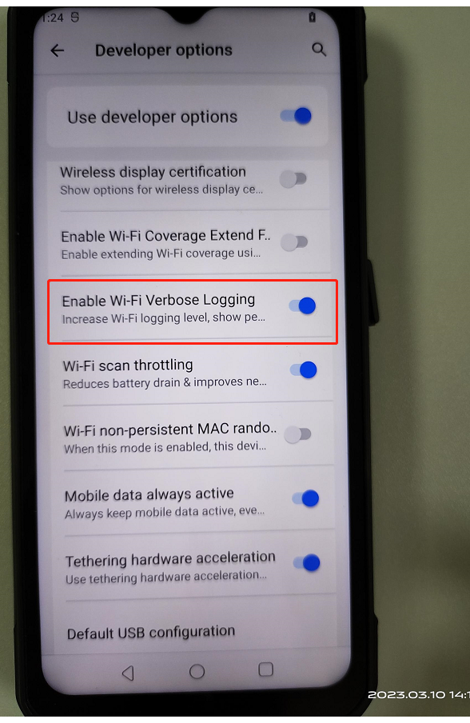
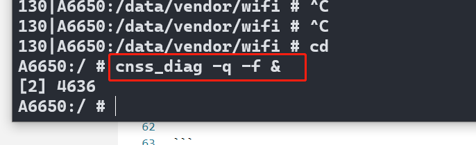
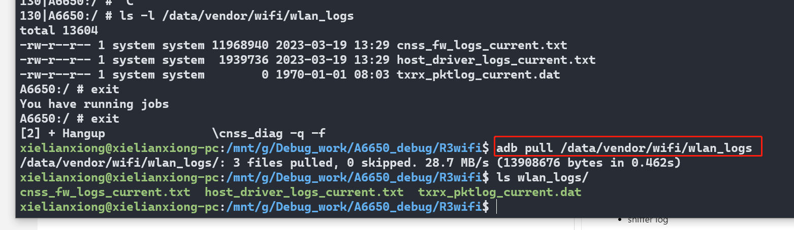

# wifi联盟 认证

记录A6650 项目,wifi联盟认证遇到的一些问题点

# A6650 2.4G有40M吗？

* 11n协议支持40M带宽

# 支持哪几种EAP加密

* EAP-TLS
* EAP-PEAP/MSCHAPv2 (both PEAPv0 and PEAPv1)
* EAP-PEAP/TLS (both PEAPv0 and PEAPv1)
* EAP-PEAP/GTC (both PEAPv0 and PEAPv1)
* EAP-PEAP/OTP (both PEAPv0 and PEAPv1)
* EAP-PEAP/MD5-Challenge (both PEAPv0 and PEAPv1)
* EAP-TTLS/EAP-MD5-Challenge
* EAP-TTLS/EAP-GTC
* EAP-TTLS/EAP-OTP
* EAP-TTLS/EAP-MSCHAPv2
* EAP-TTLS/EAP-TLS
* EAP-TTLS/MSCHAPv2
* EAP-TTLS/MSCHAP
* EAP-TTLS/PAP
* EAP-TTLS/CHAP
* EAP-SIM
* EAP-AKA
* EAP-AKA'
* EAP-PSK
* EAP-PAX
* EAP-SAKE
* EAP-IKEv2
* EAP-GPSK
* EAP-pwd
* LEAP (note: requires special support from the driver for IEEE 802.11 authentication)
(following methods are supported, but since they do not generate keying material, they cannot be used with WPA or IEEE 802.1X
WEP keying)
* EAP-MD5-Challenge * EAP-MSCHAPv2
* EAP-GTC * EAP-OTP

# WPA2-Enterprise AKA加密连不上,这一题是可选的

* Wi-Fi CERTIFIED WPA2 Test Plan v1.17.pdf,5.3.3.4章节

* logcat  (开发者选项打开启,Enable Wi-Fi Verbose Logging, 使用Logkit捉取)

    

* wlan_log (adb shell输入,cnss_diag -q -f & , 完成后拉取日志目录/data/vendor/wifi/wlan_logs ) (高通平台)

    

    

* sniffer log (这个实验室会)


# 11N测试2.4G 20/40M共存不过

* N-5.2.48_Mar-07-2023__15-23-05, Wi-Fi CERTIFIED n Test Plan v2.21.pdf,5.2.48章节

* 原因是,ap是40M带宽,,当时连上ap后,测试机,还是20M带宽所以测试不通过

* 另外一个原因是,实验室测试的是11n的40M带宽,但是机器用的是11ac的40M,所以实验室报测试不过

* 解决方法

```
gEnableRXSTBC=0
gEnableTXSTBC=0
gEnableRXLDPC=0
gTxLdpcEnable=0
gChannelBondingMode24GHz=1
```

adb push /vendor/etc/wifi/WCNSS_qcom_cfg.ini 


# n 5.2.48

* 解决方案

> 修改wifi 驱动配置
> /vendor/etc/wifi/WCNSS_qcom_cfg.ini 
> gChannelBondingMode24GHz=1   (添加N 40M支持)
> gEnableVhtFor24GHzBand=0      (关闭2.4g AC协议支持)

# WPA3 2.1.0.42_CT_Security_SCVSuffixRootStore

* 解决方案

```
//确认证书是否push
adb push cas.pem /data/cert/Hostapd/
adb push cas.pem /data/cert/Hostapd/cas
adb push wifiuser.pem /data/cert/Hostapd/
adb push wifiuser.pem /data/cert/Hostapd/wifiuser
adb push rsa_ca1_w1_fi.pem /data/cert/Hostapd/
adb push rsa_ca2_w1_fi.pem /data/cert/Hostapd/
adb push rsa_user1_w1_fi.pem /data/cert/Hostapd/
adb shell chmod 777 /data/cert/Hostapd/*

While running the test case, at step5, the tool will have a popup to instruct the user. When this popup comes, hash value need to be updated in the DUT.

Please ask lab to input the below commands in wpa_cli window in DUT to update the hash value

adb shell
wpa_cli
SET_NETWORK 0 ca_cert "hash://server/sha256/d74312b99e2e92cd948564f846820fd27fa9760402b43519762ce7ca79e7f52e"
SET_NETWORK 0 domain_match NULL
SET_NETWORK 0 domain_suffix_match NULL
disconnect
SELECT_NETWORK 0

To check for the hash value to be used, Capture the logcat and try to find below logs (just before the failure) and derive the correct/expected hash and use it
Ex:
02-07 11:51:40.241 12878 12878 I wpa_supplicant: wlan0: CTRL-EVENT-EAP-PEER-CERT depth=0 subject='/C=US/O=Wi-Fi Alliance/CN=server1.w1-fi.org' hash=d74312b99e2e92cd948564f846820fd27fa9760402b43519762ce7ca79e7f52e
```

# WPA3 scv  10147 10150 10173

* 解决方法

```
1.To push cert files(Please make sure same path is being using the quick track window certificate path. Attached log folder has the screenshot of Quicktrack window as well)
adb shell rm -rf /data/cert/Hostapd
adb shell rm -rf /data/cert
adb shell mkdir /data/cert/
adb shell mkdir /data/cert/Hostapd/
adb push cas.pem /data/
adb push cas.pem /data/cas
adb push wifiuser.pem /data/
adb push wifiuser.pem /data/wifiuser
adb push rsa_ca1_w1_fi.pem /data/
adb push rsa_ca2_w1_fi.pem /data/
adb push rsa_user1_w1_fi.pem /data/
adb shell chmod 777 /data/*

2.Hash value needs to be updated manually for these test case even though there is no pop up. Please find below procedure for updating hash value
Update hash value before first connection for 10150 and 10147.
Update hash value after step5 popup for 10173.

To update hash value, issue below commands in wpa_cli
SET_NETWORK 0 ca_cert "hash://server/sha256/6da159de0945bdf9d106c5d70d70954f289074f2c09f2aa2b02f19d0c538dd93"
SET_NETWORK 0 domain_match NULL
SET_NETWORK 0 domain_suffix_match NULL
disconnect
SELECT_NETWORK 0

3.ctrlapp_dut command used for internal testing
./ctrlapp_dut -i wlan0 -s /vendor/bin/hw/wpa_supplicant -f /data/vendor/wifi/wpa/wpa_supplicant.conf -w /data/vendor/wifi/wpa/sockets/

adb shell chmod 777 /data/wpa_supplicant.conf – Once supplicant.conf file is created , please provide chmod permissions to this file.
```

# WPA3-Personal 10214

* 解决方案

```
From 9efbd810b72fca699e0bde5945d1aece7d37a590 Mon Sep 17 00:00:00 2001
From: Srikanth Marepalli <quic_srimarep@quicinc.com>
Date: Tue, 07 Feb 2023 21:52:42 +0530
Subject: [PATCH] eap_proxy: During deinit unblock the join based on PPID

When the wpa_supplicant is started using ctrlapp_dut, it uses -B
flag in the command. And this flag daemonizes the wpa_supplicant.
The test case then tries to kill the wpa_supplicant and
reinitialize it.
Initially when the wpa_supplicant was started, eap_proxy gets
created as a child thread under this parent. And when the
wpa_supplicant gets daemonized and created as a new process, the
eap_proxy thread also dies along with its parent wpa_supplicant.
But as the dead thread ID is passed in the pthread_join call it
waits for an indefinite time. And this block the wpa_supplicant
termination, results in wpa_supplicant restart issue.

To fix this compare the PPID of the wpa_supplicant init and
deinit to unblock the pthread_join during deinit process.
As the PPID of wpa_supplicant before daemonize will be different
than the PPID after daemonize because the wpa_supplicant will be
adopted by init process which has a PID '1'.

Change-Id: I74ed4072ef3eb53af7b93d8838cfd530ea7532aa
CRs-Fixed: 3393888
---

diff --git a/src/eap_peer/eap_proxy_qmi.c b/src/eap_peer/eap_proxy_qmi.c
index 20db6cb..1dff82f 100644
--- a/src/eap_peer/eap_proxy_qmi.c
+++ b/src/eap_peer/eap_proxy_qmi.c
@@ -1176,6 +1176,8 @@
 
         // Make note of new thread creation, so that we can take care of joining.
         eap_proxy->qmi_thread_joined = false;
+        // Store the PPID of this init caller to compare this during deinit.
+        eap_proxy->init_ppid = getppid();
 
         ret = pthread_create(&eap_proxy->thread_id, NULL, eap_proxy_post_init, eap_proxy);
         if(ret != 0) {
@@ -1204,8 +1206,24 @@
          * Also, Do not join the thread if it was already joined before.
          */
         if (!eap_proxy->qmi_thread_joined) {
-                wpa_printf(MSG_ERROR, "eap_proxy: pthread_join on eap_proxy=%p", eap_proxy);
-                pthread_join(eap_proxy->thread_id, NULL);
+                /* In case when the wpa_supplicant is daemonized, the eap_proxy
+                 * thread also dies along with its parent wpa_supplicant. But as
+                 * the dead thread ID is passed in the pthread_join call it
+                 * waits for an indefinite time and this blocks the
+                 * wpa_supplicant termination.
+                 * Hence ensure to call the join only if wpa_supplicant is not a
+                 * daemon by comparing the PPID of eap_proxy init and deinit.
+                 */
+                if (getppid() == eap_proxy->init_ppid) {
+                        wpa_printf(MSG_ERROR,
+                                   "eap_proxy: pthread_join on eap_proxy=%p",
+                                   eap_proxy);
+                        pthread_join(eap_proxy->thread_id, NULL);
+                } else {
+                        wpa_printf(MSG_ERROR,
+                                   "eap_proxy: Do not block if the eap_proxy "
+                                   "thread was created under different parent");
+                }
                 eap_proxy->qmi_thread_joined = true;
         }
         eap_proxy->proxy_state = EAP_PROXY_DISABLED;
diff --git a/src/eap_peer/eap_proxy_qmi.h b/src/eap_peer/eap_proxy_qmi.h
index 0b75604..d0ce842 100644
--- a/src/eap_peer/eap_proxy_qmi.h
+++ b/src/eap_peer/eap_proxy_qmi.h
@@ -162,6 +162,8 @@
         qmi_client_type uim_notifier_handle;
         qmi_client_type auth_notifier_handle;
         bool notifier_cb_initialized;
+        // To store the PPID of eap_proxy init caller
+        pid_t init_ppid;
 };
 
 int eap_proxy_allowed_method(struct eap_peer_config *config, int vendor,

```

# WPA3-R3

* 解决方法

```
From a95b15b93e1d805897bace85b37e2cede7de7527 Mon Sep 17 00:00:00 2001
From: "yungui.dong" <yungui.dong@quectel.com>
Date: Tue, 22 Nov 2022 20:54:38 +0800
Subject: [PATCH] wpa3_r3

---
 .../cmn_services/cmn_defs/inc/wlan_cmn_ieee80211.h |  3 ++
 .../crypto/inc/wlan_crypto_global_api.h            |  8 ++++
 .../crypto/inc/wlan_crypto_global_def.h            |  6 +++
 .../crypto/src/wlan_crypto_global_api.c            | 21 ++++++++++
 .../umac/scan/core/src/wlan_scan_bss_score.c       | 46 +++++++++++++++++++--
 .../scan/dispatcher/inc/wlan_scan_public_structs.h |  5 +++
 .../umac/scan/dispatcher/inc/wlan_scan_utils_api.h | 16 ++++++++
 .../umac/scan/dispatcher/src/wlan_scan_utils_api.c |  5 +++
 .../qcacld-3.0/core/hdd/src/wlan_hdd_cfg80211.h    |  4 +-
 .../qcacld-3.0/core/hdd/src/wlan_hdd_hostapd.c     | 47 +++++++++++++++++++++-
 .../mac/src/sys/legacy/src/utils/src/parser_api.c  | 20 ++++-----
 .../wlan/qcacld-3.0/core/sap/inc/sap_api.h         |  1 +
 .../wlan/qcacld-3.0/core/sap/src/sap_fsm.c         |  1 +
 .../wlan/qcacld-3.0/core/sme/inc/csr_api.h         |  1 +
 .../qcacld-3.0/core/sme/src/csr/csr_api_roam.c     | 17 ++++++++
 15 files changed, 184 insertions(+), 17 deletions(-)

diff --git a/UM.9.15/vendor/qcom/opensource/wlan/qca-wifi-host-cmn/umac/cmn_services/cmn_defs/inc/wlan_cmn_ieee80211.h b/UM.9.15/vendor/qcom/opensource/wlan/qca-wifi-host-cmn/umac/cmn_services/cmn_defs/inc/wlan_cmn_ieee80211.h
index 7f05520..6f7216a 100644
--- a/UM.9.15/vendor/qcom/opensource/wlan/qca-wifi-host-cmn/umac/cmn_services/cmn_defs/inc/wlan_cmn_ieee80211.h
+++ b/UM.9.15/vendor/qcom/opensource/wlan/qca-wifi-host-cmn/umac/cmn_services/cmn_defs/inc/wlan_cmn_ieee80211.h
@@ -660,7 +660,9 @@ struct wlan_rsn_ie {
 	uint16_t pmkid_count;
 	uint8_t pmkid[MAX_PMKID][PMKID_LEN];
 	uint32_t mgmt_cipher_suite;
+	
 };
+//#define WLAN_RSNX_CAPA_SAE_PK BIT(6)
 
 #define WLAN_WAPI_IE_MIN_LEN            20
 
@@ -1781,6 +1783,7 @@ static inline QDF_STATUS wlan_parse_rsn_ie(uint8_t *rsn_ie,
 	return QDF_STATUS_SUCCESS;
 }
 
+
 /**
  * wlan_parse_wpa_ie() - parse wpa ie
  * @wpa_ie: wpa ie ptr
diff --git a/UM.9.15/vendor/qcom/opensource/wlan/qca-wifi-host-cmn/umac/cmn_services/crypto/inc/wlan_crypto_global_api.h b/UM.9.15/vendor/qcom/opensource/wlan/qca-wifi-host-cmn/umac/cmn_services/crypto/inc/wlan_crypto_global_api.h
index f2d5ef1..ebfdf1d 100644
--- a/UM.9.15/vendor/qcom/opensource/wlan/qca-wifi-host-cmn/umac/cmn_services/crypto/inc/wlan_crypto_global_api.h
+++ b/UM.9.15/vendor/qcom/opensource/wlan/qca-wifi-host-cmn/umac/cmn_services/crypto/inc/wlan_crypto_global_api.h
@@ -710,6 +710,14 @@ static inline int omac1_aes_128(const uint8_t *key, const uint8_t *data,
 {
 	return 0;
 }
+ /* wlan_crypto_parse_rsnxe_ie() - parse RSNXE IE
+ * @rsnxe_ie: RSNXE IE pointer
+ * @cap_len: pointer to hold len of ext capability
+ *
+ * Return: pointer to RSNXE capability or NULL
+ */
+uint8_t *
+	wlan_crypto_parse_rsnxe_ie(uint8_t *rsnxe_ie, uint8_t *cap_len);
 
 static inline int omac1_aes_256(const uint8_t *key, const uint8_t *data,
 				size_t data_len, uint8_t *mac)
diff --git a/UM.9.15/vendor/qcom/opensource/wlan/qca-wifi-host-cmn/umac/cmn_services/crypto/inc/wlan_crypto_global_def.h b/UM.9.15/vendor/qcom/opensource/wlan/qca-wifi-host-cmn/umac/cmn_services/crypto/inc/wlan_crypto_global_def.h
index 164140b..a794f8d 100644
--- a/UM.9.15/vendor/qcom/opensource/wlan/qca-wifi-host-cmn/umac/cmn_services/crypto/inc/wlan_crypto_global_def.h
+++ b/UM.9.15/vendor/qcom/opensource/wlan/qca-wifi-host-cmn/umac/cmn_services/crypto/inc/wlan_crypto_global_def.h
@@ -173,6 +173,12 @@ typedef enum wlan_crypto_rsn_cap {
 	WLAN_CRYPTO_RSN_CAP_MFP_REQUIRED  = 0x40,
 } wlan_crypto_rsn_cap;
 
+enum wlan_crypto_rsnx_cap {
+	WLAN_CRYPTO_RSNX_CAP_PROTECTED_TWT = 0x10,
+	WLAN_CRYPTO_RSNX_CAP_SAE_H2E = 0x20,
+	WLAN_CRYPTO_RSNX_CAP_SAE_PK = 0x40,
+};
+
 typedef enum wlan_crypto_key_mgmt {
 	WLAN_CRYPTO_KEY_MGMT_IEEE8021X             = 0,
 	WLAN_CRYPTO_KEY_MGMT_PSK                   = 1,
diff --git a/UM.9.15/vendor/qcom/opensource/wlan/qca-wifi-host-cmn/umac/cmn_services/crypto/src/wlan_crypto_global_api.c b/UM.9.15/vendor/qcom/opensource/wlan/qca-wifi-host-cmn/umac/cmn_services/crypto/src/wlan_crypto_global_api.c
index 012501a..184c66e 100644
--- a/UM.9.15/vendor/qcom/opensource/wlan/qca-wifi-host-cmn/umac/cmn_services/crypto/src/wlan_crypto_global_api.c
+++ b/UM.9.15/vendor/qcom/opensource/wlan/qca-wifi-host-cmn/umac/cmn_services/crypto/src/wlan_crypto_global_api.c
@@ -3956,6 +3956,27 @@ wlan_crypto_reset_prarams(struct wlan_crypto_params *params)
 	params->rsn_caps = 0;
 }
 
+uint8_t *
+wlan_crypto_parse_rsnxe_ie(uint8_t *rsnxe_ie, uint8_t *cap_len)
+{
+	uint8_t len;
+	uint8_t *ie;
+
+	if (!rsnxe_ie)
+		return NULL;
+
+	ie = rsnxe_ie;
+	len = ie[1];
+	ie += 2;
+
+	if (!len)
+		return NULL;
+
+	*cap_len = ie[0] & 0xf;
+
+	return ie;
+}
+
 QDF_STATUS wlan_set_vdev_crypto_prarams_from_ie(struct wlan_objmgr_vdev *vdev,
 						uint8_t *ie_ptr,
 						uint16_t ie_len)
diff --git a/UM.9.15/vendor/qcom/opensource/wlan/qca-wifi-host-cmn/umac/scan/core/src/wlan_scan_bss_score.c b/UM.9.15/vendor/qcom/opensource/wlan/qca-wifi-host-cmn/umac/scan/core/src/wlan_scan_bss_score.c
index dce2b85..b22c397 100644
--- a/UM.9.15/vendor/qcom/opensource/wlan/qca-wifi-host-cmn/umac/scan/core/src/wlan_scan_bss_score.c
+++ b/UM.9.15/vendor/qcom/opensource/wlan/qca-wifi-host-cmn/umac/scan/core/src/wlan_scan_bss_score.c
@@ -26,6 +26,7 @@
 #include "wlan_policy_mgr_api.h"
 #endif
 #include "wlan_reg_services_api.h"
+#include "wlan_crypto_global_api.h"
 
 #define SCM_20MHZ_BW_INDEX                  0
 #define SCM_40MHZ_BW_INDEX                  1
@@ -674,6 +675,36 @@ static uint32_t scm_get_sta_nss(struct wlan_objmgr_psoc *psoc,
 }
 #endif
 
+/**
+ * scm_calculate_sae_pk_ap_weightage() - Calculate SAE-PK AP weightage
+ * @entry: bss entry
+ * @score_params: bss score params
+ * @sae_pk_cap_present: sae_pk cap presetn in RSNXE capability field
+ *
+ * Return: SAE-PK AP weightage score
+ */
+static uint32_t
+scm_calculate_sae_pk_ap_weightage(struct scan_cache_entry *entry,
+				  struct scoring_config *score_params,
+				  bool *sae_pk_cap_present)
+{
+	uint8_t *rsnxe_ie, *rsnxe_cap, cap_len;
+
+	rsnxe_ie = util_scan_entry_rsnxe(entry);
+
+	rsnxe_cap = wlan_crypto_parse_rsnxe_ie(rsnxe_ie, &cap_len);
+
+	if (!rsnxe_cap)
+		return 0;
+
+	*sae_pk_cap_present = *rsnxe_cap & WLAN_CRYPTO_RSNX_CAP_SAE_PK;
+	if (*sae_pk_cap_present)
+		return score_params->weight_cfg.sae_pk_ap_weightage *
+			MAX_INDEX_SCORE;
+
+	return 0;
+}
+
 int scm_calculate_bss_score(struct wlan_objmgr_psoc *psoc,
 		struct scan_default_params *params,
 		struct scan_cache_entry *entry,
@@ -698,6 +729,8 @@ int scm_calculate_bss_score(struct wlan_objmgr_psoc *psoc,
 	int8_t rssi_pref_5g_rssi_thresh;
 	bool same_bucket = false;
 	bool ap_su_beam_former = false;
+		uint32_t sae_pk_score = 0;
+		bool sae_pk_cap_present = 0;
 	struct wlan_ie_vhtcaps *vht_cap;
 	struct scoring_config *score_config;
 	struct weight_config *weight_config;
@@ -806,6 +839,10 @@ int scm_calculate_bss_score(struct wlan_objmgr_psoc *psoc,
 		score += oce_wan_score;
 	}
 
+	sae_pk_score = scm_calculate_sae_pk_ap_weightage(entry, score_config,
+								&sae_pk_cap_present);
+	score += sae_pk_score;
+
 	sta_nss = scm_get_sta_nss(psoc, entry->channel.chan_idx,
 				  score_config->vdev_nss_24g,
 				  score_config->vdev_nss_5g);
@@ -825,19 +862,20 @@ int scm_calculate_bss_score(struct wlan_objmgr_psoc *psoc,
 		       score_config->beamformee_cap, score_config->cb_mode_24G,
 		       score_config->cb_mode_5G, sta_nss);
 
-	scm_nofl_debug("Candidate(%pM chan %d): rssi %d HT %d VHT %d HE %d su bfer %d phy %d  air time frac %d qbss %d cong_pct %d NSS %d",
+	scm_nofl_debug("Candidate("QDF_MAC_ADDR_FMT" freq %d): rssi %d HT %d VHT %d HE %d su bfer %d phy %d  air time frac %d qbss %d cong_pct %d NSS %d sae_pk_cap_present %d",
 		       entry->bssid.bytes, entry->channel.chan_idx,
 		       entry->rssi_raw, util_scan_entry_htcap(entry) ? 1 : 0,
 		       util_scan_entry_vhtcap(entry) ? 1 : 0,
 		       util_scan_entry_hecap(entry) ? 1 : 0, ap_su_beam_former,
 		       entry->phy_mode, entry->air_time_fraction,
-		       entry->qbss_chan_load, congestion_pct, entry->nss);
+		      entry->qbss_chan_load, congestion_pct, entry->nss,
+		       sae_pk_cap_present);
 
-	scm_nofl_debug("Scores: prorated_pcnt %d rssi %d pcl %d ht %d vht %d he %d bfee %d bw %d band %d congestion %d nss %d oce wan %d TOTAL %d",
+	scm_nofl_debug("Scores: prorated_pcnt %d rssi %d pcl %d ht %d vht %d he %d bfee %d bw %d band %d congestion %d nss %d oce wan %d sae_pk %d TOTAL %d",
 		       prorated_pcnt, rssi_score, pcl_score, ht_score,
 		       vht_score, he_score, beamformee_score, bandwidth_score,
 		       band_score, congestion_score, nss_score, oce_wan_score,
-		       score);
+		       sae_pk_score, score);
 
 	entry->bss_score = score;
 	return score;
diff --git a/UM.9.15/vendor/qcom/opensource/wlan/qca-wifi-host-cmn/umac/scan/dispatcher/inc/wlan_scan_public_structs.h b/UM.9.15/vendor/qcom/opensource/wlan/qca-wifi-host-cmn/umac/scan/dispatcher/inc/wlan_scan_public_structs.h
index 00decce..54899dd 100644
--- a/UM.9.15/vendor/qcom/opensource/wlan/qca-wifi-host-cmn/umac/scan/dispatcher/inc/wlan_scan_public_structs.h
+++ b/UM.9.15/vendor/qcom/opensource/wlan/qca-wifi-host-cmn/umac/scan/dispatcher/inc/wlan_scan_public_structs.h
@@ -68,6 +68,7 @@ typedef uint32_t wlan_scan_id;
 #define BEST_CANDIDATE_MAX_WEIGHT 100
 #define MAX_INDEX_SCORE 100
 #define MAX_INDEX_PER_INI 4
+#define SAE_PK_AP_WEIGHTAGE 3
 
 #ifdef CONFIG_MCL
 #define MAX_BCN_PROBE_IN_SCAN_QUEUE 150
@@ -160,6 +161,7 @@ struct element_info {
  * @mbo_oce: pointer to mbo/oce indication ie
  * @adaptive_11r: pointer to adaptive 11r IE
  * @single_pmk: Pointer to sae single pmk IE
+  * @rsnxe: Pointer to rsnxe IE
  */
 struct ie_list {
 	uint8_t *tim;
@@ -210,6 +212,7 @@ struct ie_list {
 	uint8_t *extender;
 	uint8_t *adaptive_11r;
 	uint8_t *single_pmk;
+	uint8_t *rsnxe;
 };
 
 enum scan_entry_connection_state {
@@ -387,6 +390,7 @@ struct scan_cache_entry {
  * @pcl_weightage: PCL weightage
  * @channel_congestion_weightage: channel congestion weightage
  * @oce_wan_weightage: OCE WAN metrics weightage
+ *@sae_pk_ap_weightage: SAE-PK AP weigtage
  */
 struct  weight_config {
 	uint8_t rssi_weightage;
@@ -400,6 +404,7 @@ struct  weight_config {
 	uint8_t pcl_weightage;
 	uint8_t channel_congestion_weightage;
 	uint8_t oce_wan_weightage;
+	uint8_t sae_pk_ap_weightage;
 };
 
 /**
diff --git a/UM.9.15/vendor/qcom/opensource/wlan/qca-wifi-host-cmn/umac/scan/dispatcher/inc/wlan_scan_utils_api.h b/UM.9.15/vendor/qcom/opensource/wlan/qca-wifi-host-cmn/umac/scan/dispatcher/inc/wlan_scan_utils_api.h
index 6fb5f54..98cb038 100644
--- a/UM.9.15/vendor/qcom/opensource/wlan/qca-wifi-host-cmn/umac/scan/dispatcher/inc/wlan_scan_utils_api.h
+++ b/UM.9.15/vendor/qcom/opensource/wlan/qca-wifi-host-cmn/umac/scan/dispatcher/inc/wlan_scan_utils_api.h
@@ -675,6 +675,7 @@ util_scan_copy_beacon_data(struct scan_cache_entry *new_entry,
 	ie_lst->extender = conv_ptr(ie_lst->extender, old_ptr, new_ptr);
 	ie_lst->adaptive_11r = conv_ptr(ie_lst->adaptive_11r, old_ptr, new_ptr);
 	ie_lst->single_pmk = conv_ptr(ie_lst->single_pmk, old_ptr, new_ptr);
+	ie_lst->rsnxe = conv_ptr(ie_lst->rsnxe, old_ptr, new_ptr);
 
 	return QDF_STATUS_SUCCESS;
 }
@@ -1539,6 +1540,21 @@ util_scan_entry_esp_info(struct scan_cache_entry *scan_entry)
 	return scan_entry->ie_list.esp;
 }
 
+ /**
+ * util_scan_entry_rsnxe() - function to read RSNXE ie
+ * @scan_entry: scan entry
+ *
+ * API, function to read RSNXE ie
+ *
+ * Return: RSNXE ie
+ */
+static inline uint8_t *
+util_scan_entry_rsnxe(struct scan_cache_entry *scan_entry)
+{
+	return scan_entry->ie_list.rsnxe;
+}
+
+
 /**
  * util_scan_entry_mbo_oce() - function to read MBO/OCE ie
  * @scan_entry: scan entry
diff --git a/UM.9.15/vendor/qcom/opensource/wlan/qca-wifi-host-cmn/umac/scan/dispatcher/src/wlan_scan_utils_api.c b/UM.9.15/vendor/qcom/opensource/wlan/qca-wifi-host-cmn/umac/scan/dispatcher/src/wlan_scan_utils_api.c
index 42ed4ec..b7d8054 100644
--- a/UM.9.15/vendor/qcom/opensource/wlan/qca-wifi-host-cmn/umac/scan/dispatcher/src/wlan_scan_utils_api.c
+++ b/UM.9.15/vendor/qcom/opensource/wlan/qca-wifi-host-cmn/umac/scan/dispatcher/src/wlan_scan_utils_api.c
@@ -737,6 +737,11 @@ util_scan_populate_bcn_ie_list(struct scan_cache_entry *scan_params)
 				goto err;
 			scan_params->ie_list.fils_indication = (uint8_t *)ie;
 			break;
+		case WLAN_ELEMID_RSNXE:
+			if (!ie->ie_len)
+				goto err;
+			scan_params->ie_list.rsnxe = (uint8_t *)ie;
+			break;
 		case WLAN_ELEMID_EXTN_ELEM:
 			status = util_scan_parse_extn_ie(scan_params, ie);
 			if (QDF_IS_STATUS_ERROR(status))
diff --git a/UM.9.15/vendor/qcom/opensource/wlan/qcacld-3.0/core/hdd/src/wlan_hdd_cfg80211.h b/UM.9.15/vendor/qcom/opensource/wlan/qcacld-3.0/core/hdd/src/wlan_hdd_cfg80211.h
index 09edb72..1cabbcd 100644
--- a/UM.9.15/vendor/qcom/opensource/wlan/qcacld-3.0/core/hdd/src/wlan_hdd_cfg80211.h
+++ b/UM.9.15/vendor/qcom/opensource/wlan/qcacld-3.0/core/hdd/src/wlan_hdd_cfg80211.h
@@ -73,8 +73,8 @@ struct hdd_context;
 #define VENDOR1_AP_OUI_TYPE "\x00\xE0\x4C"
 #define VENDOR1_AP_OUI_TYPE_SIZE 3
 
-#define WLAN_BSS_MEMBERSHIP_SELECTOR_VHT_PHY 126
-#define WLAN_BSS_MEMBERSHIP_SELECTOR_HT_PHY 127
+//#define WLAN_BSS_MEMBERSHIP_SELECTOR_VHT_PHY 126
+//#define WLAN_BSS_MEMBERSHIP_SELECTOR_HT_PHY 127
 #define BASIC_RATE_MASK   0x80
 #define RATE_MASK         0x7f
 
diff --git a/UM.9.15/vendor/qcom/opensource/wlan/qcacld-3.0/core/hdd/src/wlan_hdd_hostapd.c b/UM.9.15/vendor/qcom/opensource/wlan/qcacld-3.0/core/hdd/src/wlan_hdd_hostapd.c
index 560905c..a057790 100644
--- a/UM.9.15/vendor/qcom/opensource/wlan/qcacld-3.0/core/hdd/src/wlan_hdd_hostapd.c
+++ b/UM.9.15/vendor/qcom/opensource/wlan/qcacld-3.0/core/hdd/src/wlan_hdd_hostapd.c
@@ -106,6 +106,23 @@
 
 #define HDD_MAX_CUSTOM_START_EVENT_SIZE 64
 
+#ifndef BSS_MEMBERSHIP_SELECTOR_HT_PHY
+#define BSS_MEMBERSHIP_SELECTOR_HT_PHY  127
+#endif
+
+#ifndef BSS_MEMBERSHIP_SELECTOR_VHT_PHY
+#define BSS_MEMBERSHIP_SELECTOR_VHT_PHY 126
+#endif
+
+#ifndef BSS_MEMBERSHIP_SELECTOR_SAE_H2E
+#define BSS_MEMBERSHIP_SELECTOR_SAE_H2E 123
+#endif
+
+#ifndef BSS_MEMBERSHIP_SELECTOR_HE_PHY
+#define BSS_MEMBERSHIP_SELECTOR_HE_PHY  122
+#endif
+
+
 /*
  * 11B, 11G Rate table include Basic rate and Extended rate
  * The IDX field is the rate index
@@ -3853,15 +3870,36 @@ static void wlan_hdd_check_11gmode(const u8 *ie, u8 *require_ht,
 			}
 		} else {
 			if ((BASIC_RATE_MASK |
-				WLAN_BSS_MEMBERSHIP_SELECTOR_HT_PHY) == ie[i])
+				 BSS_MEMBERSHIP_SELECTOR_HT_PHY) == ie[i])
 				*require_ht = true;
 			else if ((BASIC_RATE_MASK |
-				WLAN_BSS_MEMBERSHIP_SELECTOR_VHT_PHY) == ie[i])
+				  BSS_MEMBERSHIP_SELECTOR_VHT_PHY) == ie[i])
 				*require_vht = true;
 		}
 	}
 }
 
+/**
+ * wlan_hdd_check_h2e() - check SAE/H2E require flag from support rate sets
+ * @rs: support rate or extended support rate set
+ * @require_h2e: pointer to store require h2e flag
+ *
+ * Return: none
+ */
+ static void wlan_hdd_check_h2e(const tSirMacRateSet *rs, bool *require_h2e)
+{
+	uint8_t i;
+
+	if (!rs || !require_h2e)
+		return;
+
+	for (i = 0; i < rs->numRates; i++) {
+		if (rs->rate[i] == (BASIC_RATE_MASK |
+				    BSS_MEMBERSHIP_SELECTOR_SAE_H2E))
+			*require_h2e = true;
+	}
+}			   
+
 #ifdef WLAN_FEATURE_11AX
 /**
  * wlan_hdd_add_extn_ie() - add extension IE
@@ -5500,6 +5538,11 @@ int wlan_hdd_cfg80211_start_bss(struct hdd_adapter *adapter,
 				}
 			}
 		}
+		config->require_h2e = false;
+		wlan_hdd_check_h2e(&config->supported_rates,
+				   &config->require_h2e);
+		wlan_hdd_check_h2e(&config->extended_rates,
+				   &config->require_h2e);
 	}
 
 	if (!cds_is_sub_20_mhz_enabled())
diff --git a/UM.9.15/vendor/qcom/opensource/wlan/qcacld-3.0/core/mac/src/sys/legacy/src/utils/src/parser_api.c b/UM.9.15/vendor/qcom/opensource/wlan/qcacld-3.0/core/mac/src/sys/legacy/src/utils/src/parser_api.c
index f8c1699..976d0b9 100644
--- a/UM.9.15/vendor/qcom/opensource/wlan/qcacld-3.0/core/mac/src/sys/legacy/src/utils/src/parser_api.c
+++ b/UM.9.15/vendor/qcom/opensource/wlan/qcacld-3.0/core/mac/src/sys/legacy/src/utils/src/parser_api.c
@@ -571,7 +571,7 @@ populate_dot11f_ext_supp_rates(struct mac_context *mac, uint8_t nChannelNum,
 			       struct pe_session *pe_session)
 {
 	QDF_STATUS nsir_status;
-	qdf_size_t nRates = 0;
+	qdf_size_t n_rates = 0;
 	uint8_t rates[WLAN_SUPPORTED_RATES_IE_MAX_LEN];
 
 	/* Use the ext rates present in session entry whenever nChannelNum is set to OPERATIONAL
@@ -580,28 +580,30 @@ populate_dot11f_ext_supp_rates(struct mac_context *mac, uint8_t nChannelNum,
 	 */
 	if (POPULATE_DOT11F_RATES_OPERATIONAL == nChannelNum) {
 		if (pe_session) {
-			nRates = pe_session->extRateSet.numRates;
+			n_rates = pe_session->extRateSet.numRates;
 			qdf_mem_copy(rates, pe_session->extRateSet.rate,
-				     nRates);
+				    n_rates);
 		} else {
 			pe_err("no session context exists while populating Operational Rate Set");
 		}
 	} else if (HIGHEST_24GHZ_CHANNEL_NUM >= nChannelNum) {
-		nRates = mac->mlme_cfg->rates.ext_opr_rate_set.len;
+		n_rates = mac->mlme_cfg->rates.ext_opr_rate_set.len;
 		nsir_status = wlan_mlme_get_cfg_str(
 			rates,
-			&mac->mlme_cfg->rates.ext_opr_rate_set, &nRates);
+		&mac->mlme_cfg->rates.ext_opr_rate_set, &n_rates);
 		if (QDF_IS_STATUS_ERROR(nsir_status)) {
-			nRates = 0;
+			n_rates = 0;
 			pe_err("Failed to retrieve nItem from CFG status: %d",
 			       (nsir_status));
 			return nsir_status;
 		}
 	}
 
-	if (0 != nRates) {
-		pDot11f->num_rates = (uint8_t) nRates;
-		qdf_mem_copy(pDot11f->rates, rates, nRates);
+	if (0 != n_rates) {
+			pe_debug("ext supp rates present, num %d", (uint8_t)n_rates);
+				pDot11f->num_rates = (uint8_t)n_rates;
+				qdf_mem_copy(pDot11f->rates, rates, n_rates);
+
 		pDot11f->present = 1;
 	}
 
diff --git a/UM.9.15/vendor/qcom/opensource/wlan/qcacld-3.0/core/sap/inc/sap_api.h b/UM.9.15/vendor/qcom/opensource/wlan/qcacld-3.0/core/sap/inc/sap_api.h
index 0b4a1f9..d25e132 100644
--- a/UM.9.15/vendor/qcom/opensource/wlan/qcacld-3.0/core/sap/inc/sap_api.h
+++ b/UM.9.15/vendor/qcom/opensource/wlan/qcacld-3.0/core/sap/inc/sap_api.h
@@ -525,6 +525,7 @@ struct sap_config {
 	uint8_t long_retry_limit;
 	tSirMacRateSet supported_rates;
 	tSirMacRateSet extended_rates;
+	bool require_h2e;
 	enum sap_acs_dfs_mode acs_dfs_mode;
 	struct hdd_channel_info *channel_info;
 	uint32_t channel_info_count;
diff --git a/UM.9.15/vendor/qcom/opensource/wlan/qcacld-3.0/core/sap/src/sap_fsm.c b/UM.9.15/vendor/qcom/opensource/wlan/qcacld-3.0/core/sap/src/sap_fsm.c
index 99e7403..e2cd6ef 100644
--- a/UM.9.15/vendor/qcom/opensource/wlan/qcacld-3.0/core/sap/src/sap_fsm.c
+++ b/UM.9.15/vendor/qcom/opensource/wlan/qcacld-3.0/core/sap/src/sap_fsm.c
@@ -2982,6 +2982,7 @@ sapconvert_to_csr_profile(struct sap_config *config, eCsrRoamBssType bssType,
 		profile->extended_rates.numRates =
 			config->extended_rates.numRates;
 	}
+	profile->require_h2e = config->require_h2e;
 
 	qdf_status = ucfg_mlme_get_sap_chan_switch_rate_enabled(
 					mac_ctx->psoc,
diff --git a/UM.9.15/vendor/qcom/opensource/wlan/qcacld-3.0/core/sme/inc/csr_api.h b/UM.9.15/vendor/qcom/opensource/wlan/qcacld-3.0/core/sme/inc/csr_api.h
index 95c5280..bce8fdf 100644
--- a/UM.9.15/vendor/qcom/opensource/wlan/qcacld-3.0/core/sme/inc/csr_api.h
+++ b/UM.9.15/vendor/qcom/opensource/wlan/qcacld-3.0/core/sme/inc/csr_api.h
@@ -826,6 +826,7 @@ struct csr_roam_profile {
 	struct add_ie_params add_ie_params;
 	uint16_t beacon_tx_rate;
 	tSirMacRateSet  supported_rates;
+	bool require_h2e;
 	tSirMacRateSet  extended_rates;
 	struct qdf_mac_addr bssid_hint;
 	bool force_24ghz_in_ht20;
diff --git a/UM.9.15/vendor/qcom/opensource/wlan/qcacld-3.0/core/sme/src/csr/csr_api_roam.c b/UM.9.15/vendor/qcom/opensource/wlan/qcacld-3.0/core/sme/src/csr/csr_api_roam.c
index 5bddd8d..af1ad19 100644
--- a/UM.9.15/vendor/qcom/opensource/wlan/qcacld-3.0/core/sme/src/csr/csr_api_roam.c
+++ b/UM.9.15/vendor/qcom/opensource/wlan/qcacld-3.0/core/sme/src/csr/csr_api_roam.c
@@ -8164,6 +8164,7 @@ QDF_STATUS csr_roam_copy_profile(struct mac_context *mac,
 		pDstProfile->extended_rates.numRates =
 			pSrcProfile->extended_rates.numRates;
 	}
+	pDstProfile->require_h2e = pSrcProfile->require_h2e;
 	pDstProfile->cac_duration_ms = pSrcProfile->cac_duration_ms;
 	pDstProfile->dfs_regdomain   = pSrcProfile->dfs_regdomain;
 	pDstProfile->chan_switch_hostapd_rate_enabled  =
@@ -14702,6 +14703,7 @@ csr_roam_get_bss_start_parms(struct mac_context *mac,
 	uint8_t opr_ch = 0;
 	tSirNwType nw_type;
 	uint8_t tmp_opr_ch = 0;
+	uint8_t h2e;
 	tSirMacRateSet *opr_rates = &pParam->operationalRateSet;
 	tSirMacRateSet *ext_rates = &pParam->extendedRateSet;
 
@@ -14798,6 +14800,21 @@ csr_roam_get_bss_start_parms(struct mac_context *mac,
 		}
 		pParam->operationChn = opr_ch;
 	}
+		if (pProfile->require_h2e) {
+			h2e = WLAN_BASIC_RATE_MASK |
+				WLAN_BSS_MEMBERSHIP_SELECTOR_SAE_H2E;
+			if (ext_rates->numRates < SIR_MAC_MAX_NUMBER_OF_RATES) {
+				ext_rates->rate[ext_rates->numRates] = h2e;
+				ext_rates->numRates++;
+				sme_debug("H2E bss membership add to ext support rate");
+			} else if (opr_rates->numRates < SIR_MAC_MAX_NUMBER_OF_RATES) {
+				opr_rates->rate[opr_rates->numRates] = h2e;
+			opr_rates->numRates++;
+				sme_debug("H2E bss membership add to support rate");
+			} else {
+				sme_err("rates full, can not add H2E bss membership");
+			}
+		}
 
 	pParam->sirNwType = nw_type;
 	pParam->ch_params.ch_width = pProfile->ch_params.ch_width;
-- 
2.7.4


```