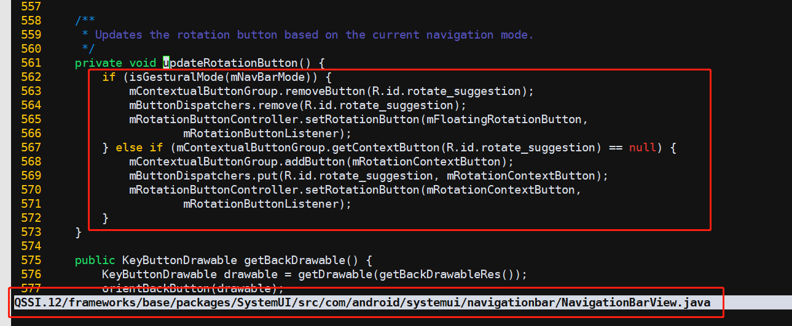

# 非接认证,EMV

L1:就看你数据链路层是否ok，波形啊，时序啊等等

L2:paypass，paywave 纯应用

L3:和银联那边对接了吧

## 非接,影响tp,导致tp乱点,需要去掉自动旋转



* 解决方法

    private void updateRotationButton() 这个方法注释掉

    

* 解决方法2

    ```
    QSSI.12/frameworks/base/packages/SystemUI/src/com/android/systemui/navigationbar/RotationButtonController.java
    mRotationButton.show -> mRotationButton.hide
    ```

    

* 解决方法3

    解决方法1.2好像都不行.

    ```
    --- a/QSSI.12/frameworks/base/packages/SystemUI/src/com/android/systemui/navigationbar/RotationButtonController.java
    +++ b/QSSI.12/frameworks/base/packages/SystemUI/src/com/android/systemui/navigationbar/RotationButtonController.java
    @@ -205,6 +205,7 @@ public class RotationButtonController {
            // Similarly, a call to make the button visible may be rejected because an a11y service is
            // active. Must account for this.
            // Rerun a show animation to indicate change but don't rerun a hide animation
    +        if(true) return;
            if (!visible && !mRotationButton.isVisible()) return;

            final View view = mRotationButton.getCurrentView();
    ```