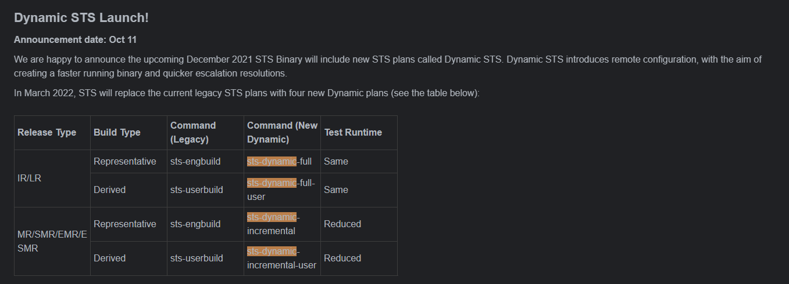

# README

跑gms的一些记录备注

# cts

## help

* help

* help run

* l r
    > 显示报告

* l d
    > 显示连接设备

* -a armeabi-v7a
    > 只跑32位

* --shard-count 4
    > 4台机器一起跑

* -m
    > 模块

* --exclude-filter
    > 调过模块,testcase
    > run retry --retry 127 --exclude-filter “CtsLocationTestCases” --exclude-filter “CtsLibcoreTestCases” --exclude-filter “CtsNNAPITestCases” --exclude-filter “CtsLibcoreOkHttpTestCases” --exclude-filter “CtsNetTestCases”

## retry

* run retry --retry 报告

* run retry --retry 13 --shard-count 4

## 添加plan

* add subplan --name plan名称 --result-type failed --session 报告

* add subplan --name sub-cts --result-type failed --session 16

* run cts --subplan sub-cts

## 模块

### camera

* run cts -m CtsCameraTestCases -a armeabi-v7a --shard-count 4

* run retry --retry 11 --shard-count 4  --exclude-filter "CtsCameraTestCases android.camera.cts.HeifWriterTest"

# sts

* run sts-dynamic-full -a arm64-v8a -s e4e190fc -m CtsSecurityTestCases -t android.security.cts.StagefrightTest#testStagefright
_cve_2022_22059

# GSI

* 那个gsi是在cts环境测试得只是命令不是run cts，改为run cts-on-gsi

## 刷机方法

adb reboot fastboot
fastboot delete-logical-partition product_a
fastboot create-logical-partition product_a 0
fastboot flash system system.img
fastboot -w && fastboot erase userdata
fastboot reboot

# VTS

## 刷机方法

adb reboot fastboot
fastboot delete-logical-partition product_a
fastboot create-logical-partition product_a 0
fastboot flash boot boot-debug.img
fastboot flash system system.img
fastboot -w && fastboot erase userdata
fastboot reboot