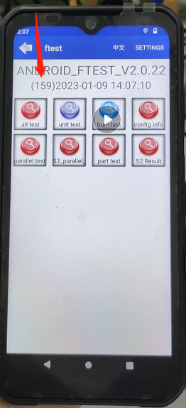
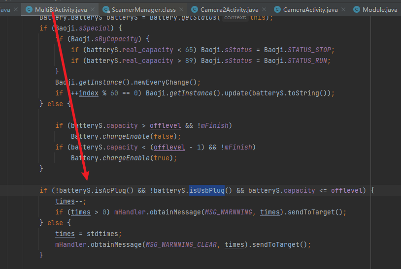

# README
* 启动Ftest

# 计算器

* !4444=

# adb 启动 ftest
* am start -n com.pax.ft/com.pax.ft.WelcomeActivity
* am start -n com.pax.ft/com.pax.ft.MainActivity

# ftest 现象

## L0 状态下,倒数进入煲机测试

* 煲机状态,假设没有插入ac,或者usb, 电量少于某个值, ft就会控制自动关机

