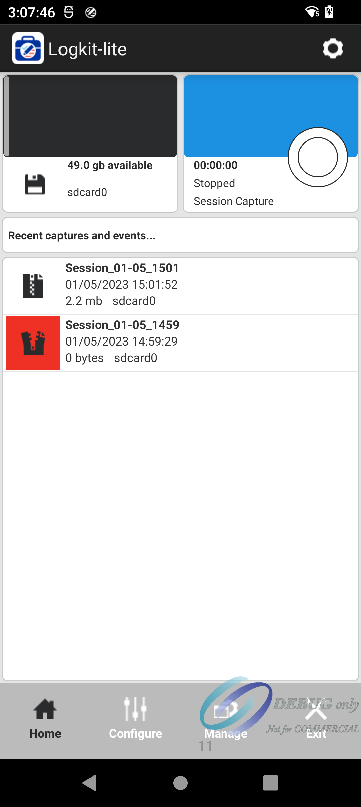
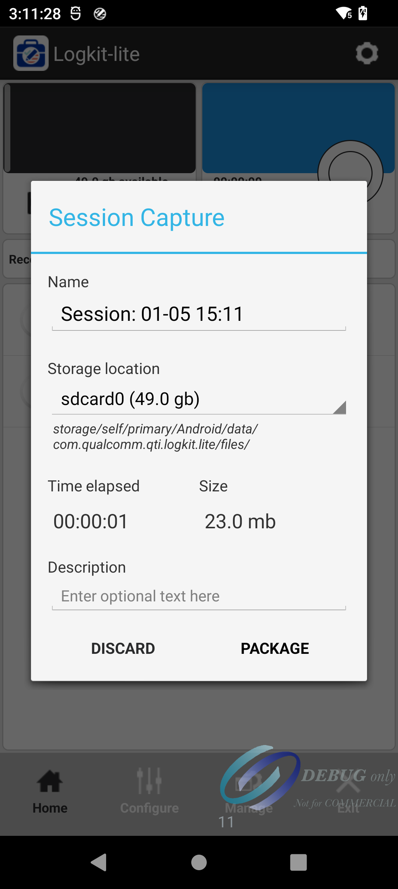
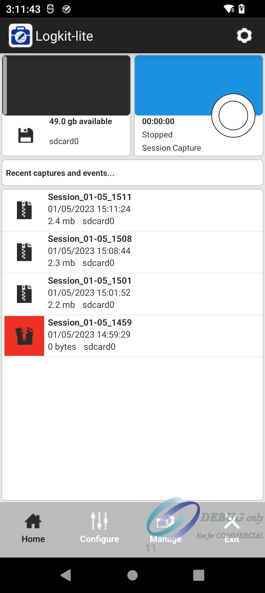
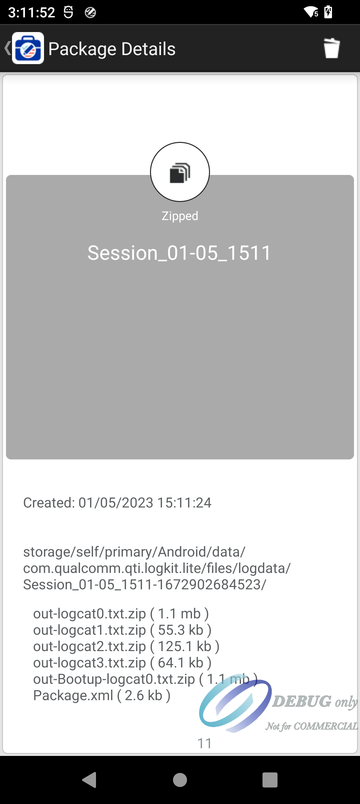

# README

高通平台，使用Logkit 捉取log， 一般都会把logkit预置进入系统

# Logkit 使用方法

* 开机，打开计算器

* !3646622=  开机logkit

* 点击右上角 00:00:00 旁边的圆形，开始捉log ，时间开始跳

    

* 复现现象，然后点击 圆形，停止捉log。会弹出如下截图，点解package

    

* package完后，点击第一条 log, Session_01-05_1511

    

* 进入log详情界面，然后查看路径，通过adb 把log pull出来

    

* adb shell ls -l /storage/self/primary/Android/data/com.qualcomm.qti.logkit.lite/files/logdata/Se*

* adb pull sd_01-05_1511-1672902684523 ./Logkig_log_pull