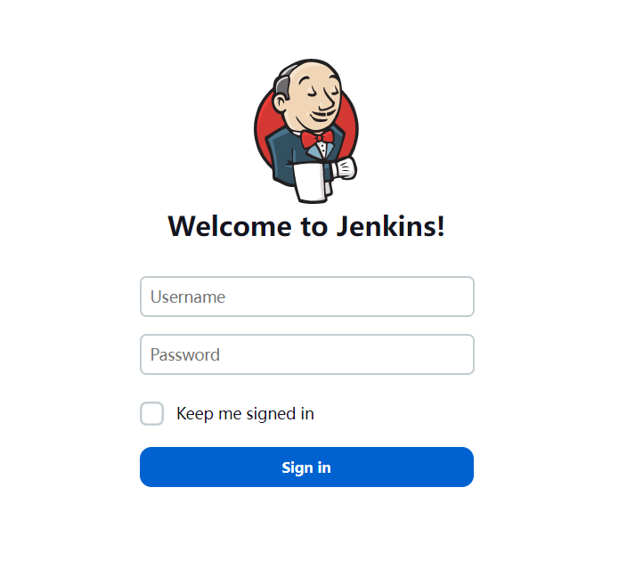
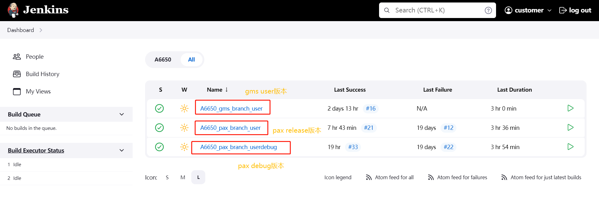
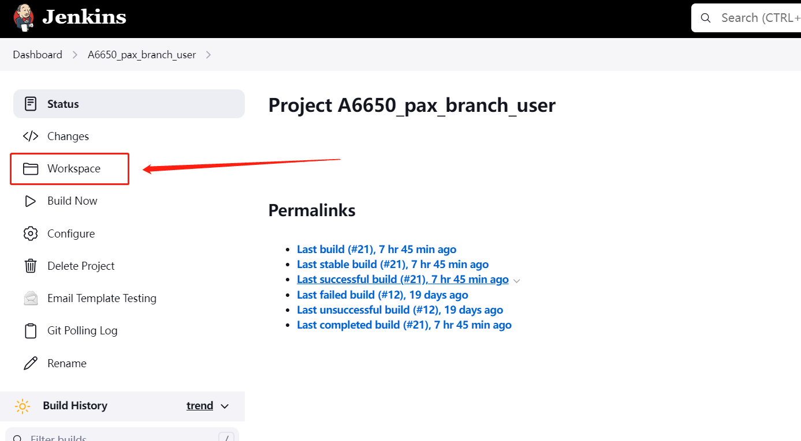
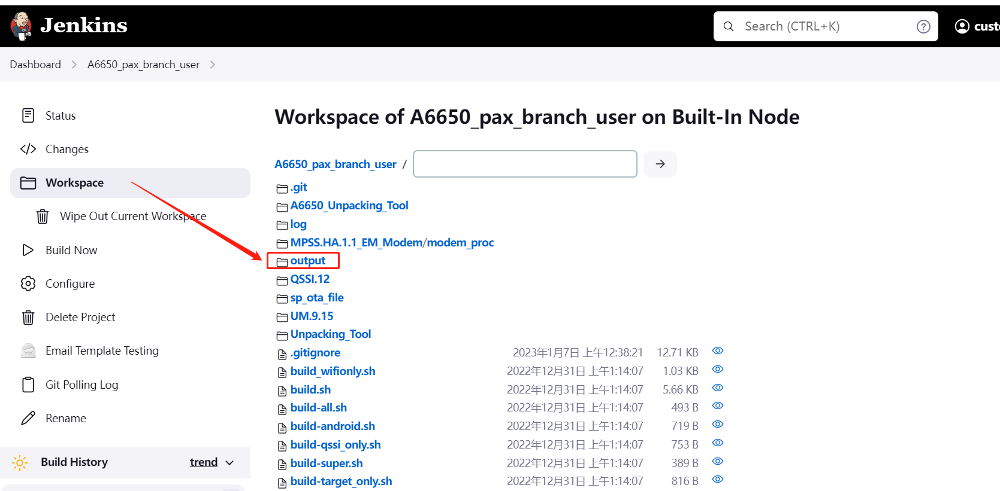
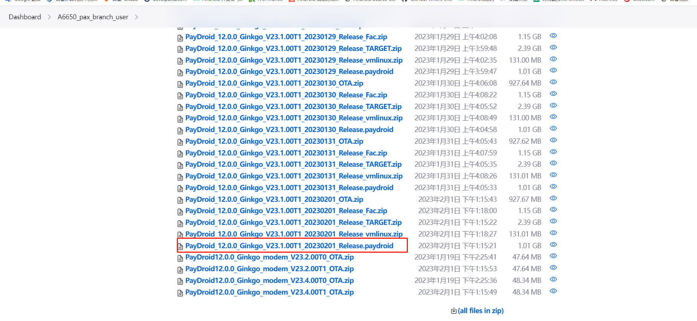

# README

A6650 项目从jenkins,取软件步骤如下.

其他项目大同小异,网址不同.

# 登录

* 浏览器输入网址 http://172.16.2.145:8080/

    

* 登录账号, customer, 登录密码,customer

    

* 选择 点击 pax release 版本,点击workspace,其他不要动,如下图

    

* 点击output

    

* 点击一个需要的版本,一般取最新的版本,浏览器会自动下载

    
