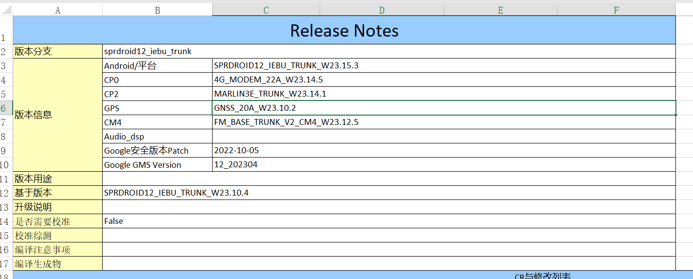

# README

展锐的一些特性,例如pac包制作,编译等

# docs

NO.|文件名称|摘要
:--:|:--|:--
0001| [打包pac](unisoc/0001_pac.md) | 展锐工厂包打包

# 展锐代码版本号

* W:\ssdCode\uis8581e_a12_1\idh.code\vendor\sprd\release\IDH\CUS_Release_Notes\AP\CUS_releasenote.xlsx

* CM4

cm4 是展锐BB内部的一个低功耗arm处理器,用cm4 配套的IIC 和gpio来控制 小的sensor,可以降低功耗

* CP0

4G  modem 相关

* CP2

看说明文档修改记录,BT wifi相关

* GNSS

gps相关