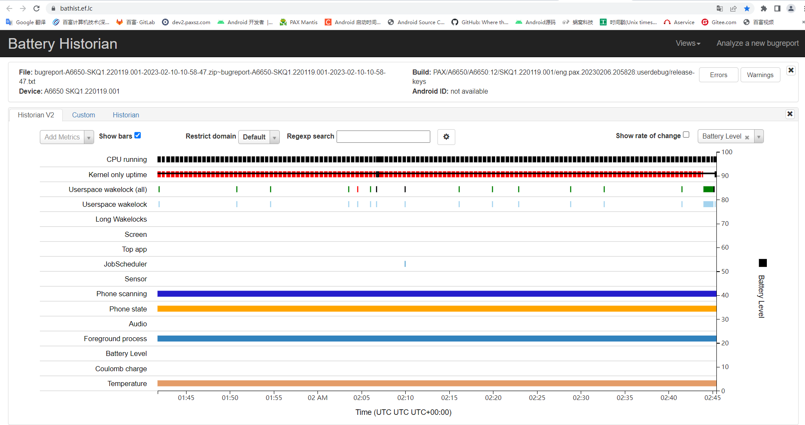
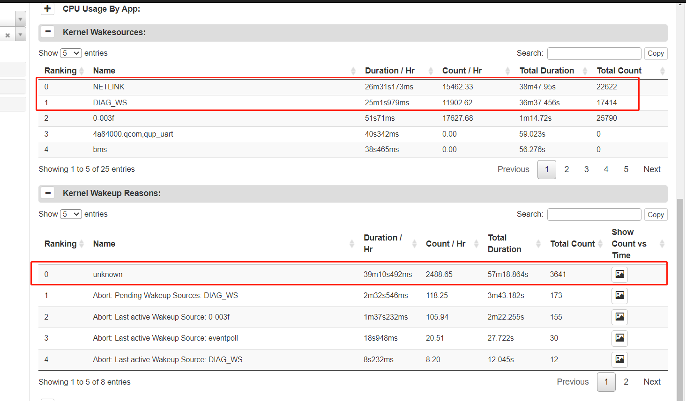
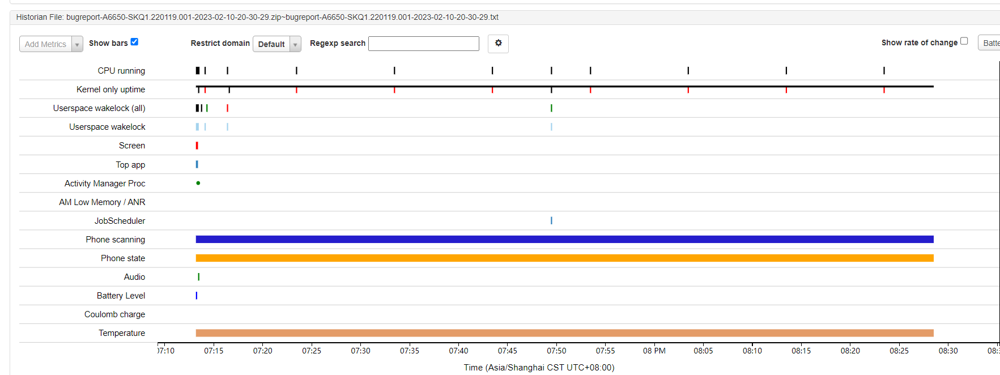
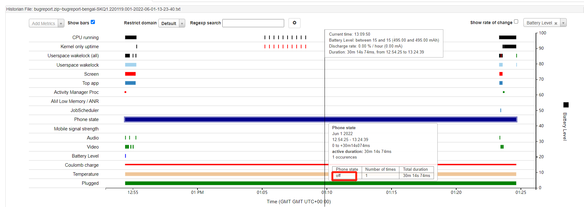
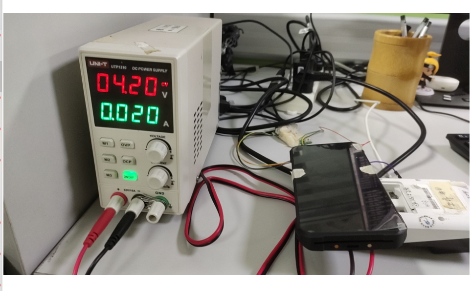
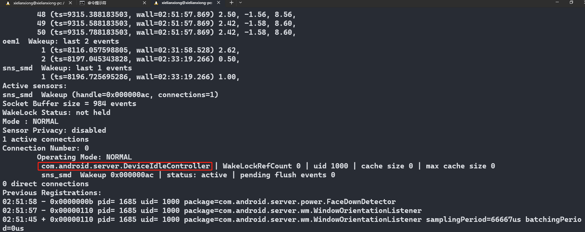

# README

功耗分析,针对6650 低电流18ma,展开分析

# 捉取log

* adb shell dumpsys batterystats --reset

* adb shell dumpsys batterystats --enable full-wake-history

* adb shell dumpsys battery unplug
    > 链接usb,不充电

* 打开mtklog,或者高通 Logkit ,捉取log, 不用打开这个,不然kernel频繁唤醒

* 复现问题,大概半小时后,

* adb bugreport bugreport.zip

* adb bugreport > bugreport.txt  ;For devices 6.0 and lower:

* adb shell dumpsys batterystats > batterystats.txt

* echo mem>/sys/power/state ,强制休眠

# BatteryHistorian 分析捉取bugreport

* 打开 [BatteryHistorian](https://bathist.ef.lc/),分析网站,上传bugreport分析

    

    kernel 很密,感觉没有怎么睡下去

    

    

* 关闭Logkit,发现就不密了.

    说明软件基本没有大问题,但是发现,phone scanning 一直在搜,难道modem没休眠?

    

* 使用移远开发板,打开飞行模式,捉取图如下

    发现没有phone scanning,并且phone state 是off状态

    

* 使用A6650版本 ,打开飞行模式测试一把,体现如下

    所以估计还是哪个器件漏电.要具体硬件帮忙量一下了

    * phone scanning 没有了.

    * phone state = off了.

    

# 使用移远给的方法捉取log, 获取高通休眠前后Log.简易带bugreport.up7.bat

```
@echo off

::::::::::::::::::::::::::::::::::::::::::::::::::::::::::::::::::::::::::::::::::::::::::::
:: 前置条件：开飞行模式，关闭 wifi bt gps, 并设置 Display->Sleep 时间改为 15s
:: 1. 脚本使用就是先连上手机，确认 adb 能连接，然后在 window 下双击脚本，等脚本等待时，
:: 2. 断开 USB, 休眠等 5 分钟
:: 3. 然后连上 USB, 在终端脚本上按任意键，完成 log 抓取
::::::::::::::::::::::::::::::::::::::::::::::::::::::::::::::::::::::::::::::::::::::::::::

set cmd1=logcat -d 
set cmd2=dmesg -c

:: DOS批处理%time%小时的值小于10的时候在这个值前加0
if "%time:~0,2%" lss "10" (set hh=0%time:~1,1%) else (set hh=%time:~0,2%)

set suspendtime=%DATE:~0,4%%DATE:~5,2%%DATE:~8,2%-%hh%%TIME:~3,2%%TIME:~6,2%

echo  %suspendtime%
@echo on
adb wait-for-device
adb root
adb wait-for-device

:: 作用：AP 是否进入睡眠
:: 检查rpm_stats是否进入vdd min或者xo/no shutdown。使用下面的命令检查rpm lower power mode count:
::如果vmin的count是0，则表明设备从来没有进入vdd min；non-zero则说明设备进入过vdd_min。
adb shell cat /sys/kernel/debug/rpm_stats    > %suspendtime%.rpm_stats.suspend.txt
adb shell cat /sys/power/system_sleep/stats  > %suspendtime%.system_sleep.suspend.txt
adb shell cat /sys/power/soc_sleep/stats  > %suspendtime%.soc_sleep.suspend.txt


:: 作用：判断哪个 CPU 没有睡眠 
adb shell cat  /sys/kernel/debug/rpm_master_stats > %suspendtime%.rpm_master_stats.suspend.txt
adb shell cat /sys/power/rpmh_stats/master_stats > %suspendtime%.master_stats.suspend.txt

:: 作用：查看哪路 CLK 没关
adb shell "echo 1 > /sys/module/kernel/parameters/initcall_debug"
adb shell "echo 1 > /sys/kernel/debug/clk/debug_suspend" 
adb shell "echo 1 > /sys/module/msm_show_resume_irq/parameters/debug_mask"
adb shell "echo 32 > /sys/module/msm_pm/parameters/debug_mask"
adb shell "echo 8 > /sys/module/mpm_of/parameters/debug_mask"

::查看唤醒源：
:: adb shell  "echo 1 > /sys/module/kernel/parameters/initcall_debug" 
:: adb shell  "echo 1 > /sys/kernel/debug/clk/debug_suspend" 
adb shell  "echo 0 >/sys/module/qpnp_rtc/parameters/poweron_alarm"
:: adb shell  "echo 1 > /sys/module/msm_show_resume_irq/parameters/debug_mask"
:: adb shell  "echo 32 > /sys/module/msm_pm/parameters/debug_mask" 
:: adb shell  "echo 8 > /sys/module/mpm_of/parameters/debug_mask" 
:: adb shell  "echo 0x2 > /sys/module/ipc_router_core/parameters/debug_mask" 
 

:: bugreport 
adb shell dumpsys batterystats --reset
adb shell dumpsys batterystats --enable full-wake-history

:: 休眠锁 # 注，拉出来后检查： last_change 看没有有变化 
adb shell cat /sys/kernel/debug/wakeup_sources > %suspendtime%.wakelock.suspend.txt

:: 获取中断频率
adb shell cat /proc/interrupts > %suspendtime%.interrupts.suspend.txt


pause

::::::::::::::::::::::::::::::::::::::::::::::::::::
:: 拔掉 USB 复现问题后，再连上
::::::::::::::::::::::::::::::::::::::::::::::::::::

adb wait-for-device
adb root
adb wait-for-device
:: 唤醒
@echo off
set resumetime=%DATE:~0,4%%DATE:~5,2%%DATE:~8,2%-%hh%%TIME:~3,2%%TIME:~6,2%
echo  %resumetime%
@echo on
adb shell cat /sys/kernel/debug/rpm_stats    > %resumetime%.rpm_stats.resume.txt
adb shell cat /sys/power/system_sleep/stats    > %resumetime%.system_sleep.resume.txt
adb shell cat /sys/power/soc_sleep/stats  > %suspendtime%.soc_sleep.resume.txt

adb shell cat  /sys/kernel/debug/rpm_master_stats > %resumetime%.rpm_master_stats.resume.txt
adb shell cat /sys/power/rpmh_stats/master_stats > %resumetime%.master_stats.resume.txt


adb shell cat /sys/kernel/debug/wakeup_sources > %resumetime%.wakelock.resume.txt
adb shell cat /proc/interrupts > %resumetime%.interrupts.resume.txt

adb shell %cmd2:"=% > %resumetime%.kernel.txt
adb shell %cmd1:"=% > %resumetime%.logcat.txt

    adb bugreport   bugreport.zip

pause

```

# 之前屏漏电,偏压ic没关,修改路径

* dts

```
+++ b/UM.9.15/vendor/qcom/proprietary/devicetree-4.19/qcom/a6650/a6650-scuba-iot-idp-overlay_V02_V03.dts
@@ -75,6 +75,7 @@
 };
 
 &sde_dsi {
+    qcom,lcd_power_2v85 = <&tlmm 69 0>;
        qcom,dsi-default-panel = <&dsi_ili7807s_1080p_video>;
 };
```

* UM.9.15/kernel/msm-4.19/techpack/display/msm/dsi/dsi_display.c

```
int dsi_display_prepare(struct dsi_display *display)
set 1
```

```
int dsi_display_unprepare(struct dsi_display *display)
set 0
```

# 漏电原因

## 操作1

* 看图形,软件是休眠下去了.估计还是那个器件没休眠,替换移远的 dts跟boot量一下低电流.

    * 没替换之前,打开飞行模式,30ma

    * 替换xbl,xbl_config,abl,dtbo,boot后,一直停留在init,休眠不下去

        ```
        [   92.859853] init: Control message: Could not find 'android.hardware.soundtrigger@2.0::ISoundTriggerHw/default' for ctl.interface_start from pid: 425 (/system/bin/hwservicemanager)
        [   93.860827] init: Control message: Could not find 'android.hardware.soundtrigger@2.0::ISoundTriggerHw/default' for ctl.interface_start from pid: 425 (/system/bin/hwservicemanager)
        [   94.861901] init: Control message: Could not find 'android.hardware.soundtrigger@2.0::ISoundTriggerHw/default' for ctl.interface_start from pid: 425 (/system/bin/hwservicemanager)
        [   95.864343] init: Control message: Could not find 'android.hardware.soundtrigger@2.0::ISoundTriggerHw/default' for ctl.interface_start from pid: 425 (/system/bin/hwservicemanager)
        [   96.865841] init: Control message: Could not find 'android.hardware.soundtrigger@2.0::ISoundTriggerHw/default' for ctl.interface_start from pid: 425 (/system/bin/hwservicemanager)
        [   97.866974] init: Control message: Could not find 'android.hardware.soundtrigger@2.0::ISoundTriggerHw/default' for ctl.interface_start from pid: 425 (/system/bin/hwservicemanager)
        [   98.867862] init: Control message: Could not find 'android.hardware.soundtrigger@2.0::ISoundTriggerHw/default' for ctl.interface_start from pid: 425 (/system/bin/hwservicemanager)
        [   99.870222] init: Control message: Could not find 'android.hardware.soundtrigger@2.0::ISoundTriggerHw/default' for ctl.interface_start from pid: 425 (/system/bin/hwservicemanager)
        [  100.869675] init: Control message: Could not find 'android.hardware.soundtrigger@2.0::ISoundTriggerHw/default' for ctl.interface_start from pid: 425 (/system/bin/hwservicemanager)
        [  101.870506] init: Control message: Could not find 'android.hardware.soundtrigger@2.0::ISoundTriggerHw/default' for ctl.interface_sta
        ```

    * 按了一下power键后,背光灭了,休眠下去了,还有25ma,拔掉串口小板后,20ma

        > 刷移远底层也是20ma,刷我们软件,底电流也是20ma, 难道上层漏电? 但是bugreport的图形图,显示上层没有漏电.难道sp漏电?

        

* 休眠软件关掉sp电源,查看情况. 经过一系列上述操作还是没指明是哪个漏电.

    > 软件关掉sp电源后,少了1-2ma,还剩下19ma.

## 操作2

刷我们软件,用拆了外围的板子,      刷移远的底层,7ma.

刷我们软件,用没有拆了外围的板子,  刷移远的底层,16ma.

让硬件,帮忙一点点拆除板子上的外围器件,看看能不能排查出来哪个漏电

* 拆外围硬件,定位哪个漏电

* 拆掉5190 ,定位漏电6ma,应该是涉及到pn5190器件漏电,还有用到的这一路spi clk漏电

* 最终定位如下下面表格,软件剩下5190漏电,其他的要再确认下怎么修改

## sensor

* 软件打开抬手亮屏,18ma

* 软件 关闭抬手亮屏,16ma

* adb rm qmi8658,14ma

* 所以 qmi8658应该还是漏电2ma

* adb shell dumpsys sensorservice

    com.android.server.DeviceIdleController 这个还漏电,PackageManager.FEATURE_LEANBACK_ONLY

    

* 去掉DeviceIdleController,修改方案

    修改前,基本都是16ma,修改后,一般都是15ma,概率性掉到12ma

```
+++ b/QSSI.12/frameworks/base/apex/jobscheduler/service/java/com/android/server/DeviceIdleController.java
@@ -3080,7 +3080,17 @@ public class DeviceIdleController extends SystemService
             if (!mForceIdle) {
                 becomeInactiveIfAppropriateLocked();
             }
+//[feature]-add-begin xielianxiong@paxsz.com,20230216,for sensor lowpower 2ma
+            if(mMotionSensor != null){
+                if(mMotionListener.active){
+                    mMotionListener.unregisterLocked();
+                }
+            }
+//[feature]-add-end xielianxiong@paxsz.com,20230216,for sensor lowpower 2ma
         } else if (screenOn) {
+//[feature]-add-begin xielianxiong@paxsz.com,20230216,for sensor lowpower 2ma
+            startMonitoringMotionLocked();
+//[feature]-add-end xielianxiong@paxsz.com,20230216,for sensor lowpower 2ma
             mScreenOn = true;
             if (!mForceIdle && (!mScreenLocked || !mConstants.WAIT_FOR_UNLOCK)) {
```

## lcd

* 鸿展屏漏电2ma,查看规格书,发现鸿展incell屏,lcd reset, tp reset 休眠时,要同时拉高,不然芯片就进入异常状态

```
--- a/UM.9.15/vendor/qcom/proprietary/devicetree-4.19/qcom/a6650/a6650-scuba-iot-idp-overlay_V01_V01.dts
+++ b/UM.9.15/vendor/qcom/proprietary/devicetree-4.19/qcom/a6650/a6650-scuba-iot-idp-overlay_V01_V01.dts
@@ -91,6 +91,7 @@
        qcom,mdss-dsi-bl-max-level = <255>;
        qcom,platform-te-gpio = <&tlmm 81 0>;
        qcom,platform-reset-gpio = <&tlmm 82 0>;
+    qcom,platform-reset-gpio-always-on;
 
        qcom,mdss-dsi-display-timings {
                timing@0{
```

* 查看屏漏电多少,可以用万用表,串联到屏的vocc看看通过的电流

# 漏电表格
|器件|漏电流|
|:--|:--|
|sp电源|大约2ma|
|1080屏|大约2ma|
|sensor|大约2ma|
|移远模块|大约4ma|

|板子|软件|底电流|
|:--|:--|:--|
|唐欢板子(全拆)|百富软件|16ma|
|唐欢板子(全拆)|百富软件,软件去掉5190|7ma|
|唐欢板子(全拆)|百富软件,移远底层|9ma|
|唐欢板子(全拆)|移远软件|9ma|
|谢连雄板子(没拆)|百富软件|17ma|
|谢连雄板子(没拆)|百富软件,软件去掉5190|17ma|
|谢连雄板子(没拆)|百富软件,移远底层|17ma|
|谢连雄板子(没拆)|移远软件|9ma|
|唐欢板子(只拆pn5190)|百富软件,软件去掉5190|10ma|
|唐欢板子(只拆pn5190)|百富软件,软件去掉5190,adb命令去掉sensor|8ma|
|唐欢板子(只拆pn5190,接上屏)|百富软件,软件去掉5190|12ma|

# 命令进入休眠方式

* echo mem > /sys/power/state

# 欧亚机器分析功耗

工厂带回来的V03 NA版本机器,底电流默认12ma, 功耗OK.

但是EM的机器,底电流28ma(接入串口,没有串口就20ma), 而且还一直有规律的调到98ma.

## 分析

接入串口,发现tp 一直在唤醒系统. 把tp驱动去掉.底电流一直稳定在27ma 包含串口.

所以估计屏也有漏电,dsi_ft8006s_720p_video

## tp 跟 lcd 的reset脚都要高,少了4ma,还是漏电2ma

* UM.9.15/vendor/qcom/proprietary/devicetree-4.19/qcom/a6650/a6650-scuba-iot-idp-overlay_V02_V03.dts
* UM.9.15/vendor/qcom/proprietary/devicetree-4.19/qcom/a6650/a6650-scuba-iot-idp-overlay_V03_V04.dts
* UM.9.15/vendor/qcom/proprietary/devicetree-4.19/qcom/a6650/a6650-scuba-iot-idp-overlay_debug.dts

* 三支文件,对dsi_ft8006s_720p_video 进行了overlay,导致dsi-panel-ft8006s-720p-video.dtsi 里面的 qcom,platform-reset-gpio-always-on 没有生效

    > find /sys/firmware/devicetree/base/soc/  -name "qcom,platform-reset-gpio-always-on"

## 电流跳动98ma问题

跳动问题是由于tp驱动 默认打开了双击唤醒,所以驱动初始化可能不正确,默认把tp双击唤醒关闭就没有问题

## 漏电2ma

漏电2ma发现是屏的休眠寄存器概率性没有写成功,这些写入规范需要fae提供.

ft8006s_720p 屏最终修改如下,下面这些指令是mipi规范,之前有文档介绍,在屏专栏

```
+++ b/UM.9.15/vendor/qcom/proprietary/devicetree-4.19/qcom/a6650/dsi-panel-ft8006s-720p-video.dtsi
@@ -64,8 +64,11 @@
                qcom,mdss-dsi-on-command =[ 
                05 01 00 00 78 00 02 11 00
                05 01 00 00 14 00 02 29 00];
-               qcom,mdss-dsi-off-command = [05 01 00 00 32 00 02 28 00
-                                       05 01 00 00 78 00 02 10 00];
+               qcom,mdss-dsi-off-command = [
+                                       05 01 00 00 78 00 02 28 00
+                                       05 01 00 00 00 00 02 10 00
+                                       15 01 00 00 00 00 02 17 5A
+                                       15 01 00 00 00 00 02 18 5A];
```