# README

功耗问题,需要BatteryHistorian图像化分析bugreport

# 快捷安装

最终还是因为被墙原因,没有安装成功,提示 Could not parse aggregated battery stats.

可以用别人安装好的,一键打包安装,只要配好环境就可以了.

https://download.csdn.net/download/weixin_49836860/86320232

如果有翻墙环境,还是建议按照如下步骤安装一把

# BatteryHistorian安装

## 安装配置Go语言环境

* 去[官网下载](https://go.dev/doc/install),容易被墙

    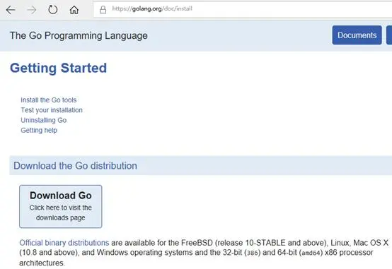

* 下载对应版本安装,例如 go1.9.5.windows-amd64.msi

    

* 配置环境变量

    * 计算机 -> 属性 -> 高级系统设置 -> 高级 -> 环境变量

    * 系统变量,新建  GOROOT

        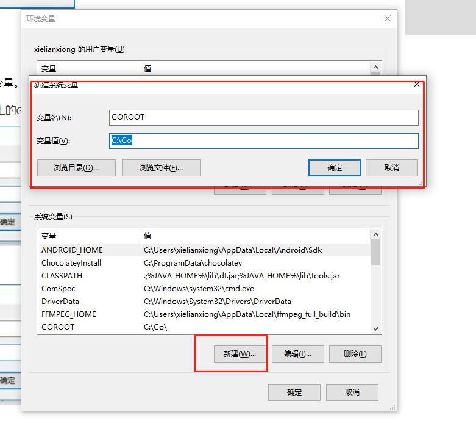

    * 系统变量 ,新建  GOPATH

        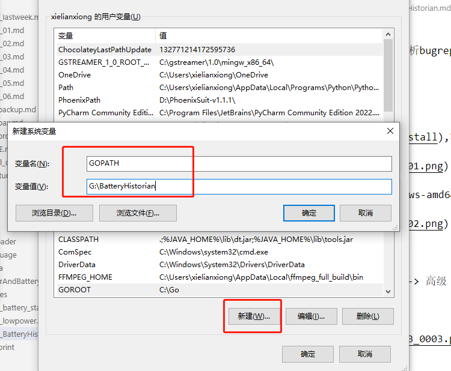

    * 编辑系统path,添加go/bin

        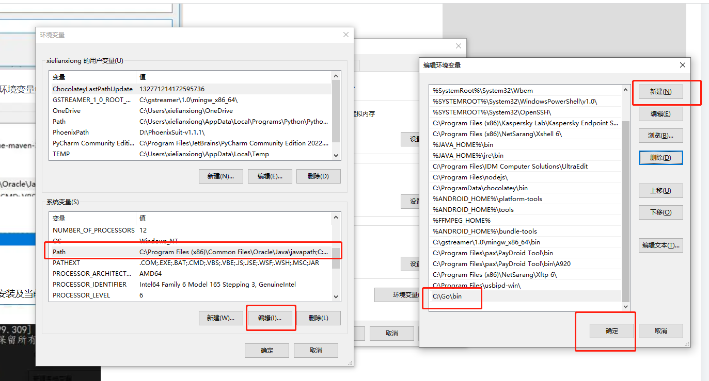

    * 新开一个cmd, 输入 go version,查看是否安装成功

        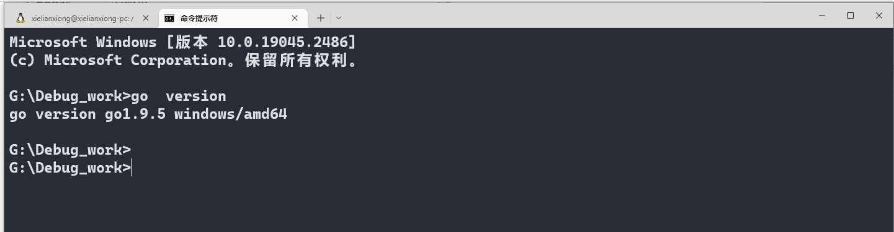

## 安装python

* [安装python](https://www.python.org/),只支持2.7,由于historian.py脚本是python2写的，所以需要安装python2.7环境。

    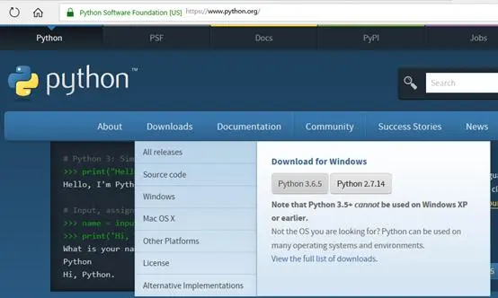

* 下载 2.7版本

    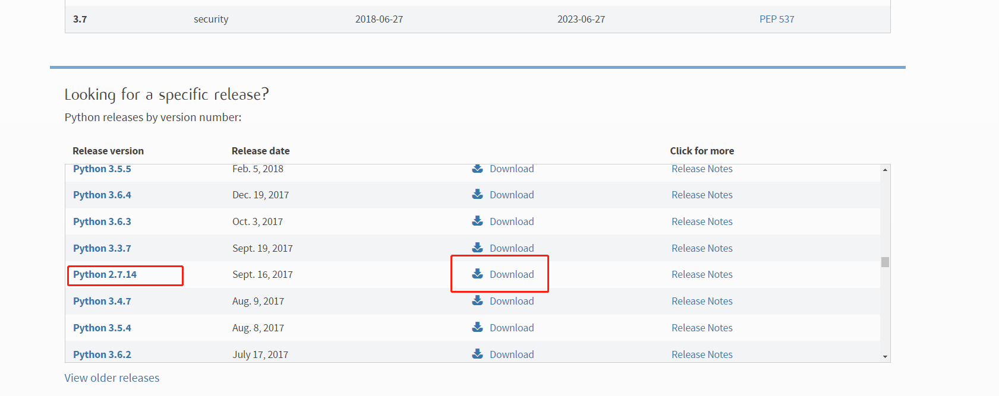

* 安装

    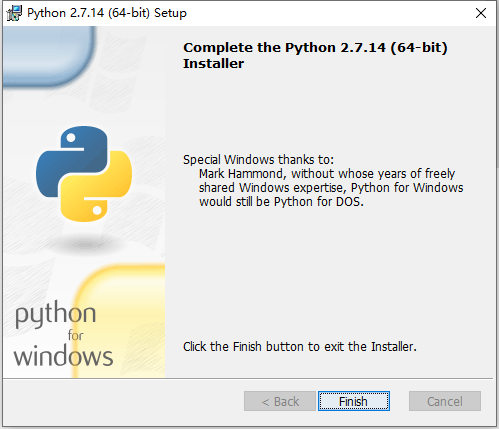

* 配置环境变量

    * 把Python27的安装目录添加到系统变量的Path环境变量中

        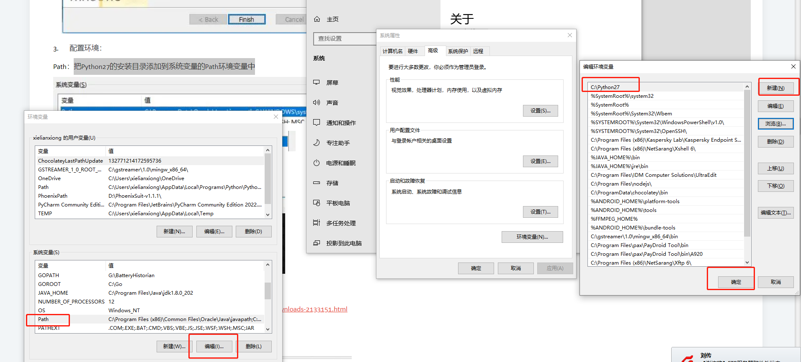

* 新建cmd串口 ,检查python是否安装成功

    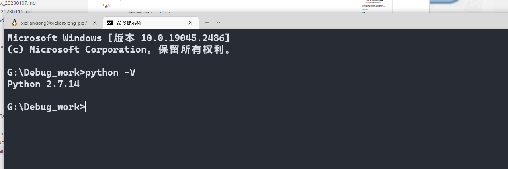

        
## 安装java

* [安装jdk 1.8](www.oracle.com/technetwork/java/javase/downloads/jdk8-downloads-2133151.html)本地已经安装了,就不展开了

* 配置环境变量,已经有了,不展开

    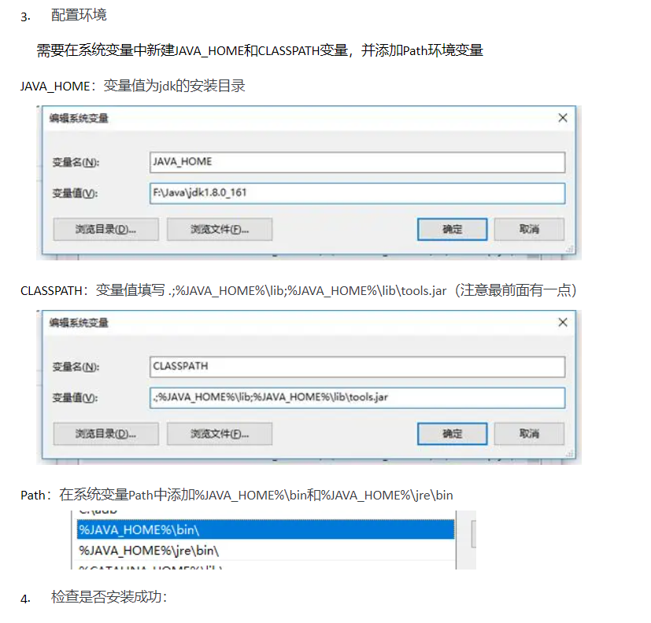

* 在cmd下执行java –version检查是否安装成功并查看当前版本号

    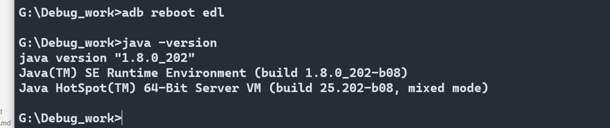

## 下载git,不展开

## 下载源码

* git clone https://github.com/google/battery-historian.git

* 创建third_party目录

    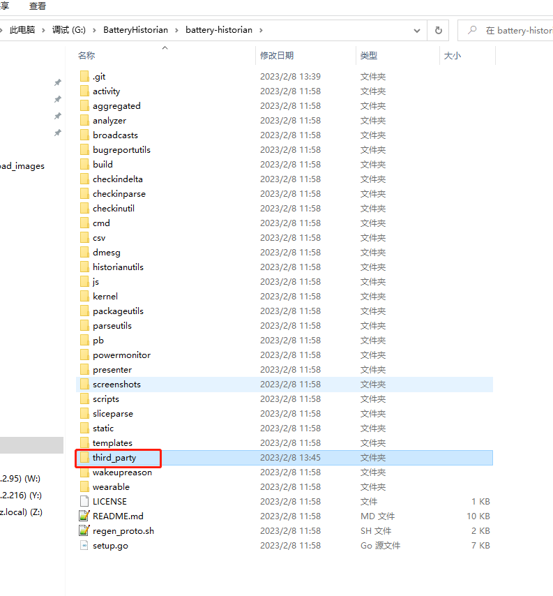

* 下载[closure-compiler](http://dl.google.com/closure-compiler/compiler-20160208.zip),解压在third_party

    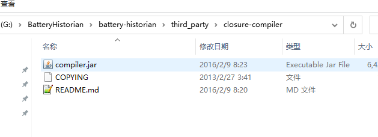

* 下载closure-library,git clone https://github.com/google/closure-library.git

    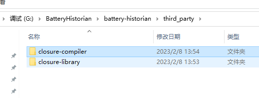

* 下载flot-axislabels,git clonehttps://github.com/xuanluo/flot-axislabels.git

    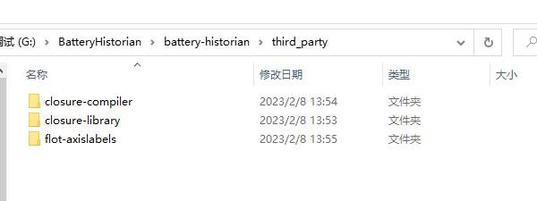

* 把源码保存在 BatteryHistorian\src\github.com\google\battery-historian,不然运行报错

    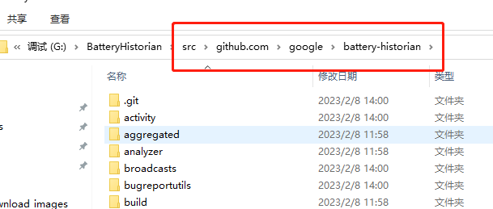

* 在如下路径,BatteryHistorian/src/github.com/golang,下载 git clone https://github.com/golang/protobuf.git

    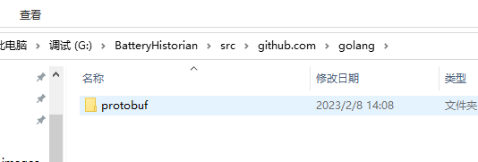

* 在如下路径,BatteryHistorian/src/google.golang.org,git clone https://github.com/protocolbuffers/protobuf-go.git protobuf

    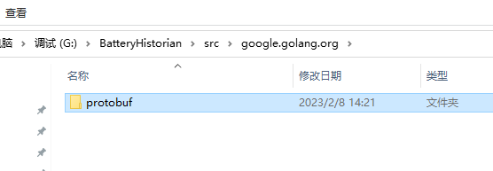

* historian-optimized.js 文件放到 battery-historian\compiled下, 如果可以翻墙的化,go run setup.go 应该可以下下来

    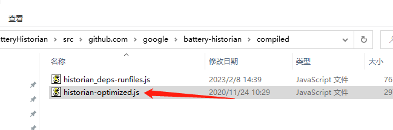

* 拷贝cdn 到 third_party 目录下,如果可以翻墙的化,go run setup.go 应该可以下下来

    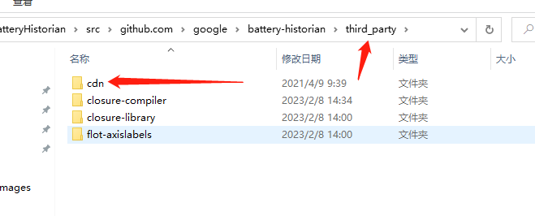

* 执行命令go run cmd/battery-historian/battery-historian.go

    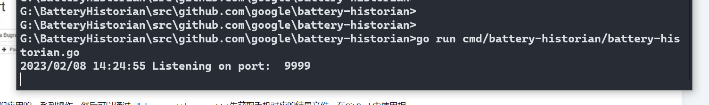

* 浏览器 登入 http://localhost:9999

    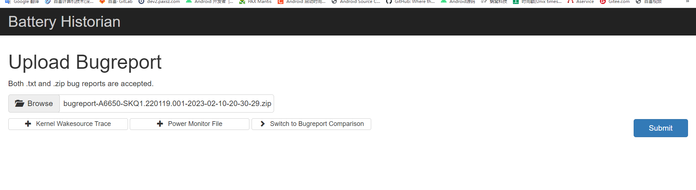

* 填入bugreport分析

    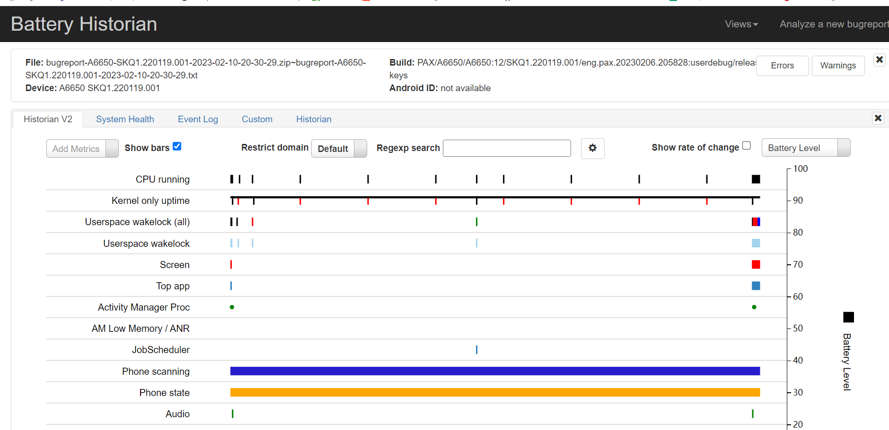

