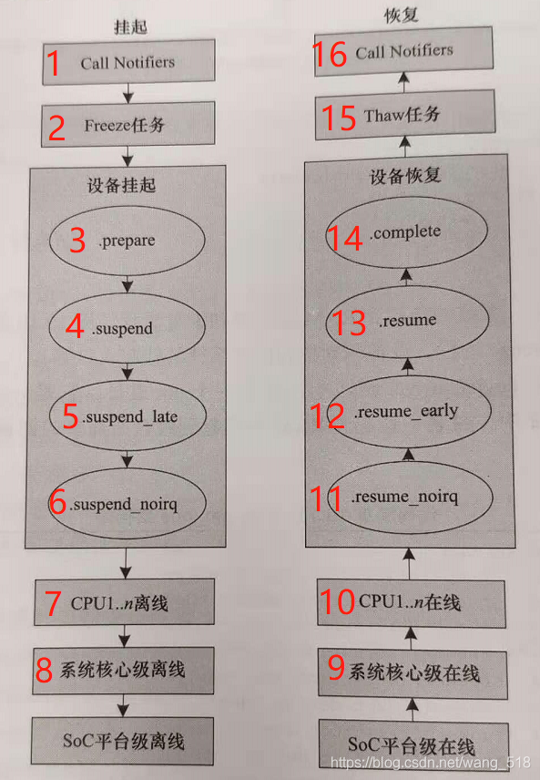

# README

KENREL 内核休眠流程,生命周期

# 流程

* 灭屏-> call notifiers -> freeze 任务 -> prepare -> suspend -> suspend_late -> suspend_noirq -> cpu 1-n offline -> 系统核离线 -> Soc 平台级离线

* 亮屏 -> Soc 平台级上线 -> 系统级核心上线 -> cpu 1-n 上线 -> resume_noirq -> resume_early -> resume -> complete -> Thaw 解冻任务 -> call notifiers

# 命令

* 查询kernel内核支持的休眠方式

    * cat /sys/power/state

* 命令系统进入休眠

    * echo mem > /sys/power/state