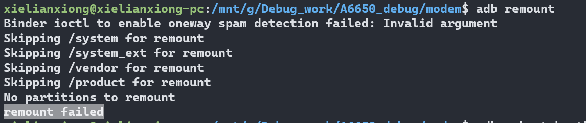
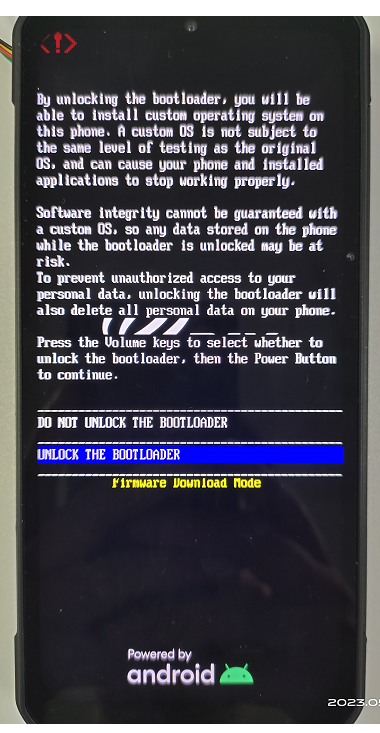
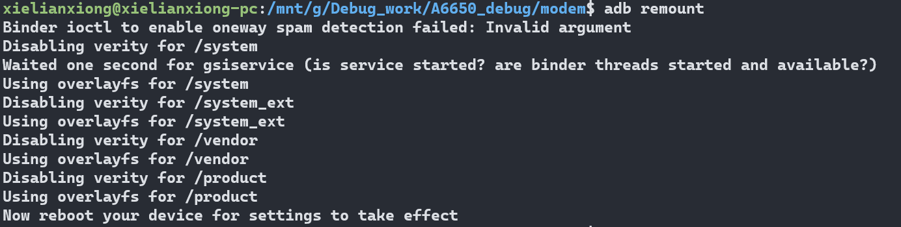
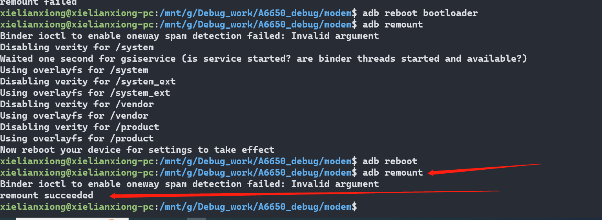

# adb remount 失败

提示No partitions to remount,remount failed

# 原因

机器打开熔丝(烧录了fuse)后,remount失败

# 解决

* 设置->关于手机,连续点击Build number 七下,提示You are Developer

* 设置->System->Developer options,打开OEM unlocking 菜单

* adb reboot bootloader

* fastboot flashing unlock

* 按音量下键选择   UNLOCK THE BOOTLOADER,然后按power键确认,重启

    

* 重启后,输入adb remount,提示需要reboot take effect,如下

    

* adb reboot,重启后,再次输入 adb remount ,提示 成功,如下

    