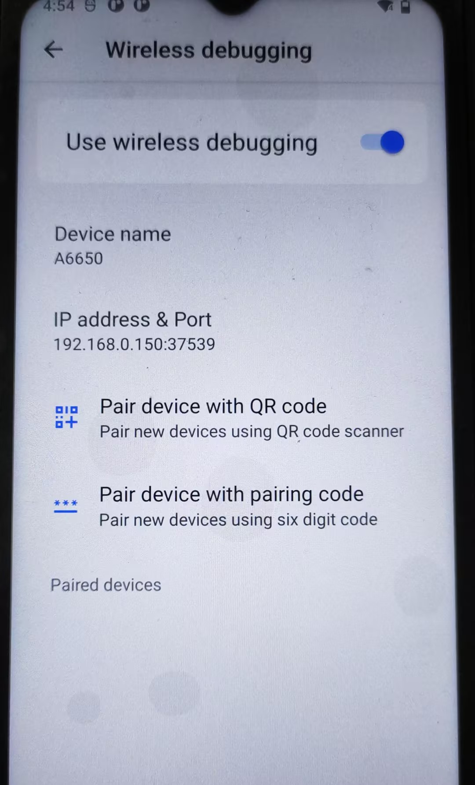
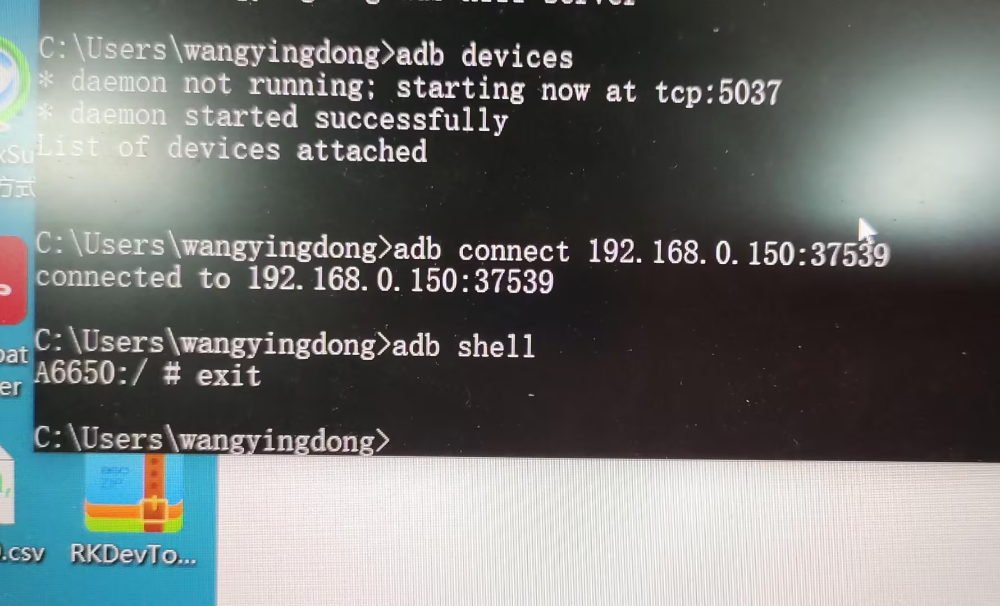
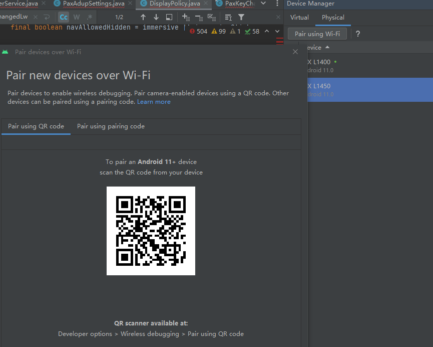
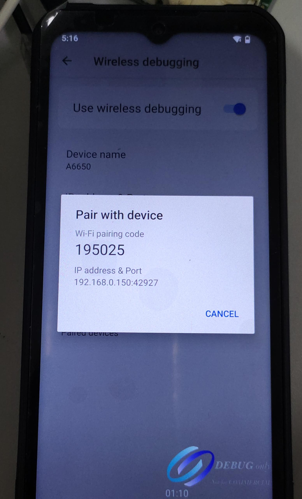
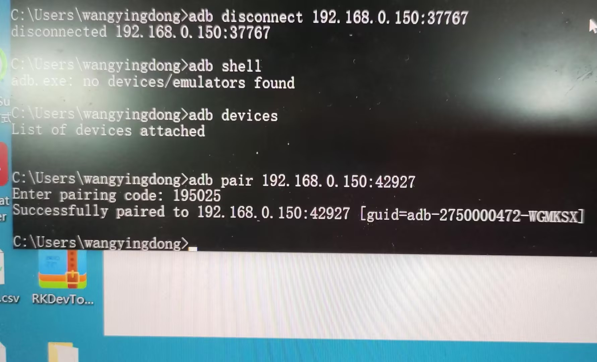

# 概要

有时候需要用到wifi adb场景

# 前提条件

连上wifi,开发者选项,打开 wifi 调试

# 使用方法

* adb connect 192.168.0.150:37539

    

* 端口号使用使用 ``adb tcpip 6666`` 修改

* adb disconnect 192.168.0.150:37539

* wifi: adb tcpip 5555

* 切usb: adb usb

# 链接失败

* 关闭selinux权限验证

# pari device with QR code

在新版android studio 的device manager里面,点击pair using Wi-Fi菜单,会弹出二维码

接着在开发者选项里面,选择Pair device with QR code扫码连接

# Pair device with paring code

* 点击菜单,生成pair code

    

* adb pair 192.168.0.150:42927

    接着输入pair code

    

* adb connect 192.168.0.150:37767