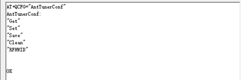
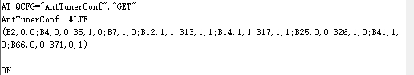
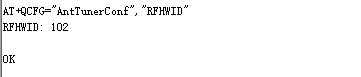
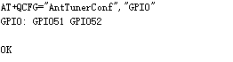

# README

本文介绍一下at命令相关知识.

同时通过一个开机,自动通过写入at命令去切换硬件高通平台modem的例子,加深对at命令的理解.

# at命令

以下是at命令的解释,来自百度百科.简单来说就是可以通过at命令跟modem交互,例如查询imei号,拨打电话等

> AT 即Attention，AT指令集是从终端设备(Terminal Equipment，TE)或数据终端设备(Data Terminal Equipment，DTE)向终端适配器(Terminal Adapter， TA)或数据电路终端设备(Data Circuit Terminal Equipment，DCE)发送的。通过TA，TE发送AT指令来控制移动台(Mobile Station，MS)的功能，与GSM 网络业务进行交互。用户可以通过AT指令进行呼叫、短信、电话本、数据业务、传真等方面的控制。90年代初，AT指令仅被用于Modem操作。没有控制移动电话文本消息的先例，只开发了一种叫SMS BlockMode的协议，通过终端设备(TE)或电脑来完全控制。由Hayes公司发明，已成为事实上的标准并被所有调制解调器制造商采用的一个调制解调器命令语言。每条命令以字母"AT"开头，因而得名。AT后跟字母和数字表明具体的功能。 SMS。之后，主要的移动电话生产厂商诺基亚、爱立信、摩托罗拉和HP共同为GSM研制了一整套AT指令，其中就包括对SMS的控制。AT指令在此基础上演化并被加入GSM07．05标准以及的GSM07．07标准，完全标准化和比较健全的标准。如：对SMS的控制共有3种实现途径：最初的BlockMode；基于AT指令的TextMode；基于AT指令的PDUMode。到PDUMode已经取代BlockMode，后者逐渐淡出。GSM模块与计算机之间的通信协议是一些AT指令集，AT指令是以AT作首，字符结束的字符串，AT指令的响应数据包在中。每个指令执行成功与否都有相应的返回。其他的一些非预期的信息(如有人拨号进来、线路无信号等)，模块将有对应的一些信息提示，接收端可做相应的处理。

# 高通2290平台 设置tuner at命令

AT+ QCFG="AntTunerConf",可以带参数,Get,Set,Save,Clean,RFHWID,GPIO,输出 OK 或者 ERROR



* AT+ QCFG="AntTunerConf","Get"

    当参数为"Get"时，返回当前的自定义Tuner配置

    

* AT+ QCFG="AntTunerConf","RFHWID"

    

    当参数为"RFHWID"是，返回当前配置的HWID

* AT+ QCFG="AntTunerConf","GPIO"

    查看当前模块支持配置的tuner的gpio,后面set命令,需要更绝此顺序来配置逻辑

    

* AT+ QCFG="AntTunerConf","Clean"

    清除当前自定义的配置

* AT+ QCFG="AntTunerConf","Save"

    保存当前的设置到efs文件,所有对自定义配置的操作,都需要save

* AT+ QCFG="AntTunerConf","Set","xxx"

    用于配置自定义的Tuner配置，建议第一次执行之前先执行clean，重新完整的配置.

    具体"xxx",解释如下,在具体应用例子里面有体验

    * “#”号后面跟着网络制式，现在支持GSM/WCDMA/LTE

    * 网络制式后面就是一个括弧，括弧里面包含了当前网络制式里的band的tuner配置

    * 括弧里面每个band的tuner配置之间用“;”隔开，不得有空格或者使用其他的字符隔开

    * 每个band的tuner配置有三个参数，参数之间用逗号“,”隔开，不得有空格或者使用其他的字符隔开

    * 三个参数按照顺序分别是    band,GPIO_1的配置,GPIO_2的配置（GRFC1 GRFC2对应着上面的“GPIO命令查出来的值”，如上图所示，则GPIO_1 就是GPIO51， GPIO_2 就是GPIO52）

    * GPIO_1, GPIO_2的配置的值只能是0，或者1， 0代表低电平，1代表高电平

    * band必须和数组quec_band_des_array_index 中的band_des一致

    * 可以配置多次，如有band重复的以最后一次覆盖配置，使用Get命令查询当前所有的配置，最后必须要使用Save命令进行保存，否则关机开机后会丢失

    * 配置完成并Save保存后，重启生效

# 高通2290 通过at设置tunner总结

由于需要重启设备生效,所以流程可以,先通过get,看一下是否符合要求

如果不符合,就clean,set,get,然后save,然后reboot设置

* 执行clean指令清空当前所有的配置

    * AT+QCFG="AntTunerConf","Clean"

* 使用Set指令进行配置；（可以配置多次）

    * AT+QCFG="AntTunerConf","Set","#LTE(B5,1,1;B8,0,1)"

* 使用Get指令查看配置是否正确，如果不正确就重新配置

    * AT+QCFG="AntTunerConf","Get"

* 使用Save命令保存

    * AT+QCFG="AntTunerConf","Save"

* 重启设备生效

# 高通2290 通过at设置tunner总结 apk例子

主要原理是通过对/dev/smd8 设备下发指令,具体的selinux权限修改就不详细列出.只列出部分

## selinux修改

```
--- a/device/qcom/common/rootdir/etc/ueventd.qcom.rc
+++ b/device/qcom/common/rootdir/etc/ueventd.qcom.rc
@@ -66,6 +66,7 @@ firmware_directories /vendor/firmware_mnt/image/
 
 #permissions for CSVT
 /dev/smd11                0660   radio      radio
+/dev/smd8                0660   radio      radio


--- a/device/qcom/sepolicy_vndr/generic/vendor/common/file_contexts
+++ b/device/qcom/sepolicy_vndr/generic/vendor/common/file_contexts
@@ -29,7 +29,7 @@
 /dev/diag                                       u:object_r:vendor_diag_device:s0
 /dev/kgsl-3d0                                   u:object_r:gpu_device:s0
 /dev/rtc0                                       u:object_r:rtc_device:s0
-/dev/smd.*                                      u:object_r:vendor_smd_device:s0
+/dev/smd*                                       u:object_r:vendor_smd_device:s0
 /dev/msm_npu                                    u:object_r:vendor_npu_device:s0

 --- a/device/qcom/sepolicy_vndr/generic/vendor/common/radio.te
+++ b/device/qcom/sepolicy_vndr/generic/vendor/common/radio.te
@@ -39,6 +39,8 @@ allow radio {
 
 # IMS needs permission to use avtimer
 allow radio vendor_avtimer_device:chr_file r_file_perms;
+allow radio vendor_smd_device:chr_file { read write open };
+allow radio device:chr_file { read write open };
```

## 具体原理,接收开机广播,写入at命令.只列出部分关键,需要加载平台提供的libqlmodem.so,mbnmanager.jar,jar包看情况.

* main

```
mModemTool = new ModemTool();
                String ret1 = mModemTool.sendAtCommand(0, "AT+QMBNCFG=\"autosel\",1");
```

* ModemTool.java

```
package com.quectel.modemtool;

import android.util.Log;

public class ModemTool{
    public static final String TAG = "ModemTool-local";

    // Used to load the 'qlmodem' library on application startup.
    static {
        System.loadLibrary("qlmodem");
    }

    private int cSelf;

    public interface ResponseListener{
        public void onResponse(String response);
    }

    private ResponseListener mListener;

    public void setResponseListener(ResponseListener listener){
        mListener = listener;
    }

    public ModemTool() {
        setAtPort("/dev/smd8");
        //cSelf = _init();
    }


    public int sendAtCommandAsync(String atCommand) {
        Log.d(TAG, "atCommand = " + atCommand);
        //_sendAtCommandAsync(atCommand);
        return 0;
    }

    public int sendData(String atCommand) {
        Log.d(TAG, "atCommand = " + atCommand);
        //_sendData(atCommand);
        return 0;
    }

    public int setAtPort(String atCommand) {
        Log.d(TAG, "atCommand = " + atCommand);
        //_setAtPort(atCommand);
        return 0;
    }

    public void onResponse(String response){

        Log.d(TAG, "response = " + response);

        mListener.onResponse(response);
    }

    public native String sendAtCommand(int commandId, String atCommand);

}
```

* Android.mk

```
LOCAL_PATH:= $(call my-dir)
include $(CLEAR_VARS)

src_dirs := src
res_dirs := res

LOCAL_SRC_FILES := $(call all-java-files-under, $(src_dirs))
LOCAL_RESOURCE_DIR := $(addprefix $(LOCAL_PATH)/, $(res_dirs))

LOCAL_AAPT_FLAGS := \
    --auto-add-overlay \
    --extra-packages com.qualcomm.qti.modemtestmode

$(info PLATFORM_VERSION =: $(PLATFORM_VERSION))
#ifeq ($(PLATFORM_VERSION), 9)
    LOCAL_PREBUILT_JNI_LIBS := libs/arm64-v8a-smd8/libqlmodem.so
#else
#    LOCAL_PREBUILT_JNI_LIBS := libs/armeabi-v7a-smd11/libqlmodem.so
#endif


LOCAL_STATIC_JAVA_LIBRARIES := mbnmanager
LOCAL_JAVA_LIBRARIES := qcrilhook telephony-common

LOCAL_DEX_PREOPT := false
LOCAL_PROGUARD_ENABLED := disabled

LOCAL_PACKAGE_NAME := ModemReboot
LOCAL_CERTIFICATE := platform
LOCAL_MODULE_TAGS := optional
LOCAL_PRIVATE_PLATFORM_APIS:=true
include $(BUILD_PACKAGE)

######################################################
include $(CLEAR_VARS)

LOCAL_PREBUILT_STATIC_JAVA_LIBRARIES := \
                    mbnmanager:libs/mbnmanager.jar

include $(BUILD_MULTI_PREBUILT)
```
 