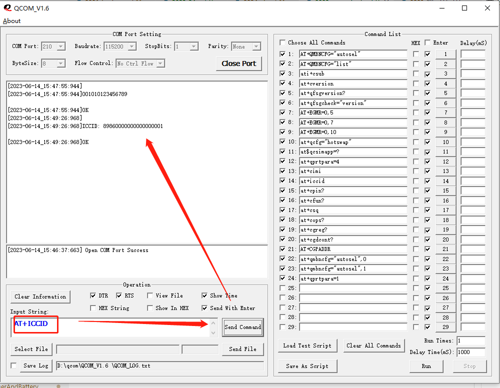

# 概要

本文介绍使用高通工具Qcom V.16 查询at命令方法

# 方法

* setprop sys.usb.config diag,serial_cdev,rmnet,adb 打开高通端口,可以看到端口是210

    

* 打开Qcom,open port

    

* AT+CIMI 读取IMSI

    

* AT+ICCID 读取 ICCID

    

* AT+QNVR=447,0  读取BT地址

    

* AT+QNVR=4678,0  读取wifi地址

    

* AT+EGMR=0,7   读取imei 1,

    