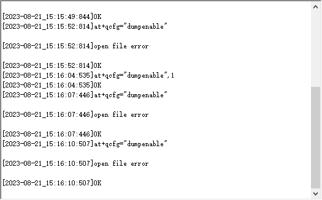
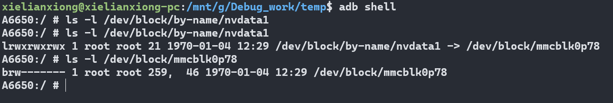
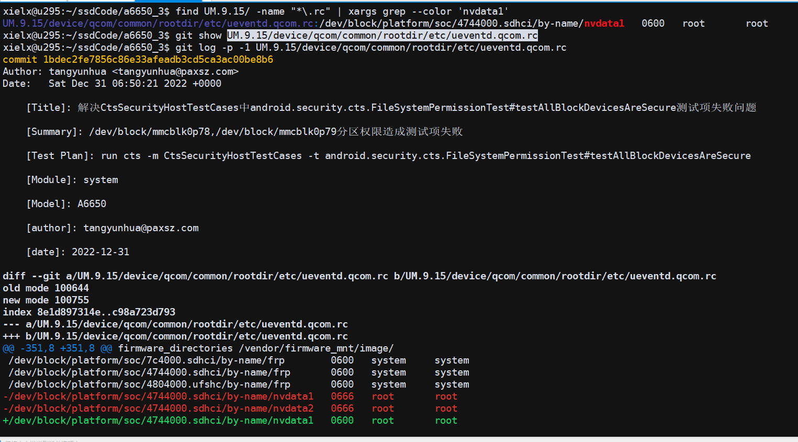

# 概要

at命令输入 dump功能失败

# 指令

* at+qcfg="dumpenable" 查询是否开启dump功能

* at+qcfg="dumpenable",0  //0表示死机后直接开机

* at+qcfg="dumpenable",1  //1表示死机后进入dump

# log

输入命令后at+qcfg="dumpenable",QCOM工具提示, open file error



log 如下

```
04-10 17:33:45.729  1045  1489 I port-bridge: buf contains1 'at+qcfg="dumpenable"

04-10 17:33:45.729  1045  1489 I port-bridge: '
04-10 17:33:45.729  1045  1489 I port-bridge: Attempting to write to '/dev/at_mdm0'...
04-10 17:33:45.729  1045  1489 I port-bridge: trying to lock [0x0x6150058818] /dev/at_mdm0
04-10 17:33:45.729  1045  1489 I port-bridge: locked [0x0x6150058818] /dev/at_mdm0
04-10 17:33:45.731  1045  1489 E port-bridge: write to '/dev/at_mdm0' returned 22
04-10 17:33:45.731  1045  1489 I port-bridge: trying to unlock [0x0x6150058818] /dev/at_mdm0
04-10 17:33:45.731  1045  1489 I port-bridge: unlocked [0x0x6150058818] /dev/at_mdm0
04-10 17:33:45.731  1045  1489 I port-bridge: wifi_modem_is_ture:0, line:821================== 
04-10 17:33:45.731  1045  1489 I port-bridge: Attempting to poll '/dev/at_usb0'...
04-10 17:33:45.732  1219  1375 I AT_Daemon_Quec: qmi_at_unsol_ind_cb: ind id:33 
04-10 17:33:45.732  1219  1375 I AT_Daemon_Quec: Received AT command forward request from modem
04-10 17:33:45.732  1219  1375 I AT_Daemon_Quec: ctrCond signalling complete.
04-10 17:33:45.733  1219  1219 I AT_Daemon_Quec: Recieved ctrCond: p: 0, S:0, nr: 1
04-10 17:33:45.733  1219  1219 I AT_Daemon_Quec: pthread notified for new request; sending response.
04-10 17:33:45.733  1219  1219 I AT_Daemon_Quec: ATFWD AtCmdFwd cmd = +qcfg
04-10 17:33:45.733  1219  1219 I AT_Daemon_Quec: quec_qcfg_handle start
04-10 17:33:45.733  1219  1219 I AT_Daemon_Quec: quec_qcfg_handle:718 quec_qcfg_handle -1s
04-10 17:33:45.733  1219  1219 I AT_Daemon_Quec: quec_qcfg_handle cmd->tokens[0]=dumpenable
04-10 17:33:45.733  1219  1219 I AT_Daemon_Quec: at+qcfg=dumpenable start
04-10 17:33:45.733  1219  1219 E AT_Daemon_Quec: QUEC_NVDATA1 open failed
04-10 17:33:45.733  1219  1219 I AT_Daemon_Quec: Response processing complete. Sending response.
04-10 17:33:45.733  1219  1219 I AT_Daemon_Quec: sending QMI_AT_FWD_RESP_AT_CMD_REQ_ V01 message
04-10 17:33:45.734  1045  1488 E port-bridge: poll on '/dev/at_mdm0' returned 1
04-10 17:33:45.734  1045  1488 I port-bridge: POLLIN is set.
04-10 17:33:45.734  1045  1488 I port-bridge: Attempting to read from '/dev/at_mdm0'...
04-10 17:33:45.734  1045  1488 I port-bridge: trying to lock [0x0x6150058818] /dev/at_mdm0
04-10 17:33:45.735  1045  1488 I port-bridge: locked [0x0x6150058818] /dev/at_mdm0
04-10 17:33:45.735  1045  1488 I port-bridge: trying to unlock [0x0x6150058818] /dev/at_mdm0
04-10 17:33:45.735  1045  1488 I port-bridge: unlocked [0x0x6150058818] /dev/at_mdm0
04-10 17:33:45.735  1219  1219 I AT_Daemon_Quec: qmi_client_send_msg_sync returned: 0
```

# 分析

at命令输入,跟port-bridge 强相关,路径```UM.9.15/vendor/qcom/proprietary/data/port-bridge/```

* UM.9.15/vendor/qcom/proprietary/telephony-apps/ATFWD-daemon_quectel/quectel_at_handle.cpp

```
#define QUEC_NVDATA1 "/dev/block/by-name/nvdata1"
fp = fopen(QUEC_NVDATA1, "r");
LOGE("QUEC_NVDATA1 open failed\n");
```

* 机器查询分区权限

可以看到只有root有读写权限,所以估计是权限不对



* 查找哪里配置的nvdata1或者mmcblk0p78

所以问题比较明显,改出来的



# 修改方法

改回nvdata1,nvdata2 改回666

* UM.9.15/device/qcom/common/rootdir/Android.mk

注意ueventd.qcom.rc 是编译到系统的/vendor/ueventd.rc,所以push认证

```
include $(CLEAR_VARS)
LOCAL_MODULE       := ueventd.qcom.rc
LOCAL_MODULE_STEM  := ueventd.rc
LOCAL_MODULE_TAGS  := optional
LOCAL_MODULE_CLASS := ETC 
LOCAL_SRC_FILES    := etc/ueventd.qcom.rc
LOCAL_MODULE_PATH  := $(TARGET_OUT_VENDOR)
include $(BUILD_PREBUILT)
```

# ueventd.rc 加载流程

ueventd 去加载 ueventd.rc ,然后配置各个文件得权限,具体流程有时间再分析

* QSSI.12/system/core/rootdir/init.rc

```
on early-init

    start ueventd
```

* QSSI.12/system/core/init/ueventd.cpp

```
int ueventd_main(int argc, char** argv) {
    /*  
     * init sets the umask to 077 for forked processes. We need to
     * create files with exact permissions, without modification by
     * the umask.
     */
    umask(000);

    android::base::InitLogging(argv, &android::base::KernelLogger);

    LOG(INFO) << "ueventd started!";

    SelinuxSetupKernelLogging();
    SelabelInitialize();

    std::vector<std::unique_ptr<UeventHandler>> uevent_handlers;

    auto ueventd_configuration = GetConfiguration();

    uevent_handlers.emplace_back(std::make_unique<DeviceHandler>(
            std::move(ueventd_configuration.dev_permissions),
            std::move(ueventd_configuration.sysfs_permissions),
            std::move(ueventd_configuration.subsystems), android::fs_mgr::GetBootDevices(), true));
    uevent_handlers.emplace_back(std::make_unique<FirmwareHandler>(
            std::move(ueventd_configuration.firmware_directories),
            std::move(ueventd_configuration.external_firmware_handlers)));

    if (ueventd_configuration.enable_modalias_handling) {
        std::vector<std::string> base_paths = {"/odm/lib/modules", "/vendor/lib/modules"};
        uevent_handlers.emplace_back(std::make_unique<ModaliasHandler>(base_paths));
    }

static UeventdConfiguration GetConfiguration() {
    // TODO: Remove these legacy paths once Android S is no longer supported.
    if (android::base::GetIntProperty("ro.product.first_api_level", 10000) <= __ANDROID_API_S__) {
        auto hardware = android::base::GetProperty("ro.hardware", "");
        return ParseConfig({"/system/etc/ueventd.rc", "/vendor/ueventd.rc", "/odm/ueventd.rc",
                            "/ueventd." + hardware + ".rc"});
    }   

    return ParseConfig({"/system/etc/ueventd.rc"});
}
```