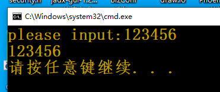
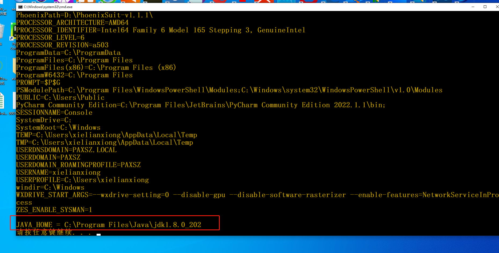
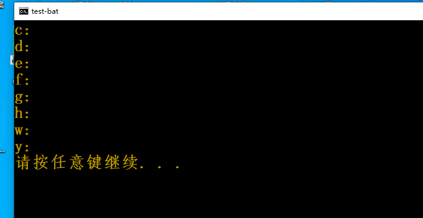
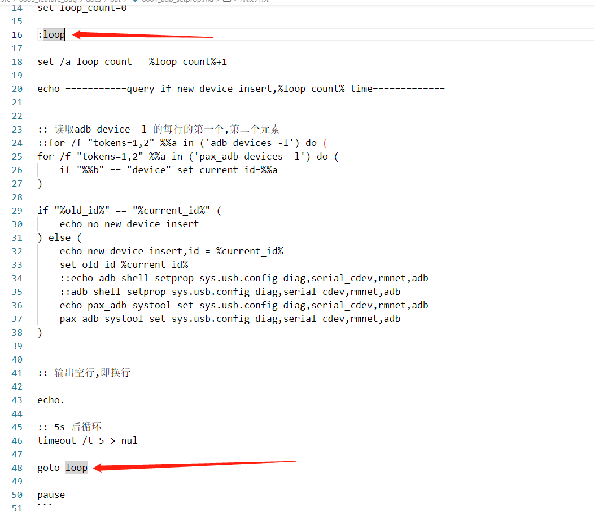

# bat 语法介绍

由于工作中经常需要用到windows电脑,所以需要bat脚本,来执行一些自动化操作

# 开启关闭回显

一般都需要关闭回显,不关闭,会输出一大堆命令,看着很迷惑人

在bat脚本的第一行,@echo off

# 注释

注释用rem,不要用::, 导致不知名闪退

* rem 这也是注释

# 输出换行

* echo加一个.

> echo.

# if判断

```
if "%old_id%" == "%current_id%" (
    echo no new device insert
) else (
    echo new device insert,id = %current_id%
    set old_id=%current_id%
    ::echo adb shell setprop sys.usb.config diag,serial_cdev,rmnet,adb
    ::adb shell setprop sys.usb.config diag,serial_cdev,rmnet,adb
    echo pax_adb systool set sys.usb.config diag,serial_cdev,rmnet,adb
    pax_adb systool set sys.usb.config diag,serial_cdev,rmnet,adb
)
```

# 设置变量 set

* 直接设置变量

    ```
    set old_id=
    set current_id=
    set loop_count=0
    set old_id=%current_id%
    ```

* 接收用户输入变量,enter键输入结束

    ```
    @echo off
    set /p param=please input:
    echo %param%
    pause
    ```

    

# 系统变量

```
@echo off
::查看所有环境变量
set
echo.
::查看JAVA_HOME的值
if defined JAVA_HOME (
    echo JAVA_HOME = %JAVA_HOME%
) else (
    echo no defined JAVA_HOME
)
pause
```



# 逻辑运算

```
@echo off

set a=1&set b=6
set c=%a%+%b%
::输出1+6
echo %c%

set d=a+b
::输出a+b
echo %d%

set /a e=a+b
::输出7
echo %e%

pause
```


# timeout ,title

设置标题

```
@echo off

set a=1
::延迟五秒输出
timeout 5 >nul
echo %a%

pause
```


# for循环

for有很多属性,举例两个稍微简单的

* 最普通的

    ```
    @echo off
    ::命令框title
    title test-bat
    set str=c d e f g h i j k l m n o p q r s t u v w x y z
    ::当前硬盘的分区有：
    for %%i in (%str%) do if exist %%i: echo %%i:
    pause
    ```

    

* \f

```
:: 读取adb device -l 的每行的第一个,第二个元素
::for /f "tokens=1,2" %%a in ('adb devices -l') do (
for /f "tokens=1,2" %%a in ('pax_adb devices -l') do (
    if "%%b" == "device" set current_id=%%a
)
```

# goto




