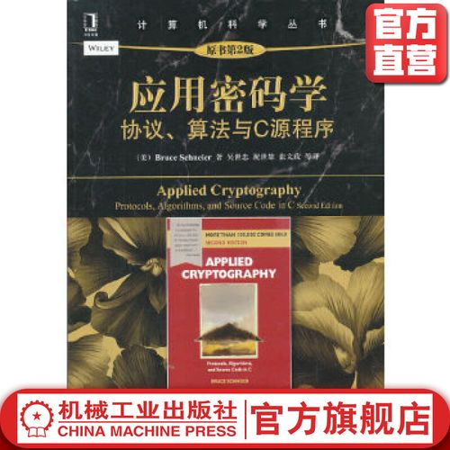

# 应用密码学

# 专业名词

|英文|中文|
|:--|:--|
|sender|发送者|
|receiver|发送者|
|plaintext|明文|
|encryption|加密|
|ciphertext|密文|
|decryption|解密|
|cryptography|密码编码学|
|cryptology|密码学|
|cryptographer|密码编码者|
|cryptanalyst|密码分析者|
|cryptologist|密码学家|

# 计算机密码算法

|简称|全称|中文|发明者|算法|简介|算法原理|
|:--|:--|:--|:--|:--|:--|:--|
|DES|Data Encryption Standard|数据加密标准|美国和国际标准|对称算法|最通用的计算机加密算法|分组加密算法64位一组|
|RSA|Rivest,Shamir,Adleman|根据发明者命名|Rivest,Shamir,Adleman|非对称算法|用作加密和数字签名|大素数分解|
|DSA|Digital Signature Algorithm|数字签名算法|美国国家标准与技术研究院|非对称算法|不能用作加密,只用作数字签名|DSA是基于整数有限域离散对数难题的|

# 数字签名

* 数字签名包括时间属性,防止签名无限时间有效

# 单项散列函数(one-way hash function)

* 他有很多别名,压缩函数,收缩函数,消息摘要,指纹,密码校验和,信息完整性校验,

* 他是现代密码学的中心,他把可变长度的输入串,转换成固定长度的输出串(hash value)