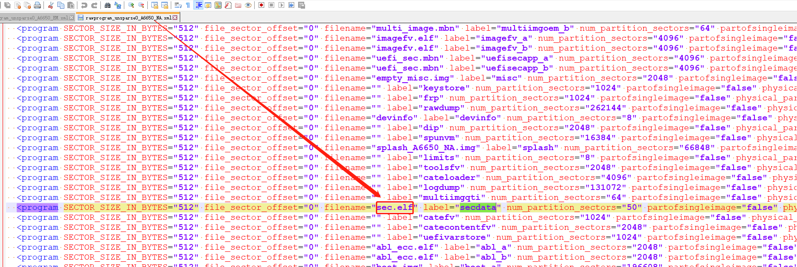
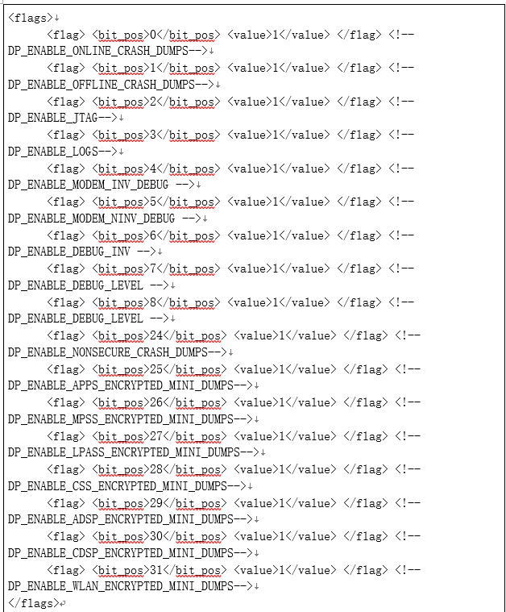
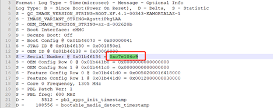
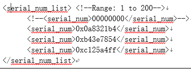
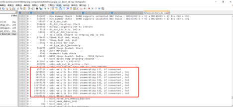
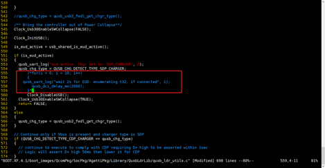

# README

高通平台熔丝后,下载软件,概率性有机器不开机

# 熔丝

需要把sec.elf文件下载到secdata分区

# 熔丝后下载以前的软件失败

需要把rawprogram_unsparse0_A6650_NA.xml 或者 rawprogram_unsparse0_A6650_EM.xml 添加下载sec.elf



* 如果下载别家的软件

需要把prog_firehose_ddr.elf替换才能下载

# log

Secure Boot: On

```
[2023/3/9 15:38:31] Format: Log Type - Time(microsec) - Message - Optional Info
[2023/3/9 15:38:31] Log Type: B - Since Boot(Power On Reset),  D - Delta,  S - Statistic
[2023/3/9 15:38:31] S - QC_IMAGE_VERSION_STRING=BOOT.XF.4.1-00343-KAMORTALAZ-1
[2023/3/9 15:38:31] S - IMAGE_VARIANT_STRING=AgattiPkgLAA
[2023/3/9 15:38:31] S - OEM_IMAGE_VERSION_STRING=u295
[2023/3/9 15:38:31] S - Boot Interface: eMMC
[2023/3/9 15:38:31] S - Secure Boot: On
[2023/3/9 15:38:31] S - Boot Config @ 0x01b46070 = 0x00000041
[2023/3/9 15:38:31] S - JTAG ID @ 0x01b46130 = 0x001850e1
[2023/3/9 15:38:31] S - OEM ID @ 0x01b46138 = 0x00000000
[2023/3/9 15:38:31] S - Serial Number @ 0x01b46134 = 0x46f7907d
[2023/3/9 15:38:31] S - Feature Config Row 0 @ 0x01b441d0 = 0x0050200016418000
[2023/3/9 15:38:31] S - Feature Config Row 1 @ 0x01b441d8 = 0x0012000000030000
[2023/3/9 15:38:31] S - Core 0 Frequency, 1305 MHz
[2023/3/9 15:38:31] S - PBL Patch Ver: 1
```

# 替换flash

* 不开机的机器,替换flash后,可以进kernel

# 原因

因为熔丝之前烧录过google key,所以有问题.熔丝后再去烧录google key就没有问题.

熔丝的时候会provison emmc，会用熔丝的key去provison，如果熔丝之前provison过emmc，熔丝之后就会有问题

# 解决方法

只是临时方法,不开机的机器,可以通过配置sn号,打开debug policy

* QCM2290.LA.2.0/common/sectools/config/agatti/agatti_debugpolicy.xml debug配置信息

    

* 过滤不开机的sn

    修改QCM2290.LA.2.0/common/sectools/config/agatti/agatti_debugpolicy.xml里面的serial_num_list，将需要开dump的机器的serial_num填进去，serial_num如下获取：

    

    

* 编译更新apdp

    QCM2290.LA.2.0$ python common/sectools/sectools.py debugpolicy -i dbgp_ap --sign_id=dbgp_ap -p agatti -g -s

    编译的文件在QCM2290.LA.2.0/common/sectools/debugpolicy_output/apdp.mbn，用fasttoot或者qfil单独升级apbp分区，重启即可。

* 去掉多余log

    开了debug policy之后，xbl会有20秒的EUD log打印，需要去掉

    

    * 修改方法

        

# 熔丝后,下载移远软件方法

熔丝后,对xbl abl等会校验签名,但是目前代码还是用默认的公钥对 对vbmeta等签名.所以还是可以替换移远的软件开机

替换文件如下,把自己编译出来的软件,下面这些文件, 替换掉移远底包的软件,就可以用移远的软件开机

```
xbl.elf
xbl_config.elf
abl_ecc.elf
devcfg.mbn
prog_firehose_ddr.elf
featenabler.mbn
hyp.mbn
km41.mbn
multi_image.mbn
rpm.mbn
storsec.mbn
tz.mbn
uefi_sec.mbn
```