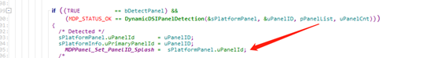
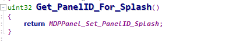
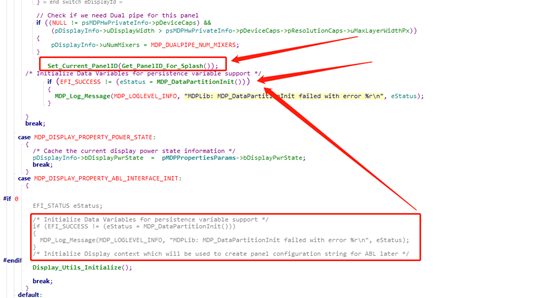
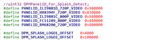
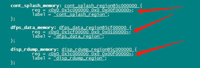

# 概要

基于高通2290,android 12,xbl兼容不通分辨率的logo

# 方法

* logo制作,logo_gen.py

使用如下pyton文件制作logo,命令为 python logo_gen.py 720p.bmp 800p.bmp

注意py文件的logo2_offset 偏移地址

```
#!/usr/bin/python
#==============================================================================
#/** @file splash_logo_gen.py
#
# GENERAL DESCRIPTION
#  Packages a custom splash image bmp into a loadable splash partition image
#  Fastboot command:
#  fastboot flash splash 
#
#  Copyright (c) 2016 Qualcomm Technologies, Inc . 
#  All Rights Reserved.
#  Confidential and Proprietary - Qualcomm Technologies, Inc.
#==============================================================================

#==============================================================================
# Copyright (c) 2013,2015, The Linux Foundation. All rights reserved.
#
# Redistribution and use in source and binary forms, with or without
# modification, are permitted provided that the following conditions are
# met:
#     * Redistributions of source code must retain the above copyright
#       notice, this list of conditions and the following disclaimer.
#     * Redistributions in binary form must reproduce the above
#       copyright notice, this list of conditions and the following
#       disclaimer in the documentation and/or other materials provided
#       with the distribution.
#     * Neither the name of The Linux Foundation nor the names of its
#       contributors may be used to endorse or promote products derived
#       from this software without specific prior written permission.
#
# THIS SOFTWARE IS PROVIDED "AS IS" AND ANY EXPRESS OR IMPLIED
# WARRANTIES, INCLUDING, BUT NOT LIMITED TO, THE IMPLIED WARRANTIES OF
# MERCHANTABILITY, FITNESS FOR A PARTICULAR PURPOSE AND NON-INFRINGEMENT
# ARE DISCLAIMED.  IN NO EVENT SHALL THE COPYRIGHT OWNER OR CONTRIBUTORS
# BE LIABLE FOR ANY DIRECT, INDIRECT, INCIDENTAL, SPECIAL, EXEMPLARY, OR
# CONSEQUENTIAL DAMAGES (INCLUDING, BUT NOT LIMITED TO, PROCUREMENT OF
# SUBSTITUTE GOODS OR SERVICES; LOSS OF USE, DATA, OR PROFITS; OR
# BUSINESS INTERRUPTION) HOWEVER CAUSED AND ON ANY THEORY OF LIABILITY,
# WHETHER IN CONTRACT, STRICT LIABILITY, OR TORT (INCLUDING NEGLIGENCE
# OR OTHERWISE) ARISING IN ANY WAY OUT OF THE USE OF THIS SOFTWARE, EVEN
# IF ADVISED OF THE POSSIBILITY OF SUCH DAMAGE.

#===========================================================================

import sys
import os
    
## make a image
def MakeLogoImage(out):
    global imgconv
    #infile = "logo.bmp" #default file name
    num = len(sys.argv)

    if num != 3:
        ShowUsage()
        sys.exit(1); # error arg

    infile = sys.argv[1]
    infile2 = sys.argv[2]
    outfile = open(out, "wb") 
    filler = b'\0'*0x4000
    outfile.write(filler)
    body = GetBMPData(infile)
    outfile.write(body)
    logo2_offset = 1024*1024
    body2 = GetBMPData(infile2)
    outfile.seek(logo2_offset)
    outfile.write(body2)
    outfile.close()

## usage
def ShowUsage():
    print("**********************************************")
    print("\nUsage:\npython splash_logo_gen2.py <image 720p file> <image 800p file>")
    print("\nSupported image formats:\n *  8-bit BMP\n * 24-bit BMP\n * 32-bit BMP")
    print("\n**********************************************")

## get BMP data from input file. if input is png convert to bmp    
def GetBMPData(infile):
   
    if os.access(infile, os.R_OK) != True:
        print("Error: Input file <%s> is not readable" % infile)
        ShowUsage()
        sys.exit(2); # error file

    with open(infile, mode='rb') as imgfile:
        data = imgfile.read()

    return data

##main
if __name__ == "__main__":
    MakeLogoImage("splash.img")
```

* 合入如下补丁

```
---
 Include/Library/DisplayABLInterface.h |   2 +-
 Include/Library/MDPSystem.h           |   7 +-
 Include/Library/QcomLib.h             |  13 +
 Library/MDPLib/DisplayABLInterface.c  |  86 +---
 Library/MDPLib/MDPDataPartition.c     | 768 ++++++++++++++++++++++++++++++++++
 Library/MDPLib/MDPDataPartition_i.h   | 123 ++++++
 Library/MDPLib/MDPLib.c               |  17 +-
 Library/MDPLib/MDPLib.inf             |   1 +
 Library/MDPLib/MDPSystem.c            |  30 +-
 Library/MDPLib/MDPSystemBoot.c        |  37 +-
 Library/QcomLib/BitmapUtils.c         | 219 +++++++++-
 Sdm660Pkg/LA/uefiplat.cfg             |   3 +
 12 files changed, 1224 insertions(+), 82 deletions(-)
 create mode 100755 Library/MDPLib/MDPDataPartition.c
 create mode 100755 Library/MDPLib/MDPDataPartition_i.h

diff --git a/Include/Library/DisplayABLInterface.h b/Include/Library/DisplayABLInterface.h
index 4ce61ef..a52ceb0 100755
--- a/Include/Library/DisplayABLInterface.h
+++ b/Include/Library/DisplayABLInterface.h
@@ -305,7 +305,7 @@ EFI_STATUS Display_ABL_GetContinuousSplashInfo(UINT32 *pAddr, UINT32 *pSize);
 * \retval None
 *
 ****************************************************************************/
-void Display_ABL_StorePLLCodes(void);
+//void Display_ABL_StorePLLCodes(void);
 
 
 /****************************************************************************
diff --git a/Include/Library/MDPSystem.h b/Include/Library/MDPSystem.h
index 52db4ca..16b1338 100755
--- a/Include/Library/MDPSystem.h
+++ b/Include/Library/MDPSystem.h
@@ -73,12 +73,12 @@ typedef enum
 
 /* MDP Variable Flag Type
  */
-typedef enum
+/*typedef enum
 {
   MDP_VARIABLE_FLAG_NONE          = 0,
   MDP_VARIABLE_FLAG_NON_VOLATILE  = 1,
   MDP_VARIABLE_FLAG_MAX,
-} MDPVariableFlagType;
+} MDPVariableFlagType;*/
 
 
 /*===========================================================================
@@ -242,7 +242,8 @@ EFI_STATUS MDP_GetBootServiceVariableSize(CHAR16 *pVariableName, UINTN *puSize);
 * \retval EFI_STATUS
 *
 ****************************************************************************/
-EFI_STATUS MDP_SetBootServiceVariable(CHAR16 *pVariableName, void *pValue, UINTN uSize, UINT32 uFlags);
+EFI_STATUS MDP_SetBootServiceVariable(CHAR16 *pVariableName, void *pValue, UINTN uSize);
+//EFI_STATUS MDP_SetBootServiceVariable(CHAR16 *pVariableName, void *pValue, UINTN uSize, UINT32 uFlags);
 
 
 /****************************************************************************
diff --git a/Include/Library/QcomLib.h b/Include/Library/QcomLib.h
index 961425e..227c945 100755
--- a/Include/Library/QcomLib.h
+++ b/Include/Library/QcomLib.h
@@ -845,6 +845,19 @@ ConnectByProtocol (
 EFI_STATUS 
 LoadDebugToolsFv (VOID);
 
+/**
+  Validate splash screen storage info
+
+  @retval EFI_STATUS
+**/
+EFI_STATUS
+ValidateSplashImage(
+    IN EFI_DISK_IO_PROTOCOL    *pDiskIo,      //Disk Handle
+    IN UINT32                   MediaId,      //Media ID
+    IN UINT32                   Address,      //Splash image offset in partition
+    IN UINT32                   MaxSize       //Splash image max size
+    );
+
 /** Enter EDL mode */
 VOID EnterEDLMode ( VOID );
 
diff --git a/Library/MDPLib/DisplayABLInterface.c b/Library/MDPLib/DisplayABLInterface.c
index 06310ec..62718ea 100755
--- a/Library/MDPLib/DisplayABLInterface.c
+++ b/Library/MDPLib/DisplayABLInterface.c
@@ -58,8 +58,9 @@
 #include "MDPLib_i.h"
 #include "MDPSystem.h"
 #include "MDPPlatformLib.h"
+#include "MDPDataPartition_i.h"
 #include "DisplayABLInterface.h"
-#include "HALDSILib.h"
+//#include "HALDSILib.h"
 
 /*=========================================================================
      Default Defines
@@ -961,12 +962,14 @@ static void CheckTargetPanelSupport()
       pABLContext->pDTInfoArray = psPanelDTInfo;
     }
 
-    if (EFI_SUCCESS != (eStatus = MDP_SetBootServiceVariable(DISPVAR_SUPPORTED_PANEL_COUNT, &uPanelCount, sizeof(uPanelCount), 0)))
-    {
+    //if (EFI_SUCCESS != (eStatus = MDP_SetBootServiceVariable(DISPVAR_SUPPORTED_PANEL_COUNT, &uPanelCount, sizeof(uPanelCount), 0)))
+    if (EFI_SUCCESS != (eStatus = MDP_SetBootServiceVariable(DISPVAR_SUPPORTED_PANEL_COUNT, &uPanelCount, sizeof(uPanelCount))))
+	{
       DEBUG((EFI_D_WARN,"MDPLib: Failed to set boot service variable <%s>. Returned %d\n", DISPVAR_SUPPORTED_PANEL_COUNT, eStatus));
     }
     
-    if (EFI_SUCCESS != (eStatus = MDP_SetBootServiceVariable(DISPVAR_SUPPORTED_PANEL_LIST, pPanels, AsciiStrSize(pPanels), 0)))
+    //if (EFI_SUCCESS != (eStatus = MDP_SetBootServiceVariable(DISPVAR_SUPPORTED_PANEL_LIST, pPanels, AsciiStrSize(pPanels), 0)))
+	if (EFI_SUCCESS != (eStatus = MDP_SetBootServiceVariable(DISPVAR_SUPPORTED_PANEL_LIST, pPanels, AsciiStrSize(pPanels))))
     {
       DEBUG((EFI_D_WARN,"MDPLib: Failed to set boot service variable <%s>. Returned %d\n", DISPVAR_SUPPORTED_PANEL_LIST, eStatus));
     }
@@ -1097,7 +1100,8 @@ void Display_ABL_SetPanelConfiguration(MDPPlatformPanelType  eSelected)
   UpdatePanelConfiguration(eSelected, pConfigStr);
 
   /* Set panel configuration variable */
-  if (EFI_SUCCESS != (eStatus = MDP_SetBootServiceVariable(DISPVAR_PANEL_CONFIGURATION, pConfigStr, AsciiStrLen(pConfigStr)+1, 0)))
+  //if (EFI_SUCCESS != (eStatus = MDP_SetBootServiceVariable(DISPVAR_PANEL_CONFIGURATION, pConfigStr, AsciiStrLen(pConfigStr)+1, 0)))
+  if (EFI_SUCCESS != (eStatus = MDP_SetBootServiceVariable(DISPVAR_PANEL_CONFIGURATION, pConfigStr, AsciiStrLen(pConfigStr)+1)))
   {
     DEBUG((EFI_D_WARN,"MDPLib: Failed to set boot service variable <%s>. Returned %d\n", DISPVAR_PANEL_CONFIGURATION, eStatus));
   }
@@ -1301,10 +1305,13 @@ EFI_STATUS Display_ABL_SetProperty (EFI_DISPLAY_ABL_PROPERTY_TYPE   ePropertyTyp
 
         eStatus = EFI_INVALID_PARAMETER;
       }
-      else if (EFI_SUCCESS != (eStatus = MDP_Display_SetVariable(DISPVAR_PANEL_OVERRIDE, 
+      else if (EFI_SUCCESS != (eStatus = MDP_SetBootServiceVariable(DISPVAR_PANEL_OVERRIDE, 
+                                                                    pData, 
+                                                                    uDataSize)))
+      /*else if (EFI_SUCCESS != (eStatus = MDP_Display_SetVariable(DISPVAR_PANEL_OVERRIDE, 
                                                                  (UINT8 *)pData, 
                                                                  (uDataSize / (sizeof(CHAR8))),
-                                                                 0)))
+                                                                 0)))*/
       {
         DEBUG((EFI_D_WARN,"Display: Failed to set boot service variable <%s>. Returned %d\n", DISPVAR_PANEL_OVERRIDE, eStatus));
       }
@@ -1312,6 +1319,9 @@ EFI_STATUS Display_ABL_SetProperty (EFI_DISPLAY_ABL_PROPERTY_TYPE   ePropertyTyp
       {
         eStatus = EFI_SUCCESS;
       }
+
+      /* Save it to partition */
+      MDP_DataPartitionExit();
     }
     break;
 
@@ -1388,68 +1398,6 @@ EFI_STATUS Display_ABL_GetProperty (EFI_DISPLAY_ABL_PROPERTY_TYPE   ePropertyTyp
 
 /****************************************************************************
 *
-** FUNCTION: Display_ABL_StorePLLCodes()
-*/
-/*!
-* \brief
-*   Display ABL to store pll codes
-*
-  @param  None
-*
-* \retval None
-*
-****************************************************************************/
-void
-Display_ABL_StorePLLCodes(void)
-{
-  UINT32               uSplashAddr          = 0;
-  UINT32               uSplashSize          = 0;
-  uintPtr              uPllCodesAddr        = 0;
-  UINT32               uPllCodesMaxSize     = MDP_MAX_PLLCODES_SIZE;
-  void                *pBuffer              = NULL;
-  MDP_Status           eStatus              = MDP_STATUS_FAILED;
-  MDP_PLLCodesInfo     sPllCodesInfo[MDP_MAX_NUM_DSI_DEVICE];
-  
-  /* Save PLL codes to last 4K of framebuffer for kernel to read */
-  if((EFI_SUCCESS == Display_ABL_GetContinuousSplashInfo(&uSplashAddr, &uSplashSize)) &&
-    (uSplashSize   > uPllCodesMaxSize))
-  {
-    uPllCodesAddr = uSplashAddr + uSplashSize;
-    pBuffer       = (void*)uPllCodesAddr;
-
-    if (sizeof(sPllCodesInfo) > uPllCodesMaxSize)
-    {
-      MDP_Log_Message(MDP_LOGLEVEL_WARN, "Error: Not enough splash memory to store pll codes\n");
-    }
-    else
-    {
-      uint32 i;
-    
-      MDP_OSAL_MEMSET(&sPllCodesInfo[0], 0, sizeof(sPllCodesInfo));
-    
-      for (i = 0; i < MDP_MAX_NUM_DSI_DEVICE; i++)
-      {
-        if (MDP_STATUS_OK == DSIDriver_GetCalibrationCodes(i, &sPllCodesInfo[i]))
-        {
-          eStatus = MDP_STATUS_OK;
-        }
-      }
-
-      if (MDP_STATUS_OK == eStatus)
-      {
-        /* copy pll codes to begining of splash memory*/
-        MDP_OSAL_MEMCPY((void *) pBuffer, sPllCodesInfo, sizeof(sPllCodesInfo));
-      }
-      else
-      {
-        MDP_Log_Message(MDP_LOGLEVEL_WARN, "Error: fail to get DSI pll codes\n");
-      }
-    }
-  }
-}
-
-/****************************************************************************
-*
 ** FUNCTION: Display_ABL_SetMode()
 */
 /*!
diff --git a/Library/MDPLib/MDPDataPartition.c b/Library/MDPLib/MDPDataPartition.c
new file mode 100755
index 0000000..d5c84cb
--- /dev/null
+++ b/Library/MDPLib/MDPDataPartition.c
@@ -0,0 +1,768 @@
+/*=============================================================================
+ 
+  File: MDPDataPartition.c
+ 
+  Source file for MDP Data Partition Manager
+  
+ 
+  Copyright (c) 2016 Qualcomm Technologies, Inc.  All Rights Reserved.
+  Qualcomm Technologies Proprietary and Confidential.
+=============================================================================*/
+#include <Uefi.h>
+#include <Library/UefiLib.h>
+#include <Library/ArmLib.h>
+#include <Library/QcomLib.h>
+#include <Library/UefiRuntimeServicesTableLib.h>
+#include <Library/UncachedMemoryAllocationLib.h>
+#include "MDPDataPartition_i.h"
+#include "MDPSystem.h"
+#include "DisplayABLInterface.h"
+
+/*=========================================================================
+     Default Defines
+==========================================================================*/
+
+
+/*=========================================================================
+     Local static Variables
+==========================================================================*/
+
+/* 
+*  Partition Header info 
+*/
+static DPM_HeaderType    gPartitionHeader;
+
+/* 
+*  Block IO Handles for the data partition
+*/
+static DPM_IOHandleType  gBlockIOHandle;
+
+/* 
+*  List of display variables that are persistent - terminated by empty string
+*/
+static CHAR16            gPersistentVariables[DPM_VARIABLES_MAX][DPM_VARIABLE_NAME_MAX_LEN] = {
+  DISPVAR_PANEL_OVERRIDE,
+  L"",
+};
+
+/*=========================================================================
+      Public APIs
+==========================================================================*/
+extern EFI_GUID gQcomTokenSpaceGuid;
+extern EFI_GUID gEfiEmmcUserPartitionGuid;
+extern EFI_GUID gEfiUfsLU4Guid;
+
+/*=========================================================================
+     Local static Functions
+==========================================================================*/
+
+/* Forward declarations */
+static uint8      CalculateChecksum(void *pData, uint32 uSize);
+static EFI_STATUS SaveVariables(void);
+
+/****************************************************************************
+*
+** FUNCTION: GetVariableInternal()
+*/
+/*!
+* \brief
+*   Helper function to get a boot service variable data. The function checks
+*   data size and allocates memory accordingly and returns data & data size.
+*
+* \param [in] pVariableName   - Name of the boot service variable
+*        [out] ppValue        - data pointer
+*        [out] puSize         - data size
+*
+* \retval EFI_STATUS
+*
+****************************************************************************/
+static EFI_STATUS GetVariableInternal(CHAR16 *pVariableName, void **ppValue, uint32 *puSize)
+{
+  EFI_STATUS eStatus     = EFI_SUCCESS;
+  UINTN      uBufferSize = 0;
+ 
+  /*
+  * The variable is queried as follows.
+  * Step 1: Get data size for the Variable
+  * Step 2: Allocate memory
+  * Step 3: Get variable using the pointer to the allocated memory
+  */
+
+  *puSize = 0;
+  
+  if (EFI_SUCCESS != (eStatus = MDP_GetBootServiceVariableSize(pVariableName, &uBufferSize)))
+  {
+    /* Variable not found. Dont print error since this could be expected in normal situations
+     * if a feature is not used 
+     */
+  }
+  else if (NULL == (*ppValue = UncachedAllocateZeroPool(uBufferSize)))
+  {
+    DEBUG((EFI_D_ERROR, "MDPDataPartition: Failed to allocate %d bytes for variable <%s>\n", uBufferSize, pVariableName));
+    eStatus = EFI_OUT_OF_RESOURCES;
+  }
+  else if (EFI_SUCCESS != (eStatus = MDP_GetBootServiceVariable(pVariableName, *ppValue, &uBufferSize)))
+  {
+    /* Since variable exists and buffer was allocated this is an error */
+    DEBUG((EFI_D_ERROR, "MDPDataPartition: Failed to get boot service variable <%s>. Reason %r\n", pVariableName, eStatus));
+
+    /* Free memory*/
+    UncachedSafeFreePool(*ppValue);
+  }
+  else
+  {
+    *puSize = (uint32) uBufferSize;
+  }
+
+  return eStatus;
+}
+
+/****************************************************************************
+*
+** FUNCTION: EnumeratePartitions()
+*/
+/*!
+* \brief
+*   Enumerates the display partition memory and gets the block IO handles
+*
+* \param [out] pHandles    - Array of handles
+*        [in]  uMaxHandles - Max number of handles that the array can hold
+*        [out] pNumHandles - Actual number of handles retrieved
+*
+* \retval EFI_STATUS
+*
+****************************************************************************/
+static EFI_STATUS EnumeratePartitions(HandleInfo *pHandles, UINT32 uMaxHandles, UINT32* pNumHandles)
+{
+  UINT32            Attribs       = 0;
+  EFI_STATUS        eStatus;
+  PartiSelectFilter HandleFilter;
+  UINT32            HandleCount;
+
+  /* Check for EMMC */
+  Attribs                     |= BLK_IO_SEL_MATCH_ROOT_DEVICE;
+  HandleCount                 =  uMaxHandles;
+  HandleFilter.PartitionType  =  0;
+  HandleFilter.VolumeName     =  0;
+  HandleFilter.RootDeviceType =  &gEfiEmmcUserPartitionGuid;
+
+  /* Get Handles */
+  eStatus = GetBlkIOHandles(Attribs, &HandleFilter, pHandles, &HandleCount);
+
+  /* If EMMC failed, then check for UFS */
+  if (EFI_ERROR(eStatus) || HandleCount == 0)
+  {
+    HandleCount                 = uMaxHandles;
+    HandleFilter.PartitionType  = 0;
+    HandleFilter.VolumeName     = 0;
+    HandleFilter.RootDeviceType = &gEfiUfsLU4Guid;
+
+    eStatus = GetBlkIOHandles(Attribs, &HandleFilter, pHandles, &HandleCount);
+  }
+  if (EFI_SUCCESS == eStatus)
+  {
+    /* Block IO handles retrieved successfully*/
+    *pNumHandles = HandleCount;
+  }
+
+  return eStatus;
+}
+
+/****************************************************************************
+*
+** FUNCTION: CalculateChecksum()
+*/
+/*!
+* \brief
+*   Calculate the checksum for specified data. The 8-bit addition of all 
+*   data bytes and the checksum value will be 0.
+*
+* \param [in] pData    - Data pointer
+*        [in] uSize    - Data size
+*
+* \retval checksum value
+*
+****************************************************************************/
+static uint8 CalculateChecksum(void *pData, uint32 uSize)
+{
+  uint32 sum      = 0;
+  uint32 checksum = 0;
+  uint32 i;
+
+  /* add all bytes*/
+  for (i = 0; i < uSize; i++)
+  {
+    sum += ((uint8 *)pData)[i];
+  }
+  /* checksum*/
+  checksum = 256 - (sum & 0xFF);
+
+  /* only the LSB will have non-zero value*/
+  return (uint8)(checksum&0xFF);
+}
+
+/****************************************************************************
+*
+** FUNCTION: InitializeHeader()
+*/
+/*!
+* \brief
+*   Initialize the Partition header structure with Magic string and
+*   version
+*
+* \param [in] pHeader    - Pointer to header structure
+*
+* \retval None
+*
+****************************************************************************/
+static void InitializeHeader(DPM_HeaderType *pHeader)
+{
+  /* Zero */
+  MDP_OSAL_MEMZERO(pHeader, sizeof(DPM_HeaderType));
+
+  /* Magic */
+  pHeader->magic = DPM_MAGIC;
+
+  /* Version */
+  pHeader->versionMajor = DPM_MAJOR_VERSION;
+  pHeader->versionMinor = DPM_MINOR_VERSION;
+
+}
+
+/****************************************************************************
+*
+** FUNCTION: ValidateVariableHeader()
+*/
+/*!
+* \brief
+*   Validate the variable header
+*
+* \param [in] pVarHdr    - Pointer to header structure
+*
+* \retval EFI_STATUS
+*
+****************************************************************************/
+static EFI_STATUS ValidateVariableHeader(DPM_VariableInfoType *pVarHdr)
+{
+  EFI_STATUS eStatus  = EFI_SUCCESS;
+  uint32     uDataEnd = pVarHdr->dataOffset + pVarHdr->dataSize;
+  
+  /* Validate offset & size */
+  if ((uDataEnd          <= pVarHdr->dataOffset) || //checks datasize & uDataEnd wrap around 
+      (DPM_VARDATA_START >  pVarHdr->dataOffset) ||
+      (DPM_VARDATA_END   <= pVarHdr->dataOffset) ||
+      (DPM_VARDATA_START >  uDataEnd)            ||
+      (DPM_VARDATA_END   <= uDataEnd))
+  {
+    /* Data out of bounds - Error */
+    DEBUG((EFI_D_WARN, "MDPDataPartition: Failed header validation for <%a>: offset %d size %d\n", pVarHdr->name,
+           pVarHdr->dataSize, pVarHdr->dataOffset));
+
+    eStatus = EFI_VOLUME_CORRUPTED;
+  }
+  /* Make sure variable name is null terminated */
+  else if ('\0' != pVarHdr->name[DPM_VARIABLE_NAME_MAX_LEN - 1])
+  {
+    /* Name not null terminated */
+    DEBUG((EFI_D_WARN, "MDPDataPartition: Failed header validation for <%a>: name not terminated\n", pVarHdr->name));
+
+    eStatus = EFI_VOLUME_CORRUPTED;
+  }
+  
+  return eStatus;
+}
+
+/****************************************************************************
+*
+** FUNCTION: ValidatePartitionHeader()
+*/
+/*!
+* \brief
+*   Validate the partition header
+*
+* \param [in] pHeader    - Pointer to header structure
+*
+* \retval EFI_STATUS
+*
+****************************************************************************/
+static EFI_STATUS ValidatePartitionHeader(DPM_HeaderType *pHeader)
+{
+  EFI_STATUS eStatus = EFI_VOLUME_CORRUPTED;
+
+  /*Check Magic */
+  if (DPM_MAGIC != pHeader->magic)
+  {
+    /* Magic check failed */
+    DEBUG((EFI_D_VERBOSE, "MDPDataPartition: Failed partition header validation: Magic 0x%x\n",
+           pHeader->magic));
+  }
+  else if (DPM_MAJOR_VERSION != pHeader->versionMajor)
+  {
+    /* Major version mismatch */
+    DEBUG((EFI_D_WARN, "MDPDataPartition: Failed partition header validation: Major Version %d (Expected = %d)\n", 
+           pHeader->versionMajor, DPM_MAJOR_VERSION));
+  }
+  else if (DPM_MINOR_VERSION < pHeader->versionMinor)
+  {
+    /* Minor version mismatch */
+    DEBUG((EFI_D_WARN, "MDPDataPartition: Failed partition header validation: Minor Version %d  (Expected > %d)\n",
+           pHeader->versionMinor, DPM_MINOR_VERSION));
+  }
+  else if (DPM_VARDATA_END < (pHeader->size + DPM_VARDATA_START))
+  {
+    /* Possible corruption - data size overrun */
+    DEBUG((EFI_D_WARN, "MDPDataPartition: Failed partition header validation: Data size %d exceeds limit.\n", 
+           pHeader->size));
+  }
+  else if (DPM_VARIABLES_MAX < pHeader->count)
+  {
+    /* Possible corruption - variable count over max */
+    DEBUG((EFI_D_WARN, "MDPDataPartition: Failed partition header validation: Variable count %d exceeds %d\n", 
+           pHeader->count, DPM_VARIABLES_MAX));
+  }
+  else
+  {
+    eStatus = EFI_SUCCESS;
+  }
+  return eStatus;
+}
+
+/****************************************************************************
+*
+** FUNCTION: ReadVariable()
+*/
+/*!
+* \brief
+*   Reads variable from partition & validates checksum
+*   It allocates memory for data. The caller should free it when done.
+*
+* \param [in]  pVarHdr    - Variable header
+*        [out] ppVarData  - Data pointer 
+*
+* \retval EFI_STATUS
+*
+****************************************************************************/
+static EFI_STATUS ReadVariable(DPM_VariableInfoType *pVarHdr, void** ppVarData)
+{
+  EFI_STATUS eStatus = EFI_SUCCESS;
+
+  if (NULL == gBlockIOHandle.pDiskIo)
+  {
+    DEBUG((EFI_D_WARN, "MDPDataPartition: ReadVariable Failed. DiskIO is not initialized yet!\n"));
+    eStatus = EFI_OUT_OF_RESOURCES;
+  }
+  else
+  {
+    void                 *pData     = NULL;
+    EFI_DISK_IO_PROTOCOL *pDiskIo;
+    uint32                checksum;
+    UINT32                mediaId;
+
+    pDiskIo = gBlockIOHandle.pDiskIo;
+    mediaId = gBlockIOHandle.MediaId;
+
+    /*Verify Variable*/
+    if (EFI_SUCCESS != (eStatus = ValidateVariableHeader(pVarHdr)))
+    {
+      /* The variable header is corrupted */
+    }
+    /* Allocate Data */
+    else if (NULL == (pData = UncachedAllocateZeroPool(pVarHdr->dataSize)))
+    {
+      DEBUG((EFI_D_ERROR, "MDPDataPartition: Failed to allocate %d bytes for variable <%a>\n", 
+             pVarHdr->dataSize, pVarHdr->name));
+
+      /* Unable to allocate buffer */
+      eStatus = EFI_OUT_OF_RESOURCES;
+    }
+    else
+    {
+      /* Read data */
+      if (EFI_SUCCESS != (eStatus = pDiskIo->ReadDisk(pDiskIo, mediaId, pVarHdr->dataOffset, pVarHdr->dataSize, pData)))
+      {
+        DEBUG((EFI_D_ERROR, "MDPDataPartition: Failed to read data for variable <a> from partition: Reason %r\n", 
+               pVarHdr->name, eStatus));
+      }
+      /* Calculate Checksum */
+      else if (pVarHdr->checksum != (checksum = CalculateChecksum(pData, pVarHdr->dataSize)))
+      {
+        /* Checksum mismatch */
+        DEBUG((EFI_D_ERROR, "Failed checksum validation for variable <%a>. Expected %d Actual %d\n", pVarHdr->name,
+               checksum, pVarHdr->checksum));
+
+        eStatus = EFI_VOLUME_CORRUPTED;
+      }
+      else
+      {
+        /* Read Variable succeeded. Update data pointer*/
+        *ppVarData = pData;
+
+        eStatus    = EFI_SUCCESS;  
+      }
+
+      if (EFI_SUCCESS != eStatus)
+      {
+        /* Failed after memory was allocated. So free memory here*/
+        UncachedSafeFreePool(pData);
+
+        *ppVarData = NULL;
+      }
+    }
+  }
+  
+  return eStatus;
+}
+
+
+/****************************************************************************
+*
+** FUNCTION: ReadAndSetVariables()
+*/
+/*!
+* \brief
+*   Parse the partition header structure to get all persistent variables
+*   and set boot services variable
+*
+* \param [in] pHeader    - Pointer to header structure
+*
+* \retval EFI_STATUS
+*
+****************************************************************************/
+static EFI_STATUS ReadAndSetVariables(DPM_HeaderType *pHeader)
+{
+  EFI_STATUS eStatus = EFI_SUCCESS;
+
+  if (NULL == gBlockIOHandle.pDiskIo)
+  {
+    DEBUG((EFI_D_WARN, "MDPDataPartition: ReadAndSetVariables Failed:. DiskIO is not initialized yet!\n"));
+    eStatus = EFI_OUT_OF_RESOURCES;
+  }
+  else
+  {
+    void                 *pVarData                            = NULL;
+    uint32                i                                   = 0;
+    DPM_VariableInfoType *pVarHdr;
+    CHAR16                sVarName[DPM_VARIABLE_NAME_MAX_LEN];
+
+    /* Iterate through the list of persistent variables*/
+    for (i = 0; i < pHeader->count; i++)
+    {
+      pVarHdr = &pHeader->variableInfo[i];
+      
+      if (EFI_SUCCESS != ReadVariable(pVarHdr, &pVarData))
+      {
+        /* Variable read failed. Ignore and continue*/
+      }
+      else
+      {
+        MDP_OSAL_MEMZERO(sVarName, sizeof(sVarName));
+        AsciiStrToUnicodeStr(pVarHdr->name, sVarName);
+
+        /* Set Boot Service Variable */
+        eStatus = MDP_SetBootServiceVariable(sVarName, pVarData, pVarHdr->dataSize);
+        
+        if (EFI_SUCCESS != eStatus)
+        {
+          DEBUG((EFI_D_WARN, "MDPDataPartition: Failed to set variable <%s>. Reason %r\n", sVarName, eStatus));
+        }
+
+        /* Free Pool*/
+        UncachedSafeFreePool(pVarData);
+      }
+
+      pVarData = NULL;
+    }
+  }
+  
+  return eStatus;
+}
+
+/****************************************************************************
+*
+** FUNCTION: SaveVariables()
+*/
+/*!
+* \brief
+*   Get all boot service variables that are marked for persistency and save
+*   them in the partition
+*
+* \param None
+*
+* \retval EFI_STATUS
+*
+****************************************************************************/
+static EFI_STATUS SaveVariables()
+{
+  EFI_STATUS eStatus = EFI_SUCCESS;
+
+  if (NULL == gBlockIOHandle.pDiskIo)
+  {
+    DEBUG((EFI_D_WARN, "MDPDataPartition: SaveVariables Failed. DiskIO is not initialized yet!\n"));
+    eStatus = EFI_OUT_OF_RESOURCES;
+  }
+  else
+  {
+    VOID                 *pBuffer         = NULL;
+    uint32                uVarIndex       = 0;
+    uint32                i               = 0;
+    uint32                dataStart;
+    uint32                uChecksum;
+    EFI_DISK_IO_PROTOCOL *pDiskIo;
+    UINT32                mediaId;
+    DPM_VariableInfoType *psVarInfo;
+    uint32                uDataSize;
+    DPM_HeaderType        sHeader;
+    CHAR16               *pVariableName;
+    uint32                uAvailable;
+    
+    pDiskIo = gBlockIOHandle.pDiskIo;
+    mediaId = gBlockIOHandle.MediaId;
+
+    /* Initialize header structure */
+    InitializeHeader(&sHeader);
+
+    dataStart  = DPM_VARDATA_START;
+    uAvailable = DPM_VARDATA_END - DPM_VARDATA_START;
+    
+    /* 
+      * Traverse thru LUT and get all variables. 
+      * List terminated by an empty string
+      */
+    for (i = 0; i < DPM_VARIABLES_MAX; i++)
+    {
+      pVariableName = gPersistentVariables[i];
+
+      if (*pVariableName == L'\0')
+      {
+        /* Done iterating through variables - Exit now */
+        break;
+      }
+
+      if (DPM_VARDATA_END <= dataStart)
+      {
+        DEBUG((EFI_D_ERROR, "MDPDataPartition: Failed to save all display variables. Ran out of space after %d variables\n", i));
+        break;
+      }
+
+      /*update available size */
+      uAvailable = DPM_VARDATA_END - dataStart;
+
+      /* Get Environment Variable */
+      eStatus = GetVariableInternal(pVariableName, &pBuffer, &uDataSize);
+
+      /* Check if variable is set. If not, just move on to the next variable */
+      if ((EFI_SUCCESS == eStatus) &&
+          (NULL        != pBuffer) &&
+          (0           <  uDataSize))
+      {
+        uChecksum = CalculateChecksum(pBuffer, uDataSize);
+
+        psVarInfo = &sHeader.variableInfo[uVarIndex];
+
+        /* Name */
+        UnicodeStrToAsciiStr(pVariableName, psVarInfo->name);
+
+        /* Offset */
+        psVarInfo->dataOffset = dataStart;
+
+        /* Data Size */
+        psVarInfo->dataSize = uDataSize;
+
+        /* Checksum */
+        psVarInfo->checksum = uChecksum;
+
+        /* Check if data size is too large */
+        if (uDataSize > uAvailable)
+        {
+          DEBUG((EFI_D_ERROR, "MDPDataPartition: Failed to save variable <%a>. Data size(%d) > Available(%d)\n", 
+                 psVarInfo->name, uDataSize, uAvailable));
+          
+          /* continue with next variable */
+        }
+        /* Write data */
+        else if (EFI_SUCCESS != (eStatus = pDiskIo->WriteDisk(pDiskIo, mediaId, dataStart, uDataSize, pBuffer)))
+        {
+          /* Write to disk failed. Break out */
+          DEBUG((EFI_D_ERROR, "MDPDataPartition: Failed to write variable %d bytes to partition offset 0x%x. Reason: %r\n",
+                 uDataSize, dataStart, eStatus));
+
+        }
+        else
+        {
+          /* Next variable index */
+          uVarIndex++;
+
+          /* data offset for next variable. */
+          dataStart += uDataSize;
+
+          /* Adjust alignment */
+          dataStart =  DPM_ALIGN(dataStart, DPM_DATA_ALIGNMENT);
+
+        }
+
+        /* Free allocated memory*/
+        UncachedSafeFreePool(pBuffer);
+      }
+    }
+
+    /* Update Variable count & Total Size */
+    sHeader.count = uVarIndex;
+    sHeader.size  = (dataStart - DPM_VARDATA_START);
+
+    /* Write Header */
+    eStatus = pDiskIo->WriteDisk(pDiskIo, mediaId, 0, sizeof(sHeader), &sHeader);
+    if(EFI_ERROR(eStatus))
+    {
+      DEBUG((EFI_D_ERROR, "MDPDataPartition: Failed to write partition header to display partition. Reason: %r\n", eStatus));
+    }
+  }
+
+  return eStatus;
+}
+
+
+/*=========================================================================
+     Public functions
+==========================================================================*/
+
+/****************************************************************************
+*
+** FUNCTION: MDP_DataPartitionInit()
+*/
+/*!
+* \brief
+*   Reads display data partition and sets boot services variables
+*
+* \param None
+*
+* \retval EFI_STATUS
+*
+****************************************************************************/
+EFI_STATUS  MDP_DataPartitionInit()
+{
+  UINT32               HandleCount                      = 0;
+  HandleInfo           BlkIoHandle[DPM_MAX_PARTITIONS];
+  EFI_STATUS           eStatus;
+
+  MDP_OSAL_MEMZERO(&gBlockIOHandle, sizeof(DPM_IOHandleType));
+
+  /*Get PartitionHandles*/
+  eStatus = EnumeratePartitions(BlkIoHandle, DPM_MAX_PARTITIONS, &HandleCount);
+  if (EFI_SUCCESS != eStatus)
+  {
+    DEBUG((EFI_D_ERROR, "MDPDataPartition: Unable to enumerate partitions. Reason %r\n", eStatus));
+  }
+  else
+  {
+    EFI_HANDLE           *pHandle        = NULL;
+    BOOLEAN               PartitionFound;
+    UINT32                i;
+    EFI_PARTITION_ENTRY  *PartEntry;
+    UINT32                PartitionSize;
+
+    /* Look for display partition */
+    PartitionFound = FALSE;
+
+    for (i = 0; i < HandleCount; i++)
+    {
+      eStatus = gBS->HandleProtocol(BlkIoHandle[i].Handle, &gEfiPartitionRecordGuid, (VOID **)&PartEntry);
+
+      if (EFI_SUCCESS != eStatus)
+      {
+        DEBUG((EFI_D_VERBOSE, "MDPDataPartition: Failed to get partition info for block #%d: Reason %r\n", i, eStatus));
+        continue;
+      }
+
+      if (StrnCmp(PartEntry->PartitionName, DPM_PARTITION_NAME, StrLen(DPM_PARTITION_NAME)) == 0)
+      {
+        PartitionFound         = TRUE;
+        pHandle                = BlkIoHandle[i].Handle;
+        gBlockIOHandle.MediaId = BlkIoHandle[i].BlkIo->Media->MediaId;
+        PartitionSize          = (BlkIoHandle[i].BlkIo->Media->LastBlock + 1) * BlkIoHandle[i].BlkIo->Media->BlockSize;
+        break;
+      }
+    }
+    
+    if ((!PartitionFound) || 
+        (PartitionSize < DPM_SPLASH_IMAGE_OFFSET))
+    {
+      DEBUG((EFI_D_VERBOSE, "MDPDataPartition: Display partition <%s> not found\n", DPM_PARTITION_NAME));
+      eStatus = EFI_NOT_FOUND;
+    }
+    else if (EFI_SUCCESS != (eStatus = gBS->OpenProtocol(pHandle,
+                                                         &gEfiDiskIoProtocolGuid,
+                                                         (VOID **)&gBlockIOHandle.pDiskIo,
+                                                         gImageHandle,
+                                                         NULL,
+                                                         EFI_OPEN_PROTOCOL_GET_PROTOCOL
+                                                         )))
+    {
+      DEBUG((EFI_D_ERROR, "MDPDataPartition: Failed to get open protocol from partition. Reason: %r\n", eStatus));
+      gBlockIOHandle.pDiskIo = NULL;
+    }
+    else if (EFI_SUCCESS != (eStatus = gBlockIOHandle.pDiskIo->ReadDisk(gBlockIOHandle.pDiskIo, 
+                                                                        gBlockIOHandle.MediaId,
+                                                                        0, 
+                                                                        sizeof(gPartitionHeader), 
+                                                                        (VOID *)&gPartitionHeader)))
+    {
+      DEBUG((EFI_D_ERROR, "MDPDataPartition: Failed to read partition header. Reason: %r\n", eStatus));
+    }
+    else
+    {
+      UINT32       MaxImageSize  = PartitionSize - DPM_SPLASH_IMAGE_OFFSET;
+      EFI_STATUS   eSplashStatus;
+        
+      /* Validate header */
+      if (EFI_SUCCESS != (eStatus = ValidatePartitionHeader(&gPartitionHeader)))
+      {
+        DEBUG((EFI_D_VERBOSE, "MDPDataPartition: Failed to validate partition header. Reason: %r\n", eStatus));
+      }
+      else if (EFI_SUCCESS != (eStatus = ReadAndSetVariables(&gPartitionHeader)))
+      {
+        DEBUG((EFI_D_ERROR, "MDPDataPartition: Failed to set boot services variables. Reason: %r\n", eStatus));
+      }
+
+      /* Check splash image - when splash image is flashed the partition header is overwritten.
+      So this should be checked even if other validations fail */
+      if(EFI_SUCCESS != (eSplashStatus = ValidateSplashImage(gBlockIOHandle.pDiskIo,
+                                                             gBlockIOHandle.MediaId,
+                                                             DPM_SPLASH_IMAGE_OFFSET,
+                                                             MaxImageSize)))
+      {
+        DEBUG((EFI_D_ERROR, "MDPDataPartition: Failed splash image validation. Reason %r\n", eSplashStatus));
+      }
+    }
+  }
+  return eStatus;
+
+}
+
+/****************************************************************************
+*
+** FUNCTION: MDP_DataPartitionExit()
+*/
+/*!
+* \brief
+*   Queries all persistent boot services variables and saves them in the
+*   display partition
+*
+* \param None
+*
+* \retval None
+*
+****************************************************************************/
+void  MDP_DataPartitionExit()
+{
+  EFI_STATUS eStatus;
+
+  /* Callback on Reboot - Save all persistent variables */
+  if (EFI_SUCCESS != (eStatus = SaveVariables()))
+  {
+    DEBUG((EFI_D_ERROR, "MDPDataPartition: Failed to save display boot service variables. Reason: %r\n", eStatus));
+  }
+}
+
+
+
+
diff --git a/Library/MDPLib/MDPDataPartition_i.h b/Library/MDPLib/MDPDataPartition_i.h
new file mode 100755
index 0000000..b81389d
--- /dev/null
+++ b/Library/MDPLib/MDPDataPartition_i.h
@@ -0,0 +1,123 @@
+#ifndef __MDPDATAPARTITION_I_H__
+#define __MDPDATAPARTITION_I_H__
+/*=============================================================================
+ 
+  File: MDPDataPartition_i.h
+ 
+  Internal header file for MDP Data Partition manager
+  
+ 
+  Copyright (c) 2016 Qualcomm Technologies, Inc.  All Rights Reserved.
+  Qualcomm Technologies Proprietary and Confidential.
+=============================================================================*/
+
+/*===========================================================================
+
+                     INCLUDE FILES FOR MODULE
+
+===========================================================================*/
+#include <Uefi.h>
+#include <Protocol/BlockIo.h>
+#include <Protocol/DiskIo.h>
+
+/*===========================================================================
+                                Defines 
+===========================================================================*/
+
+#define DPM_MAGIC                 0x48504444   //44:'D' 44:'D' 50:'P' 48:'H' 
+#define DPM_PARTITION_NAME        L"splash"    //name from partition.xml in META
+#define DPM_MAJOR_VERSION         0x1          //Major revision number 
+#define DPM_MINOR_VERSION         0x0          //Minor revision number
+#define DPM_MAX_PARTITIONS        128          //Maximum number of partitions  
+#define DPM_VARDATA_START         0x0400       //1k bytes for Header
+#define DPM_VARDATA_END           0x4000       //15k bytes for Data
+#define DPM_VARIABLES_MAX         8            //Max number of variables supported 
+#define DPM_VARIABLE_NAME_MAX_LEN 64           //Maximum length for variable names 
+#define DPM_SPLASH_IMAGE_OFFSET   0x4000       //Data offset for splash image in partition
+#define DPM_DATA_ALIGNMENT        64           //Byte alignment for data offset addresses 
+
+/* Alignment macro to align to the next available multiple */
+#define DPM_ALIGN(_x_,_a_)        (((_x_) + ((_a_) - 1)) & ~((_a_) - 1))
+
+/* 
+*  Data Partition Variable Header
+*/
+typedef struct {
+  CHAR8  name[DPM_VARIABLE_NAME_MAX_LEN];               //Variable name
+  uint32 dataOffset;                                    //Offset wrt start of partition
+  uint32 dataSize;                                      //Data size in bytes
+  uint32 checksum;                                      //Data checksum
+  uint32 flags;                                         //Internal flags
+} DPM_VariableInfoType;
+
+
+/* 
+*  Data Partition Header
+*/
+typedef struct {
+  uint32               magic;                           //Magic Number
+  uint16               versionMajor;                    //Major Version
+  uint16               versionMinor;                    //Minor Version
+  uint32               size;                            //Total size
+  uint32               count;                           //Number of variables
+  uint32               reserved;                        //Reserved
+  DPM_VariableInfoType variableInfo[DPM_VARIABLES_MAX]; //Variable header array
+} DPM_HeaderType;
+
+/* 
+*  DDP information 
+*/
+typedef struct {
+  EFI_DISK_IO_PROTOCOL    *pDiskIo;                     //Disk Handle
+  UINT32                   MediaId;                     //Media ID
+} DPM_IOHandleType;
+
+
+
+/*===========================================================================
+
+                                Globals
+
+===========================================================================*/
+
+
+/*===========================================================================
+
+                               MDP Data Partition Functions
+
+===========================================================================*/
+
+/****************************************************************************
+*
+** FUNCTION: MDP_DataPartitionInit()
+*/
+/*!
+* \brief
+*   Reads display data partition and sets boot services variables
+*
+* \param None
+*
+* \retval EFI_STATUS
+*
+****************************************************************************/
+EFI_STATUS  MDP_DataPartitionInit (void);
+
+/****************************************************************************
+*
+** FUNCTION: MDP_DataPartitionExit()
+*/
+/*!
+* \brief
+*   Queries all persistent boot services variables and saves them in the
+*   display partition. Must be called before reboot in the callback for
+*   the variables to be persistent.
+*
+* \param None
+*
+* \retval None
+*
+****************************************************************************/
+void        MDP_DataPartitionExit (void);
+
+#endif // __MDPDATAPARTITION_I_H__
+
diff --git a/Library/MDPLib/MDPLib.c b/Library/MDPLib/MDPLib.c
index a0b69b3..1fab7c1 100755
--- a/Library/MDPLib/MDPLib.c
+++ b/Library/MDPLib/MDPLib.c
@@ -13,6 +13,7 @@
 #include "MDPLib_i.h"
 #include "MDPSystem.h"
 #include "MDPPlatformLib.h"
+#include "MDPDataPartition_i.h"
 #include "DisplayABLInterface.h"
 #include "ExternalDisplayDriver.h"
 
@@ -708,6 +709,14 @@ MDP_Status  MDPSetProperty(MDP_Display_IDType eDisplayId, MDP_Display_Property e
       }
     case MDP_DISPLAY_PROPERTY_ABL_INTERFACE_INIT:
       {
+        EFI_STATUS eStatus;
+        
+        /* Initialize Data Variables for persistence variable support */
+        if (EFI_SUCCESS != (eStatus = MDP_DataPartitionInit()))
+        {
+          MDP_Log_Message(MDP_LOGLEVEL_INFO, "MDPLib: MDP_DataPartitionInit failed with error %r\n", eStatus);
+        }
+
         /* Initialize ABL context which will be used to create panel configuration string for ABL later */
         Display_ABL_Initialize();
         
@@ -962,8 +971,12 @@ MDP_Status  MDPExitBoot(uint32 uFlags)
     gpI2CTermSequenceBuffer = NULL;
   }
 
-  // Store display pll codes 
-  Display_ABL_StorePLLCodes();
+  //Save persistent variables only when partition handles are not invalidated.
+  if (0 == (MDP_EXIT_FLAG_INVALIDATE_GPT & uFlags))
+  {
+    /* Update display partition */
+    MDP_DataPartitionExit();
+  }
 
   return MDP_STATUS_OK;
 }
diff --git a/Library/MDPLib/MDPLib.inf b/Library/MDPLib/MDPLib.inf
index f056d3d..71c231a 100755
--- a/Library/MDPLib/MDPLib.inf
+++ b/Library/MDPLib/MDPLib.inf
@@ -27,6 +27,7 @@
   MDPSystem.c
   MDPVersion.c
   MDPPeripherals.c
+  MDPDataPartition.c
   DisplayABLInterface.c
 
 [Packages]
diff --git a/Library/MDPLib/MDPSystem.c b/Library/MDPLib/MDPSystem.c
index f73bf07..5a51fc5 100755
--- a/Library/MDPLib/MDPSystem.c
+++ b/Library/MDPLib/MDPSystem.c
@@ -700,7 +700,29 @@ EFI_STATUS MDP_GetBootServiceVariable(CHAR16 *pVariableName, void *pValue, UINTN
 * \retval EFI_STATUS
 *
 ****************************************************************************/
-EFI_STATUS MDP_SetBootServiceVariable(CHAR16 *pVariableName, void *pValue, UINTN uSize, UINT32 uFlags)
+EFI_STATUS MDP_SetBootServiceVariable(CHAR16 *pVariableName, void *pValue, UINTN uSize)
+{
+  EFI_STATUS eStatus;
+
+  if ((NULL == pVariableName) ||
+      (NULL == pValue))
+  {
+    DEBUG((EFI_D_ERROR, "MDPSystem: Null parameter\n"));
+    eStatus = EFI_INVALID_PARAMETER;
+  }
+  else if (EFI_SUCCESS != (eStatus = gRT->SetVariable(pVariableName,
+                                                     &gQcomTokenSpaceGuid,
+                                                      EFI_VARIABLE_RUNTIME_ACCESS | EFI_VARIABLE_BOOTSERVICE_ACCESS,
+                                                      uSize,
+                                                      pValue)))
+  {
+    DEBUG((EFI_D_ERROR, "MDPSystem: Failed to set variable <%s>. Error: %r\n", pVariableName, eStatus));
+  }
+
+  return eStatus;
+}
+
+/*EFI_STATUS MDP_SetBootServiceVariable(CHAR16 *pVariableName, void *pValue, UINTN uSize, UINT32 uFlags)
 {
   EFI_STATUS eStatus     = EFI_SUCCESS;
   UINT32     uAttributes = 0;
@@ -731,7 +753,7 @@ EFI_STATUS MDP_SetBootServiceVariable(CHAR16 *pVariableName, void *pValue, UINTN
   }
 
   return eStatus;
-}
+}*/
 
 /****************************************************************************
 *
@@ -1016,12 +1038,12 @@ MDP_Status MDP_SaveFirmwareEnvironmentVariable(MDP_Display_IDType eDisplayId)
     //Set frame buffer variable for ABL
     sSplashInfo.uVersion   = DISPLAY_SPLASH_BUFFER_INFO_TYPE_VERSION;
     sSplashInfo.uFrameAddr = (UINTN)pFrameBufferInfo->pPlane0Offset;
-    sSplashInfo.uFrameSize = FrameBufferSize - MDP_MAX_PLLCODES_SIZE;
+    sSplashInfo.uFrameSize = FrameBufferSize;
 
     //Save the info in Display ABL
     Display_ABL_SetContinuousSplashInfo(sSplashInfo.uFrameAddr, sSplashInfo.uFrameSize);
 
-    MDP_SetBootServiceVariable(DISPVAR_SPLASH_BUFFER_INFO, &sSplashInfo, sizeof(sSplashInfo), 0);
+    MDP_SetBootServiceVariable(DISPVAR_SPLASH_BUFFER_INFO, &sSplashInfo, sizeof(sSplashInfo));
     
   }
 
diff --git a/Library/MDPLib/MDPSystemBoot.c b/Library/MDPLib/MDPSystemBoot.c
index f6dc966..3e786d0 100755
--- a/Library/MDPLib/MDPSystemBoot.c
+++ b/Library/MDPLib/MDPSystemBoot.c
@@ -425,14 +425,49 @@ EFI_STATUS MDP_GetBootServiceVariable(CHAR16 *pVariableName, void *pValue, UINTN
 * \retval EFI_STATUS
 *
 ****************************************************************************/
-EFI_STATUS MDP_SetBootServiceVariable(CHAR16 *pVariableName, void *pValue, UINTN uSize, UINT32 uFlags)
+EFI_STATUS MDP_SetBootServiceVariable(CHAR16 *pVariableName, void *pValue, UINTN uSize)
 {
   return EFI_SUCCESS;
 }
 
+/****************************************************************************
+*
+** FUNCTION: MDP_DataPartitionInit()
+*/
+/*!
+* \brief
+*   Reads display data partition and sets boot services variables
+*
+* \param None
+*
+* \retval EFI_STATUS
+*
+****************************************************************************/
+EFI_STATUS  MDP_DataPartitionInit(void)
+{
+  return EFI_SUCCESS;
+}
 
 /****************************************************************************
 *
+** FUNCTION: MDP_DataPartitionExit()
+*/
+/*!
+* \brief
+*   Queries all persistent boot services variables and saves them in the
+*   display partition
+*
+* \param None
+*
+* \retval None
+*
+****************************************************************************/
+void MDP_DataPartitionExit(void)
+{
+  return;
+}
+
+/****************************************************************************
 ** FUNCTION: I2CDriver_Init()
 */
 /*!
diff --git a/Library/QcomLib/BitmapUtils.c b/Library/QcomLib/BitmapUtils.c
index 10a3d48..5eaacaa 100755
--- a/Library/QcomLib/BitmapUtils.c
+++ b/Library/QcomLib/BitmapUtils.c
@@ -37,6 +37,17 @@
 //Variable name to store custom splash image storage info
 #define QCOMLIBVAR_SPLASH_IMAGE_STORAGE_INFO  L"SplashImageStorageInfo"
 
+/* 
+*  Custom splash image storage info
+*/
+typedef struct {
+  EFI_DISK_IO_PROTOCOL    *pDiskIo;      //Disk Handle
+  UINT32                   MediaId;      //Media ID
+  UINT32                   Address;      //Splash image offset in partition
+  UINT32                   Size;         //Splash image size
+} SplashImageInfoType;
+
+
 /* External references */
 
 // Physical Partition Guids
@@ -86,6 +97,15 @@ LoadBitmapImage(
     IN OUT UINT32 *BufferSize,
     OUT UINT32 *ImageSize);
 
+/* LoadBitmapImageFromPartition() - Load a bitmap image from the splash partition
+ */
+static
+EFI_STATUS
+LoadBitmapImageFromPartition(
+    IN OUT UINT8 **Buffer,
+    IN OUT UINT32 *BufferSize,
+    OUT    UINT32 *ImageSize);
+
 
 /* Public Functions */
 
@@ -130,9 +150,18 @@ RenderSplashScreen(
        UINT32        ImageSize      = 0;
        UINT8        *BGRTAddress    = NULL;
        UINT32        BGRTBufferSize = 0;     
+       UINT32        Setting = 0;
 
-       // Load logo1, from plat partition or the main FV
-       Status = LoadBitmapImage("logo1.bmp", &BGRTAddress, &BGRTBufferSize, &ImageSize);
+       Status = GetConfigValue("EnableSecurityHoleForSplashPartition", &Setting);
+       if ((Status == EFI_SUCCESS) && (Setting == 1)) {
+          // Load image from splash partition only if explicitly enabled in FV.
+          // NOTE: Recommend not to use splash partition as it is not authenticated.
+          Status = LoadBitmapImageFromPartition(&BGRTAddress, &BGRTBufferSize, &ImageSize);
+       }
+       else {
+          // Load logo1, from plat partition or the main FV
+          Status = LoadBitmapImage("logo1.bmp", &BGRTAddress, &BGRTBufferSize, &ImageSize);
+       }
 
        if (EFI_SUCCESS == Status)
        {
@@ -747,3 +776,189 @@ LoadBitmapImage(
   return Status;
 }
 
+/**
+   LoadBitmapImageFromPartition - Read image data from splash partition in to a caller specified buffer.
+
+  @param[in][out]  Buffer       Pointer to a pointer to a buffer allocated by the caller. If buffer is NULL or smaller in size than required,
+                                then dynamically allocate buffer.
+  @param[in][out]  BufferSize   If input buffer is provided, then BufferSize indicates the size of callers buffer in bytes.
+                                If input buffer is null or buffersize is smaller than the filesize, size of a newly allocated buffer is stored here.
+  @param[out]      ImageSize    The returned size of the image file that has been loaded in to memory.
+
+  @retval EFI_SUCCESS            Image loaded successfully in to memory.
+  @retval EFI_INVALID_PARAMETER  Invalid input parameters passed in
+  @retval EFI_OUT_OF_RESOURCES   Input buffer is too small to hold the incoming image and dynamic allocation for a bigger memory failed.
+
+**/
+static
+EFI_STATUS
+LoadBitmapImageFromPartition(
+    IN OUT UINT8 **Buffer,
+    IN OUT UINT32 *BufferSize,
+    OUT UINT32 *ImageSize)
+{
+  EFI_STATUS  Status = EFI_SUCCESS;
+
+  if ((NULL == Buffer)     ||
+      (NULL == BufferSize) ||
+      (NULL == ImageSize))
+  {
+    Status = EFI_INVALID_PARAMETER;
+  }
+  else if ((NULL != *Buffer)  &&
+           (0 == *BufferSize))
+  {
+    // Buffersize cannot be zero if buffer is non-null
+    Status = EFI_INVALID_PARAMETER;
+  }
+  else
+  {
+    UINTN               VarSize    = sizeof(SplashImageInfoType);
+    SplashImageInfoType SplashInfo;
+      
+    if (EFI_SUCCESS != (Status = gRT->GetVariable (QCOMLIBVAR_SPLASH_IMAGE_STORAGE_INFO, 
+                                                  &gQcomTokenSpaceGuid,
+                                                   NULL,
+                                                   &VarSize,
+                                                   &SplashInfo)))
+    {
+      //There is no valid splash image present in partition
+      Status = EFI_NOT_FOUND;
+    }
+    else if(NULL == SplashInfo.pDiskIo)
+    {
+      DEBUG((EFI_D_ERROR, "Custom splash image is set with NULL Io Handle\n"));
+      Status = EFI_NOT_FOUND;
+    }
+    else
+    {
+      //Cache the original provided buffer
+      UINT8 *pOriginalBuffer     = *Buffer;
+      UINT32 uOriginalBufferSize = *BufferSize;
+
+      // If no buffer is provided or buffersize is smaller than filesize, allocate a new buffer dynamically.
+      if ((NULL == pOriginalBuffer) ||
+          (SplashInfo.Size > uOriginalBufferSize))
+      {
+        UINT8 *pNewBuffer;
+
+        //Allocate memory to a new buffer
+        pNewBuffer = (UINT8 *)AllocatePool(SplashInfo.Size);
+
+        if (NULL != pNewBuffer)
+        {
+          if (NULL != pOriginalBuffer)
+          {
+            // Free the passed original buffer as it is too small and a bigger buffer has been allocated.
+            FreePool(pOriginalBuffer);
+          }
+
+          //Update the provided buffer with new buffer address and size.
+          *Buffer     = pNewBuffer;
+          *BufferSize = SplashInfo.Size;
+        }
+        else
+        {
+          /* Not enough memory available for dynamic memory allocation */
+          Status  = EFI_OUT_OF_RESOURCES;
+        }
+      }
+
+      if (EFI_SUCCESS == Status)
+      {
+        UINTN  BytesToRead = SplashInfo.Size;
+
+        // Read the entire buffer in to memory
+        if (EFI_SUCCESS == (Status = SplashInfo.pDiskIo->ReadDisk(SplashInfo.pDiskIo, 
+                                                                  SplashInfo.MediaId,
+                                                                  SplashInfo.Address, 
+                                                                   BytesToRead, 
+                                                                  *Buffer)))
+        {
+         // Return the result of the read
+         *ImageSize = BytesToRead;
+        }
+      }
+    }
+  }
+
+  return Status;
+}
+
+
+/**
+  Validate splash screen storage info
+
+  @retval EFI_STATUS
+**/
+/**
+   ValidateSplashImage - Read image header from splash partition and validate.
+
+  @param[in]  pDiskIo       Pointer to a pointer to a buffer allocated by the caller. If buffer is NULL or smaller in size than required,
+                                then dynamically allocate buffer.
+  @param[in]  MediaId   If input buffer is provided, then BufferSize indicates the size of callers buffer in bytes.
+                                If input buffer is null or buffersize is smaller than the filesize, size of a newly allocated buffer is stored here.
+  @param[out]      ImageSize    The returned size of the image file that has been loaded in to memory.
+
+  @retval EFI_SUCCESS            Image loaded successfully in to memory.
+  @retval EFI_INVALID_PARAMETER  Invalid input parameters passed in
+  @retval EFI_OUT_OF_RESOURCES   Input buffer is too small to hold the incoming image and dynamic allocation for a bigger memory failed.
+
+**/
+
+EFI_STATUS
+ValidateSplashImage(
+    IN EFI_DISK_IO_PROTOCOL    *pDiskIo,      //Disk Handle
+    IN UINT32                   MediaId,      //Media ID
+    IN UINT32                   Address,      //Splash image offset in partition
+    IN UINT32                   MaxSize       //Splash image max size
+    )
+{
+
+  /* Read bitmap header from splash image offset & validate it */
+  EFI_STATUS eStatus = EFI_SUCCESS;
+
+  if ((NULL == pDiskIo)    ||
+      (sizeof(BMP_IMAGE_HEADER) > MaxSize))
+  {
+    DEBUG((EFI_D_WARN, "ValidateSplashImage Failed. Invalid parameters!\n"));
+    eStatus = EFI_INVALID_PARAMETER;
+  }
+  else
+  {
+    BMP_IMAGE_HEADER  ImageHeader;
+
+    /* Read bitmap header */
+    if (EFI_SUCCESS != (eStatus = pDiskIo->ReadDisk(pDiskIo, MediaId, Address, sizeof(BMP_IMAGE_HEADER), (VOID*) &ImageHeader)))
+    {
+      DEBUG((EFI_D_ERROR, "Failed to read splash image header from partition: Reason %r\n", eStatus));
+    }
+    /* Bitmap header was read successfully - validate header*/
+    else if (('B' != ImageHeader.CharB)  ||
+             ('M' != ImageHeader.CharM)  ||
+             (MaxSize < ImageHeader.Size))
+    {
+      eStatus = EFI_VOLUME_CORRUPTED;
+    }
+    else
+    {
+      SplashImageInfoType SplashInfo;
+        
+      /* Validation successful - Save info for later */
+      SplashInfo.pDiskIo     = pDiskIo;
+      SplashInfo.MediaId     = MediaId;
+      SplashInfo.Address     = Address;
+      SplashInfo.Size        = ImageHeader.Size;
+      
+      eStatus = gRT->SetVariable (QCOMLIBVAR_SPLASH_IMAGE_STORAGE_INFO, 
+                                 &gQcomTokenSpaceGuid,
+                                  EFI_VARIABLE_RUNTIME_ACCESS | EFI_VARIABLE_BOOTSERVICE_ACCESS,
+                                  sizeof(SplashInfo),
+                                  &SplashInfo);
+      DEBUG((EFI_D_ERROR, "Setvariable returned %r\n", eStatus));
+    }
+  }
+  
+  return eStatus;
+}
+
diff --git a/Sdm660Pkg/LA/uefiplat.cfg b/Sdm660Pkg/LA/uefiplat.cfg
index cac99e0..0bce757 100755
--- a/Sdm660Pkg/LA/uefiplat.cfg
+++ b/Sdm660Pkg/LA/uefiplat.cfg
@@ -144,6 +144,9 @@ DefaultBDSBootApp = "LinuxLoader"
 ## NOTE: Ensure logs 8MB bin is flashed from /Tools/binaries ## 
 EnableLogFsSyncInRetail = 0x0
 
+## NOTE: Enabling splash partition is a security risk ## 
+EnableSecurityHoleForSplashPartition = 0x1
+
 ## NOTE: Do not remove last newline, required by parser ##
 
 
-- 
2.7.4

```

* BOOT.XF.4.1\boot_images\QcomPkg\SocPkg\AgattiPkg\Library\MDPPlatformLib\M DPPlatformLib.c

    

    

* BOOT.XF.4.1\boot_images\QcomPkg\Library\MDPLib\MDPLib.c

由于在 MDP_DISPLAY_PROPERTY_ABL_INTERFACE_INIT 中还没有进行 pannelID 的识 别，

所以需要把 MDP_DataPartitionInit 往后移到 MDP_DISPLAY_PROPERTY_MODE_INFO 中执行

    

* BOOT.XF.4.1\boot_images\QcomPkg\Library\MDPLib\MDPDataPartition.c

    

* BOOT.XF.4.1\boot_images\QcomPkg\Library\MDPLib\MDPDataPartition_i.h

    

# 注意

DPM_SPLASH_LOGO2_OFFSET 的大小要和 splash 中 logo2 的偏移相同

如果生成的 splash 文件过大，需要修改 scuba.dtsi 中有关 splash 空间的定义

