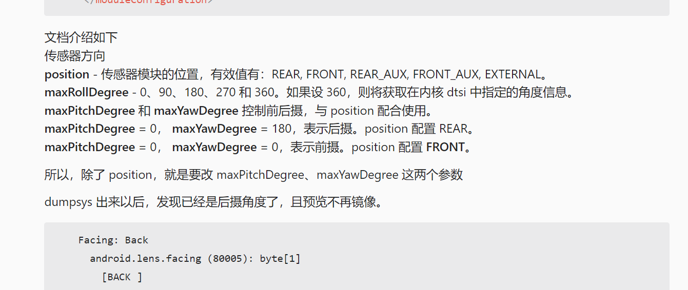

# 概要

视频通话前摄打不开,gc5035可以打开,bf2553L打不开

# 添加log

* QSSI.12/vendor/codeaurora/commonsys/packages/apps/Dialer/java/com/android/incallui/InCallCameraManager.java

```

public String getActiveCameraId() {
     maybeInitializeCameraList(context);
 
+    Log.d(this, "victor_call,useFrontFacingCamera = " + useFrontFacingCamera +",frontFacingCameraId = "+frontFacingCame
raId+",rearFacingCameraId = "+rearFacingCameraId);
     if (useFrontFacingCamera) {
       return frontFacingCameraId;
     } else {
@@ -106,7 +107,7 @@ public class InCallCameraManager {
       return;
     }

private void maybeInitializeCameraList(Context context) {
+    Log.v(this, "victor_call,cameraIds.length = "+cameraIds.length);
     for (int i = 0; i < cameraIds.length; i++) {
       CameraCharacteristics c = null;
       try {
@@ -141,15 +143,21 @@ public class InCallCameraManager {
       if (c != null) {
         int facingCharacteristic = c.get(CameraCharacteristics.LENS_FACING);
         if (facingCharacteristic == CameraCharacteristics.LENS_FACING_FRONT) {
+          Log.v(this, "victor_call,i = "+i+",frontFacingCameraId = "+cameraIds[i]);
           frontFacingCameraId = cameraIds[i];
         } else if (facingCharacteristic == CameraCharacteristics.LENS_FACING_BACK) {
+          Log.v(this, "victor_call,i = "+i+",rearFacingCameraId = "+cameraIds[i]);
           rearFacingCameraId = cameraIds[i];
+        }else{
+            Log.v(this, "victor_call,i = "+i+",no LENS_FACING_FRONT,no LENS_FACING_BACK");
         }
+      }else{
+        Log.v(this, "victor_call,c = null ");
       }
     }
 
     isInitialized = true;
-    Log.v(this, "initializeCameraList : done");
+    Log.v(this, "victor_call,initializeCameraList : done");
   }
```

# GC5035

`victor_call,i = 1,frontFacingCameraId = 1` ,所以视频通话前摄可以打开

```
Dialer  : InCallCameraManager - victor_call,initializeCameraList
Dialer  : InCallCameraManager - victor_call,cameraIds.length = 2
Dialer  : InCallCameraManager - victor_call,i = 0,rearFacingCameraId = 0
Dialer  : InCallCameraManager - victor_call,i = 1,frontFacingCameraId = 1
Dialer  : InCallCameraManager - victor_call,initializeCameraList : done
Dialer  : InCallCameraManager - victor_call,useFrontFacingCamera = true,frontFacingCameraId = 1,rearFacingCameraId = 0
Dialer  : InCallCameraManager - victor_call,useFrontFacingCamera = true,frontFacingCameraId = 1,rearFacingCameraId = 0
Dialer  : InCallCameraManager - victor_call,useFrontFacingCamera = true,frontFacingCameraId = 1,rearFacingCameraId = 0
Dialer  : InCallCameraManager - victor_call,useFrontFacingCamera = true,frontFacingCameraId = 1,rearFacingCameraId = 0
Dialer  : InCallCameraManager - victor_call,useFrontFacingCamera = true,frontFacingCameraId = 1,rearFacingCameraId = 0
Dialer  : InCallCameraManager - victor_call,useFrontFacingCamera = true,frontFacingCameraId = 1,rearFacingCameraId = 0
Dialer  : InCallCameraManager - victor_call,useFrontFacingCamera = true,frontFacingCameraId = 1,rearFacingCameraId = 0
```

# BF2553L

可以看到`victor_call,i = 1,no LENS_FACING_FRONT,no LENS_FACING_BACK`

`victor_call - cameraManager.getActiveCameraId = null`

没有配置facing,所以视频通话前摄打不开

```
Dialer  : InCallCameraManager - victor_call,initializeCameraList
Dialer  : InCallCameraManager - victor_call,cameraIds.length = 2
Dialer  : InCallCameraManager - victor_call,i = 0,rearFacingCameraId = 0
Dialer  : InCallCameraManager - victor_call,i = 1,no LENS_FACING_FRONT,no LENS_FACING_BACK
Dialer  : InCallCameraManager - victor_call,initializeCameraList : done
Dialer  : InCallCameraManager - victor_call,useFrontFacingCamera = true,frontFacingCameraId = null,rearFacingCameraId = 0
Dialer  : InCallCameraManager - victor_call,useFrontFacingCamera = true,frontFacingCameraId = null,rearFacingCameraId = 0
Dialer  : InCallCameraManager - victor_call,useFrontFacingCamera = true,frontFacingCameraId = null,rearFacingCameraId = 0
Dialer  : InCallCameraManager - victor_call,useFrontFacingCamera = true,frontFacingCameraId = null,rearFacingCameraId = 0
Dialer  : InCallCameraManager - victor_call,useFrontFacingCamera = true,frontFacingCameraId = null,rearFacingCameraId = 0
Dialer  : InCallCameraManager - victor_call,useFrontFacingCamera = true,frontFacingCameraId = null,rearFacingCameraId = 0
Dialer  : InCallCameraManager - victor_call,useFrontFacingCamera = true,frontFacingCameraId = null,rearFacingCameraId = 0
Dialer  : InCallCameraManager - victor_call,useFrontFacingCamera = false,frontFacingCameraId = null,rearFacingCameraId = 0
Dialer  : InCallCameraManager - victor_call,useFrontFacingCamera = false,frontFacingCameraId = null,rearFacingCameraId = 0
Dialer  : InCallCameraManager - victor_call,useFrontFacingCamera = false,frontFacingCameraId = null,rearFacingCameraId = 0
Dialer  : InCallCameraManager - victor_call,useFrontFacingCamera = false,frontFacingCameraId = null,rearFacingCameraId = 0
```

# 修改方法

* UM.9.15/vendor/qcom/proprietary/chi-cdk/oem/qcom/module/byd_bf2553L_module.xml

```
--- a/UM.9.15/vendor/qcom/proprietary/chi-cdk/oem/qcom/module/byd_bf2553L_module.xml
+++ b/UM.9.15/vendor/qcom/proprietary/chi-cdk/oem/qcom/module/byd_bf2553L_module.xml
@@ -56,11 +56,11 @@
         <!--Vertical view angle in degrees. -->
         <verticalViewAngle>45.0</verticalViewAngle>
         <!--Maximum Roll Degree. Valid values are: 0, 90, 180, 270, 360 -->
-        <maxRollDegree>270</maxRollDegree>
+        <maxRollDegree>90</maxRollDegree>
         <!--Maximum Pitch Degree. Valid values are: 0, 90, 180, 270 -->
-        <maxPitchDegree>90</maxPitchDegree>
+        <maxPitchDegree>0</maxPitchDegree>
         <!--Maximum Yaw Degree. Valid values are: 0 to 359 -->
-        <maxYawDegree>180</maxYawDegree>
+        <maxYawDegree>0</maxYawDegree>
       </lensInfo>
```

* UM.9.15/vendor/qcom/proprietary/chi-cdk/oem/qcom/sensor/bf2553L/bf2553L_sensor.xml

```
--- a/UM.9.15/vendor/qcom/proprietary/chi-cdk/oem/qcom/sensor/bf2553L/bf2553L_sensor.xml
+++ b/UM.9.15/vendor/qcom/proprietary/chi-cdk/oem/qcom/sensor/bf2553L/bf2553L_sensor.xml
@@ -300,7 +300,7 @@
     </regSetting>
     <regSetting>
       <registerAddr>0x00</registerAddr>
-      <registerData>0x41</registerData>
+      <registerData>0x49</registerData>
       <regAddrType range="[1,4]">1</regAddrType>
       <regDataType range="[1,4]">1</regDataType>
       <operation>WRITE</operation>
@@ -707,7 +707,7 @@
       </regSetting>
       <regSetting>
         <registerAddr>0x00</registerAddr>
-        <registerData>0x4d</registerData>
+               <registerData>0x49</registerData>
         <regAddrType range="[1,4]">1</regAddrType>
         <regDataType range="[1,4]">1</regDataType>
         <operation>WRITE</operation>
```

# 问题OK的log

可以看到,顺利注册rearFacingCameraId = 0,frontFacingCameraId = 1

```
Dialer  : InCallCameraManager - victor_call,initializeCameraList
Dialer  : InCallCameraManager - victor_call,cameraIds.length = 2
Dialer  : InCallCameraManager - victor_call,i = 0,rearFacingCameraId = 0
Dialer  : InCallCameraManager - victor_call,i = 1,frontFacingCameraId = 1
Dialer  : InCallCameraManager - victor_call,initializeCameraList : done
Dialer  : InCallCameraManager - victor_call,useFrontFacingCamera = true,frontFacingCameraId = 1,rearFacingCameraId = 0
Dialer  : InCallCameraManager - victor_call,useFrontFacingCamera = true,frontFacingCameraId = 1,rearFacingCameraId = 0
Dialer  : InCallCameraManager - victor_call,useFrontFacingCamera = true,frontFacingCameraId = 1,rearFacingCameraId = 0
Dialer  : victor_call - cameraManager.getActiveCameraId != null
Dialer  : InCallCameraManager - victor_call,useFrontFacingCamera = true,frontFacingCameraId = 1,rearFacingCameraId = 0
Dialer  : InCallCameraManager - victor_call,useFrontFacingCamera = true,frontFacingCameraId = 1,rearFacingCameraId = 0
 Dialer  : InCallCameraManager - victor_call,useFrontFacingCamera = true,frontFacingCameraId = 1,rearFacingCameraId = 0
 Dialer  : InCallCameraManager - victor_call,useFrontFacingCamera = true,frontFacingCameraId = 1,rearFacingCameraId = 0
```

# 高通平台摄像头方向总结



# 编译camera命令

高通平台,编译camera模块命令,qcm2290,在UM.9.15 这一边运行python脚本

* python vendor/qcom/proprietary/chi-cdk/tools/buildbins/buildbins.py

* adb push UM.9.15\vendor\qcom\proprietary\chi-cdk\oem\qcom\bin\com.qti.sensormodule.byd_bf2553L.bin /vendor/lib/camera/

* adb push UM.9.15\vendor\qcom\proprietary\chi-cdk\oem\qcom\bin\com.qti.sensormodule.byd_bf2553L.bin /vendor/lib64/camera/

# 调试手段

注意remount push后,可能bin会被还原.

注意检查md5sum bin文件是否一样

* killall android.hardware.camera.provider@2.4-service_64

使用该命令,不用重启生效

* adb shell dumpsys media.camera > 1220.5.dumpsys_media.camera.txt

可以过滤 Facing,还有Orientation 等从驱动读出来的数据

# 修改二

由于调整sensor寄存器的mirror后,导致效果重调,并且拍照试图镜像.

所以从framework 避免sensor 的镜像预览处置

* frameworks/av/camera/CameraUtils.cpp

添加属性控制,是否需要前摄mirror,注意配套的selinxu修改

```
status_t CameraUtils::getRotationTransform(const CameraMetadata& staticInfo,
                /*out*/int32_t* transform) {
    ALOGV("%s", __FUNCTION__);
    bool mirror = (entryFacing.data.u8[0] == ANDROID_LENS_FACING_FRONT && base::GetBoolProperty("ro.pax.front.camera.mirror", true));
    int orientation = entry.data.i32[0];
    if (!mirror) {
        switch (orientation) {
            case 0:
                flags = 0;
                break;
            case 90:
                flags = NATIVE_WINDOW_TRANSFORM_ROT_90;
                break;
            case 180:
                flags = NATIVE_WINDOW_TRANSFORM_ROT_180;
                break;
            case 270:
                flags = NATIVE_WINDOW_TRANSFORM_ROT_270;
                break;
            default:
                ALOGE("%s: Invalid HAL android.sensor.orientation value: %d",
                      __FUNCTION__, orientation);
                return INVALID_OPERATION;
        }
    } else {
        // Front camera needs to be horizontally flipped for mirror-like behavior.
        // Note: Flips are applied before rotates; using XOR here as some of these flags are
        // composed in terms of other flip/rotation flags, and are not bitwise-ORable.
        switch (orientation) {
            case 0:
                flags = NATIVE_WINDOW_TRANSFORM_FLIP_H;
                break;
            case 90:
                flags = NATIVE_WINDOW_TRANSFORM_FLIP_H ^
                        NATIVE_WINDOW_TRANSFORM_ROT_270;
                break;
            case 180:
                flags = NATIVE_WINDOW_TRANSFORM_FLIP_H ^
                        NATIVE_WINDOW_TRANSFORM_ROT_180;
                break;
            case 270:
                flags = NATIVE_WINDOW_TRANSFORM_FLIP_H ^
                        NATIVE_WINDOW_TRANSFORM_ROT_90;

                break;
            default:
                ALOGE("%s: Invalid HAL android.sensor.orientation value: %d",
                      __FUNCTION__, orientation);
                return INVALID_OPERATION;
        }
    }

    return OK;
}
```

* system/sepolicy/public/cameraserver.te

```
--- a/QSSI.12/system/sepolicy/public/cameraserver.te
+++ b/QSSI.12/system/sepolicy/public/cameraserver.te
@@ -61,6 +61,7 @@ allow cameraserver adbd:unix_stream_socket { read write };
 allow cameraserver shell:fd use;
 allow cameraserver shell:unix_stream_socket { read write };
 allow cameraserver shell:fifo_file { read write };
+allow cameraserver pax_ctrl_prop:file { open getattr map read };
 
 # Allow to talk with media codec
 allow cameraserver mediametrics_service:service_manager find;
```

* adb push QSSI\out\target\product\qssi\system\lib64\libcamera_client.so /system/lib64/

killall cameraserver 应该可以生效