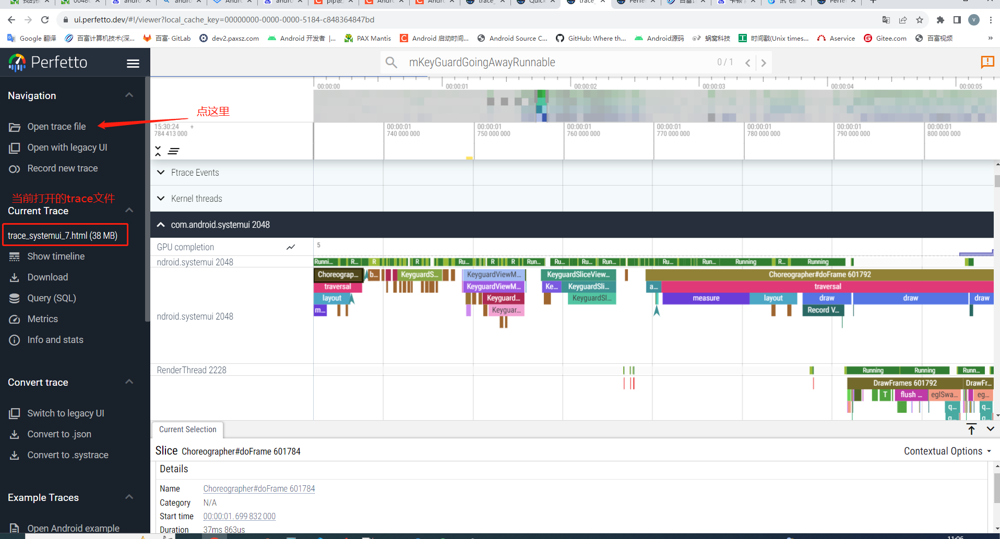
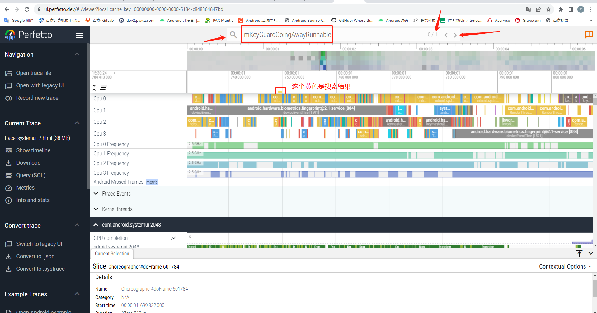

# 概要

本文介绍Perfertto 的工具安装,大概使用. android系统,涉及到一些卡顿问题,需要使用trace分析

# 网址

* https://ui.perfetto.dev/

# windows 环境

* 安装 Python 2.7.14,上网百度

* 安装pip,python -m pip install --upgrade pip,注意环境变量是否2.7路径下

* 配置国内源, pip config set global.index-url https://pypi.tuna.tsinghua.edu.cn/simple

    * 恢复默认源, pip config unset global.index-url

* 安装win32, pip install pypiwin32

* 安装six, pip install six

# windows 捉去trace

* sdk路径, C:\Users\starmenxie\AppData\Local\Android\Sdk\platform-tools\systrace

    * cmd窗口, 输入set,敲入回车,可以打印出所有环境变量

* python systrace.py gfx rs input view sched am wm dalvik freq idle load sync workq powerdisk sm hal res binder_driver binder_lock -a com.android.systemui -t 5 -o trace_systemui_3.html

    * -a 包名, 看起来加入包名才可以捉取对应应用的trace

    * -t 5 ,捉5秒

    * -o 输出文件

* 也可以用该命令捉,python systrace.py -t 4 -a com.android.systemui -o trace_systemui_7.html

# Perfetto

* 使用Peretto打开trace_systemui_7.html

    

* 搜索想要的关键字

    例如代码Trace.beginSection("KeyguardViewMediator.mKeyGuardGoingAwayRunnable");

    点击向右按键,指示黄色的搜索结果

    

* 快捷键

    * w 放大

    * s 缩小

    * d 右移

    * a 左移

# 源码

* QSSI.12/frameworks/base/packages/SystemUI/src/com/android/systemui/keyguard/KeyguardViewMediator.java

添加标签  Trace.beginSection, Trace.endSection();

```
private final Runnable mKeyguardGoingAwayRunnable = new Runnable() {
        @Override
        public void run() {
            Trace.beginSection("KeyguardViewMediator.mKeyGuardGoingAwayRunnable");
            if (DEBUG) Log.d(TAG, "keyguardGoingAway");
            mKeyguardViewControllerLazy.get().keyguardGoingAway();

            int flags = 0;
            if (mKeyguardViewControllerLazy.get().shouldDisableWindowAnimationsForUnlock()
                    || mWakeAndUnlocking && !mWallpaperSupportsAmbientMode) {
                flags |= WindowManagerPolicyConstants
                        .KEYGUARD_GOING_AWAY_FLAG_NO_WINDOW_ANIMATIONS;
            }
            if (mKeyguardViewControllerLazy.get().isGoingToNotificationShade()
                    || mWakeAndUnlocking && mWallpaperSupportsAmbientMode) {
                // When the wallpaper supports ambient mode, the scrim isn't fully opaque during
                // wake and unlock and we should fade in the app on top of the wallpaper
                flags |= WindowManagerPolicyConstants.KEYGUARD_GOING_AWAY_FLAG_TO_SHADE;
            }
            if (mKeyguardViewControllerLazy.get().isUnlockWithWallpaper()) {
                flags |= KEYGUARD_GOING_AWAY_FLAG_WITH_WALLPAPER;
            }
            if (mKeyguardViewControllerLazy.get().shouldSubtleWindowAnimationsForUnlock()) {
                flags |= WindowManagerPolicyConstants
                        .KEYGUARD_GOING_AWAY_FLAG_SUBTLE_WINDOW_ANIMATIONS;
            }

            mUpdateMonitor.setKeyguardGoingAway(true);
            mKeyguardViewControllerLazy.get().setKeyguardGoingAwayState(true);

            // Don't actually hide the Keyguard at the moment, wait for window
            // manager until it tells us it's safe to do so with
            // startKeyguardExitAnimation.
            // Posting to mUiOffloadThread to ensure that calls to ActivityTaskManager will be in
            // order.
            final int keyguardFlag = flags;
            mUiBgExecutor.execute(() -> {
                try {
                    ActivityTaskManager.getService().keyguardGoingAway(keyguardFlag);
                } catch (RemoteException e) {
                    Log.e(TAG, "Error while calling WindowManager", e);
                }
            });
            Trace.endSection();
        }
    };
```