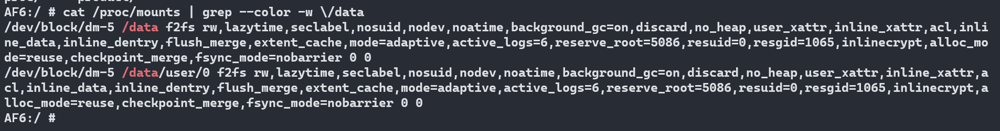

# 概要

查看系统,挂载点的使用的文件系统

# 查看系统分区

* df -h


# 查看使用文件系统

* mount | grep --color -w \/data

    输入 mount 命令,拼接grep命令,可以看到/data分区,使用的是f2fs文件系统

    

* cat /proc/mounts | grep --color -w \/data

    cat mounts可以看到,直接的文件系统挂载参数

    

# 配置文件系统

* 挂载文件系统,system/core/rootdir/init.rc

```
mount configfs none /config nodev noexec nosuid
chmod 0770 /config/sdcardfs
chown system package_info /config/sdcardfs

# Mount binderfs
mkdir /dev/binderfs
mount binder binder /dev/binderfs stats=global
chmod 0755 /dev/binderfs
```

* 展锐

    * idh.code/device/sprd/mpool/module/fs/fstab.mk

    * idh.code/device/sprd/mpool/module/fs/README_fstab.txt

* 高通

    * UM.9.15/device/qcom/bengal/emmc/fstab_AB_dynamic_partition.qti

# 文件系统

Linux将文件系统分为了两层：VFS(虚拟文件系统) -> 具体文件系统


# 文件系统类型

mount | grep type

可以看到文件系统的类型有很多

* erofs,华为的

Enhanced Read-Only File System 是一个Linux操作系统下的只读文件系统，用来在保证嵌入式设备端到端的性能下节省存储空间，尤其是Android设备。相比其他通用文件系统，它使用了减少元数据的设计，并且提供透明压缩技术给目标文件系统用户

EROFS随机数据读取对比ext4有明显优势，最高超过 500%

采用了EROFS超级文件系统之后，手机的随机读取性能平均提升20%，最大可提升近300%；实现系统ROM空间占用节省2GB（以P30 Pro 128G为例，不同机型节省空间不一样）；可避免在内存紧张时低效地反复读数据，解压缩数据带来的整机卡顿问题；天然只读设计，系统分区不可被三方改写。

```
/dev/block/dm-0 on / type erofs (ro,seclabel,relatime,user_xattr,acl,cache_strategy=readaround)
/dev/block/dm-1 on /system_ext type erofs (ro,seclabel,relatime,user_xattr,acl,cache_strategy=readaround)
/dev/block/dm-2 on /vendor type erofs (ro,seclabel,relatime,user_xattr,acl,cache_strategy=readaround)
/dev/block/dm-3 on /product type erofs (ro,seclabel,relatime,user_xattr,acl,cache_strategy=readaround)

/dev/block/dm-0       713M 713M     0 100% /
/dev/block/dm-1       310M 310M     0 100% /system_ext
/dev/block/dm-2       609M 609M     0 100% /vendor
/dev/block/dm-3       139M 139M     0 100% /product
```

* tmpfs

临时文件系统，是一种基于内存的文件系统。它和虚拟磁盘 ramdisk比较类似像，但不完全相同，和ramdisk一样，tmpfs可以使用RAM，但它也可以使用swap分区来存储，而且传统的ramdisk是个块设备，要用mkfs来格式化它，才能真正地使用它；而tmpfs是一个文件系统，并不是块设备，只是安装它，就可以使用了

假如你想占用机器 10G 的内存，那我只要先创建一个临时目录 /tmp/memory ，并指定 tmpfs 的文件系统类型及大小 10240M 挂载到该目录下。

    `mount -t tmpfs -o size=10240M tmpfs /tmp/memory`

 接着咱使用 dd 命令，往该目录下写入多少内容，就会占用多少内存，由于我们的目的是占用内存，因此 if 直接使用 /dev/zero

    `dd if=/dev/zero of=/tmp/memory/block`

当 dd 写入完成后，你再使用 free 去查看可用内存，会发现剩余的内存可分配的内存少了 10G

```
tmpfs on /dev type tmpfs (rw,seclabel,nosuid,relatime,size=947772k,nr_inodes=236943,mode=755)
tmpfs on /mnt type tmpfs (rw,seclabel,nosuid,nodev,noexec,relatime,size=947772k,nr_inodes=236943,mode=755,gid=1000)
tmpfs on /mnt/installer type tmpfs (rw,seclabel,nosuid,nodev,noexec,relatime,size=947772k,nr_inodes=236943,mode=755,gid=1000)
tmpfs on /mnt/androidwritable type tmpfs (rw,seclabel,nosuid,nodev,noexec,relatime,size=947772k,nr_inodes=236943,mode=755,gid=1000)
tmpfs on /apex type tmpfs (rw,seclabel,nosuid,nodev,noexec,relatime,size=947772k,nr_inodes=236943,mode=755)
tmpfs on /linkerconfig type tmpfs (rw,seclabel,nosuid,nodev,noexec,relatime,size=947772k,nr_inodes=236943,mode=755)
tmpfs on /storage type tmpfs (rw,seclabel,nosuid,nodev,noexec,relatime,size=947772k,nr_inodes=236943,mode=755,gid=1000)
tmpfs on /linkerconfig type tmpfs (rw,seclabel,nosuid,nodev,noexec,relatime,size=947772k,nr_inodes=236943,mode=755)
tmpfs on /data_mirror type tmpfs (rw,seclabel,nosuid,nodev,noexec,relatime,size=947772k,nr_inodes=236943,mode=700,gid=1000)
tmpfs on /apex/apex-info-list.xml type tmpfs (rw,seclabel,nosuid,nodev,noexec,relatime,size=947772k,nr_inodes=236943,mode=755)

tmpfs                 926M 1.3M  924M   1% /dev
tmpfs                 926M    0  926M   0% /mnt
tmpfs                 926M  12K  926M   1% /apex
tmpfs                 926M 496K  925M   1% /linkerconfig
tmpfs                 926M    0  926M   0% /data_mirror
```

* devpts -> /dev/pts

devpts即远程虚拟中断文件设备，通过这个文件系统可以了解目前远程虚拟终端的基本情况，对相应的设备文件进行操作，就可以达到操作文件的目的。/dev/pts是远程登录(telnet,ssh等)后创建的控制台设备文件所在的目录。

* proc -> /proc

proc 文件系统是一种内核和内核模块用来向进程发送信息的机制。这个伪文件系统让你可以和内核内部数据结构进行交互，这个文件系统下面包含了很多有用的信息，比如CPU信息、内核版本信息、内存使用情况、系统支持的文件系统等等。 与其他文件系统不同，/proc 存在于内存之中而不是硬盘上。

* sysfs -> /sys/

RAMFS指的是Linux Kernel RAM文件系统，它是一个用于缓存Linux内核数据的特殊文件系统。一般来说，RAMFS存在于内存中，并且与硬盘驱动器没有任何联系。这个文件系统的主要功能是将Linux内核的重要数据（包括运行中的应用程序、临时数据、配置文件等）都缓存到内存中，以便系统可以更快速地应用这些数据。当系统启动时，RAMFS就被创建，并在一些内存空间上挂载。然后系统会将大部分进程的数据都存储在这个RAM文件系统中，以加快磁盘和网络的访问速度，并减少系统开销

sysfs是一种基于ramfs实现的内存文件系统，与其它同样以ramfs实现的文件系统一样。

* selinuxfs -> /sys/fs/selinux

这个文件系统是专供 SELinux 使用的，其中存储了与安装策略 (installed policy) 相关的文件


* ext4

EXT4是第四代扩展文件系统（英语：Fourth extended filesystem，缩写为 ext4）是Linux系统下的日志文件系统

```
/dev/block/mmcblk0p54 on /metadata type ext4 (rw,seclabel,nosuid,nodev,noatime,errors=panic)
/dev/block/dm-4 on /vendor_dlkm type ext4 (ro,seclabel,noatime,errors=panic)
/dev/block/mmcblk0p1 on /mnt/vendor type ext4 (rw,seclabel,nosuid,nodev,noatime,noauto_da_alloc)
/dev/block/mmcblk0p51 on /cache type ext4 (rw,seclabel,nosuid,nodev,noatime,noauto_da_alloc)
/dev/block/loop5 on /apex/com.android.adbd@319999999 type ext4 (ro,dirsync,seclabel,nodev,noatime)
/dev/block/loop6 on /apex/com.android.media@319999900 type ext4 (ro,dirsync,seclabel,nodev,noatime)
/dev/block/loop5 on /apex/com.android.adbd type ext4 (ro,dirsync,seclabel,nodev,noatime)
/dev/block/loop6 on /apex/com.android.media type ext4 (ro,dirsync,seclabel,nodev,noatime)
/dev/block/loop7 on /apex/com.android.tethering@319999900 type ext4 (ro,dirsync,seclabel,nodev,noatime)
/dev/block/loop7 on /apex/com.android.tethering type ext4 (ro,dirsync,seclabel,nodev,noatime)
/dev/block/loop8 on /apex/com.android.mediaprovider@319999910 type ext4 (ro,dirsync,seclabel,nodev,noatime)
/dev/block/loop8 on /apex/com.android.mediaprovider type ext4 (ro,dirsync,seclabel,nodev,noatime)
/dev/block/loop4 on /apex/com.android.ipsec@319999900 type ext4 (ro,dirsync,seclabel,nodev,noatime)
/dev/block/loop10 on /apex/com.android.art@319999900 type ext4 (ro,dirsync,seclabel,nodev,noatime)
/dev/block/loop10 on /apex/com.android.art type ext4 (ro,dirsync,seclabel,nodev,noatime)
/dev/block/loop11 on /apex/com.android.extservices@319999900 type ext4 (ro,dirsync,seclabel,nodev,noatime)
/dev/block/loop9 on /apex/com.android.apex.cts.shim@1 type ext4 (ro,dirsync,seclabel,nodev,noatime)
/dev/block/loop11 on /apex/com.android.extservices type ext4 (ro,dirsync,seclabel,nodev,noatime)
/dev/block/loop9 on /apex/com.android.apex.cts.shim type ext4 (ro,dirsync,seclabel,nodev,noatime)
/dev/block/loop4 on /apex/com.android.ipsec type ext4 (ro,dirsync,seclabel,nodev,noatime)
/dev/block/loop13 on /apex/com.android.tzdata@319999900 type ext4 (ro,dirsync,seclabel,nodev,noatime)
/dev/block/loop13 on /apex/com.android.tzdata type ext4 (ro,dirsync,seclabel,nodev,noatime)
/dev/block/loop15 on /apex/com.android.cellbroadcast@319999900 type ext4 (ro,dirsync,seclabel,nodev,noatime)
/dev/block/loop14 on /apex/com.android.vndk.v31@1 type ext4 (ro,dirsync,seclabel,nodev,noatime)
/dev/block/loop14 on /apex/com.android.vndk.v31 type ext4 (ro,dirsync,seclabel,nodev,noatime)
/dev/block/loop12 on /apex/com.android.permission@319999900 type ext4 (ro,dirsync,seclabel,nodev,noatime)
/dev/block/loop17 on /apex/com.android.scheduling@319999900 type ext4 (ro,dirsync,seclabel,nodev,noatime)
/dev/block/loop15 on /apex/com.android.cellbroadcast type ext4 (ro,dirsync,seclabel,nodev,noatime)
/dev/block/loop17 on /apex/com.android.scheduling type ext4 (ro,dirsync,seclabel,nodev,noatime)
/dev/block/loop19 on /apex/com.android.media.swcodec@319999900 type ext4 (ro,dirsync,seclabel,nodev,noatime)
/dev/block/loop19 on /apex/com.android.media.swcodec type ext4 (ro,dirsync,seclabel,nodev,noatime)
/dev/block/loop20 on /apex/com.android.os.statsd@319999900 type ext4 (ro,dirsync,seclabel,nodev,noatime)
/dev/block/loop12 on /apex/com.android.permission type ext4 (ro,dirsync,seclabel,nodev,noatime)
/dev/block/loop16 on /apex/com.android.appsearch@300000000 type ext4 (ro,dirsync,seclabel,nodev,noatime)
/dev/block/loop16 on /apex/com.android.appsearch type ext4 (ro,dirsync,seclabel,nodev,noatime)
/dev/block/loop18 on /apex/com.android.conscrypt@319999900 type ext4 (ro,dirsync,seclabel,nodev,noatime)
/dev/block/loop21 on /apex/com.android.neuralnetworks@319999900 type ext4 (ro,dirsync,seclabel,nodev,noatime)
/dev/block/loop22 on /apex/com.android.resolv@319999900 type ext4 (ro,dirsync,seclabel,nodev,noatime)
/dev/block/loop18 on /apex/com.android.conscrypt type ext4 (ro,dirsync,seclabel,nodev,noatime)
/dev/block/loop23 on /apex/com.android.runtime@1 type ext4 (ro,dirsync,seclabel,nodev,noatime)
/dev/block/loop23 on /apex/com.android.runtime type ext4 (ro,dirsync,seclabel,nodev,noatime)
/dev/block/loop21 on /apex/com.android.neuralnetworks type ext4 (ro,dirsync,seclabel,nodev,noatime)
/dev/block/loop25 on /apex/com.android.sdkext@319999900 type ext4 (ro,dirsync,seclabel,nodev,noatime)
/dev/block/loop22 on /apex/com.android.resolv type ext4 (ro,dirsync,seclabel,nodev,noatime)
/dev/block/loop26 on /apex/com.android.wifi@319999900 type ext4 (ro,dirsync,seclabel,nodev,noatime)
/dev/block/loop24 on /apex/com.android.i18n@1 type ext4 (ro,dirsync,seclabel,nodev,noatime)
/dev/block/loop25 on /apex/com.android.sdkext type ext4 (ro,dirsync,seclabel,nodev,noatime)
/dev/block/loop26 on /apex/com.android.wifi type ext4 (ro,dirsync,seclabel,nodev,noatime)
/dev/block/loop20 on /apex/com.android.os.statsd type ext4 (ro,dirsync,seclabel,nodev,noatime)
/dev/block/loop24 on /apex/com.android.i18n type ext4 (ro,dirsync,seclabel,nodev,noatime)


/dev/block/mmcblk0p54  11M 176K   11M   2% /metadata
/dev/block/dm-4        17M  17M   52K 100% /vendor_dlkm
/dev/block/mmcblk0p1  5.3M 180K  5.1M   4% /mnt/vendor
/dev/block/mmcblk0p51 488M  12M  476M   3% /cache
/dev/block/loop5      8.3M 8.3M   28K 100% /apex/com.android.adbd@319999999
/dev/block/loop6      6.3M 6.2M   32K 100% /apex/com.android.media@319999900
/dev/block/loop7      2.6M 2.5M   28K  99% /apex/com.android.tethering@319999900
/dev/block/loop8      4.2M 4.1M   32K 100% /apex/com.android.mediaprovider@319999910
/dev/block/loop4      692K 664K   28K  96% /apex/com.android.ipsec@319999900
/dev/block/loop10      60M  60M   36K 100% /apex/com.android.art@319999900
/dev/block/loop11     5.3M 5.3M   32K 100% /apex/com.android.extservices@319999900
/dev/block/loop9      232K  88K  144K  38% /apex/com.android.apex.cts.shim@1
/dev/block/loop13     832K 804K   28K  97% /apex/com.android.tzdata@319999900
/dev/block/loop15      10M  10M   28K 100% /apex/com.android.cellbroadcast@319999900
/dev/block/loop14      39M  39M   28K 100% /apex/com.android.vndk.v31@1
/dev/block/loop12      18M  18M   28K 100% /apex/com.android.permission@319999900
/dev/block/loop17     232K 152K   80K  66% /apex/com.android.scheduling@319999900
/dev/block/loop19      18M  18M   32K 100% /apex/com.android.media.swcodec@319999900
/dev/block/loop20     1.6M 1.6M   28K  99% /apex/com.android.os.statsd@319999900
/dev/block/loop16     2.0M 1.9M   28K  99% /apex/com.android.appsearch@300000000
/dev/block/loop18     4.8M 4.8M   28K 100% /apex/com.android.conscrypt@319999900
/dev/block/loop21     7.6M 7.6M   28K 100% /apex/com.android.neuralnetworks@319999900
/dev/block/loop22     2.4M 2.4M   28K  99% /apex/com.android.resolv@319999900
/dev/block/loop23     7.5M 7.4M   36K 100% /apex/com.android.runtime@1
/dev/block/loop25     692K 664K   28K  96% /apex/com.android.sdkext@319999900
/dev/block/loop26     5.6M 5.6M   28K 100% /apex/com.android.wifi@319999900
/dev/block/loop24      35M  35M   28K 100% /apex/com.android.i18n@1
```

* cgroup,cgroup2 -> /sys/fs/cgroup

cgroup 是一种层次化的组织结构，类似于文件系统的目录树结构。每个cgroup都可以包含一组进程，并且可以对这些进程施加资源限制和管理策略。

```
none on /dev/blkio type cgroup (rw,nosuid,nodev,noexec,relatime,blkio)
none on /sys/fs/cgroup type cgroup2 (rw,nosuid,nodev,noexec,relatime)
none on /dev/cpuctl type cgroup (rw,nosuid,nodev,noexec,relatime,cpu)
none on /dev/cpuset type cgroup (rw,nosuid,nodev,noexec,relatime,cpuset,noprefix,release_agent=/sbin/cpuset_release_agent)
none on /dev/memcg type cgroup (rw,nosuid,nodev,noexec,relatime,memory)
```

使用cgroup限制进程使用指定的CPU核数和CPU利用率:

    *  创建一个新的cgroup：

        ```
        mkdir /sys/fs/cgroup/cpu/mygroup
        ```
        
    * 限制CPU核数：在cgroup的cpu.cfs_quota_us文件中设置CPU配额值，以微秒为单位。

        例如，要限制进程仅使用一个CPU核，可以设置cpu.   cfs_quota_us的值为100000（100000微秒，即0.1秒）

        ```
        echo 100000 > /sys/fs/cgroup/cpu/mygroup/cpu.cfs_quota_us
        ```

    * 限制CPU利用率:在cgroup的cpu.cfs_quota_us和cpu.cfs_period_us文件中设置CPU配额值和周期值

        配额值表示允许使用的CPU时间量，周期值表示配额的计算周期。例如，要限制进程的CPU利用率为50%，可以设置cpu.cfs_quota_us的值为50000微秒（0.05秒），并设置cpu.cfs_period_us的值为100000微秒（0.1秒）：

        ```
        echo 50000 > /sys/fs/cgroup/cpu/mygroup/cpu.cfs_quota_us
        echo 100000 > /sys/fs/cgroup/cpu/mygroup/cpu.cfs_period_us
        ```

    * 将进程添加到cgroup：

        * 获取进程的PID（进程ID）: `pidof your_process_name`

        * 将进程的PID写入cgroup的tasks文件中，将进程添加到cgroup: `echo <pid> > /sys/fs/cgroup/cpu/mygroup/tasks`

    * 现在，进程将受到cgroup的限制，并且只能在指定的CPU核上运行，或按照指定的CPU利用率执行。

* tracefs -> /sys/kernel/tracing

trace通过debugfs(或者tracefs)文件系统向用户空间提供访问接口，因此需要在系统启动时挂载debugfs（tracefs）。
不需要额外的工具，你就可以通过挂载点（ /sys/kernel/debug/tracing 目录或者/sys/kernel/tracing目录）内的文件读写，来跟 ftrace 交互，跟踪内核或者应用程序的运行事件。
debugfs是Linux内核中一种特殊的文件系统，非常易用、基于RAM，专门设计用于调试.

* configfs -> /config

configfs 的 config_item 创建通过用户空间的 mkdir 操作实现，销毁使用 rmdir。

mkdir 执行后，属性项也随之出现，后续使用 read/write 修改它们。

例如通过configs 配置usb的功能,acm,adb等


* binder -> /dev/binderfs

register_filesystem()会向VFS注册binder文件系统。
每个注册的文件系统都用一个类型为file_system_type的对象表示。file_system_type主要记录文件系统的类型相关信息，比如名称、上下文初始化函数指针等。binder_fs_type指明将要挂载的Binder文件系统名为binder。

```
static struct file_system_type binder_fs_type = {
	.name			= "binder",
	.init_fs_context	= binderfs_init_fs_context,
	.parameters		= binderfs_fs_parameters,
	.kill_sb		= kill_litter_super,
	.fs_flags		= FS_USERNS_MOUNT,
};

int __init init_binderfs(void)
{
	int ret;
	ret = register_filesystem(&binder_fs_type);
	return ret;
}
```

* fusectl -> /sys/fs/fuse/connections

* bpf -> /sys/fs/bpf

BPF（Berkeley Packet Filter）文件系统是一种特殊的文件系统，用于在Linux内核中运行高级网络过滤和数据包处理程序。

* pstore -> /sys/fs/pstore

pstore最初是用于系统发生oops或panic时，自动保存内核log buffer中的日志。不过在当前内核版本中，其已经支持了更多的功能，如保存console日志、ftrace消息和用户空间日志。同时，它还支持将这些消息保存在不同的存储设备中，如内存、块设备或mtd设备。 为了提高灵活性和可扩展性，pstore将以上功能分别抽象为前端和后端，其中像dmesg、console等为pstore提供数据的模块称为前端，而内存设备、块设备等用于存储数据的模块称为后端，pstore core则分别为它们提供相关的注册接口

* functionfs -> /dev/usb-ffs/adb

配合configfs 对usb的功能做具体配置

```
adb on /dev/usb-ffs/adb type functionfs (rw,relatime)
mtp on /dev/usb-ffs/mtp type functionfs (rw,relatime)
ptp on /dev/usb-ffs/ptp type functionfs (rw,relatime)
```

* f2fs -> /dev/block/dm-5 on /data

F2FS (Flash Friendly File System) 是专门为基于 NAND 的存储设备设计的新型开源 flash 文件系统。特别针对NAND 闪存存储介质做了友好设计

* fuse

FUSE(Filesystem in Userspace)，是一种用户空间文件系统。用户可以通过FUSE文件系统操作内卡。FUSE主要实现代码位于用户空间中，而不需要重新编译到内核，用户空间开发者可以通过FUSE的接口直接访问内核空间，不需要了解文件系统的内幕和内核模块编程的知识，这给用户空间开发者带来了众多便利。简单讲，用户可通过fuse在用户空间来定制实现自己的文件系统

# 文件系统参数

具体参数跟解释,可以使用 `man mount`

* rw

表示文件系统以读写模式挂载

* relatime

表示文件系统的访问时间在读取操作时更新