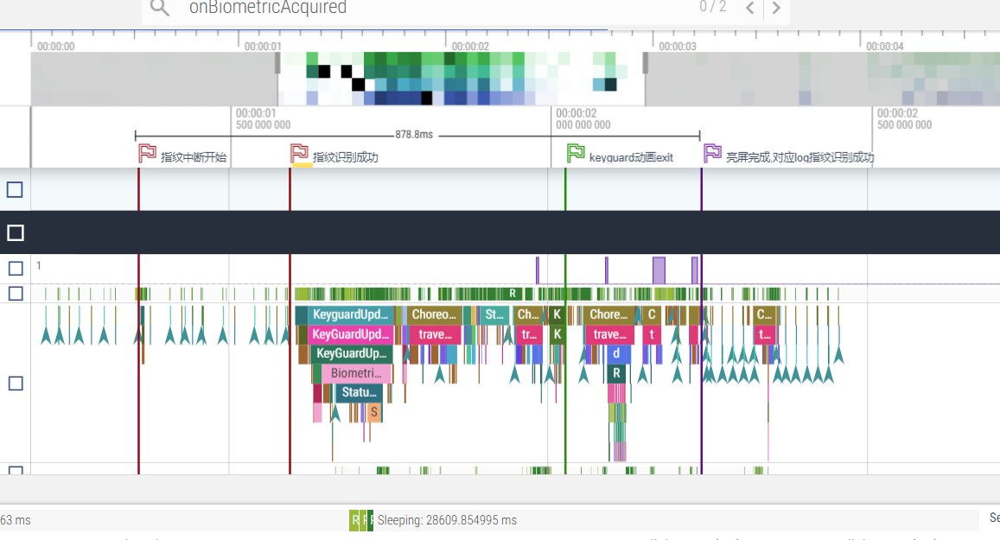
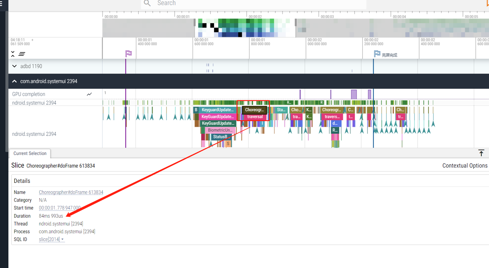
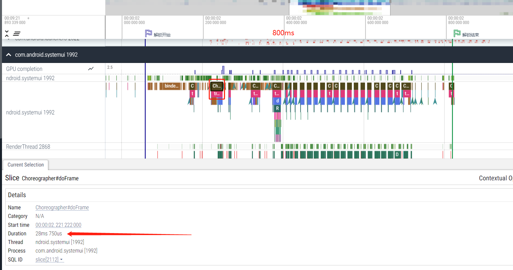

# 概要

测试部提出指纹解锁慢,需要1.366s,大于要求的500ms

# 直观体验

感觉大概需要1s左右,主要是屏幕亮起,有一个黑色的背光,好像是动画还是什么问题. 在设置界面,锁屏,更加明显

# log

可以看到,指纹从中断出来,16:27:57.808,到通知系统解锁notifyCallback, 16:27:57.995, 大概只有187ms,还是比较快的.

log也对应得上,  AUTHENTICATION in TA consumed time 19/164//184 ms

```
	行 101: 08-05 16:27:57.808     0     0 I fortsense-fsfp_ctl-245: fsfp_ctl_device_irq(irq = 195, ..) toggled.
	行 101: 08-05 16:27:57.808     0     0 I fortsense-fsfp_ctl-245: fsfp_ctl_device_irq(irq = 195, ..) toggled.
	行 102: 08-05 16:27:57.808     0     0 I fortsense-fsfp_ctl-237: fsfp_ctl_device_event(..) enter.
	行 102: 08-05 16:27:57.808     0     0 I fortsense-fsfp_ctl-237: fsfp_ctl_device_event(..) enter.
	行 103: 08-05 16:27:57.810   916   979 I   916   979 [fsfp-hal-device] : (847) got device falling edge interrupt, signal the semaphore.
	行 104: 08-05 16:27:57.810   916  1405 I   916  1405 [fsfp-hal-v1.4.0.10] : (2475) got the device interrupt. 0
	行 105: 08-05 16:27:57.829   916  1405 I   916  1405 [fsfp-client-qs] : (316) ---8<---- TA LOG BEGINS ---------
	行 106: 08-05 16:27:57.829   916  1405 I   916  1405 [fsfp-ic] : (6977) ifgr_cur.sum: 124+14//128+17/128+15/128+17/136+14/117+15/116+17/117+17/123+6, 12/4/5, 122/122/32/0/0, 67/63
	行 107: 08-05 16:27:57.829   916  1405 I   916  1405 [fsfp-tee-v1.4.0.10] : (2549) 'sf_interrupt_query' leave, time: 1ms, query int status: opstate SF_OPERATION_STATE_AUTH, device SF_DEVICE_STAT_WAITING_IMAGE, irq SF_DEVICE_STAT_IMAGE_READY
	行 108: 08-05 16:27:57.829   916  1405 I   916  1405 [fsfp-client-qs] : (333) --------- TA LOG FINISH ---->8---
	行 109: 08-05 16:27:57.829   916  1405 I   916  1405 [fsfp-hal-v1.4.0.10] : (3392) (1344) 'notifyCallback' enter, msg type: 1 acquired_info = 0
	行 111: 08-05 16:27:57.830   916  1405 I   916  1405 [fsfp-hal-v1.4.0.10] : (3392) (1344) 'notifyCallback' enter, msg type: 1 acquired_info = 1002
	行 117: 08-05 16:27:57.994   916  1405 I   916  1405 [fsfp-client-qs] : (316) ---8<---- TA LOG BEGINS ---------
	行 118: 08-05 16:27:57.994   916  1405 I   916  1405 [fsfp-ic] : (3842) 'ic_get_finger_status' finger: touch
	行 119: 08-05 16:27:57.994   916  1405 I   916  1405 [fsfp-tee-v1.4.0.10] : (806) 'do_read_multi_sensor_data_check' consumed time 19//9/0/8//17 ms, check valid: 0/0/0/0/SF_FINGER_TOUCH//Y
	行 120: 08-05 16:27:57.994   916  1405 I   916  1405 [fsfp-algo] : (516) retry0 api_algo_get_fingerquality(0x36a60d1c) = 60. erea 96
	行 121: 08-05 16:27:57.994   916  1405 I   916  1405 [fsfp-algo] : (530) retry0 api_algo_fingerfeature_handle(..) consumed time       95 ms.
	行 122: 08-05 16:27:57.994   916  1405 I   916  1405 [fsfp-algo] : (1044) api_algo_vertify_feature, alg_ver: 2048506_2108230, idx = 0/1, fid =  363990709, score =  54, study = 1/1, enroll_frame: 16/ 5
	行 123: 08-05 16:27:57.994   916  1405 I   916  1405 [fsfp-algo] : (1121) retry0 api_algo_vertify_feature totally consumed time ( 34 +   0) =       34 ms.
	行 124: 08-05 16:27:57.994   916  1405 I   916  1405 [fsfp-tee-v1.4.0.10] : (997) retry0 do_authenticate: score =  54, fid = 363990709, study = 1(Y), authenticate total time: 146 ms.
	行 125: 08-05 16:27:57.994   916  1405 I   916  1405 [fsfp-tee-v1.4.0.10] : (2655) 'sf_interrupt_process' leave, time: 148ms, err = 0
	行 126: 08-05 16:27:57.994   916  1405 I   916  1405 [fsfp-client-qs] : (333) --------- TA LOG FINISH ---->8---
	行 127: 08-05 16:27:57.994   916  1405 I   916  1405 [fsfp-hal-v1.4.0.10] : (2720) AUTHENTICATION in TA consumed time 19/164//184 ms.
	行 128: 08-05 16:27:57.994   916  1405 I   916  1405 [fsfp-hal-v1.4.0.10] : (3392) (1459) 'notifyCallback' enter, msg type: 1 acquired_info = 0
	行 130: 08-05 16:27:57.995   916  1405 I   916  1405 [fsfp-hal-v1.4.0.10] : (3408) (1463) 'notifyCallback' enter, msg type: 5 gid = 0 fid = 363990709(363990709)
```

# 流程

从指纹中断,到亮屏,总共花费,1118 ms,时间还是比较多的

时间|耗时|动作|log
:--|:--|:--|:--
16:27:57.808| 		|接收指纹中断| fsfp_ctl_device_irq
16:27:57.995| 187ms |指纹匹配成功,通知解锁| notifyCallback
16:27:58.044| 49ms |系统开始唤醒并且解锁| startWakeAndUnlock
16:27:58.050| 6ms | 开始draw|Blocking screen on until initial contents have been drawn.
16:27:58.051| 1ms  |通知亮屏|notifyScreenOn
16:27:58.310| 259ms|开始亮屏|handleNotifyScreenTurningOn
16:27:58.540| 230ms|开始唤醒|handleNotifyWakingUp
16:27:58.926| 386ms|亮屏成功|Screen on took 881 ms

* 16:27:57.808     0     0 I fortsense-fsfp_ctl-245: fsfp_ctl_device_irq(irq = 195, ..) toggled.

* 16:27:57.995   916  1405 I   916  1405 [fsfp-hal-v1.4.0.10] : (3408) (1463) 'notifyCallback' enter, msg type: 5 gid = 0 fid = 363990709(363990709)

* 16:27:58.044  2039  2039 V BiometricUnlockCtrl: startWakeAndUnlock(1)

* 16:27:58.050  1589  1805 I DisplayPowerController[0]: Blocking screen on until initial contents have been drawn.

* 16:27:58.051  2039  5636 D KeyguardViewMediator: notifyScreenOn

* 16:27:58.310  2039  2039 D KeyguardViewMediator: handleNotifyScreenTurningOn

* 16:27:58.320  2039  2039 D KeyguardViewMediator: keyguardGoingAway

* 16:27:58.382     0     0 I ILITEK  : (drm_notifier_callback, 483): resume: event = 1, TP_RESUME

tp resume看起来花了40ms,

```
08-05 16:27:58.382     0     0 I ILITEK  : (drm_notifier_callback, 477): DRM event:1,blank:0
08-05 16:27:58.382     0     0 I ILITEK  : (drm_notifier_callback, 483): resume: event = 1, TP_RESUME
08-05 16:27:58.382     0     0 I ILITEK  : (ili_sleep_handler, 539): Sleep Mode = 2
08-05 16:27:58.382     0     0 I ILITEK  : (ili_sleep_handler, 595): TP resume start
08-05 16:27:58.382     0     0 I ILITEK  : (ili_reset_ctrl, 1036): TP HW RST
08-05 16:27:58.382     0     0 I ILITEK  : (ili_tp_reset, 37): edge delay = 40
08-05 16:27:58.428     0     0 I ILITEK  : (ili_set_tp_data_len, 826): TP mode = 0, format = 0, len = 43
08-05 16:27:58.428     0     0 I ILITEK  : (ili_sleep_handler, 619): TP resume end
08-05 16:27:58.428     0     0 I ILITEK  : (ili_irq_enable, 269): Enable irq success
08-05 16:27:58.428     0     0 E [pax_authinfo]: gpio_sleep_sp, en=0
```

* 16:27:58.540  2039  2039 D KeyguardViewMediator: handleNotifyWakingUp

* 16:27:58.920  1589  1805 I DisplayPowerController[0]: Unblocked screen on after 870 ms

* 16:27:58.926  1589  1805 W PowerManagerService: Screen on took 881 ms

# 正常解锁时间对比

普通亮屏只有383ms,看起来还是比较正常,当时普通亮屏没有解锁动画,加入锁屏模式试试

时间|耗时|动作|log
:--|:--|:--|:--
17:17:51.535| 		|按键按下| Powering on display group
17:17:51.548| 13ms | 开始wakeup| onStartedWakingUp
17:17:51.564| 24ms | 开始draw|Blocking screen on until initial contents have been drawn.
17:17:51.573| 9ms  | 通知亮屏 | KeyguardViewMediator: notifyScreenOn
17:17:51.694| 121ms|开始亮屏|KeyguardViewMediator: handleNotifyScreenTurningOn
17:17:51.914| 220ms | 亮屏成功 | PowerManagerService: Screen on took 383 ms

# 动画

* Transition animation scale, 渐进渐出动画,def_window_transition_scale

	进入设置,从下往上的动画,

* Animator duration scale, 渐变动画,指纹解锁需要关掉这个,起码快100ms,def_animator_duration_scale

	灭屏,图案解锁显示的动画

* Window animation scale,窗口动画,def_window_animation_scale

	从launcher,进入设置, 设置图标渐渐消失动画

# 耗时

最终其实还是芯片差异,qcm6125 啥动画都不用改,都是200ms, 主要是6125 画图很快,20ms, 2290需要80ms

* KeyguardViewMediator#handleMessage START_KEYGUARD_EXIT_ANIM  ,  45ms

# 流程

* 08-11 01:37:38.212     0     0 I fortsense-fsfp_ctl-245: fsfp_ctl_device_irq(irq = 195, ..) toggled.
	> 指纹中断

* 08-11 01:37:38.234   911  1229 I   911  1229 [fsfp-hal-v1.4.0.10] : (3392) (1344) 'notifyCallback' enter, msg type: 1 acquired_info = 0
	> 指纹发送,FINGERPRINT_ACQUIRED_GOOD, 指纹供应商so里面的代码

* 08-11 01:37:38.236   911  1229 I   911  1229 [fsfp-hal-v1.4.0.10] : (3392) (1344) 'notifyCallback' enter, msg type: 1 acquired_info = 1002
	> 指纹发送,1002,指纹供应商so里面的代码

* UM.9.15/hardware/interfaces/biometrics/fingerprint/2.1/default/BiometricsFingerprint.cpp

	调用到hal层,nofify,msg type: 1 ,对应 FINGERPRINT_ACQUIRED,
	
	acquired_info = 0,对应FINGERPRINT_ACQUIRED_GOOD,ACQUIRED_GOOD

	acquired_info = 1002,对应 10002 - FINGERPRINT_ACQUIRED_VENDOR_BASE(1000) = 2


```

void BiometricsFingerprint::notify(const fingerprint_msg_t *msg) {
    BiometricsFingerprint* thisPtr = static_cast<BiometricsFingerprint*>(
            BiometricsFingerprint::getInstance());
    std::lock_guard<std::mutex> lock(thisPtr->mClientCallbackMutex);
    if (thisPtr == nullptr || thisPtr->mClientCallback == nullptr) {
        ALOGE("Receiving callbacks before the client callback is registered.");
        return;
    }   
    const uint64_t devId = reinterpret_cast<uint64_t>(thisPtr->mDevice);
    switch (msg->type) {
        case FINGERPRINT_ERROR: {
                int32_t vendorCode = 0;
                FingerprintError result = VendorErrorFilter(msg->data.error, &vendorCode);
                ALOGD("onError(%d)", result);
                if (!thisPtr->mClientCallback->onError(devId, result, vendorCode).isOk()) {
                    ALOGE("failed to invoke fingerprint onError callback");
                }   
            }   
            break;
        case FINGERPRINT_ACQUIRED: {
                int32_t vendorCode = 0;
                FingerprintAcquiredInfo result =
                    VendorAcquiredFilter(msg->data.acquired.acquired_info, &vendorCode);
                ALOGD("onAcquired(%d)", result);
                if (!thisPtr->mClientCallback->onAcquired(devId, result, vendorCode).isOk()) {
                    ALOGE("failed to invoke fingerprint onAcquired callback");
                }
            }
            break;
			        case FINGERPRINT_TEMPLATE_ENROLLING:
            ALOGD("onEnrollResult(fid=%d, gid=%d, rem=%d)",
                msg->data.enroll.finger.fid,
                msg->data.enroll.finger.gid,
                msg->data.enroll.samples_remaining);
            if (!thisPtr->mClientCallback->onEnrollResult(devId,
                    msg->data.enroll.finger.fid,
                    msg->data.enroll.finger.gid,
                    msg->data.enroll.samples_remaining).isOk()) {
                ALOGE("failed to invoke fingerprint onEnrollResult callback");
            }
            break;
        case FINGERPRINT_TEMPLATE_REMOVED:
            ALOGD("onRemove(fid=%d, gid=%d, rem=%d)",
                msg->data.removed.finger.fid,
                msg->data.removed.finger.gid,
                msg->data.removed.remaining_templates);
            if (!thisPtr->mClientCallback->onRemoved(devId,
                    msg->data.removed.finger.fid,
                    msg->data.removed.finger.gid,
                    msg->data.removed.remaining_templates).isOk()) {
                ALOGE("failed to invoke fingerprint onRemoved callback");
            }
            break;
        case FINGERPRINT_AUTHENTICATED:
            if (msg->data.authenticated.finger.fid != 0) {
                ALOGD("onAuthenticated(fid=%d, gid=%d)",
                    msg->data.authenticated.finger.fid,
                    msg->data.authenticated.finger.gid);
                const uint8_t* hat =
				reinterpret_cast<const uint8_t *>(&msg->data.authenticated.hat);
                const hidl_vec<uint8_t> token(
                    std::vector<uint8_t>(hat, hat + sizeof(msg->data.authenticated.hat)));
                if (!thisPtr->mClientCallback->onAuthenticated(devId,
                        msg->data.authenticated.finger.fid,
                        msg->data.authenticated.finger.gid,
                        token).isOk()) {
                    ALOGE("failed to invoke fingerprint onAuthenticated callback");
                }
            } else {
                // Not a recognized fingerprint
                if (!thisPtr->mClientCallback->onAuthenticated(devId,
                        msg->data.authenticated.finger.fid,
                        msg->data.authenticated.finger.gid,
                        hidl_vec<uint8_t>()).isOk()) {
                    ALOGE("failed to invoke fingerprint onAuthenticated callback");
                }
            }
            break;
        case FINGERPRINT_TEMPLATE_ENUMERATING:
            ALOGD("onEnumerate(fid=%d, gid=%d, rem=%d)",
                msg->data.enumerated.finger.fid,
                msg->data.enumerated.finger.gid,
                msg->data.enumerated.remaining_templates);
            if (!thisPtr->mClientCallback->onEnumerate(devId,
                    msg->data.enumerated.finger.fid,
                    msg->data.enumerated.finger.gid,
                    msg->data.enumerated.remaining_templates).isOk()) {
                ALOGE("failed to invoke fingerprint onEnumerate callback");
				}
            break;
    }
}
```
* UM.9.15/hardware/libhardware/include/hardware/fingerprint.h

```
typedef enum fingerprint_msg_type {
    FINGERPRINT_ERROR = -1, 
    FINGERPRINT_ACQUIRED = 1,
    FINGERPRINT_TEMPLATE_ENROLLING = 3,
    FINGERPRINT_TEMPLATE_REMOVED = 4,
    FINGERPRINT_AUTHENTICATED = 5,
    FINGERPRINT_TEMPLATE_ENUMERATING = 6,
} fingerprint_msg_type_t;

* Fingerprint acquisition info is meant as feedback for the current operation.  Anything but
 * FINGERPRINT_ACQUIRED_GOOD will be shown to the user as feedback on how to take action on the
 * current operation. For example, FINGERPRINT_ACQUIRED_IMAGER_DIRTY can be used to tell the user
 * to clean the sensor.  If this will cause the current operation to fail, an additional
 * FINGERPRINT_ERROR_CANCELED can be sent to stop the operation in progress (e.g. enrollment).
 * In general, these messages will result in a "Try again" message.
 */
typedef enum fingerprint_acquired_info {
    FINGERPRINT_ACQUIRED_GOOD = 0,
    FINGERPRINT_ACQUIRED_PARTIAL = 1, /* sensor needs more data, i.e. longer swipe. */
    FINGERPRINT_ACQUIRED_INSUFFICIENT = 2, /* image doesn't contain enough detail for recognition*/
    FINGERPRINT_ACQUIRED_IMAGER_DIRTY = 3, /* sensor needs to be cleaned */
    FINGERPRINT_ACQUIRED_TOO_SLOW = 4, /* mostly swipe-type sensors; not enough data collected */
    FINGERPRINT_ACQUIRED_TOO_FAST = 5, /* for swipe and area sensors; tell user to slow down*/
    FINGERPRINT_ACQUIRED_DETECTED = 6, /* when the finger is first detected. Used to optimize wakeup.
                                          Should be followed by one of the above messages */
    FINGERPRINT_ACQUIRED_VENDOR_BASE = 1000 /* vendor-specific acquisition messages start here */
} fingerprint_acquired_info_t;
```

* UM.9.15/hardware/interfaces/biometrics/fingerprint/2.1/types.hal

```
/**
 * Fingerprint acquisition info is meant as feedback for the current operation.
 * Anything but ACQUIRED_GOOD must be shown to the user as feedback on how to
 * take action on the current operation. For example, ACQUIRED_IMAGER_DIRTY may 
 * be used to tell the user to clean the sensor if it is detected to be dirty.
 * If this causes the current operation to fail, an additional ERROR_CANCELED
 * must be sent to stop the operation in progress (e.g. enrollment).
 * In general, these messages will result in a "Try again" message.
 */
enum FingerprintAcquiredInfo : int32_t {
  ACQUIRED_GOOD = 0,
  /** sensor needs more data, i.e. longer swipe. */
  ACQUIRED_PARTIAL = 1,
  /** 
   * image doesn't contain enough detail for recognition*/
  ACQUIRED_INSUFFICIENT = 2,
  /** sensor needs to be cleaned */
  ACQUIRED_IMAGER_DIRTY = 3,
  /** mostly swipe-type sensors; not enough data collected */
  ACQUIRED_TOO_SLOW = 4,
  /** vendor-specific acquisition messages start here */
  ACQUIRED_TOO_FAST = 5,
  /** vendor-specific acquisition messages */
  ACQUIRED_VENDOR = 6 
};
```


* QSSI.12/frameworks/base/services/core/java/com/android/server/biometrics/sensors/AcquisitionClient.java

msg type: 1 acquired_info = 0,msg type: 1 acquired_info = 1002 两条信息,转到framework 就是 

按照代码分析,第一帧,msg type: 1 acquired_info = 0 ,对应代码的作用 notifyUserActivity,防止机器休眠了

```
08-11 01:37:38.236  1324  1324 V Biometrics/AcquisitionClient: Acquired: 0 0, shouldSend: true
08-11 01:37:38.238  1324  1324 V Biometrics/AcquisitionClient: Acquired: 6 2, shouldSend: true
```

```
/** 
     * Called when we get notification from the biometric's HAL that an image has been acquired.
     * Common to authenticate and enroll.
     * @param acquiredInfo info about the current image acquisition
     */
    public void onAcquired(int acquiredInfo, int vendorCode) {
        // Default is to always send acquire messages to clients.
        onAcquiredInternal(acquiredInfo, vendorCode, true /* shouldSend */);
    }   

    protected final void onAcquiredInternal(int acquiredInfo, int vendorCode,
            boolean shouldSend) {
        super.logOnAcquired(getContext(), acquiredInfo, vendorCode, getTargetUserId());
        if (DEBUG) {
            Slog.v(TAG, "Acquired: " + acquiredInfo + " " + vendorCode
                    + ", shouldSend: " + shouldSend);
        }   

        // Good scans will keep the device awake
        if (acquiredInfo == BiometricConstants.BIOMETRIC_ACQUIRED_GOOD) {
            notifyUserActivity();
        }   

        try {
            if (getListener() != null && shouldSend) {
                getListener().onAcquired(getSensorId(), acquiredInfo, vendorCode);
            }   
        } catch (RemoteException e) {
            Slog.w(TAG, "Failed to invoke sendAcquired", e); 
            mCallback.onClientFinished(this, false /* success */);
        }   
    }   
```

```
final void notifyUserActivity() {
        long now = SystemClock.uptimeMillis();
        mPowerManager.userActivity(now, PowerManager.USER_ACTIVITY_EVENT_TOUCH, 0); 
    }   
```

* QSSI.12/frameworks/base/core/java/android/hardware/fingerprint/FingerprintManager.java

这个是上层回调

```
private IFingerprintServiceReceiver mServiceReceiver = new IFingerprintServiceReceiver.Stub() {

        @Override // binder call
        public void onEnrollResult(Fingerprint fp, int remaining) {
            mHandler.obtainMessage(MSG_ENROLL_RESULT, remaining, 0, fp).sendToTarget();
        }    

        @Override // binder call
        public void onAcquired(int acquireInfo, int vendorCode) {
            mHandler.obtainMessage(MSG_ACQUIRED, acquireInfo, vendorCode).sendToTarget();
        }    

        @Override // binder call
        public void onAuthenticationSucceeded(Fingerprint fp, int userId,
                boolean isStrongBiometric) {
            mHandler.obtainMessage(MSG_AUTHENTICATION_SUCCEEDED, userId, isStrongBiometric ? 1 : 0, 
                    fp).sendToTarget();
        }    

        @Override
        public void onFingerprintDetected(int sensorId, int userId, boolean isStrongBiometric) {
            mHandler.obtainMessage(MSG_FINGERPRINT_DETECTED, sensorId, userId, isStrongBiometric)
                    .sendToTarget();
        }

        @Override // binder call
        public void onAuthenticationFailed() {
            mHandler.obtainMessage(MSG_AUTHENTICATION_FAILED).sendToTarget();
        }

        @Override // binder call
        public void onError(int error, int vendorCode) {
            mHandler.obtainMessage(MSG_ERROR, error, vendorCode).sendToTarget();
			}

        @Override // binder call
        public void onRemoved(Fingerprint fp, int remaining) {
            mHandler.obtainMessage(MSG_REMOVED, remaining, 0, fp).sendToTarget();
        }

        @Override // binder call
        public void onChallengeGenerated(int sensorId, int userId, long challenge) {
            mHandler.obtainMessage(MSG_CHALLENGE_GENERATED, sensorId, userId, challenge)
                    .sendToTarget();
        }

        @Override // binder call
        public void onUdfpsPointerDown(int sensorId) {
            mHandler.obtainMessage(MSG_UDFPS_POINTER_DOWN, sensorId, 0).sendToTarget();
        }

        @Override // binder call
        public void onUdfpsPointerUp(int sensorId) {
            mHandler.obtainMessage(MSG_UDFPS_POINTER_UP, sensorId, 0).sendToTarget();
        }
    };
```

* QSSI.12/frameworks/base/packages/SystemUI/src/com/android/systemui/statusbar/phone/BiometricUnlockController.java

	onBiometricAcquired 暂时没啥作用,

```
 @Override
    public void onBiometricAcquired(BiometricSourceType biometricSourceType) {
        Trace.beginSection("BiometricUnlockController#onBiometricAcquired");
        Log.d(TAG, "victor,onBiometricAcquired");
        releaseBiometricWakeLock();
        if (!mUpdateMonitor.isDeviceInteractive()) {
            if (LatencyTracker.isEnabled(mContext)) {
                int action = LatencyTracker.ACTION_FINGERPRINT_WAKE_AND_UNLOCK;
                if (biometricSourceType == BiometricSourceType.FACE) {
                    action = LatencyTracker.ACTION_FACE_WAKE_AND_UNLOCK;
                }
                LatencyTracker.getInstance(mContext).onActionStart(action);
            }
            mWakeLock = mPowerManager.newWakeLock(
                    PowerManager.PARTIAL_WAKE_LOCK, BIOMETRIC_WAKE_LOCK_NAME);
            Trace.beginSection("acquiring wake-and-unlock");
            mWakeLock.acquire();
            Trace.endSection();
            if (DEBUG_BIO_WAKELOCK) {
                Log.i(TAG, "biometric acquired, grabbing biometric wakelock");
            }
            mHandler.postDelayed(mReleaseBiometricWakeLockRunnable,
                    BIOMETRIC_WAKELOCK_TIMEOUT_MS);
        }
        Trace.endSection();
    }
```

* 08-11 01:37:38.410   911  1229 I   911  1229 [fsfp-hal-v1.4.0.10] : (2720) AUTHENTICATION in TA consumed time 20/174//196 ms.
* 08-11 01:37:38.410   911  1229 I   911  1229 [fsfp-hal-v1.4.0.10] : (3408) (1463) 'notifyCallback' enter, msg type: 5 gid = 0 fid = 122318814(122318814)

	指纹匹配成功,可以看到 ,从指纹中断识别08-11 01:37:38.212,到指纹匹配成功,08-11 01:37:38.410,总共用了 198ms

	发送了一个 msg type: 5 gid = 0 fid = 122318814(122318814) 的消息

* UM.9.15/hardware/interfaces/biometrics/fingerprint/2.1/default/BiometricsFingerprint.cpp

对应log,08-11 01:37:38.410   911  1229 D android.hardware.biometrics.fingerprint@2.1-service: onAuthenticated(fid=122318814, gid=0)

```
void BiometricsFingerprint::notify(const fingerprint_msg_t *msg) {
    BiometricsFingerprint* thisPtr = static_cast<BiometricsFingerprint*>(
            BiometricsFingerprint::getInstance());
    std::lock_guard<std::mutex> lock(thisPtr->mClientCallbackMutex);
    if (thisPtr == nullptr || thisPtr->mClientCallback == nullptr) {
        ALOGE("Receiving callbacks before the client callback is registered.");
        return;
    }
    const uint64_t devId = reinterpret_cast<uint64_t>(thisPtr->mDevice);
    switch (msg->type) {
		case FINGERPRINT_AUTHENTICATED:
            if (msg->data.authenticated.finger.fid != 0) {
                ALOGD("onAuthenticated(fid=%d, gid=%d)",
                    msg->data.authenticated.finger.fid,
                    msg->data.authenticated.finger.gid);
                const uint8_t* hat =
                    reinterpret_cast<const uint8_t *>(&msg->data.authenticated.hat);
                const hidl_vec<uint8_t> token(
                    std::vector<uint8_t>(hat, hat + sizeof(msg->data.authenticated.hat)));
                if (!thisPtr->mClientCallback->onAuthenticated(devId,
                        msg->data.authenticated.finger.fid,
                        msg->data.authenticated.finger.gid,
                        token).isOk()) {
                    ALOGE("failed to invoke fingerprint onAuthenticated callback");
                }
            } else {
                // Not a recognized fingerprint
                if (!thisPtr->mClientCallback->onAuthenticated(devId,
                        msg->data.authenticated.finger.fid,
                        msg->data.authenticated.finger.gid,
                        hidl_vec<uint8_t>()).isOk()) {
                    ALOGE("failed to invoke fingerprint onAuthenticated callback");
                }
            }
            break;
	}
}
```

* QSSI.12/frameworks/base/services/core/java/com/android/server/biometrics/sensors/AuthenticationClient.java

开始 onAuthenticated 解锁 对应log

08-11 01:37:38.414  1324  1324 V Biometrics/AuthenticationClient: onAuthenticated(true), ID:122318814, Owner: com.android.systemui, isBP: false, listener: com.android.server.biometrics.sensors.ClientMonitorCallbackConverter@d8cdb2, requireConfirmation: false, user: 0, clientMonitor: {[58] FingerprintAuthenticationClient, proto=3, owner=com.android.systemui, cookie=0, requestId=24, userId=0}

```
@Override
    public void onAuthenticated(BiometricAuthenticator.Identifier identifier,
            boolean authenticated, ArrayList<Byte> hardwareAuthToken) {
        super.logOnAuthenticated(getContext(), authenticated, mRequireConfirmation,
                getTargetUserId(), isBiometricPrompt());

        final ClientMonitorCallbackConverter listener = getListener();

        if (DEBUG) Slog.v(TAG, "onAuthenticated(" + authenticated + ")" 
                + ", ID:" + identifier.getBiometricId()
                + ", Owner: " + getOwnerString()
                + ", isBP: " + isBiometricPrompt()
                + ", listener: " + listener
                + ", requireConfirmation: " + mRequireConfirmation
                + ", user: " + getTargetUserId()
                + ", clientMonitor: " + toString());

        final PerformanceTracker pm = PerformanceTracker.getInstanceForSensorId(getSensorId());
        if (isCryptoOperation()) {
            pm.incrementCryptoAuthForUser(getTargetUserId(), authenticated);
        } else {
            pm.incrementAuthForUser(getTargetUserId(), authenticated);
        }   

        if (mAllowBackgroundAuthentication) {
            Slog.w(TAG, "Allowing background authentication,"
                    + " this is allowed only for platform or test invocations");
        }   

        // Ensure authentication only succeeds if the client activity is on top.
        boolean isBackgroundAuth = false;
        if (!mAllowBackgroundAuthentication && authenticated
                && !Utils.isKeyguard(getContext(), getOwnerString())
                && !Utils.isSystem(getContext(), getOwnerString())) {
            final List<ActivityManager.RunningTaskInfo> tasks =
                    mActivityTaskManager.getTasks(1);
            if (tasks == null || tasks.isEmpty()) {
                Slog.e(TAG, "No running tasks reported");
                isBackgroundAuth = true;
            } else {
                final ComponentName topActivity = tasks.get(0).topActivity;
                if (topActivity == null) {
                    Slog.e(TAG, "Unable to get top activity");
                    isBackgroundAuth = true;
                } else {
                    final String topPackage = topActivity.getPackageName();
                    if (!topPackage.contentEquals(getOwnerString())) {
                        Slog.e(TAG, "Background authentication detected, top: " + topPackage
                                + ", client: " + getOwnerString());
                        isBackgroundAuth = true;
                    }
                }
            }
        }

        // Fail authentication if we can't confirm the client activity is on top.
        if (isBackgroundAuth) {
            Slog.e(TAG, "Failing possible background authentication");
            authenticated = false;
			// SafetyNet logging for exploitation attempts of b/159249069.
            final ApplicationInfo appInfo = getContext().getApplicationInfo();
            EventLog.writeEvent(0x534e4554, "159249069", appInfo != null ? appInfo.uid : -1,
                    "Attempted background authentication");
        }

        if (authenticated) {
            // SafetyNet logging for b/159249069 if constraint is violated.
            if (isBackgroundAuth) {
                final ApplicationInfo appInfo = getContext().getApplicationInfo();
                EventLog.writeEvent(0x534e4554, "159249069", appInfo != null ? appInfo.uid : -1,
                        "Successful background authentication!");
            }

            mAlreadyDone = true;

            if (mTaskStackListener != null) {
                mActivityTaskManager.unregisterTaskStackListener(mTaskStackListener);
            }

            final byte[] byteToken = new byte[hardwareAuthToken.size()];
            for (int i = 0; i < hardwareAuthToken.size(); i++) {
                byteToken[i] = hardwareAuthToken.get(i);
            }

            if (mIsStrongBiometric) {
                mBiometricManager.resetLockoutTimeBound(getToken(),
                        getContext().getOpPackageName(),
                        getSensorId(), getTargetUserId(), byteToken);
            }
			final CoexCoordinator coordinator = CoexCoordinator.getInstance();
            coordinator.onAuthenticationSucceeded(SystemClock.uptimeMillis(), this,
                    new CoexCoordinator.Callback() {
                @Override
                public void sendAuthenticationResult(boolean addAuthTokenIfStrong) {
                    if (addAuthTokenIfStrong && mIsStrongBiometric) {
                        final int result = KeyStore.getInstance().addAuthToken(byteToken);
                        Slog.d(TAG, "addAuthToken: " + result);
                    } else {
                        Slog.d(TAG, "Skipping addAuthToken");
                    }

                    if (listener != null) {
                        try {
                            // Explicitly have if/else here to make it super obvious in case the
                            // code is touched in the future.
                            if (!mIsRestricted) {
                                listener.onAuthenticationSucceeded(getSensorId(),
                                        identifier,
                                        byteToken,
                                        getTargetUserId(),
                                        mIsStrongBiometric);
                            } else {
                                listener.onAuthenticationSucceeded(getSensorId(),
                                        null /* identifier */,
                                        byteToken,
                                        getTargetUserId(),
                                        mIsStrongBiometric);
                            }
                        } catch (RemoteException e) {
                            Slog.e(TAG, "Unable to notify listener", e);
                        }
                    } else {
                        Slog.w(TAG, "Client not listening");
                    }
                }

                @Override
                public void sendHapticFeedback() {
                    if (listener != null && mShouldVibrate) {
                        vibrateSuccess();//指纹震动就是这里
                    }
                }

                @Override
                public void handleLifecycleAfterAuth() {
                    AuthenticationClient.this.handleLifecycleAfterAuth(true /* authenticated */);
                }

                @Override
                public void sendAuthenticationCanceled() {
                    sendCancelOnly(listener);
                }
            });
        } else {
            // Allow system-defined limit of number of attempts before giving up
            final @LockoutTracker.LockoutMode int lockoutMode =
                    handleFailedAttempt(getTargetUserId());
					if (lockoutMode != LockoutTracker.LOCKOUT_NONE) {
                mAlreadyDone = true;
            }

            final CoexCoordinator coordinator = CoexCoordinator.getInstance();
            coordinator.onAuthenticationRejected(SystemClock.uptimeMillis(), this, lockoutMode,
                    new CoexCoordinator.Callback() {
                @Override
                public void sendAuthenticationResult(boolean addAuthTokenIfStrong) {
                    if (listener != null) {
                        try {
                            listener.onAuthenticationFailed(getSensorId());
                        } catch (RemoteException e) {
                            Slog.e(TAG, "Unable to notify listener", e);
                        }
                    }
                }

                @Override
                public void sendHapticFeedback() {
                    if (listener != null && mShouldVibrate) {
                        vibrateError();
                    }
                }

                @Override
                public void handleLifecycleAfterAuth() {
					AuthenticationClient.this.handleLifecycleAfterAuth(false /* authenticated */);
                }

                @Override
                public void sendAuthenticationCanceled() {
                    sendCancelOnly(listener);
                }
            });
        }
    }
```

* QSSI.12/frameworks/base/services/core/java/com/android/server/biometrics/sensors/CoexCoordinator.java

```
public void onAuthenticationSucceeded(long currentTimeMillis,
            @NonNull AuthenticationClient<?> client,
            @NonNull Callback callback) {
				callback.sendHapticFeedback();//指纹震动
                callback.sendAuthenticationResult(true /* addAuthTokenIfStrong */);,配置结果
                callback.handleLifecycleAfterAuth();
			}
```

* QSSI.12/frameworks/base/services/core/java/com/android/server/biometrics/sensors/fingerprint/aidl/FingerprintAuthenticationClient.java

这个是指纹的真正client类

```
    @Override
    protected void handleLifecycleAfterAuth(boolean authenticated) {
        if (authenticated) {
            mCallback.onClientFinished(this, true /* success */);
        }   
    }
```

* 08-11 01:37:38.449  2394  2394 V BiometricUnlockCtrl: startWakeAndUnlock(1)

从底层指纹匹配成功,08-11 01:37:38.410, 到 开始startWakeAndUnlock,01:37:38.449 ,,用了40ms

这一阶段的时间大概是250ms,是OK的

* 08-11 01:37:38.931  1324  1772 W PowerManagerService: Screen on took 482 ms

startWakeAndUnlock 01:37:38.449 到解锁完成,屏幕亮,01:37:38.931 打开用时,482ms, 这个时间,也是可以接受的.

但是 startWakeAndUnlock 到 屏幕亮, 这一阶段的时间,不是很稳定,有时候500ms, 慢的时候,700ms.

# 使用Perfetto 分析的指纹时间

跟6125对比,主要是2290 性能比较低,Choreographer#doFrame 画图比较慢,一些需要80ms, 6125 大概20ms 就画完

* 2290

	

	

* 6125

	

# 去掉指纹解锁动画

之前修改方法是把整个系统的def_animator_duration_scale">0% view动画设为0

虽然解决问题,但是会导致系统没有view动画,例如关机动画不转圈等等.

所以要针对指纹,单独去掉动画,特别是 一圈蓝色的渐变动画

* QSSI.12/frameworks/base/packages/SystemUI/src/com/android/systemui/biometrics/AuthRippleController.kt

关掉生物解锁的水波纹动画

```
--- a/QSSI.12/frameworks/base/packages/SystemUI/src/com/android/systemui/biometrics/AuthRippleController.kt
+++ b/QSSI.12/frameworks/base/packages/SystemUI/src/com/android/systemui/biometrics/AuthRippleController.kt
@@ -118,6 +118,8 @@ class AuthRippleController @Inject constructor(
     }
 
     fun showRipple(biometricSourceType: BiometricSourceType?) {
+//[feature]-modify-bigin xielianxiong@paxsz.com,20230811,for unlock lcd trun on not immediately
+        /*
         if (!keyguardUpdateMonitor.isKeyguardVisible ||
             keyguardUpdateMonitor.userNeedsStrongAuth()) {
             return
@@ -135,6 +137,8 @@ class AuthRippleController @Inject constructor(
             mView.setSensorLocation(faceSensorLocation!!)
             showUnlockedRipple()
         }
+        */
+//[feature]-modify-end xielianxiong@paxsz.com,20230811,for unlock lcd trun on not immediately
     }
```

* QSSI.12/frameworks/base/services/core/java/com/android/server/display/DisplayPowerController.java

关掉亮灭屏的背光 渐亮,渐灭动画

```
--- a/QSSI.12/frameworks/base/services/core/java/com/android/server/display/DisplayPowerController.java
+++ b/QSSI.12/frameworks/base/services/core/java/com/android/server/display/DisplayPowerController.java
@@ -520,8 +520,9 @@ final class DisplayPowerController implements AutomaticBrightnessController.Call
         saveBrightnessInfo(getScreenBrightnessSetting());
 
         setUpAutoBrightness(resources, handler);
-
-        mColorFadeEnabled = !ActivityManager.isLowRamDeviceStatic();
+//[feature]-modify-bigin xielianxiong@paxsz.com,20230811,for unlock lcd trun on not immediately
+        mColorFadeEnabled = false;//!ActivityManager.isLowRamDeviceStatic();
+//[feature]-modify-end xielianxiong@paxsz.com,20230811,for unlock lcd trun on not immediately
         mColorFadeFadesConfig = resources.getBoolean(
                 com.android.internal.R.bool.config_animateScreenLights);
```