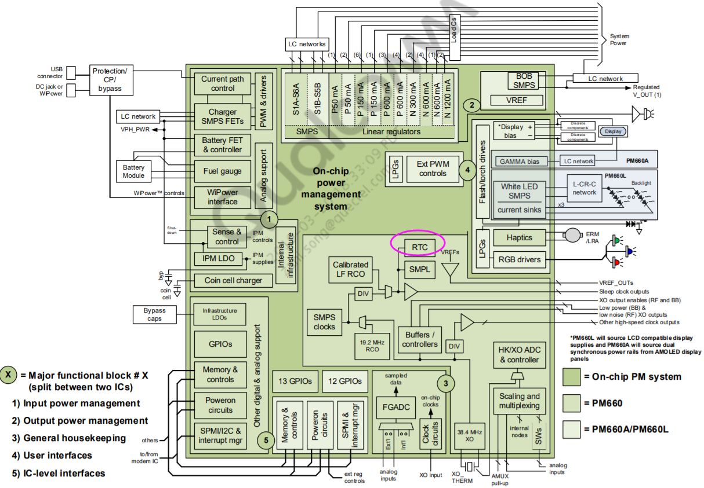
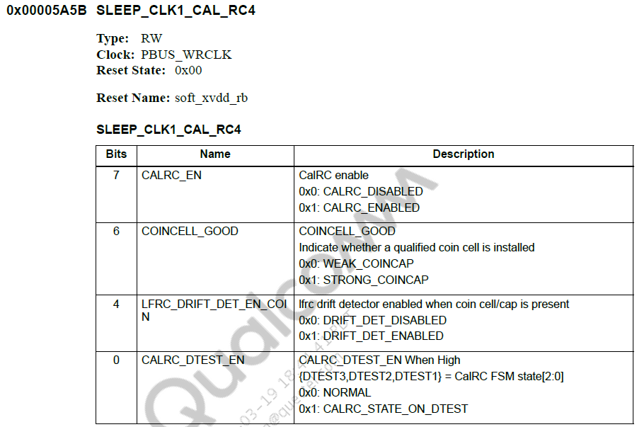

# 概要

读取高通寄存器.

rtc（real time clock)是实时时钟的缩写，设备在断电的情况下，rtc 芯片因为有电池的存在，可以继续
工作。

# 方法

例如读取rtc的寄存器,0x5a5b,0x5a58

* cd /sys/kernel/debug/regmap/spmi0-00

* echo 0xff > count

* echo 0x5A00 > address

* cat data

# 设备树代码

* kernel/msm-4.4/arch/arm/boot/dts/qcom/msm-pm660.dtsi


# kernel 代码位置

* kernel/msm-4.4/drivers/rtc/qpnp-rtc.c

# 硬件框架

* PMIC 框图,RTC 位于PMIC 芯片上



* 原理图,硬件原理图如下，其中J1108 是电池的位置


* 接模块图,外部只需要提供一个电源即可


# 验证rtc功能

设置--->系统—>DATA/time，把设备的自动更新时间关闭

设置完成后，断开系统电源，等待一定时间，重新上电，如果机器系统时间依然是系统默认的上电的时间，则证明rtc 功能无效

# rtc精准度

如果测试发现系统时间过快或者过慢，则需要修改下面的文件，以SC66 为例

* pm_config_target_sbl_sequence.c

将寄存器0x5A5B 的值由0x80 改为0xD0


# 0x5A5B寄存器

第6位: 是否安装了合格的纽扣电池；

第4位: 当存在纽扣电池/盖时，启用lfrc（low frequence RTC）漂移检测器；

修改前：0x80 == 1000 0000

修改后：0xD0 ==1101 0000



# log

RTC时钟分RTC硬件时间和RTC偏移时间


# 常见问题

* 无法保存RTC时间

由于客户装箱过程挤压到power按键，高通机制是按power 15s会导致RTC时间清零

RTC时间清零还有可能是RTC电池异常或者电压不足导致，经测试静电是不会导致RTC清零现象

* RTC偏移时间延迟更新

在手动设置时间之后和自动更新时间后,概率性延迟更新偏移时间,

导致重启后我们查看到时间显示有问题，是由于广播未及时更新，查看应用层是否去使用了time相关的广播。

手动更新广播：am broadcast -a android.intent.action.DATE_CHANGED -p com.qualcomm.timeservice

# 实测

* 原始状态,没有配置rtc,实测135.9 ua

```
{ 0,    0x80,   0x5A5B,     0xFF,   PM_SBL_WRITE,   0,  0}
```

* 配置rtc,0x5A58 配置 0x10,600多微安, 配置 0xC0, 140多微安,值越小精度越大

```
{ 0,    0xD0,   0x5A5B,     0xFF,   PM_SBL_WRITE,   0,  0},
{ 0,    0x10,   0x5A58,     0xFF,   PM_SBL_WRITE,   0,  0},
```