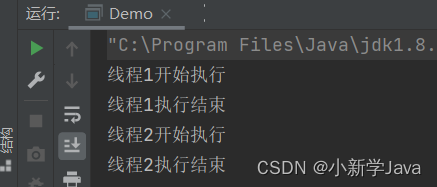
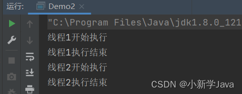
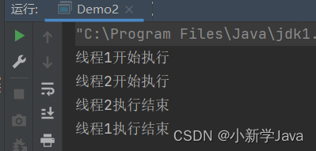

# java synchronized

synchronized 关键字，代表这个方法加锁,相当于不管哪一个线程（例如线程A），运行到这个方法时,都要检查有没有其它线程B（或者C、 D等）正在用这个方法(或者该类的其他同步方法)，有的话要等正在使用synchronized方法的线程B（或者C 、D）运行完这个方法后再运行此线程A,没有的话,锁定调用者,然后直接运行。它包括两种用法：synchronized 方法和 synchronized 块。

## synchronized 方法

* 同步代码块（对象锁）

    ```
    public class Demo implements Runnable{
    
        @Override
        public void run() {
            /**
            * 同步代码块形式--->锁为this，两个线程使用的锁是一样的，
            * 线程1必须要等到线程2释放了该锁后，才能执行
            */
            synchronized (this) {
                System.out.println(Thread.currentThread().getName() + "开始执行");
                try {
                    Thread.sleep(2000);
                } catch (InterruptedException e) {
                    e.printStackTrace();
                }
                System.out.println(Thread.currentThread().getName() + "执行结束");
            }
        }
    
        public static void main(String[] args) {
            Demo demo = new Demo();
            new Thread(demo,"线程1").start();
            new Thread(demo,"线程2").start();
        }
    }
    ```

    

    > 代码块中的synchronized(this)，指获取类Demo创建的实例对象demo中的内置锁（锁定当前代码块执行者），可以看到线程2必须要等到线程1释放了该锁后，才能执行。

* 同步方法（对象锁）

    * 同一对象实体

        ```

        public class Demo2 implements Runnable{
        
            @Override
            public void run() {
                method();
            }
        
            public synchronized void method(){
                System.out.println(Thread.currentThread().getName() + "开始执行");
                try {
                    Thread.sleep(2000);
                } catch (InterruptedException e) {
                    e.printStackTrace();
                }
                System.out.println(Thread.currentThread().getName() + "执行结束");
            }
        
            public static void main(String[] args) {
                Demo2 demo2 = new Demo2();
                new Thread(demo2,"线程1").start();
                new Thread(demo2,"线程2").start();
            }
        }
        ```

        

        > synchonized指定类demo2创建的实例对象demo2的内置锁（锁定当前方法调用者），可以看到线程2必须等到线程1释放了该锁后，才能执行。

    * new不同对象实体

        ```
        public class Demo2 implements Runnable{
        
            @Override
            public void run() {
                method();
            }
        
            /**
            * synchronized用在普通方法上，默认的所就是this，当前实例
            */
            public synchronized void method(){
                System.out.println(Thread.currentThread().getName() + "开始执行");
                try {
                    Thread.sleep(2000);
                } catch (InterruptedException e) {
                    e.printStackTrace();
                }
                System.out.println(Thread.currentThread().getName() + "执行结束");
            }
        
            public static void main(String[] args) {
                Demo2 t1 = new Demo2();
                Demo2 t2 = new Demo2();
                new Thread(t1,"线程1").start();
                new Thread(t2,"线程2").start();
            }
        }
        ```

        

        

        > 可以看到线程1和线程2的执行顺序不能保证，并且可能还有其他结果. 因为这两个线程获取的Demo2类的不同实例对象的不同内置锁。

* 静态方法 (类锁)

    ```
    public class Demo3 implements Runnable{
    
        @Override
        public void run() {
            method();
        }
    
        /**
        * synchronized用在静态方法上，默认锁的就是当前所在的Class类，
        * 所以无论是哪个线程访问它，需要的锁都只有一把
        */
        public static synchronized void method(){
            System.out.println(Thread.currentThread().getName() + "执行了");
            try {
                Thread.sleep(2000);
            } catch (InterruptedException e) {
                e.printStackTrace();
            }
            System.out.println(Thread.currentThread().getName() + "结束了");
        }
    
        public static void main(String[] args) {
            Demo3 t1 = new Demo3();
            Demo3 t2 = new Demo3();
            new Thread(t1,"线程1").start();
            new Thread(t2,"线程2").start();
    
        }
    }
    ```

    > 线程1执行了
    > 线程1结束了
    > 线程2执行了
    > 线程2结束了

    > 上面这个例子，虽然类Demo3有两个不同的实例，但结果总是线程1先执行，然后线程2再执行。这是因为静态方法获取的是Demo3的类锁，和实例无关。且类锁只有一个，所以实现了同步。

* 同步代码块（类锁）

    ```
    public class Demo implements Runnable{
    
        @Override
        public void run() {
            /**
            * 所有线程需要的锁都是同一把
            */
            synchronized (Demo.class) {
                System.out.println(Thread.currentThread().getName() + "开始执行");
                try {
                    Thread.sleep(1000);
                } catch (InterruptedException e) {
                    e.printStackTrace();
                }
                System.out.println(Thread.currentThread().getName() + "执行结束");
            }
        }
    
        public static void main(String[] args) {
            Demo t1 = new Demo();
            Demo t2 = new Demo();
            new Thread(t1,"线程1").start();
            new Thread(t2,"线程2").start();
        }
    }
    ```

    > 获取的是类Demo的类锁,与实例无关.要测试验证一下.

# 对象锁和类锁

java的内置锁：每个Java对象都可以用做一个实现同步的锁，这些锁称为内置锁。线程进入同步代码块或方法的时候会自动获得该锁，在退出同步代码块或方法时会释放该锁。获得内置锁的唯一途径就是进入这个锁的保护的同步代码块或方法。

java内置锁是一个互斥锁，这就是意味着最多只有一个线程能够获得该锁，当线程A尝试去获得线程B持有的内置锁时，线程A必须等待或者阻塞，直到线程B 释放这个锁，如果线程B不释放这个锁，那么线程A将永远等待下去。

Java的对象锁和类锁：Java的对象锁和类锁在锁的概念上基本上和内置锁是一致的，但是两个锁实际是有很大区别的，对象锁是用于对象实例方法，或者一个对象实例上的，类锁是用与类的静态方法或者一个类的class对象上的。我们知道，类的对象实例可以有很多个，但是每个类只有一个class对象，所以不同对象实例的对象锁是互不干扰的，但是每个类只有一个类锁。但是有一点必须注意的是，其实类锁只是一个概念上的东西，并不是真实存在的，它只是用来帮助我们理解锁定实例方法和静态方法的区别的。