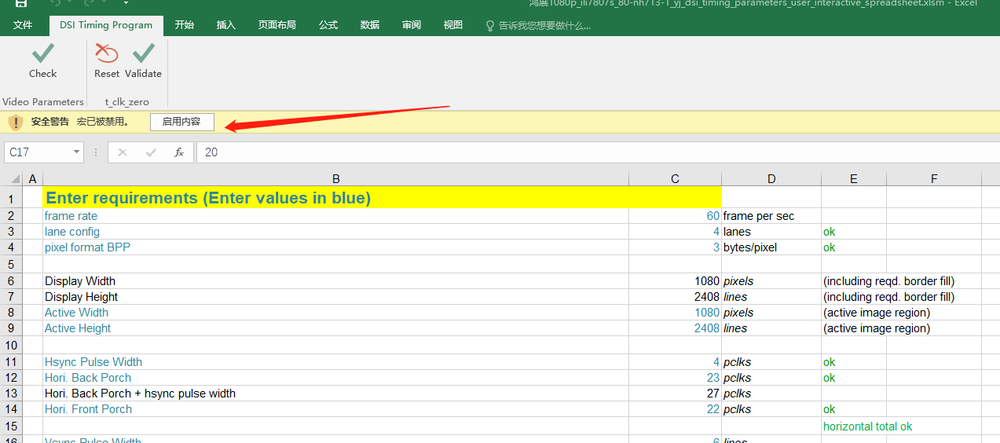
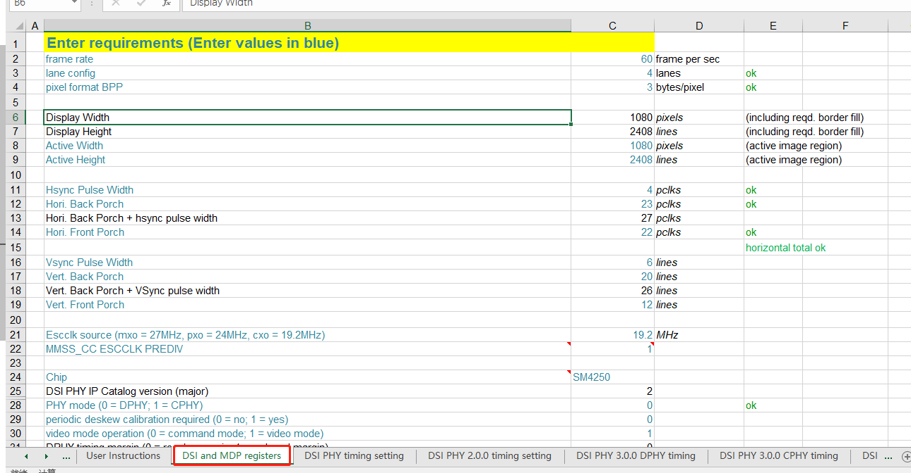
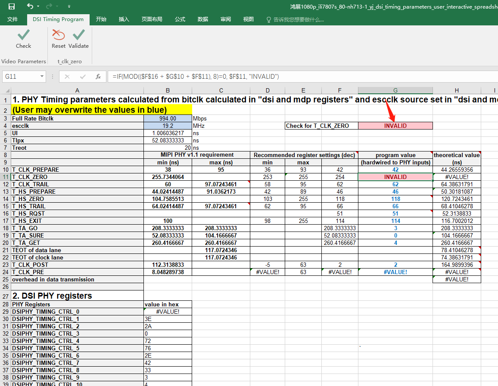
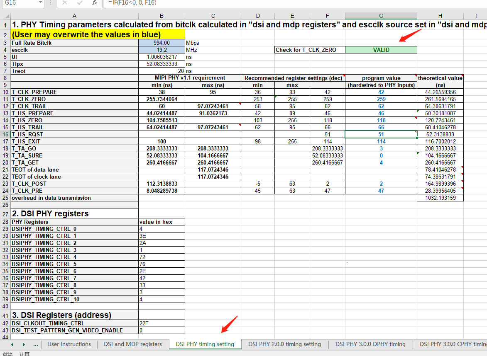
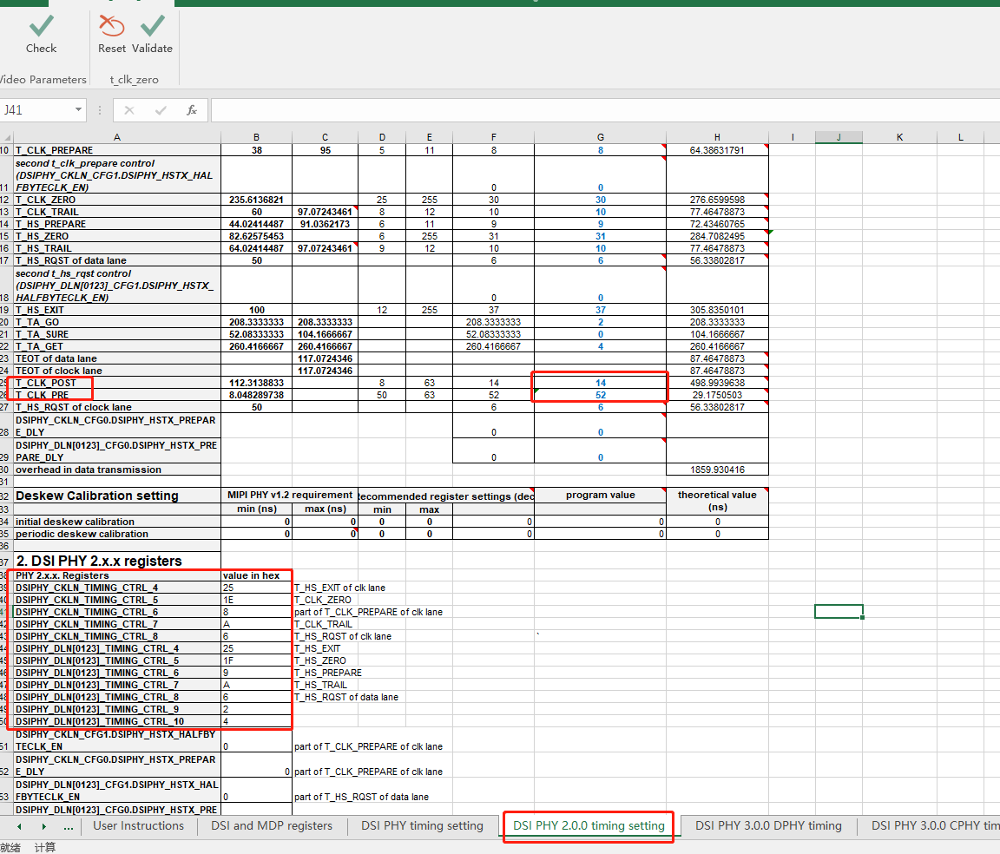
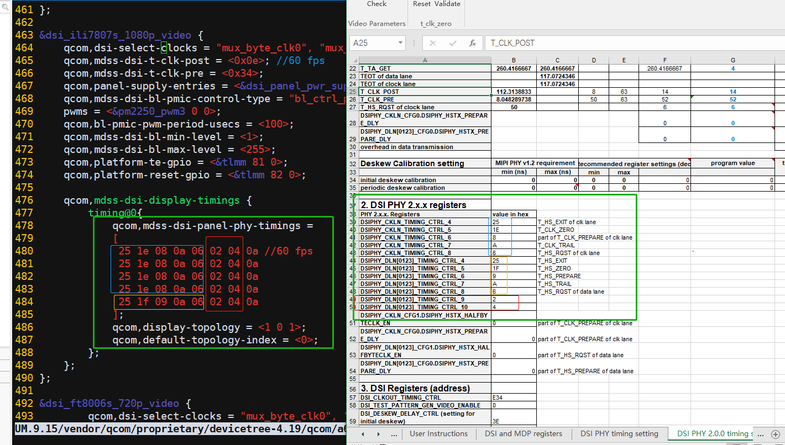

# README

高通平台,屏参数调试

# 备注

A6650 项目1080P excel表,对应以下提交,files/鸿展1080p_ili7807s_80-nh713-1_yj_dsi_timing_parameters_user_interactive_spreadsheet.xlsm

> 99d381c3194c581101aaccfd42a74cf44905ac5f
> [Title]: 修复A6650 1080p屏幕顶部右上角闪屏及灰阶闪屏问题
> [Summary]:
>   1.右上角闪，优化porch设置。
>   2.灰阶闪屏，屏蔽VCOM控制寄存器。
> [Test Plan]:
>   1.查看1080p屏幕顶部右上角闪屏。
>   2.Ftest测试查看灰阶图片是否有闪屏现象。

# 参考文档

files/Quectel_SC200E系列_显示驱动_开发指导_V1.1.0_Preliminary_20220928.pdf

# 屏调试方法

## xbl

* 对应文件,填入屏参数

    > A6650_Unpacking_Tool/BOOT.XF.4.1/boot_images/QcomPkg/Settings/Panel/Panel_ili7807s_1080p_video.xml

## kernel

* 对应dts 填入参数

    > UM.9.15/vendor/qcom/proprietary/devicetree-4.19/qcom/a6650/a6650-scuba-iot-idp-overlay_V01_V01.dts
    > &dsi_ili7807s_1080p_video

    > UM.9.15/vendor/qcom/proprietary/devicetree-4.19/qcom/a6650/dsi-panel-ili7807s-1080p-video.dtsi
    > dsi_ili7807s_1080p_video: qcom,mdss_dsi_ili7807S_1080p_video_dpi_480

### excel表格,制作lcd 时序

* 启动excel表的宏编辑功能

    

* 打开 DSI and MDP registers 页,填好屏幕参数,跟fae确认填写

    

* 打开 DSI PHY timing setting页面,查看 DSI 相关时钟频率

    * 先按 Ctrl+J 清除旧数据,显示INVALID

        

    * 再按 Ctrl+K 生成新数据,显示VALID

        

* 打开 DSI PHY 2.0.0 timing setting 页面,查看计算出的DSI 时序值，示例如下

    

    * UM.9.15/vendor/qcom/proprietary/devicetree-4.19/qcom/a6650/a6650-scuba-iot-idp-overlay_V01_V01.dts

        > 把对应屏的&dsi_ili7807s_1080p_video qcom,mdss-dsi-t-clk-post,qcom,mdss-dsi-t-clk-pre,修改一下
        > excel是10进制, dts是16进制

    

    * 把 dts的 qcom,mdss-dsi-display-timings,按照如下图对应起来

        * excel表格 红色,对应dts 红色两列

        * exccel表格,黄色,对应dts黄色一行

        * excel表格,蓝色,对应dts 蓝色四行

        

