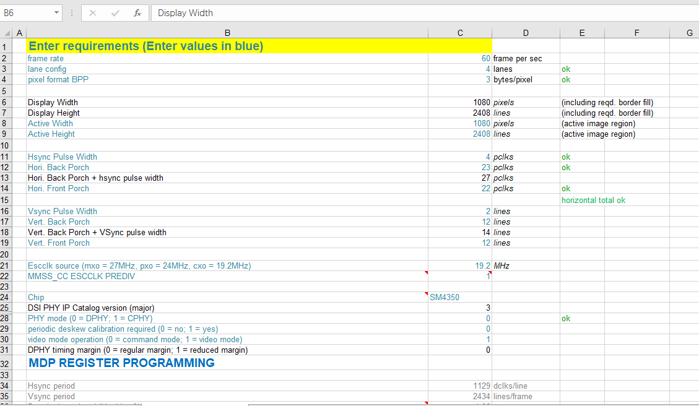
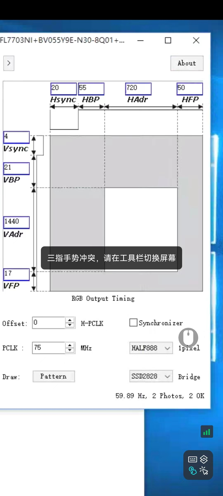

# 概要

项目开始之初,需要屏幕mipi clk

原因是mipi clk 大于200MHz在攻击技能上分值会高，实验室需要考虑阻抗匹配，接入的bug不是普通bug

这样在方案设计初期，可以更准确的设计

# mipi clk计算方式

mipi 屏的传输时钟频率 CLKN,CLKP = (屏幕分辨率width+hsync+hfp+hbp)*(屏幕分辨率高height+vsync+vfp+vbp)* 帧率 * rgb显示数据宽度 / lane_num / 2

主要参数是,屏幕分辨率,横向竖向脉冲宽度,屏幕横竖前后肩参数

# 举例

width = 1080

hsync = Hsync Pulse Width = 4

hfp = Horizontal Front Porch = 22

hbp = Horizontal Back Porch = 23

height = 2408

vsync = Vertical Pulse Width = 2

vfp = Vertical Front Porch = 12

vbp = Vertical Back Porch = 12

frame rate = 帧率 = 60

rgb显示数据宽度 = pixel format BPP = 3byte * 8bit = 24

lane_num = lane config = 4

* clkN,clkP = (1080+4+23+22) * (2408+2+12+12) * 60 * 24 / 4 / 2 = 1129 * 2434 * 60 * 24 / 4 / 2 = 494,637,480 / 1000,000 = 494 Mhz

# 720x1440-5.5英寸-A920 Pro白色液晶显示模块-KTD-HBP55794BTTW-V0-不带摄像头孔-BOE+FL7703I+CF1133-科莱

* width = 720

* hsync = 20

* hbp = 55

* hfp = 50

* height = 1440

* vsync = 4

* vbp = 21

* vfp = 17

* rgb  = HALF888 = 24bit

* clk = (720+20+55+50)*(1440+4+21+17)*60*24/4/2 = 845 * 1482 * 60 * 24 / 4 / 2 = 225.4122Mhz