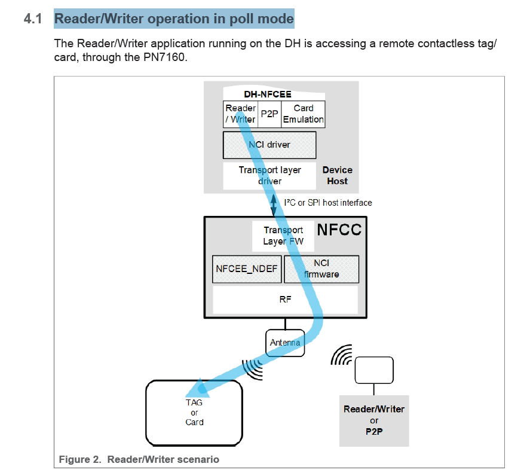
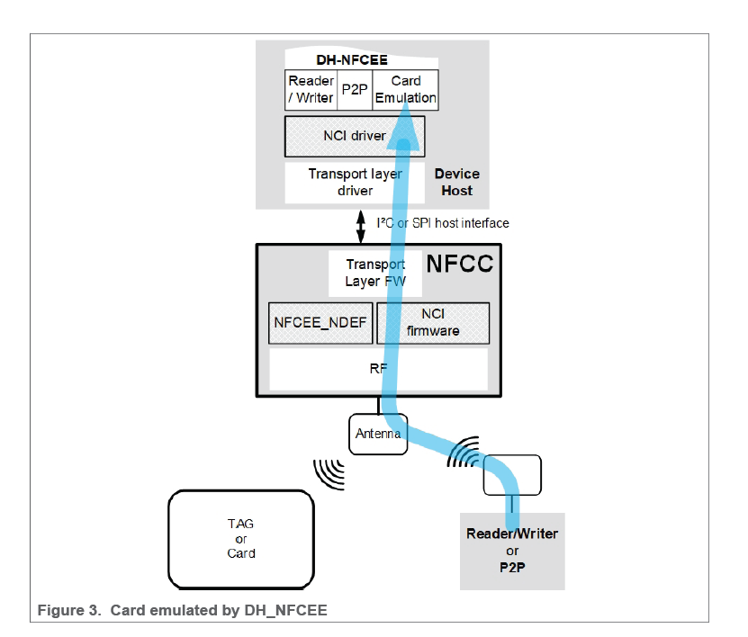
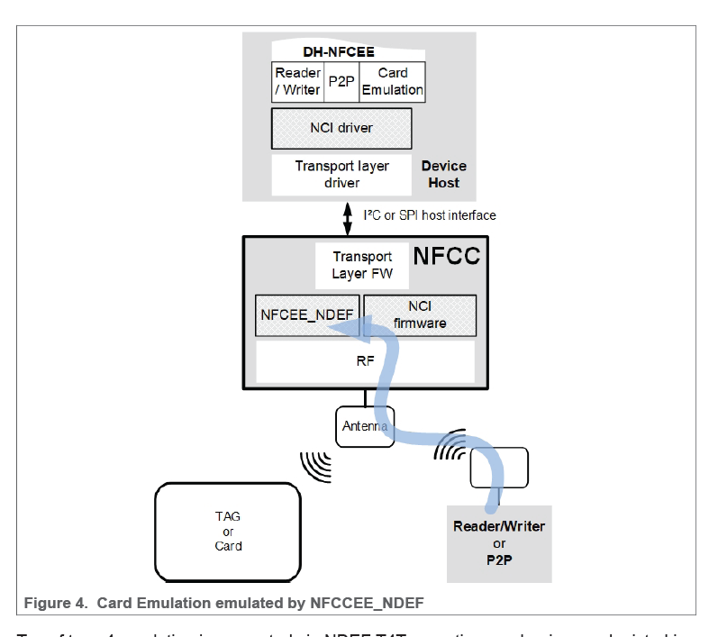
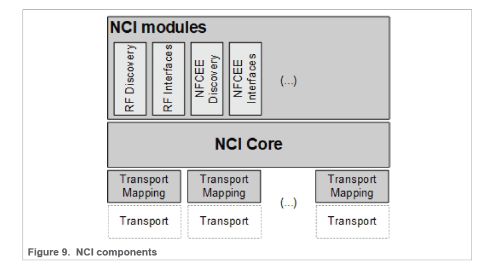

# README

由于pn557 快停产,所以切换到pn7160, android 12平台

所以要重新搞一次portting

# nfc 流程截图


# nfc术语

## DPC = dynamic power control

Therefore a process is needed to control the output power and the driver current, and to
adapt it to the loading and detuning, if needed. This process is automatically done with
the dynamic power control (DPC).

## DWL_REQ = DoWnLoad REQuest pin

当dwl_req 拉高,并且 reset脚从低到高,芯片进入 download模式

When the DWL_REQ pin is set to the digital high level (this pin is referenced to
VDD(PAD) power level) at reset (VEN transition from digital low to digital high), the chip
will boot in download mode.

In this case, the download protocol described in the PN7160 User Manual can be used to
load a new firmware image into the chip.

This firmware upgrade feature is fully supported by the NXP HAL middleware stack
(Android and Linux) provided that the DWL_REQ (DL_REQ) pin is connected a GPIO pin
of the host controller.

## NFC = Near Field Communication

## NFCC = Near Field Communication Controller

## VEN = V ENable pin (PN7160 Hard reset control)

## WKUP_REQ = Wake-up request

A6650 项目,没有接nfc wake up 脚

When the PN7160 goes in standby mode, there is 3 possibilities to wake it up:

* PN7160 detects an external RF field

* Host controller sends a command (via host interface) to PN7160

* Host drives WKUP_REQ pin to high level

## DH = Device Host

## DH-NFCEE = NFC Execution Environment running on the DH

## HCI = Host Controller Interface

## HCP = Host Controller Protocol

## HDLL = Host Data Link Layer

## LPCD =  Low Power Card Detector

## NCI = NFC Controller Interface

## NFCEE = NFC Execution Environment

## RF = Radio Frequency

## RFU = Reserved For Future Use

## Peer to Peer = P2P

## VDD(TX)

天线输出能力,由VDD(up)控制 VDD(TX) 2.7v-5.25v

The voltage level on TX output buffer is coming from VDD(TX) and this pin is powered
internally by the PN7160 thanks to the TXLDO block. The output voltage of this TXLDO
can be set between 2.7 V to 5.25 V depending on the VDD(UP) voltage.

## “NFCEE_NDEF” is an NFCC embedded NDEF tag emulation, configured by the DH.


# Power-up sequences,上电时序

PN7160_PN7161.pdf,第29页, Ven脚,在power脚拉高后,再拉高

# Power-down sequences

During power-down sequence, VEN shall always be set low before VDD(PAD) is shut down.

# Reader/Writer operation in poll mode



# 卡模拟

## Card Emulated by the DH-NFCEE



## Card Emulation over NFCC



# NCI

## 模型



# porting

## 按照文档porting

## pn7160 没有se,删除掉QSSI.12/frameworks/base/core/java/android/se/omapi/ 文件夹后,编译报错,看起来是api不匹配

```
android-non-updatable.api.public.latest/gen/android-non-updatable.api.public.latest:37114: error: Removed package android.se.omapi [RemovedPackage]

******************************
You have tried to change the API from what has been previously released in
an SDK.  Please fix the errors listed above.
******************************
exit status 255
```

* 把相关prebuild目录下的 android.se.omapi 删掉

## 删除android.se.omapi后,很多 packages/apps/Nfc/的类找不到

```
packages/apps/Nfc/src/com/android/nfc/NfcService.java:99: error: package android.se.omapi does not exist
import android.se.omapi.ISecureElementService;
                       ^
packages/apps/Nfc/src/com/android/nfc/NfcService.java:113: error: cannot find symbol
import com.android.nfc.cardemulation.AidRoutingManager;
                                    ^
  symbol:   class AidRoutingManager
  location: package com.android.nfc.cardemulation
packages/apps/Nfc/src/com/android/nfc/NfcService.java:114: error: cannot find symbol
import com.android.nfc.cardemulation.CardEmulationManager;
                                    ^
  symbol:   class CardEmulationManager
  location: package com.android.nfc.cardemulation
packages/apps/Nfc/src/com/android/nfc/NfcService.java:115: error: cannot find symbol
import com.android.nfc.cardemulation.RegisteredAidCache;
                                    ^
  symbol:   class RegisteredAidCache
  location: package com.android.nfc.cardemulation
packages/apps/Nfc/src/com/android/nfc/NfcService.java:122: error: package com.android.nfc.dhimpl does not exist
import com.android.nfc.dhimpl.NativeNfcManager;
                             ^
packages/apps/Nfc/src/com/android/nfc/NfcService.java:123: error: package com.android.nfc.dhimpl does not exist
import com.android.nfc.dhimpl.NativeNfcSecureElement;
                             ^
packages/apps/Nfc/src/com/android/nfc/NfcService.java:124: error: package com.android.nfc.handover does not exist
import com.android.nfc.handover.HandoverDataParser;
                               ^
packages/apps/Nfc/src/com/android/nfc/NfcService.java:126: error: cannot find symbol
import com.nxp.nfc.INxpNfcAdapterExtras;
                  ^
  symbol:   class INxpNfcAdapterExtras
  location: package com.nxp.nfc
packages/apps/Nfc/src/com/android/nfc/NfcService.java:127: error: cannot find symbol
import com.nxp.nfc.INxpWlcAdapter;
                  ^
  symbol:   class INxpWlcAdapter
  location: package com.nxp.nfc
packages/apps/Nfc/src/com/android/nfc/NfcService.java:128: error: cannot find symbol
import com.nxp.nfc.INxpWlcCallBack;
                  ^
  symbol:   class INxpWlcCallBack
  location: package com.nxp.nfc
packages/apps/Nfc/src/com/android/nfc/NfcService.java:2009: error: cannot find symbol
        public INxpNfcAdapterExtras getNxpNfcAdapterExtrasInterface() throws RemoteException {
               ^
  symbol:   class INxpNfcAdapterExtras
  location: class NfcService.NxpNfcAdapterService
packages/apps/Nfc/src/com/android/nfc/NfcService.java:419: error: cannot find symbol
    public NativeNfcSecureElement mSecureElement;
           ^
  symbol:   class NativeNfcSecureElement
  location: class NfcService
packages/apps/Nfc/src/com/android/nfc/NfcService.java:422: error: cannot find symbol
    private HashMap<Integer, ReaderModeDeathRecipient> mPollingDisableDeathRecipients =
                             ^
  symbol:   class ReaderModeDeathRecipient
  location: class NfcService
packages/apps/Nfc/src/com/android/nfc/NfcService.java:424: error: cannot find symbol
    private final ReaderModeDeathRecipient mReaderModeDeathRecipient =
                  ^
  symbol:   class ReaderModeDeathRecipient
  location: class NfcService
packages/apps/Nfc/src/com/android/nfc/NfcService.java:426: error: cannot find symbol
    private final NfcUnlockManager mNfcUnlockManager;
                  ^
  symbol:   class NfcUnlockManager
  location: class NfcService
packages/apps/Nfc/src/com/android/nfc/NfcService.java:472: error: cannot find symbol
    ToastHandler mToastHandler;
    ^
  symbol:   class ToastHandler
  location: class NfcService
packages/apps/Nfc/src/com/android/nfc/NfcService.java:494: error: cannot find symbol
    P2pLinkManager mP2pLinkManager;
    ^
  symbol:   class P2pLinkManager
  location: class NfcService
packages/apps/Nfc/src/com/android/nfc/NfcService.java:495: error: cannot find symbol
    TagService mNfcTagService;
    ^
  symbol:   class TagService
  location: class NfcService
packages/apps/Nfc/src/com/android/nfc/NfcService.java:499: error: cannot find symbol
    NfcDtaService mNfcDtaService;
    ^
  symbol:   class NfcDtaService
  location: class NfcService
packages/apps/Nfc/src/com/android/nfc/NfcService.java:500: error: cannot find symbol
    NxpNfcAdapterExtrasService mNxpExtrasService;
    ^
  symbol:   class NxpNfcAdapterExtrasService
  location: class NfcService
packages/apps/Nfc/src/com/android/nfc/NfcService.java:502: error: cannot find symbol
    NxpWlcAdapterService mNxpWlcAdapter;
    ^
  symbol:   class NxpWlcAdapterService
  location: class NfcService
packages/apps/Nfc/src/com/android/nfc/NfcDispatcher.java:24: error: package com.android.nfc.RegisteredComponentCache does not exist
import com.android.nfc.RegisteredComponentCache.ComponentInfo;
                                               ^
packages/apps/Nfc/src/com/android/nfc/NfcDispatcher.java:25: error: package com.android.nfc.handover does not exist
import com.android.nfc.handover.HandoverDataParser;
                               ^
packages/apps/Nfc/src/com/android/nfc/NfcDispatcher.java:26: error: package com.android.nfc.handover does not exist
import com.android.nfc.handover.PeripheralHandoverService;
                               ^
packages/apps/Nfc/src/com/android/nfc/NfcService.java:518: error: cannot find symbol
    private HandoverDataParser mHandoverDataParser;
            ^
  symbol:   class HandoverDataParser
  location: class NfcService
packages/apps/Nfc/src/com/android/nfc/NfcService.java:520: error: cannot find symbol
    private CardEmulationManager mCardEmulationManager;
            ^
  symbol:   class CardEmulationManager
  location: class NfcService
packages/apps/Nfc/src/com/android/nfc/NfcService.java:521: error: cannot find symbol
    private AidRoutingManager mAidRoutingManager;
            ^
  symbol:   class AidRoutingManager
  location: class NfcService
packages/apps/Nfc/src/com/android/nfc/NfcService.java:522: error: cannot find symbol
    private RegisteredAidCache mAidCache;
            ^
  symbol:   class RegisteredAidCache
  location: class NfcService
packages/apps/Nfc/src/com/android/nfc/NfcService.java:525: error: cannot find symbol
    private ISecureElementService mSEService;
            ^
  symbol:   class ISecureElementService
  location: class NfcService
packages/apps/Nfc/src/com/android/nfc/NfcService.java:527: error: cannot find symbol
    private ScreenStateHelper mScreenStateHelper;
            ^
  symbol:   class ScreenStateHelper
  location: class NfcService
packages/apps/Nfc/src/com/android/nfc/NfcService.java:560: error: cannot find symbol
    private WlcServiceProxy mWlc = null;
```

* 把相关android.se.omapi 调用删掉

## 报AidRoutingManager找不到

```
EAIIED::out/soong/.intermediates/packages/apps/Nfc/NfcNci/android common/javac/NfcNci.jarIm-rf·"out/soong/.intermediates/packages/apps /Mfc/MfcNci/android cmmo/iavac/classes" "out/song/ intermediates/packages/apps/Mfo/fpackages/apps/Nfc/src/com/android/nfc/NfcService,java:112:error::cannot·find·symbolimport·com.android.nfc.cardemulation.AidRoutingManager;
.swmbol:...class .AidRoutinaManager.location:.package·com.android.nfc.cardemulationpackages/apps/Nfc/src/com/android/nfc/NfcService.java:113::error::cannot find·symbol
import·com.android.nfc.cardemulation.CardEmulationManager;
·symbol:..:class.CardEmulationManagerlocation:.package·com.android.nfc.cardemulationpackages/apps/Nfc/src/com/android/nfc/NfcService,ava:114::error::cannot findsymbol
```

原因是,后面报错很多重复定义.所以看报错,不能只看第一个

* 原因是,直接在最新的package/apps/Nfc 上nxp的patch,会导致很多重复定义,需要先把package/apps/Nfc 还原到android 12.0.0_r9代码,再上nxp patch

## 删除se后,报UM相关的 hardware/nxp/nfc报错

* 因为高通平台UM这边是 android 11,所以有些问题,直接把 QSSI的 hardware/nxp/nfc 覆盖 UM/hardware/nxp/nfc

## vendor/nxp/nxpnfc/1.0/INxpNfc.h,out没有生成

```
FAILED: out/soong/.intermediates/hardware/nxp/nfc/pn8x/android.hardware.nfc@1.2-service/android_vendor.30_arm64_armv8-a/obj/hardware/nxp/nfc/pn8x/extns/impl/NxpNfc.o
In file included from hardware/nxp/nfc/pn8x/extns/impl/NxpNfc.cpp:21:
hardware/nxp/nfc/pn8x/extns/impl/NxpNfc.h:24:10: fatal error: 'vendor/nxp/nxpnfc/1.0/INxpNfc.h' file not found
#include <vendor/nxp/nxpnfc/1.0/INxpNfc.h>
         ^~~~~~~~~~~~~~~~~~~~~~~~~~~~~~~~~
1 error generated.
[  4% 1559/34435] //hardware/nxp/nfc/pn8x:android.hardware.nfc@1.2-service clang++ 1.2/NxpNfcService.cpp
```

* 解决方法,shared_libs: 要添加 hidl的调用vendor.nxp.nxpnfc@1.0

```
cc_binary {
    name: "android.hardware.nfc@1.2-service",
    init_rc: ["1.2/android.hardware.nfc@1.2-service.rc"],
    defaults: ["nxp_nfc_defaults"],
    srcs: [
        "1.2/NxpNfcService.cpp",
        "1.2/Nfc.cpp",
    ],
}

cc_defaults {
    name: "nxp_nfc_defaults",
    relative_install_path: "hw",
    proprietary: true,
    defaults: ["hidl_defaults"],
    srcs: [
        "extns/impl/NxpNfc.cpp",
    ],

    shared_libs: [
        "nfc_nci_nxp",
        "libbase",
        "libcutils",
        "libhardware",
        "liblog",
        "libutils",
        "android.hardware.nfc@1.0",
        "android.hardware.nfc@1.1",
        "android.hardware.nfc@1.2",
        "libhidlbase",
        "vendor.nxp.nxpnfc@1.0",
    ],
}
```

## 还有很多跟删除se相关报错的

* 把相关的全部删除掉

## API-LINT 报错Unexpected reference to android.Manifest.permission.NFC_SET_CONTROLLER_ALWAYS_ON

```
frameworks/base/media/java/android/media/AudioTrack.java:3520: warning: SAM-compatible parameters (such as parameter 1, "listener", in android.media.AudioTrack.addOnRoutingChangedListener) should be last to improve Kotlin interoperability; see https://kotlinlang.org/docs/reference/java-interop.html#sam-conversions [SamShouldBeLast]
frameworks/base/core/java/android/nfc/NfcAdapter.java:2295: error: Unexpected reference to android.Manifest.permission.NFC_SET_CONTROLLER_ALWAYS_ON [InternalError]
frameworks/base/core/java/android/nfc/NfcAdapter.java:2323: error: Unexpected reference to android.Manifest.permission.NFC_SET_CONTROLLER_ALWAYS_ON [InternalError]
frameworks/base/core/java/android/nfc/NfcAdapter.java:2264: error: Unexpected reference to android.Manifest.permission.NFC_SET_CONTROLLER_ALWAYS_ON [InternalError]
frameworks/base/core/java/android/nfc/NfcAdapter.java:2356: error: Unexpected reference to android.Manifest.permission.NFC_SET_CONTROLLER_ALWAYS_ON [InternalError]
frameworks/base/core/java/android/nfc/NfcAdapter.java:2375: error: Unexpected reference to android.Manifest.permission.NFC_SET_CONTROLLER_ALWAYS_ON [InternalError]
1 new API lint issues were found.
See tools/metalava/API-LINT.md for how to handle these.
```

* 原因

[nfc7160][001]replace frameworks/base/core/java/android/nfc with android-12.0.0-r9

这个patch是framework,属于QSSI这边的,不用打到UM

## 开机nfc apk 报crash

```
03-27 08:58:15.705  3734  3734 E AndroidRuntime: FATAL EXCEPTION: main
03-27 08:58:15.705  3734  3734 E AndroidRuntime: Process: com.android.nfc, PID: 3734
03-27 08:58:15.705  3734  3734 E AndroidRuntime: java.lang.NoClassDefFoundError: Failed resolution of: Lcom/android/nfc/NfcService$NxpNfcAdapterService;
03-27 08:58:15.705  3734  3734 E AndroidRuntime: 	at com.android.nfc.NfcService.<init>(NfcService.java:480)
03-27 08:58:15.705  3734  3734 E AndroidRuntime: 	at com.android.nfc.NfcApplication.onCreate(NfcApplication.java:66)
03-27 08:58:15.705  3734  3734 E AndroidRuntime: 	at android.app.Instrumentation.callApplicationOnCreate(Instrumentation.java:1212)
03-27 08:58:15.705  3734  3734 E AndroidRuntime: 	at android.app.ActivityThread.handleBindApplication(ActivityThread.java:6744)
03-27 08:58:15.705  3734  3734 E AndroidRuntime: 	at android.app.ActivityThread.access$1500(ActivityThread.java:248)
03-27 08:58:15.705  3734  3734 E AndroidRuntime: 	at android.app.ActivityThread$H.handleMessage(ActivityThread.java:2054)
03-27 08:58:15.705  3734  3734 E AndroidRuntime: 	at android.os.Handler.dispatchMessage(Handler.java:106)
03-27 08:58:15.705  3734  3734 E AndroidRuntime: 	at android.os.Looper.loopOnce(Looper.java:201)
03-27 08:58:15.705  3734  3734 E AndroidRuntime: 	at android.os.Looper.loop(Looper.java:288)
03-27 08:58:15.705  3734  3734 E AndroidRuntime: 	at android.app.ActivityThread.main(ActivityThread.java:7880)
03-27 08:58:15.705  3734  3734 E AndroidRuntime: 	at java.lang.reflect.Method.invoke(Native Method)
03-27 08:58:15.705  3734  3734 E AndroidRuntime: 	at com.android.internal.os.RuntimeInit$MethodAndArgsCaller.run(RuntimeInit.java:548)
03-27 08:58:15.705  3734  3734 E AndroidRuntime: 	at com.android.internal.os.ZygoteInit.main(ZygoteInit.java:1009)
03-27 08:58:15.705  3734  3734 E AndroidRuntime: Caused by: java.lang.ClassNotFoundException: com.android.nfc.NfcService$NxpNfcAdapterService
```

* 报init error,就是内部类,继承的INxpNfcAdapter.Stub 没有找到实现,原因应该是 com.nxp.nfc 没有编译进去

```
//#######################################
// com.nxp.nfc - library
//#######################################
java_library {

    name: "com.nxp.nfc",
    installable: true,
    required: ["com.nxp.nfc.xml"],

    srcs: [
        "com/**/I*.aidl",
        "com/**/*.java",
    ],  

}
```

# nfc 7160 porting总结

* 驱动调试,基于iic pn7160

    * 电源,VSYS->pn7160,VBAT,VDD(UP), LDO15A_1V8 -> VDD(PAD),

    * 时钟 ,采用了外部27M晶振

    * IIC,SDA,SCL

    * reset脚,VEN

    * IRQ,

    * DWL_REQ固件升级脚,功能可以不用

    * wkup_req,唤醒脚,没有连接

* 基于android-12.0.0-r9替换,frameworks/base/core/java/android/nfc,并且合入AROOT_frameworks_base.patch

* 删除packages/apps/SecureElement/,frameworks/base/core/java/android/se,pn7160 不支持se

* 基于android-12.0.0-r9替换,system/nfc,合入AROOT_system_nfc.patch

* 基于android-12.0.0-r9替换,packages/apps/Nfc/,合入AROOT_packages_apps_Nfc.patch,删除NfcService.java 调用se相关的接口

* 合入AROOT_hardware_nxp_nfc.patch,去掉se相关,UM也使用QSSI 的hardware/nxp/nfc代码

* 添加写入配置文件NFC_PARA_1参数到nfc功能

* 合入nxp nfc pn7160 AROOT_system_core.patch

* 删除因为删除se导致的api编译报错,

```
M       QSSI.12/frameworks/base/api/system-current.txt
M       QSSI.12/frameworks/base/core/api/current.txt
M       QSSI.12/frameworks/base/core/api/system-current.txt
M       QSSI.12/prebuilts/sdk/31/public/api/android-non-updatable.txt
M       QSSI.12/prebuilts/sdk/31/public/api/android.txt
M       QSSI.12/prebuilts/sdk/31/system/api/android-non-updatable.txt
M       QSSI.12/prebuilts/sdk/31/system/api/android.txt
M       UM.9.15/frameworks/base/api/current.txt
M       UM.9.15/frameworks/base/api/system-current.txt
M       UM.9.15/frameworks/base/non-updatable-api/current.txt
M       UM.9.15/frameworks/base/non-updatable-api/system-current.txt
M       UM.9.15/prebuilts/sdk/30/public/api/android-non-updatable.txt
M       UM.9.15/prebuilts/sdk/30/public/api/android.txt
M       UM.9.15/prebuilts/sdk/30/system/api/android-non-updatable.txt
M       UM.9.15/prebuilts/sdk/30/system/api/android.txt
```

* 合入nfc pn7160 关于vendor/nxp的修改,合入AROOT_vendor_nxp.patch,根据项目配置pn7160 libnfc-nxp.conf

* 修改pn7160 nfc的系统配置,关闭原有nfc TARGET_USES_NQ_NFC := false,添加nfc的hidl兼容性接口,合入AROOT_build_make.patch,合入AROOT_hardware_interfaces.patch

