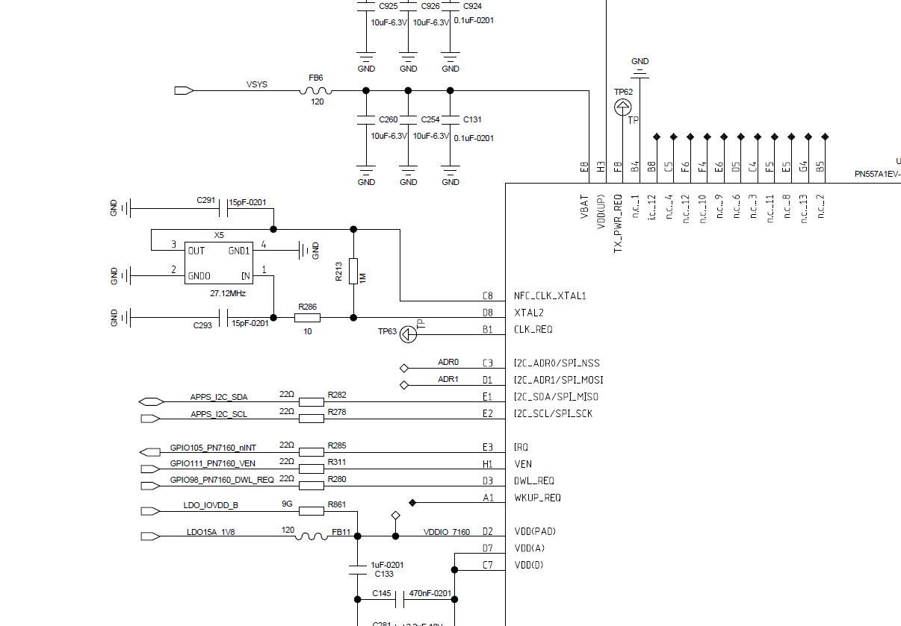

# TITLE

NFC PN7160(没有se),驱动初始化,分析

# 硬件

列出软件配置部分,电源,中断,reset脚等



# probe

## 查看dtb,设置nfc_active,ven脚,power脚等等

这里nfc驱动流程有问题,原有流程是先设置nfc_active,再上电power.

应该是要上power,再设置设置nfc_active, 不过项目没有单独控制nfc的电源脚,直接用vsys供电,所以bug没有体现出来

后续优化一下

```
&qupv3_se0_i2c {
	status = "okay";
        /*NFC*/
	pn7160: pn7160@28 {
	    status = "okay";
		compatible = "nxp,pn7160";
		reg = <0x28>;
	
		nxp,pn7160-irq = <&tlmm 105 0>;
		nxp,pn7160-ven = <&tlmm 111 0>;
		nxp,pn7160-fw-dwnld = <&tlmm 98 0>;
		
		interrupt-parent = <&tlmm>;
		interrupts = <105 0>;
		interrupt-names = "nfc_irq";
		pinctrl-names = "nfc_active", "nfc_suspend";
		pinctrl-0 = <&pax_nfc_int_active &pax_nfc_enable_active &nfc_power_default>;/*&nfc_power_default*/
		pinctrl-1 = <&pax_nfc_int_suspend &pax_nfc_enable_suspend>;	
		nxp,pn7160-power = <&pm2250_gpios 3 GPIO_ACTIVE_HIGH>;
		
	};
};
```

```
set_state = pinctrl_lookup_state(pinctrl,"nfc_active");
ret = pinctrl_select_state(pinctrl,set_state);
```

```
set_state = pinctrl_lookup_state(pinctrl,"nfc_active");
		if (IS_ERR_OR_NULL(set_state)) {
			pr_err("nfc pinctrl lookup failed for default state\n");
			return -EINVAL;
		}
		ret = pinctrl_select_state(pinctrl,set_state);
		if (ret){
			pr_err("%s:nfc Error selecting active state\n");
		}
		else{
			pr_info("OK selecting active state\n");
		}
	}
	
	/* irq required for i2c based chips only */
	if (interface == PLATFORM_IF_I2C || interface == PLATFORM_IF_SPI) {
		nfc_gpio->irq = of_get_named_gpio(np, DTS_IRQ_GPIO_STR, 0);
		if ((!gpio_is_valid(nfc_gpio->irq))) {
			pr_err("%s: irq gpio invalid %d\n", __func__,
			       nfc_gpio->irq);
			return -EINVAL;
		}
		pr_info("%s: irq %d\n", __func__, nfc_gpio->irq);
	}
	nfc_gpio->ven = of_get_named_gpio(np, DTS_VEN_GPIO_STR, 0);
	if ((!gpio_is_valid(nfc_gpio->ven))) {
		pr_err("%s: ven gpio invalid %d\n", __func__, nfc_gpio->ven);
		return -EINVAL;
	}
	/* some products like sn220 does not required fw dwl pin */
	nfc_gpio->dwl_req = of_get_named_gpio(np, DTS_FWDN_GPIO_STR, 0);
	if ((!gpio_is_valid(nfc_gpio->dwl_req)))
		pr_warn("%s: dwl_req gpio invalid %d\n", __func__,nfc_gpio->dwl_req);


	nfc_power_gpio = of_get_named_gpio(np, "nxp,pn7160-power", 0);
	if ((!gpio_is_valid(nfc_power_gpio))) {
		pr_err("%s: ven gpio invalid %d\n", __func__, nfc_power_gpio);
		return -EINVAL;
	}

	ret = gpio_request(nfc_power_gpio, "nfc_power");
	pr_info("gpio_request nfc_power_gpio ret:%d \n",ret);

	ret = gpio_direction_output(nfc_power_gpio, 1);
	pr_info("gpio_direction_output nfc_power_gpio ret:%d \n",ret);

```

## 创建nfc设备等

```
/* Max device count for this driver */
#define DEV_COUNT			1

/* NFC character device name, this will be in /dev/ */
#define NFC_CHAR_DEV_NAME		"nxpnfc"

/* i2c device class */
#define CLASS_NAME			"nfc"

	ret = nfc_misc_register(nfc_dev, &nfc_i2c_dev_fops, DEV_COUNT,
				NFC_CHAR_DEV_NAME, CLASS_NAME);
```

```
int nfc_misc_register(struct nfc_dev *nfc_dev,
		      const struct file_operations *nfc_fops, int count,
		      char *devname, char *classname)
{
    ret = alloc_chrdev_region(&nfc_dev->devno, 0, count, devname);
    nfc_dev->nfc_class = class_create(THIS_MODULE, classname);
    cdev_init(&nfc_dev->c_dev, nfc_fops);
    ret = cdev_add(&nfc_dev->c_dev, nfc_dev->devno, count);
        nfc_dev->nfc_device = device_create(nfc_dev->nfc_class, NULL,nfc_dev->devno, nfc_dev, devname);
}
```

```
A6650:/ # ls -l /sys/class/nfc/nxpnfc/
total 0
-r--r--r-- 1 root root 4096 2023-03-30 20:00 dev
drwxr-xr-x 2 root root    0 2023-03-30 20:00 power
lrwxrwxrwx 1 root root    0 2023-03-30 20:00 subsystem -> ../../../../class/nfc
-rw-r--r-- 1 root root 4096 2023-03-30 20:00 uevent
A6650:/ # ls -l /dev/nxpnfc
crw-rw---- 1 nfc nfc 505,   0 1970-01-02 01:01 /dev/nxpnfc
A6650:/ #
```

# 注册irq,设置reset

```
	/* interrupt initializations */
	pr_info("%s: requesting IRQ %d\n", __func__, client->irq);
	i2c_dev->irq_enabled = true;
	ret = request_irq(client->irq, i2c_irq_handler, IRQF_TRIGGER_HIGH,
			  client->name, nfc_dev);
	if (ret) {
		pr_err("%s: request_irq failed\n", __func__);
		goto err_nfc_misc_unregister;
	}
	i2c_disable_irq(nfc_dev);
	gpio_set_ven(nfc_dev, 1);
	gpio_set_ven(nfc_dev, 0);
	gpio_set_ven(nfc_dev, 1);
```

# 中断来了之后,唤醒工作队列

PN7160给DH回rsp或者ntf的时候,会拉高中断,就是7160有数据需要dh读取的时候拉高中断

猜测是下发读卡指令等,通过iic去读取芯片内容,然后wait_event_interruptible等 芯片中断到来

```
static irqreturn_t i2c_irq_handler(int irq, void *dev_id)
{
	struct nfc_dev *nfc_dev = dev_id;
	struct i2c_dev *i2c_dev = &nfc_dev->i2c_dev;

	if (device_may_wakeup(&i2c_dev->client->dev))
		pm_wakeup_event(&i2c_dev->client->dev, WAKEUP_SRC_TIMEOUT);

	i2c_disable_irq(nfc_dev);
	wake_up(&nfc_dev->read_wq);

	return IRQ_HANDLED;
}
```

```
int i2c_read(struct nfc_dev *nfc_dev, char *buf, size_t count, int timeout)
{
	int ret;
	struct i2c_dev *i2c_dev = &nfc_dev->i2c_dev;
	struct platform_gpio *nfc_gpio = &nfc_dev->configs.gpio;

	pr_debug("%s: reading %zu bytes.\n", __func__, count);

	if (timeout > NCI_CMD_RSP_TIMEOUT_MS)
		timeout = NCI_CMD_RSP_TIMEOUT_MS;

	if (count > MAX_NCI_BUFFER_SIZE)
		count = MAX_NCI_BUFFER_SIZE;

	if (!gpio_get_value(nfc_gpio->irq)) {
		while (1) {
			ret = 0;
			if (!i2c_dev->irq_enabled) {
				i2c_dev->irq_enabled = true;
				enable_irq(i2c_dev->client->irq);
			}
			if (!gpio_get_value(nfc_gpio->irq)) {
				if (timeout) {
					ret = wait_event_interruptible_timeout(
						nfc_dev->read_wq,
						!i2c_dev->irq_enabled,
						msecs_to_jiffies(timeout));

					if (ret <= 0) {
						pr_err("%s: timeout error\n",
						       __func__);
						goto err;
					}
				} else {
					ret = wait_event_interruptible(
						nfc_dev->read_wq,
						!i2c_dev->irq_enabled);
					if (ret) {
						pr_err("%s: err wakeup of wq\n",
						       __func__);
						goto err;
					}
				}
			}
        }
    }
}
```

# nfc状态

```
/* nfc state flags */
enum nfc_state_flags {
	/* nfc in unknown state */
	NFC_STATE_UNKNOWN = 0,
	/* nfc in download mode */
	NFC_STATE_FW_DWL = 0x1,
	/* nfc booted in NCI mode */
	NFC_STATE_NCI = 0x2,
	/* nfc booted in Fw teared mode */
	NFC_STATE_FW_TEARED = 0x4,
};
```

# 总结

nfc 驱动 还是相对简单,主要是利用iic read等待,中断触发数据.

用户空间通过 /dev/nxpnfc跟驱动做交互

```
static const struct file_operations nfc_i2c_dev_fops = {
	.owner = THIS_MODULE,
	.llseek = no_llseek,
	.read = nfc_i2c_dev_read,
	.write = nfc_i2c_dev_write,
	.open = nfc_dev_open,
	.release = nfc_dev_close,
	.unlocked_ioctl = nfc_dev_ioctl,
};
```

后续看一下nfc的整体架构,包括上层,hal层等