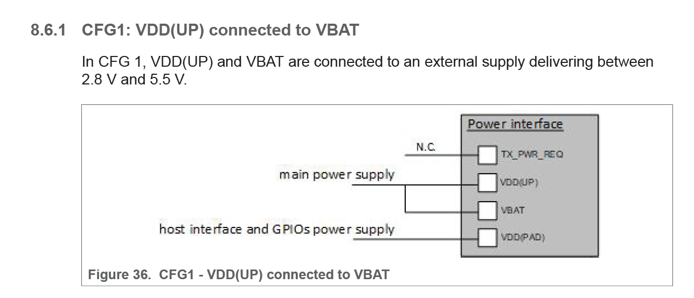

# README

pn7160 遇到问题做归纳

# so 是html文件

* 原因是 使用wget命令 从github下载nxp的so,是html. 


```
wget -r -np -nd -P vendor/nxp/pn7160/firmware/64-bit/ https://github.com/NXP/nfc-NXPNFCC_FW/tree/master/InfraFW/pn7160/64-bit/libpn7160_fw.so
```

* 要登录github网站,点击下载,才下载到争取的so

# so没有编译进去

* 原因是so路径错误

```
--- a/QSSI.12/vendor/nxp/nfc/device-nfc.mk
+++ b/QSSI.12/vendor/nxp/nfc/device-nfc.mk
@@ -27,10 +27,10 @@ PRODUCT_COPY_FILES += \
 PRODUCT_COPY_FILES += \
      vendor/$(NXP_VENDOR_DIR)/nfc/hw/init.$(NXP_NFC_PLATFORM).nfc.rc:vendor/etc/init/init.$(NXP_NFC_HOST).nfc.rc
 # PN7160 firmware file
-ifeq ($(strip $(TARGET_NXP_NFC_HW)), pn7160)
+ifeq ($(strip $(NXP_NFC_HW)), pn7160)
     PRODUCT_COPY_FILES += \
-    vendor/$(NXP_VENDOR_DIR)/nfc/${NXP_NFC_HW}/firmware/lib64/libpn7160_fw.so:vendor/lib64/libpn7160_fw.so \
-    vendor/$(NXP_VENDOR_DIR)/nfc/${NXP_NFC_HW}/firmware/lib/libpn7160_fw.so:vendor/lib/libpn7160_fw.so
+    vendor/$(NXP_VENDOR_DIR)/nfc/${NXP_NFC_HW}/firmware/64-bit/libpn7160_fw.so:vendor/lib64/libpn7160_fw.so \
+    vendor/$(NXP_VENDOR_DIR)/nfc/${NXP_NFC_HW}/firmware/32-bit/libpn7160_fw.so:vendor/lib/libpn7160_fw.so
 endif
```

# 电池电压少于3.9v,读不到卡

* 原因是nfc芯片的 VDD(UP),VBAT都使用了外供电源,需要配置使用 CFG1



```
###############################################################################
# TVDD configurations settings
# Allow NFCC to configure External TVDD
# There are two possible configurations (0x01 or 0x02):
#    CFG1: Vbat is used to generate the VDD(TX) through TXLDO
#    CFG2: external 5V is used to generate the VDD(TX) through TXLDO
NXP_EXT_TVDD_CFG=0x02  -> 改成0x01
```

# 卡模拟功能,数据不能写到NDEF

实际是可以写数据到ndef,可以点击T4T apk的read按钮,把相应数据读取出来.

但是因为 nfc的polling mode 跟 listen mode时间配置有问题,导致listen mode时间很短

灭屏后,就可以使用其他手机监听到写入NFCEE的ndef数据了. 因为灭屏后,没有reader模式,没有polling mode,只有listen mode