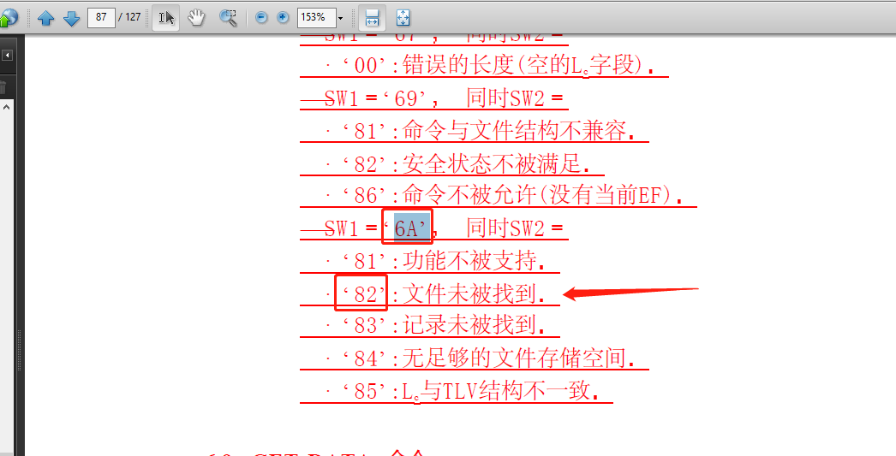
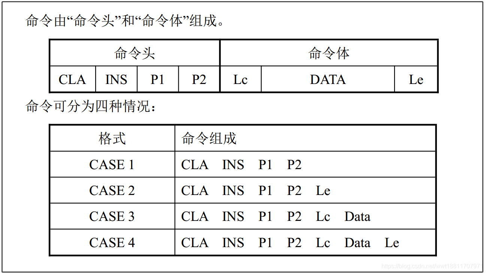
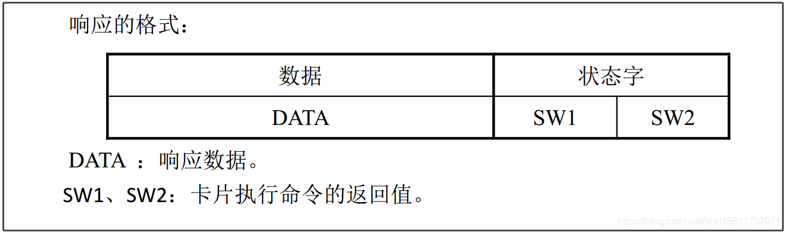
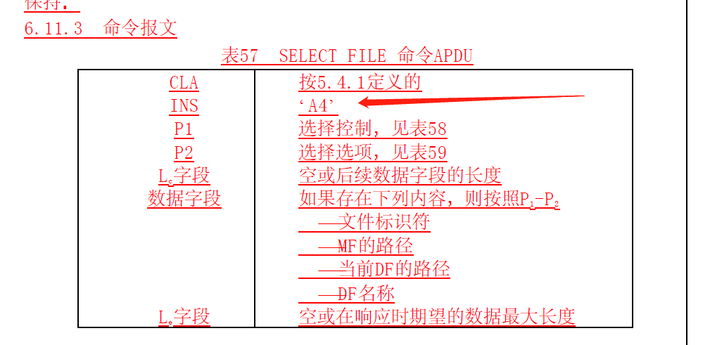
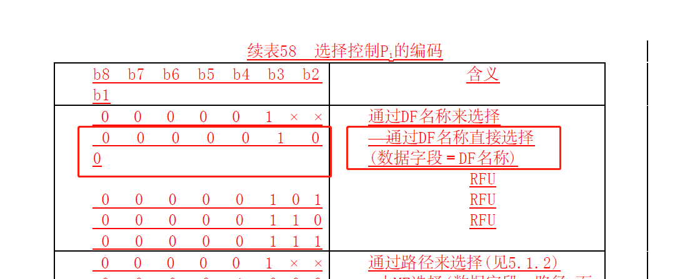

# 概要

改nfc的bug遇到的一些问题,总结一下

# 标准文档

参考文档

[ISO7816](files/ISO7816-1234.pdf)

[国标识别卡带触点的集成电路卡第3部分](files/GB-T_16649.3-2006_识别卡带触点的集成电路卡第3部分_电信号和传输协议.pdf)

# 问题

遇到发送指令到nfc卡后,返回值0x6A82不匹配问题.

这里涉及到发送指令格式知识点

返回值知识点

```
txbuf2[0] = 0x00;
txbuf2[1] = (byte) 0xa4;
txbuf2[2] = 0x04;
txbuf2[3] = 0x00;
txbuf2[4] = 0x09;
byte[] data1 = DateUtils.hexStrToBytes("A00000000386980701");
System.arraycopy(data1, 0, txbuf2, 5,
        data1.length);
txbuf2[4+data1.length+1] = 0x00;
try {
    recvBuf = mNfcA.transceive(txbuf2);
    byte statusWord1[] = {recvBuf[recvBuf.length - 2], recvBuf[recvBuf.length - 1]};
    if (!Arrays.equals(SELECT_OK, statusWord1)) {
        sendmessage("select data file statusWord is not correct\n");
        Log.d(LOG_TAG,"ByteArrayToHexString,statusWord1 = "+DateUtils.ByteArrayToHexString(statusWord1));
        Log.d(LOG_TAG,"Bytes2HexString,statusWord1 = "+DateUtils.Bytes2HexString(statusWord1));
        Log.d(LOG_TAG,"bytesToHexString,statusWord1 = "+DateUtils.bytesToHexString(statusWord1));
        return;
    }
}
```

# 返回值

返回值,bytes2str转义后,显示0x6A82.参考iso文档87页.

显示文件未找到,是不是卡里面有文件? 这个后续还要分析下



# 名词解释

## APDU(ApplicationProtocol data unit) 是智能卡与智能卡读卡器之间传送的信息单元

## IFD (接口设备) 与IC卡直接的通讯

* 首先，IFD发送5个字节的命令头给IC卡，这5个字节的内容告诉了IC卡要做什么操作

* 然后，IC卡回传一个过程字节给IFD，告诉IFD，IC卡是否支持该操作

* 如果返回的过程字节告诉IFD——IC卡支持该操作，则接下来就进行数据的传输（如果有的话），数据从IFD输入到IC卡或数据从IC卡输出到IFD

* 如果返回的过程字节告诉IFD——IC卡不支持该操作，则IC卡回传给IFD两个状态字节SW1 SW2，IFD根据SW1 SW2两字节判断IC卡不支持该操作的原因

## 命令头


### APDU： Application Protocol data unit,，是智能卡与智能卡读卡器之间传送的信息单元,.（向智能卡发送的命令）指令（ISO 7816-4规范有定义）：



CLA INS P1 P2 Lc Data Le

* CLA: 表示指令类别（class）。其中值‘FF’被保留用于PPS。注意 ISO/IEC 7816-4 强制‘FF’对于CLA为无效值

* INS：表示指令代码（instruction）。其中值‘6X’和‘9X’为无效值。注意 ISO/IEC 7816-4 强制‘6X’和‘9X’对于INS为无效值。

* P1、P2：参数；对于不同的指令（INS）P1 P2有不同的含义。

* Lc：为Data的长度；

* Le：为希望响应时回答的数据字节数，0表最大可能长度。

### 响应APDU



* Response data ,响应数据,N字节

* SW1,SW2 ,长度2,命令处理状态,如90 00 16 进制,表示成功

# 常用apdu命令集

指令名称|CLA|INS|解释
:--|:--|:--|:--
READ BINARY|00/04|	B0	|读出带有透明结构的EF内容的一部分
WRITE BINARY|	|	D0	|将二进制值写入 EF
UPDATE BINARY|	00/04|	D6	|启动使用在命令 APDU 中给出的位来更新早已呈现在EF中的位
ERASE BINARY	|	|0E	|顺序地从给出的偏移开始，将 EF 的内容的一部分置为其逻辑擦除的状态
READ RECORD|	00/04|	B2	|给出了EF的规定记录的内容或EF的一个记录开始部分的内容
WRITE RECORD|	|	D2|	WRITE RECORD命令报文启动下列操作之一:a. 写一次记录；b. 对早已呈现在卡内的记录数据字节与在命令 APDU 中给出的记录数据字节进行逻辑“或”运算；c. 对早已呈现在卡内的记录数据字节与在命令 APDU 中给出的记录数据字节进行逻辑“和”运算
APPEND RECORD	|00/04|	E2|	启动在线性结构 EF 的结束端添加记录，或者在循环结构的 EF 内写记录号 1
UPDATE RECORD	|00/04	|DC	|启动使用命令 APDU 给出的位来更新特定记录
GET DATA	|	|CA	|可在当前上下文(例如应用特定环境或当前 DF )范围内用于检索一个原始数据对象，或者包含在结构化数据对象中所包含的一个或多个数据对象
PUT DATA	|	|DA	|可在当前上下文(例如应用特定环境或当前 DF )范围内用于存储一个原始数据对象，或者包含在结构化数据对象中的一个或多个数据对象正确的存储功能(写一次和/或更新和/或添加)通过数据对象的定义和性质来引出
SELECT FILE	|00	|A4	|设置当前文件后续命令可以通过那个逻辑信道隐式地引用该当前文件
VERIFY	|00/04|	20|	启动从接口设备送入卡内的验证数据与卡内存储的引用数据(例如口令)进行比较
INTERNAL AUTHENTICATE|	00|	88|	启动卡使用从接口设备发送来的询问数据和在卡内存储的相关秘密(例如密钥)来计算鉴别数据，当该相关秘密被连接到 MF 时，命令可以用来鉴别整个卡当该相关秘密被连接到另一个 DF 时命令可以用来鉴别那个 DF。
EXTERNAL AUTHENTICATE|	00	|82	|使用卡计算的结果(是或否)有条件地来更新安全状态而该卡的计算是以该卡先前发出(例如通过 GETCHALLENGE 命令)的询问在卡内存储的可能的秘密密钥以及接口设备发送的鉴别数据为基础的
GET CHALLENGE	|00	|84	|要求发出一个询问(例如随机数)以便用于安全相关的规程(例EXTERNAL AUTHENTICATE 命令)
MANAGE CHANNEL|		|70	|打开和关闭逻辑信道
GET RESPONSE	|00	|C0	|用于从卡发送至接口设备用可用的协议不能传送的那一些的 APDU (或APDU的一部分)
ENVOLOPE	|80|	C2	|用来发送那些不能由有效协议来发送的 APDU 或 APDU 的一部分或任何数据串

# 常用响应码指令

SW1SW2|解释
:--|:--
9000 |	执行成功
6100|	数据被截断
6200|	警告,信息未提供
6281|	警告,回送数据可能出错
6282|	警告,文件长度小于Le
6283|	应用无效
6284|	FCI格式与P2指定的不符
6300|	认证失败
63Cx|	校验失败（x－允许重试次数）
6400|	原因不明
6581|	内存失败
6700|	长度不对
6900|	不能处理
6901|	命令不接受（无效状态）
6981|	命令与文件结构不相容，当前文件非所需文件
6982|	要PIN验证
6983|	文件无效,PIN被锁定
6984|	数据无效,随机数无效，引用的数据无效
6985|	条件不满足
6986|	不允许该命令
6982|	安全条件不满足
6987|	安全消息丢失
6988|	安全消息不正确
6999|	应用选择失败
6A80|	数据错误
6A81|	功能不支持
6A82|	文件找不到
6A83|	记录找不到
6A84|	没有足够的空间
6A86|	不正确的参数(P1,P2)
6A88|	引用数据没找到
6B00|	错误的参数 (P1,P2)
6C00|	长度错误 (Le)
6D00|	INS不支持
6E00|	CLA 不支持
6F00|	未知错误
9301|	资金不足
9302|	MAC无效
9303|	应用被永久锁定
9401|	交易金额不足
9402|	交易计数器达到最大值
9403|	密钥索引不支持
9406|	所需MAC不可用
61XX| 正常处理
62XX| 警告错误
63XX| 警告错误
64XX | 执行错误
65XX | 执行错误
67XX | 检测错误
6FXX | 检测错误


# 发送指令

对应代码

```
txbuf2[0] = 0x00;
txbuf2[1] = (byte) 0xa4;
txbuf2[2] = 0x04;
txbuf2[3] = 0x00;
txbuf2[4] = 0x09;
byte[] data1 = DateUtils.hexStrToBytes("A00000000386980701");
System.arraycopy(data1, 0, txbuf2, 5,
        data1.length);
txbuf2[14] = 0x00;
```

* 命令解析,iso文档90页6.11 SELECT FILE 命令






# 错误分析

回归这一笔问题,之前6A82,看起来是str转成byte的时候,出错了.导致一直找不到文件

使用以下三种方法,转换成byte,每种测试方法,输出log都不一样,只有第三种方法是对的

同理,可以看到,只有使用atohex方法的byte数组,再转换回 string是跟源string对应的 

```
Log.d(LOG_TAG,"A00000000386980701.getBytes() = "+"A00000000386980701".getBytes().toString());
Log.d(LOG_TAG,"DateUtils.hexStrToBytes(A00000000386980701) = "+DateUtils.hexStrToBytes("A00000000386980701").toString());
Log.d(LOG_TAG,"DateUtils.atohex(A00000000386980701) = "+byteAPDU.toString());

2023-07-15 10:19:47.978 11868-11944/nfc.pax.com.nfctest D/NFC_TEST: A00000000386980701.getBytes() = [B@151adf1
2023-07-15 10:19:47.979 11868-11944/nfc.pax.com.nfctest D/NFC_TEST: DateUtils.hexStrToBytes(A00000000386980701) = [B@c2cadd6
2023-07-15 10:19:47.979 11868-11944/nfc.pax.com.nfctest D/NFC_TEST: DateUtils.atohex(A00000000386980701) = [B@5816857

Log.d(LOG_TAG,"string getBytes,getHexString = "+ DateUtils.getHexString("A00000000386980701".getBytes()));
Log.d(LOG_TAG,"DateUtils.hexStrToBytes,getHexString = "+ DateUtils.getHexString(DateUtils.hexStrToBytes("A00000000386980701")));
Log.d(LOG_TAG,"DateUtils.atohex,getHexString = "+ DateUtils.getHexString(byteAPDU));

2023-07-15 10:26:56.822 12111-12149/nfc.pax.com.nfctest D/NFC_TEST: A00000000386980701.getBytes() = [B@d868198
2023-07-15 10:26:56.823 12111-12149/nfc.pax.com.nfctest D/NFC_TEST: DateUtils.hexStrToBytes(A00000000386980701) = [B@151adf1
2023-07-15 10:26:56.823 12111-12149/nfc.pax.com.nfctest D/NFC_TEST: DateUtils.atohex(A00000000386980701) = [B@c2cadd6
2023-07-15 10:26:56.842 12111-12149/nfc.pax.com.nfctest D/NFC_TEST: string getBytes,getHexString = 41 30 30 30 30 30 30 30 30 33 38 36 39 38 30 37 30 31 
2023-07-15 10:26:56.850 12111-12149/nfc.pax.com.nfctest D/NFC_TEST: DateUtils.hexStrToBytes,getHexString = F0 00 00 00 03 86 98 07 01 
2023-07-15 10:26:56.854 12111-12149/nfc.pax.com.nfctest D/NFC_TEST: DateUtils.atohex,getHexString = A0 00 00 00 03 86 98 07 01
```

# string装byte方法

```
public static byte[] atohex(String data)
	{
		String hexchars = "0123456789abcdef";
		int count;
		data = data.replaceAll(" ","").toLowerCase();
		if (data == null)
		{
			return null;
		}
		if(data.length() % 2 == 0){
			count = data.length() / 2;
		}else{
			count = data.length() / 2 +1;
		}
		//Log.d("NFC_TEST","data.length() = "+data.length()+"count = "+count+",data = "+data);

		byte[] hex = new byte[count];

		for (int ii = 0; ii < data.length(); ii += 2)
		{
			if((ii +1 ) >= data.length()){
				int i1 = hexchars.indexOf(data.charAt(ii));
				hex[ii/2] = (byte)((0 << 4) | i1);
		    }else{
				int i1 = hexchars.indexOf(data.charAt(ii));
				int i2 = hexchars.indexOf(data.charAt(ii + 1));
				hex[ii/2] = (byte)((i1 << 4) | i2);
			}
			//Log.d("NFC_TEST","hex[ "+(ii/2)+"] = "+hex[ii/2]);
		}
		return hex;
	}
```

```
public static String getHexString(byte[] data) throws Exception
{
    String szDataStr = "";
    for (byte datum : data) {
        szDataStr += String.format("%02X ", datum & 0xFF);
    }
    return szDataStr;
}
```
