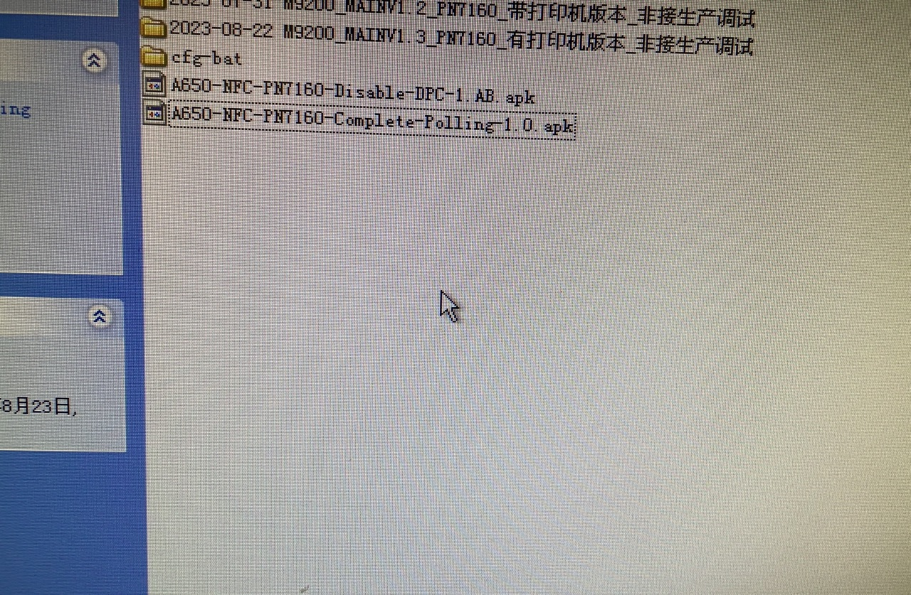

# 概要

同事说,nfc 配置文件参数不生效

分别下读指令, 2F1402824A

写指令, 20020A01A00D06824A33070007

# 配置文件写参数流程

* UM.9.15/hardware/nxp/nfc/pn8x/halimpl/hal/phNxpNciHal.cc

在这支文件的phNxpNciHal_core_initialized,添加log,发现重启log 没有出来.

要在设置里面,打开nfc 开关,log才会出来.看起来phNxpNciHal_core_initialized 函数是动态执行的,不是开机就会执行

```
const char RF_ANTENNA_PARAMETER_LIST[10][23] =
{
	"ro.fac.cfg.NFC_PARA_1",
	"ro.fac.cfg.NFC_PARA_2",
	"ro.fac.cfg.NFC_PARA_3",
	"ro.fac.cfg.NFC_PARA_4",
	"ro.fac.cfg.NFC_PARA_5",
	"ro.fac.cfg.NFC_PARA_6",
	"ro.fac.cfg.NFC_PARA_7",
	"ro.fac.cfg.NFC_PARA_8",
	"ro.fac.cfg.NFC_PARA_9",
	"ro.fac.cfg.NFC_PARA_10"
};

	/***************PAX Antenna Setting start*********************/
  status = NFCSTATUS_SUCCESS;
  numOfRfAntenna = sizeof(RF_ANTENNA_PARAMETER_LIST) / sizeof(RF_ANTENNA_PARAMETER_LIST[0]);
  for (int i=0; i< numOfRfAntenna; i++) {
    retlen = 0;
    NXPLOG_NCIHAL_E("Performing PAX Antenna Setting BLK %u", i+1);
    memset(antenna_string_buffer, 0x00, sizeof(antenna_string_buffer));
    retlen = property_get(RF_ANTENNA_PARAMETER_LIST[i], antenna_string_buffer,"");
    if (retlen > 0) {
      CStringToHexArray(antenna_string_buffer, antenna_hex_buffer);
      retlen /= 2;
      //兼容之前用2002开头的配置文件
      if((antenna_hex_buffer[0] != 0x20) || (antenna_hex_buffer[1] != 0x02)) {
                  NXPLOG_NCIHAL_E("PAX config file error!");
                  break;
      }
      status = phNxpNciHal_send_ext_cmd(retlen, antenna_hex_buffer);
      if ((nfcFL.chipType != pn547C2) && (status == NFCSTATUS_SUCCESS)) {
              status = phNxpNciHal_CheckRFCmdRespStatus();
              /*STATUS INVALID PARAM 0x09*/
              if (status == 0x09) {
                  phNxpNciHalRFConfigCmdRecSequence();
                  break;
              }
              NXPLOG_NCIHAL_E("PAX Antenna write NFC parameter  %s success!\n",RF_ANTENNA_PARAMETER_LIST[i]);
          } else if (status != NFCSTATUS_SUCCESS) {
              NXPLOG_NCIHAL_E("PAX Antenna Setting BLK %u failed", i+1);
              break;
          }
    }
  }
```

# 最终原因

同事说是apk的问题,换了一个apk就可以

第一个应用配置文件不生效,A650-NFC-PN7160-Disable-DPC-1.AB.apk

但用第二个应用配置文件可以生效,A650-NFC-PN7160-Complete-Polling-1.0.apk



# log输出配置

* UM.9.15/hardware/nxp/nfc/pn8x/halimpl/log/phNxpLog.h

可以看到.有两个变量控制log输出,nfc_debug_enabled,gLog_level.hal_log_level

```
#define NXPLOG_LOG_SILENT_LOGLEVEL 0x00
#define NXPLOG_LOG_ERROR_LOGLEVEL 0x01
#define NXPLOG_LOG_WARN_LOGLEVEL 0x02
#define NXPLOG_LOG_DEBUG_LOGLEVEL 0x03

#if (ENABLE_HAL_TRACES == TRUE)
#define NXPLOG_NCIHAL_D(...)                                       \
  {                                                                \
    if ((nfc_debug_enabled) ||                                     \
        (gLog_level.hal_log_level >= NXPLOG_LOG_DEBUG_LOGLEVEL))   \
      LOG_PRI(ANDROID_LOG_DEBUG, NXPLOG_ITEM_NCIHAL, __VA_ARGS__); \
  }
#define NXPLOG_NCIHAL_W(...)                                      \
  {                                                               \
    if ((nfc_debug_enabled) ||                                    \
        (gLog_level.hal_log_level >= NXPLOG_LOG_WARN_LOGLEVEL))   \
      LOG_PRI(ANDROID_LOG_WARN, NXPLOG_ITEM_NCIHAL, __VA_ARGS__); \
  }
#define NXPLOG_NCIHAL_E(...)                                       \
  {                                                                \
    if (gLog_level.hal_log_level >= NXPLOG_LOG_ERROR_LOGLEVEL)     \
      LOG_PRI(ANDROID_LOG_ERROR, NXPLOG_ITEM_NCIHAL, __VA_ARGS__); \
  }
#else
#define NXPLOG_NCIHAL_D(...)
#define NXPLOG_NCIHAL_W(...)
#define NXPLOG_NCIHAL_E(...)
#endif /* Logging APIs used by HAL module */
```

* nfc_debug_enabled

在phNxpNciHal_MinOpen 的时候,会初始化log,先从`UM.9.15/vendor/nxp/nfc/hw/pn7160/libnfc-nci.conf` 读取NAME_NFC_DEBUG_ENABLED,

一般配置都是1

接着使用nfc.debug_enabled overlay , 不过user跟debug都没配置

```
phNxpNciHal_MinOpen

static void phNxpNciHal_initialize_debug_enabled_flag() {
  unsigned long num = 0;
  char valueStr[PROPERTY_VALUE_MAX] = {0};
  if (GetNxpNumValue(NAME_NFC_DEBUG_ENABLED, &num, sizeof(num))) {
    nfc_debug_enabled = (num == 0) ? false : true;
  }

  int len = property_get("nfc.debug_enabled", valueStr, "");
  if (len > 0) {
    // let Android property override .conf variable
    unsigned debug_enabled = 0;
    sscanf(valueStr, "%u", &debug_enabled);
    nfc_debug_enabled = (debug_enabled == 0) ? false : true;
  }
  NXPLOG_NCIHAL_D("nfc_debug_enabled : %d", nfc_debug_enabled);
}
```

    * UM.9.15/vendor/nxp/nfc/hw/pn7160/libnfc-nci.conf

    ```
    NFC_DEBUG_ENABLED=0x01
    ```
* gLog_level.hal_log_level

    * UM.9.15/hardware/nxp/nfc/pn8x/halimpl/log/phNxpLog.cc

    ```
    /******************************************************************************
    * Function         phNxpLog_InitializeLogLevel
    *
    * Description      Initialize and get log level of module from libnfc-nxp.conf
    *or
    *                  Android runtime properties.
    *                  The Android property nfc.nxp_global_log_level is to
    *                  define log level for all modules. Modules log level will
    *overwide global level.
    *                  The Android property will overwide the level
    *                  in libnfc-nxp.conf
    *
    *                  Android property names:
    *                      nfc.nxp_log_level_global    * defines log level for all
    *modules
    *                      nfc.nxp_log_level_extns     * extensions module log
    *                      nfc.nxp_log_level_hal       * Hal module log
    *                      nfc.nxp_log_level_dnld      * firmware download module
    *log
    *                      nfc.nxp_log_level_tml       * TML module log
    *                      nfc.nxp_log_level_nci       * NCI transaction log
    *
    *                  Log Level values:
    *                      NXPLOG_LOG_SILENT_LOGLEVEL  0        * No trace to show
    *                      NXPLOG_LOG_ERROR_LOGLEVEL   1        * Show Error trace
    *only
    *                      NXPLOG_LOG_WARN_LOGLEVEL    2        * Show Warning
    *trace and Error trace
    *                      NXPLOG_LOG_DEBUG_LOGLEVEL   3        * Show all traces
    *
    * Returns          void
    *
    ******************************************************************************/
    void phNxpLog_InitializeLogLevel(void) {
    uint8_t level = phNxpLog_SetGlobalLogLevel();
    phNxpLog_SetHALLogLevel(level);
    phNxpLog_SetExtnsLogLevel(level);
    phNxpLog_SetTmlLogLevel(level);
    phNxpLog_SetDnldLogLevel(level);
    phNxpLog_SetNciTxLogLevel(level);

    ALOGD_IF(nfc_debug_enabled,
    "%s: global =%u, Fwdnld =%u, extns =%u, \
        hal =%u, tml =%u, ncir =%u, \
        ncix =%u",
    __func__, gLog_level.global_log_level, gLog_level.dnld_log_level,
    gLog_level.extns_log_level, gLog_level.hal_log_level,
    gLog_level.tml_log_level, gLog_level.ncir_log_level,
    gLog_level.ncix_log_level);
    }
    ```

    * UM.9.15/hardware/nxp/nfc/pn8x/halimpl/log/phNxpLog.h

    ```
    typedef struct nci_log_level {
    uint8_t global_log_level;
    uint8_t extns_log_level;
    uint8_t hal_log_level;
    uint8_t dnld_log_level;
    uint8_t tml_log_level;
    uint8_t ncix_log_level;
    uint8_t ncir_log_level;
    } nci_log_level_t;
    ```

    * UM.9.15/vendor/nxp/nfc/hw/pn7160/libnfc-nxp.conf

    ```
    NXPLOG_EXTNS_LOGLEVEL=0x03
    NXPLOG_NCIHAL_LOGLEVEL=0x03
    NXPLOG_NCIX_LOGLEVEL=0x03
    NXPLOG_NCIR_LOGLEVEL=0x03
    NXPLOG_FWDNLD_LOGLEVEL=0x03
    NXPLOG_TML_LOGLEVEL=0x03
    ```

# 默认关闭nfc,开机nfc流程

* kernel

    nfc_i2c_dev_init: Loading NXP NFC I2C driver

* hal

    * QSSI.12/vendor/paxsz/initrc/init.A6650.common.rc

        > on property:ro.fac.cfg.NFC=02
        >   start vendor.nfc_hal_service

    * UM.9.15/hardware/nxp/nfc/pn8x/1.2/android.hardware.nfc@1.2-service.rc

        > service vendor.nfc_hal_service /vendor/bin/hw/android.hardware.nfc@1.2-service
        >   disabled
        >   user nfc
        >   group nfc

    * UM.9.15/hardware/nxp/nfc/pn8x/1.2/NxpNfcService.cpp

        ```
        #include <vendor/nxp/nxpnfc/1.0/INxpNfc.h>
        int main() {
            ALOGD("NFC HAL Service 1.2 is starting.");
            sp<INfc> nfc_service = new Nfc();

            configureRpcThreadpool(1, true /*callerWillJoin*/);
            status_t status = nfc_service->registerAsService();
            if (status != OK) {
                LOG_ALWAYS_FATAL("Could not register service for NFC HAL Iface (%d).",
                                status);
                return -1; 
            }
            sp<INxpNfc> nxp_nfc_service = new NxpNfc();
            status = nxp_nfc_service->registerAsService();
            if (status != OK) {
                ALOGD("Could not register service for NXP NFC Extn Iface (%d).", status);
            }
            ALOGD("NFC service is ready");
            joinRpcThreadpool();
            return 1;
            }
        ```

    * UM.9.15/hardware/nxp/nfc/pn8x/extns/impl/NxpNfc.h

    ```
    using ::vendor::nxp::nxpnfc::V1_0::INxpNfc;

    struct NxpNfc : public INxpNfc {
    Return<void> ioctl(uint64_t ioctlType, const hidl_vec<uint8_t>& inOutData,
                        ioctl_cb _hidl_cb) override;
    };
    ```

    * UM.9.15/hardware/nxp/nfc/intf/nxpnfc/1.0/INxpNfc.hal

    可以看到.定义hal 自动会生成service接口

    ```
    package vendor.nxp.nxpnfc@1.0;

    interface INxpNfc {
        /*  
        * Performs an General Input Output operations.
        *   
        * Based on the ioctlType, input data bytes are processed and 
        * Output data bytes are generated.
        * @param ioctlType contains type of functionality as below
        *         HAL_NFC_IOCTL_SPI_DWP_SYNC to synchronize access to eSE 
        *         HAL_NFC_INHIBIT_PWR_CNTRL to disable eSE power
        *         HAL_NFC_SET_SPM_PWR to toggle eSE power
        * @return output data as stream of bytes
        */  
        ioctl(uint64_t ioctlType,NfcData inputData) generates(NfcData outputData);
    };
    ```

    * UM.9.15/out/soong/.intermediates/hardware/nxp/nfc/intf/nxpnfc/1.0/vendor.nxp.nxpnfc@1.0_genc++_headers/gen/vendor/nxp/nxpnfc/1.0/INxpNfc.h

    ```
    struct INxpNfc : public ::android::hidl::base::V1_0::IBase {
        static ::android::sp<INxpNfc> getService(const std::string &serviceName="default", bool getStub=false);
    /**
     * Deprecated. See getService(std::string, bool)
     */
    static ::android::sp<INxpNfc> getService(const char serviceName[], bool getStub=false)  { std::string str(serviceName ? serviceName : "");      return getService(str, getStub); }
    /**
     * Deprecated. See getService(std::string, bool)
     */
    static ::android::sp<INxpNfc> getService(const ::android::hardware::hidl_string& serviceName, bool getStub=false)  { std::string str(serviceName.c_str());      return getService(str, getStub); }
    /**
     * Calls getService("default", bool). This is the recommended instance name for singleton services.
     */
    static ::android::sp<INxpNfc> getService(bool getStub) { return getService("default", getStub); }
    /**
     * Registers a service with the service manager. For Trebilized devices, the service
     * must also be in the VINTF manifest.
     */
    __attribute__ ((warn_unused_result))::android::status_t registerAsService(const std::string &serviceName="default");
    ```

# 应用层nfc启动

* QSSI.12/packages/apps/Nfc/AndroidManifest.xml

```
    <application android:name=".NfcApplication">
    <receiver android:name=".NfcBootCompletedReceiver"
        android:exported="true">
        <intent-filter>
            <action android:name="android.intent.action.BOOT_COMPLETED" />
        </intent-filter>
    </receiver>
```

* QSSI.12/packages/apps/Nfc/src/com/android/nfc/NfcApplication.java

因为定义了静态receiver,所以调用NfcApplication

```
public void onCreate() {
        super.onCreate();
        PackageManager pm = getApplicationContext().getPackageManager();
        if (!pm.hasSystemFeature(PackageManager.FEATURE_NFC_ANY)) {
                return;
        }   

        boolean isMainProcess = false;
        // We start a service in a separate process to do
        // handover transfer. We don't want to instantiate an NfcService
        // object in those cases, hence check the name of the process
        // to determine whether we're the main NFC service, or the
        // handover process
        ActivityManager am = (ActivityManager)this.getSystemService(ACTIVITY_SERVICE);
        List processes = am.getRunningAppProcesses();
        Iterator i = processes.iterator();
        while (i.hasNext()) {
            RunningAppProcessInfo appInfo = (RunningAppProcessInfo)(i.next());
            if (appInfo.pid == Process.myPid()) {
                isMainProcess =  (NFC_PROCESS.equals(appInfo.processName));
                break;
            }   
        }   
        if (UserHandle.myUserId() == 0 && isMainProcess) {
            mNfcService = new NfcService(this);
            ThreadedRenderer.enableForegroundTrimming();
        }   
    }   
```

* QSSI.12/packages/apps/Nfc/nci/src/com/android/nfc/dhimpl/NativeNfcManager.java

```
    static {
        System.loadLibrary("nfc_nci_jni");
    }   
```

* QSSI.12/packages/apps/Nfc/nci/jni/NfcJniUtil.cpp

    system.loadLibrary 会调用到libnfc_nci_jni.so的JNI_OnLoad(JavaVM* jvm, void*)

```
jint JNI_OnLoad(JavaVM* jvm, void*) {
  DLOG_IF(INFO, nfc_debug_enabled) << StringPrintf("%s: enter", __func__);
  JNIEnv* e = NULL;

  LOG(INFO) << StringPrintf("NFC Service: loading nci JNI");

  // Check JNI version
  if (jvm->GetEnv((void**)&e, JNI_VERSION_1_6)) return JNI_ERR;

  if (android::register_com_android_nfc_NativeNfcManager(e) == -1) 
    return JNI_ERR;
  if (android::register_com_android_nfc_NativeLlcpServiceSocket(e) == -1) 
    return JNI_ERR;
  if (android::register_com_android_nfc_NativeLlcpSocket(e) == -1) 
    return JNI_ERR;
  if (android::register_com_android_nfc_NativeNfcTag(e) == -1) return JNI_ERR;
  if (android::register_com_android_nfc_NativeLlcpConnectionlessSocket(e) == -1) 
    return JNI_ERR;
  if (android::register_com_android_nfc_NativeP2pDevice(e) == -1) 
    return JNI_ERR;
  if (RoutingManager::getInstance().registerJniFunctions(e) == -1) 
    return JNI_ERR;
  if (android::register_com_android_nfc_NativeT4tNfcee(e) == -1) 
    return JNI_ERR;
  DLOG_IF(INFO, nfc_debug_enabled) << StringPrintf("%s: exit", __func__);
  return JNI_VERSION_1_6;
}
```

* loadConfigEntry

    加载nci配置文件,暂时没有找到源码入口
    
```
08-25 22:43:50.742  3390  3390 I com.android.nf: ConfigFile - Parsing file '/etc/libnfc-nci.conf'
08-25 22:43:50.742  3390  3390 I com.android.nf: ConfigFile - [APPL_TRACE_LEVEL] = 0xFF
08-25 22:43:50.743  3390  3390 I com.android.nf: ConfigFile - [PROTOCOL_TRACE_LEVEL] = 0xFFFFFFFF
08-25 22:43:50.743  3390  3390 I com.android.nf: ConfigFile - [NFC_DEBUG_ENABLED] = 0x01
08-25 22:43:50.743  3390  3390 I com.android.nf: ConfigFile - [NFA_STORAGE] = "/data/vendor/nfc"
08-25 22:43:50.743  3390  3390 I com.android.nf: ConfigFile - [HOST_LISTEN_TECH_MASK] = 0x07
08-25 22:43:50.743  3390  3390 I com.android.nf: ConfigFile - [SCREEN_OFF_POWER_STATE] = 1
08-25 22:43:50.743  3390  3390 I com.android.nf: ConfigFile - [NCI_HAL_MODULE] = "nfc_nci.pn54x"
08-25 22:43:50.743  3390  3390 I com.android.nf: ConfigFile - [POLLING_TECH_MASK] = 0xEF
08-25 22:43:50.743  3390  3390 I com.android.nf: ConfigFile - [P2P_LISTEN_TECH_MASK] = 0xC5
08-25 22:43:50.743  3390  3390 I com.android.nf: ConfigFile - [PRESERVE_STORAGE] = 0x01
08-25 22:43:50.743  3390  3390 I com.android.nf: ConfigFile - [AID_MATCHING_MODE] = 0x03
08-25 22:43:50.743  3390  3390 I com.android.nf: ConfigFile - [NFA_MAX_EE_SUPPORTED] = 0x01
08-25 22:43:50.743  3390  3390 I com.android.nf: ConfigFile - [OFFHOST_AID_ROUTE_PWR_STATE] = 0x3B
 ```

* QSSI.12/system/nfc/src/adaptation/NfcAdaptation.cc

    后面就到桥梁NfcAdaptation跟hal交互, package/app/Nfc -> system/nfc/NfcAdaptation -> hal

# user版本 ,配置文件的参数还是没写下去

在分析配置文件写流程过程中,发现配置文件还是因为 selinux 权限没有配置下去

```
 Access denied finding property "ro.fac.cfg.NFC_PARA_1"
 08-28 14:38:05.442   890   890 W nfc@1.2-service: type=1400 audit(0.0:474): avc: denied { read } for name="u:object_r:pax_ctrl_prop:s0" dev="tmpfs" ino=11357 scontext=u:r:hal_nfc_default:s0 tcontext=u:object_r:pax_ctrl_prop:s0 tclass=file permissive=0
08-28 14:38:05.442   890   890 W nfc@1.2-service: type=1400 audit(0.0:475): avc: denied { read } for name="u:object_r:pax_ctrl_prop:s0" dev="tmpfs" ino=11357 scontext=u:r:hal_nfc_default:s0 tcontext=u:object_r:pax_ctrl_prop:s0 tclass=file permissive=0
08-28 14:38:05.442   890   890 W nfc@1.2-service: type=1400 audit(0.0:476): avc: denied { read } for name="u:object_r:pax_ctrl_prop:s0" dev="tmpfs" ino=11357 scontext=u:r:hal_nfc_default:s0 tcontext=u:object_r:pax_ctrl_prop:s0 tclass=file permissive=0
08-28 14:38:05.445   890  5010 D NxpTml  : PN54X - I2C Read successful.....
08-28 14:38:05.442   890   890 W nfc@1.2-service: type=1400 audit(0.0:477): avc: denied { read } for name="u:object_r:pax_ctrl_prop:s0" dev="tmpfs" ino=11357 scontext=u:r:hal_nfc_default:s0 tcontext=u:object_r:pax_ctrl_prop:s0 tclass=file permissive=0
08-28 14:38:05.442   890   890 W nfc@1.2-service: type=1400 audit(0.0:478): avc: denied { read } for name="u:object_r:pax_ctrl_prop:s0" dev="tmpfs" ino=11357 scontext=u:r:hal_nfc_default:s0 tcontext=u:object_r:pax_ctrl_prop:s0 tclass=file permissive=0
```

# 解决方法

添加selinux权限

* UM.9.15/vendor/nxp/nfc/sepolicy/nfc/hal_nfc_default.te

```
--- a/UM.9.15/vendor/nxp/nfc/sepolicy/nfc/hal_nfc_default.te
+++ b/UM.9.15/vendor/nxp/nfc/sepolicy/nfc/hal_nfc_default.te
@@ -11,3 +11,4 @@ allow hal_nfc_default vendor_nfc_prop:property_service set;
 
 allow hal_nfc_default nfc_vendor_data_file:dir { getattr add_name read write search remove_name };
 allow hal_nfc_default nfc_vendor_data_file:file { getattr open create read write unlink setattr append };
+allow hal_nfc_default pax_ctrl_prop:file { getattr open read map };
```

# 写入配置文件的nci命令

## 获取配置文件设置的property

ro.fac.cfg.NFC_PARA_1-10,init进程解析的

## string转换成hex buffer

先算出 与'0' 或者 'a' 'A'的插值,然后左移4位,继续算,得到16进制值

```
static int CStringToHexArray( char *pcStr, unsigned char *pucArr )
{
    unsigned char *pucHead = pucArr;
    unsigned char  ucTmp;

    while( '\0' != *pcStr )
    {
        if( *pcStr >= '0' && *pcStr <= '9' )ucTmp = *pcStr - '0';
        else if( *pcStr >= 'a' && *pcStr <= 'f' )ucTmp = 10 + ( *pcStr - 'a' );
        else if( *pcStr >= 'A' && *pcStr <= 'F' )ucTmp = 10 + ( *pcStr - 'A' );
        else return -1;

        pcStr++;
        if( '\0' != *pcStr )
        {
            ucTmp <<= 4;
            if( *pcStr >= '0' && *pcStr <= '9' )ucTmp |= *pcStr - '0';
            else if( *pcStr >= 'a' && *pcStr <= 'f' )ucTmp |= 10 + ( *pcStr - 'a' );
            else if( *pcStr >= 'A' && *pcStr <= 'F' )ucTmp |= 10 + ( *pcStr - 'A' );
            else return -1;
        }
        pcStr++;
        *pucArr++ = ucTmp;
    }

    return ( pucArr - pucHead );
}
```

## 写入命令

* UM.9.15/hardware/nxp/nfc/pn8x/halimpl/hal/phNxpNciHal.cc

```
int phNxpNciHal_core_initialized(uint16_t core_init_rsp_params_len,
                                 uint8_t* p_core_init_rsp_params) {

  numOfRfAntenna = sizeof(RF_ANTENNA_PARAMETER_LIST) / sizeof(RF_ANTENNA_PARAMETER_LIST[0]);
  for (int i=0; i< numOfRfAntenna; i++) {
    retlen = 0;
    NXPLOG_NCIHAL_E("Performing PAX Antenna Setting BLK %u", i+1);
    memset(antenna_string_buffer, 0x00, sizeof(antenna_string_buffer));
    retlen = property_get(RF_ANTENNA_PARAMETER_LIST[i], antenna_string_buffer,"");
    if (retlen > 0) {
      CStringToHexArray(antenna_string_buffer, antenna_hex_buffer);
      retlen /= 2;
      //兼容之前用2002开头的配置文件
      if((antenna_hex_buffer[0] != 0x20) || (antenna_hex_buffer[1] != 0x02)) {
                  NXPLOG_NCIHAL_E("PAX config file error!");
                  break;
      }
      status = phNxpNciHal_send_ext_cmd(retlen, antenna_hex_buffer);
      if ((nfcFL.chipType != pn547C2) && (status == NFCSTATUS_SUCCESS)) {
              status = phNxpNciHal_CheckRFCmdRespStatus();
              /*STATUS INVALID PARAM 0x09*/
              if (status == 0x09) {
                  phNxpNciHalRFConfigCmdRecSequence();
                  break;
              }
              NXPLOG_NCIHAL_E("PAX Antenna write NFC parameter  %s success!\n",RF_ANTENNA_PARAMETER_LIST[i]);
          } else if (status != NFCSTATUS_SUCCESS) {
              NXPLOG_NCIHAL_E("PAX Antenna Setting BLK %u failed", i+1);
              break;
          }
    }
  }
}
```

* UM.9.15/hardware/nxp/nfc/pn8x/halimpl/hal/phNxpNciHal_ext.cc

```
/******************************************************************************
 * Function         phNxpNciHal_send_ext_cmd
 *
 * Description      This function send the extension command to NFCC. No
 *                  response is checked by this function but it waits for
 *                  the response to come.
 *
 * Returns          Returns NFCSTATUS_SUCCESS if sending cmd is successful and
 *                  response is received.
 *
 ******************************************************************************/
NFCSTATUS phNxpNciHal_send_ext_cmd(uint16_t cmd_len, uint8_t* p_cmd) {
  NFCSTATUS status = NFCSTATUS_FAILED;
  HAL_ENABLE_EXT();
  nxpncihal_ctrl.cmd_len = cmd_len;
  memcpy(nxpncihal_ctrl.p_cmd_data, p_cmd, cmd_len);
  status = phNxpNciHal_process_ext_cmd_rsp(nxpncihal_ctrl.cmd_len,
                                           nxpncihal_ctrl.p_cmd_data);
  HAL_DISABLE_EXT();

  return status;
}
```

```
/******************************************************************************
 * Function         phNxpNciHal_process_ext_cmd_rsp
 *
 * Description      This function process the extension command response. It
 *                  also checks the received response to expected response.
 *
 * Returns          returns NFCSTATUS_SUCCESS if response is as expected else
 *                  returns failure.
 *
 ******************************************************************************/
static NFCSTATUS phNxpNciHal_process_ext_cmd_rsp(uint16_t cmd_len,
                                                 uint8_t* p_cmd) {
  NFCSTATUS status = NFCSTATUS_FAILED;
  uint16_t data_written = 0;

  /* Create the local semaphore */
  if (phNxpNciHal_init_cb_data(&nxpncihal_ctrl.ext_cb_data, NULL) !=
      NFCSTATUS_SUCCESS) {
    NXPLOG_NCIHAL_D("Create ext_cb_data failed");
    return NFCSTATUS_FAILED;
  }

  nxpncihal_ctrl.ext_cb_data.status = NFCSTATUS_SUCCESS;

  /* Send ext command */
  data_written = phNxpNciHal_write_unlocked(cmd_len, p_cmd);
  if (data_written != cmd_len) {
    NXPLOG_NCIHAL_D("phNxpNciHal_write failed for hal ext");
    goto clean_and_return;
  }

  /* Start timer */
  status = phOsalNfc_Timer_Start(timeoutTimerId, HAL_EXTNS_WRITE_RSP_TIMEOUT,
                                 &hal_extns_write_rsp_timeout_cb, NULL);
  if (NFCSTATUS_SUCCESS == status) {
    NXPLOG_NCIHAL_D("Response timer started");
  } else {
    NXPLOG_NCIHAL_E("Response timer not started!!!");
    status = NFCSTATUS_FAILED;
    goto clean_and_return;
  }

  /* Wait for rsp */
  NXPLOG_NCIHAL_D("Waiting after ext cmd sent");
  if (SEM_WAIT(nxpncihal_ctrl.ext_cb_data)) {
    NXPLOG_NCIHAL_E("p_hal_ext->ext_cb_data.sem semaphore error");
    goto clean_and_return;
  }

  /* Stop Timer */
  status = phOsalNfc_Timer_Stop(timeoutTimerId);
  if (NFCSTATUS_SUCCESS == status) {
    NXPLOG_NCIHAL_D("Response timer stopped");
  } else {
    NXPLOG_NCIHAL_E("Response timer stop ERROR!!!");
    status = NFCSTATUS_FAILED;
    goto clean_and_return;
  }

  if (cmd_len < 3) {
    android_errorWriteLog(0x534e4554, "153880630");
    status = NFCSTATUS_FAILED;
    goto clean_and_return;
  }

  /* No NTF expected for OMAPI command */
  if (p_cmd[0] == 0x2F && p_cmd[1] == 0x1 && p_cmd[2] == 0x01) {
    nxpncihal_ctrl.nci_info.wait_for_ntf = FALSE;
  }
  /* Start timer to wait for NTF*/
  if (nxpncihal_ctrl.nci_info.wait_for_ntf == TRUE) {
    status = phOsalNfc_Timer_Start(timeoutTimerId, HAL_EXTNS_WRITE_RSP_TIMEOUT,
                                   &hal_extns_write_rsp_timeout_cb, NULL);
    if (NFCSTATUS_SUCCESS == status) {
      NXPLOG_NCIHAL_D("Response timer started");
    } else {
      NXPLOG_NCIHAL_E("Response timer not started!!!");
      status = NFCSTATUS_FAILED;
      goto clean_and_return;
    }
    if (SEM_WAIT(nxpncihal_ctrl.ext_cb_data)) {
      NXPLOG_NCIHAL_E("p_hal_ext->ext_cb_data.sem semaphore error");
      /* Stop Timer */
      status = phOsalNfc_Timer_Stop(timeoutTimerId);
      goto clean_and_return;
    }
    status = phOsalNfc_Timer_Stop(timeoutTimerId);
    if (NFCSTATUS_SUCCESS == status) {
      NXPLOG_NCIHAL_D("Response timer stopped");
    } else {
      NXPLOG_NCIHAL_E("Response timer stop ERROR!!!");
      status = NFCSTATUS_FAILED;
      goto clean_and_return;
    }
  }

  if (nxpncihal_ctrl.ext_cb_data.status != NFCSTATUS_SUCCESS &&
      p_cmd[0] != 0x2F && p_cmd[1] != 0x1 && p_cmd[2] == 0x01) {
    NXPLOG_NCIHAL_E(
        "Callback Status is failed!! Timer Expired!! Couldn't read it! 0x%x",
        nxpncihal_ctrl.ext_cb_data.status);
    status = NFCSTATUS_FAILED;
    goto clean_and_return;
  }

  NXPLOG_NCIHAL_D("Checking response");
  status = NFCSTATUS_SUCCESS;

clean_and_return:
  phNxpNciHal_cleanup_cb_data(&nxpncihal_ctrl.ext_cb_data);
  nxpncihal_ctrl.nci_info.wait_for_ntf = FALSE;
  return status;
}
```

* UM.9.15/hardware/nxp/nfc/pn8x/halimpl/hal/phNxpNciHal.cc

```
/******************************************************************************
 * Function         phNxpNciHal_write_unlocked
 *
 * Description      This is the actual function which is being called by
 *                  phNxpNciHal_write. This function writes the data to NFCC.
 *                  It waits till write callback provide the result of write
 *                  process.
 *
 * Returns          It returns number of bytes successfully written to NFCC.
 *
 ******************************************************************************/
int phNxpNciHal_write_unlocked(uint16_t data_len, const uint8_t* p_data) {
  NFCSTATUS status = NFCSTATUS_INVALID_PARAMETER;
  phNxpNciHal_Sem_t cb_data;
  nxpncihal_ctrl.retry_cnt = 0;
  static uint8_t reset_ntf[] = {0x60, 0x00, 0x06, 0xA0, 0x00,
                                0xC7, 0xD4, 0x00, 0x00};
  /* Create the local semaphore */
  if (phNxpNciHal_init_cb_data(&cb_data, NULL) != NFCSTATUS_SUCCESS) {
    NXPLOG_NCIHAL_D("phNxpNciHal_write_unlocked Create cb data failed");
    data_len = 0;
    goto clean_and_return;
  }

  /* Create local copy of cmd_data */
  memcpy(nxpncihal_ctrl.p_cmd_data, p_data, data_len);
  nxpncihal_ctrl.cmd_len = data_len;

  /* check for write synchronyztion */
  if (phNxpNciHal_check_ncicmd_write_window(nxpncihal_ctrl.cmd_len,
                                            nxpncihal_ctrl.p_cmd_data) !=
      NFCSTATUS_SUCCESS) {
    NXPLOG_NCIHAL_D("phNxpNciHal_write_unlocked check nci write window failed");
    data_len = 0;
    goto clean_and_return;
  }

  NfccPowerTracker::getInstance().ProcessCmd(
      (uint8_t*)nxpncihal_ctrl.p_cmd_data, (uint16_t)nxpncihal_ctrl.cmd_len);

retry:

  data_len = nxpncihal_ctrl.cmd_len;

  status = phTmlNfc_Write(
      (uint8_t*)nxpncihal_ctrl.p_cmd_data, (uint16_t)nxpncihal_ctrl.cmd_len,
      (pphTmlNfc_TransactCompletionCb_t)&phNxpNciHal_write_complete,
      (void*)&cb_data);
  if (status != NFCSTATUS_PENDING) {
    NXPLOG_NCIHAL_E("write_unlocked status error");
    data_len = 0;
    goto clean_and_return;
  }

  /* Wait for callback response */
  if (SEM_WAIT(cb_data)) {
    NXPLOG_NCIHAL_E("write_unlocked semaphore error");
    data_len = 0;
    goto clean_and_return;
  }

  if (cb_data.status != NFCSTATUS_SUCCESS) {
    data_len = 0;
    if (nxpncihal_ctrl.retry_cnt++ < MAX_RETRY_COUNT) {
      NXPLOG_NCIHAL_D(
          "write_unlocked failed - PN54X Maybe in Standby Mode - Retry");
      /* 10ms delay to give NFCC wake up delay */
      usleep(1000 * 10);
      goto retry;
    } else {
      NXPLOG_NCIHAL_E(
          "write_unlocked failed - PN54X Maybe in Standby Mode (max count = "
          "0x%x)",
          nxpncihal_ctrl.retry_cnt);

      sem_post(&(nxpncihal_ctrl.syncSpiNfc));

      status = phTmlNfc_IoCtl(phTmlNfc_e_ResetDevice);

      if (NFCSTATUS_SUCCESS == status) {
        NXPLOG_NCIHAL_D("PN54X Reset - SUCCESS\n");
      } else {
        NXPLOG_NCIHAL_D("PN54X Reset - FAILED\n");
      }
      if (nxpncihal_ctrl.p_nfc_stack_data_cback != NULL &&
          nxpncihal_ctrl.p_rx_data != NULL &&
          nxpncihal_ctrl.hal_open_status == true) {
        NXPLOG_NCIHAL_D(
            "Send the Core Reset NTF to upper layer, which will trigger the "
            "recovery\n");
        // Send the Core Reset NTF to upper layer, which will trigger the
        // recovery.
        nxpncihal_ctrl.rx_data_len = sizeof(reset_ntf);
        memcpy(nxpncihal_ctrl.p_rx_data, reset_ntf, sizeof(reset_ntf));
        (*nxpncihal_ctrl.p_nfc_stack_data_cback)(nxpncihal_ctrl.rx_data_len,
                                                 nxpncihal_ctrl.p_rx_data);
      }
    }
  }

clean_and_return:
  phNxpNciHal_cleanup_cb_data(&cb_data);
  return data_len;
}
```

* UM.9.15/hardware/nxp/nfc/pn8x/halimpl/tml/phTmlNfc.cc

注意pTmlWriteComplete 这里有callback调用

```
NFCSTATUS phTmlNfc_Write(uint8_t* pBuffer, uint16_t wLength,
                         pphTmlNfc_TransactCompletionCb_t pTmlWriteComplete,
                         void* pContext) {
  NFCSTATUS wWriteStatus;

  /* Check whether TML is Initialized */

  if (NULL != gpphTmlNfc_Context) {
    if ((NULL != gpphTmlNfc_Context->pDevHandle) && (NULL != pBuffer) &&
        (PH_TMLNFC_RESET_VALUE != wLength) && (NULL != pTmlWriteComplete)) {
      if (!gpphTmlNfc_Context->tWriteInfo.bThreadBusy) {
        /* Setting the flag marks beginning of a Write Operation */
        gpphTmlNfc_Context->tWriteInfo.bThreadBusy = true;
        /* Copy the buffer, length and Callback function,
           This shall be utilized while invoking the Callback function in thread
           */
        gpphTmlNfc_Context->tWriteInfo.pBuffer = pBuffer;
        gpphTmlNfc_Context->tWriteInfo.wLength = wLength;
        gpphTmlNfc_Context->tWriteInfo.pThread_Callback = pTmlWriteComplete;
        gpphTmlNfc_Context->tWriteInfo.pContext = pContext;

        wWriteStatus = NFCSTATUS_PENDING;
        // FIXME: If retry is going on. Stop the retry thread/timer
        if (phTmlNfc_e_EnableRetrans == gpphTmlNfc_Context->eConfig) {
          /* Set retry count to default value */
          // FIXME: If the timer expired there, and meanwhile we have created
          // a new request. The expired timer will think that retry is still
          // ongoing.
          bCurrentRetryCount = gpphTmlNfc_Context->bRetryCount;
          gpphTmlNfc_Context->bWriteCbInvoked = false;
        }
        /* Set event to invoke Writer Thread */
        gpphTmlNfc_Context->tWriteInfo.bEnable = 1;
        sem_post(&gpphTmlNfc_Context->txSemaphore);
      } else {
        wWriteStatus = PHNFCSTVAL(CID_NFC_TML, NFCSTATUS_BUSY);
      }
    } else {
      wWriteStatus = PHNFCSTVAL(CID_NFC_TML, NFCSTATUS_INVALID_PARAMETER);
    }
  } else {
    wWriteStatus = PHNFCSTVAL(CID_NFC_TML, NFCSTATUS_NOT_INITIALISED);
  }

  return wWriteStatus;
}
```

调用到写nci指令进程

```
static void* phTmlNfc_TmlWriterThread(void* pParam) {
  NFCSTATUS wStatus = NFCSTATUS_SUCCESS;
  int32_t dwNoBytesWrRd = PH_TMLNFC_RESET_VALUE;
  /* Transaction info buffer to be passed to Callback Thread */
  static phTmlNfc_TransactInfo_t tTransactionInfo;
  /* Structure containing Tml callback function and parameters to be invoked
     by the callback thread */
  static phLibNfc_DeferredCall_t tDeferredInfo;
  /* Initialize Message structure to post message onto Callback Thread */
  static phLibNfc_Message_t tMsg;
  /* In case of I2C Write Retry */
  static uint16_t retry_cnt;
  UNUSED(pParam);
  NXPLOG_TML_D("PN54X - Tml Writer Thread Started................\n");

  /* Writer thread loop shall be running till shutdown is invoked */
  while (gpphTmlNfc_Context->bThreadDone) {
    NXPLOG_TML_D("PN54X - Tml Writer Thread Running................\n");
    sem_wait(&gpphTmlNfc_Context->txSemaphore);
    /* If Tml write is requested */
    if (1 == gpphTmlNfc_Context->tWriteInfo.bEnable) {
      NXPLOG_TML_D("PN54X - Write requested.....\n");
      /* Set the variable to success initially */
      wStatus = NFCSTATUS_SUCCESS;
      if (NULL != gpphTmlNfc_Context->pDevHandle) {
      retry:
        gpphTmlNfc_Context->tWriteInfo.bEnable = 0;
        /* Variable to fetch the actual number of bytes written */
        dwNoBytesWrRd = PH_TMLNFC_RESET_VALUE;
        /* Write the data in the buffer onto the file */
        NXPLOG_TML_D("PN54X - Invoking I2C Write.....\n");
        dwNoBytesWrRd =
            gpTransportObj->Write(gpphTmlNfc_Context->pDevHandle,
                                  gpphTmlNfc_Context->tWriteInfo.pBuffer,
                                  gpphTmlNfc_Context->tWriteInfo.wLength);

        /* Try I2C Write Five Times, if it fails : Raju */
        if (-1 == dwNoBytesWrRd) {
          if (gpTransportObj->IsFwDnldModeEnabled() == true) {
            if (retry_cnt++ < MAX_WRITE_RETRY_COUNT) {
              NXPLOG_TML_D("PN54X - Error in I2C Write  - Retry 0x%x",
                           retry_cnt);
              // Add a 10 ms delay to ensure NFCC is not still in stand by mode.
              usleep(10 * 1000);
              goto retry;
            }
          }
          NXPLOG_TML_D("PN54X - Error in I2C Write.....\n");
          wStatus = PHNFCSTVAL(CID_NFC_TML, NFCSTATUS_FAILED);
        } else {
          phNxpNciHal_print_packet("SEND",
                                   gpphTmlNfc_Context->tWriteInfo.pBuffer,
                                   gpphTmlNfc_Context->tWriteInfo.wLength);
        }
        retry_cnt = 0;
        if (NFCSTATUS_SUCCESS == wStatus) {
          NXPLOG_TML_D("PN54X - I2C Write successful.....\n");
          dwNoBytesWrRd = PH_TMLNFC_VALUE_ONE;
        }
        /* Fill the Transaction info structure to be passed to Callback Function
         */
        tTransactionInfo.wStatus = wStatus;
        tTransactionInfo.pBuff = gpphTmlNfc_Context->tWriteInfo.pBuffer;
        /* Actual number of bytes written is filled in the structure */
        tTransactionInfo.wLength = (uint16_t)dwNoBytesWrRd;

        /* Prepare the message to be posted on the User thread */
        tDeferredInfo.pCallback = &phTmlNfc_WriteDeferredCb;
        tDeferredInfo.pParameter = &tTransactionInfo;
        /* Write operation completed successfully. Post a Message onto Callback
         * Thread*/
        tMsg.eMsgType = PH_LIBNFC_DEFERREDCALL_MSG;
        tMsg.pMsgData = &tDeferredInfo;
        tMsg.Size = sizeof(tDeferredInfo);

        /* Check whether Retransmission needs to be started,
         * If yes, Post message only if
         * case 1. Message is not posted &&
         * case 11. Write status is success ||
         * case 12. Last retry of write is also failure
         */
        if ((phTmlNfc_e_EnableRetrans == gpphTmlNfc_Context->eConfig) &&
            (0x00 != (gpphTmlNfc_Context->tWriteInfo.pBuffer[0] & 0xE0))) {
          if (gpphTmlNfc_Context->bWriteCbInvoked == false) {
            if ((NFCSTATUS_SUCCESS == wStatus) || (bCurrentRetryCount == 0)) {
              NXPLOG_TML_D("PN54X - Posting Write message.....\n");
              phTmlNfc_DeferredCall(gpphTmlNfc_Context->dwCallbackThreadId,
                                    &tMsg);
              gpphTmlNfc_Context->bWriteCbInvoked = true;
            }
          }
        } else {
          NXPLOG_TML_D("PN54X - Posting Fresh Write message.....\n");
          phTmlNfc_DeferredCall(gpphTmlNfc_Context->dwCallbackThreadId, &tMsg);
        }
      } else {
        NXPLOG_TML_D("PN54X - gpphTmlNfc_Context->pDevHandle is NULL");
      }

      /* If Data packet is sent, then NO retransmission */
      if ((phTmlNfc_e_EnableRetrans == gpphTmlNfc_Context->eConfig) &&
          (0x00 != (gpphTmlNfc_Context->tWriteInfo.pBuffer[0] & 0xE0))) {
        NXPLOG_TML_D("PN54X - Starting timer for Retransmission case");
        wStatus = phTmlNfc_InitiateTimer();
        if (NFCSTATUS_SUCCESS != wStatus) {
          /* Reset Variables used for Retransmission */
          NXPLOG_TML_D("PN54X - Retransmission timer initiate failed");
          gpphTmlNfc_Context->tWriteInfo.bEnable = 0;
          bCurrentRetryCount = 0;
        }
      }
    } else {
      NXPLOG_TML_D("PN54X - Write request NOT enabled");
      usleep(10000);
    }

  } /* End of While loop */

  return NULL;
}
```

* UM.9.15/kernel/msm-4.19/drivers/misc/pax/nfc/pn7160/i2c_drv.c

调用的写的文件,/dev/nxpnfc

第一个配置文件下的参数,20022905A00D047242F840A00D06724A0007001BA00D03721601A00D063C44660A0000A00D063C2DDC400400

2002代表,CORE_SET_CONFIG_CMD

29 代表 0x29 = 41 个数据长度

```
ssize_t nfc_i2c_dev_write(struct file *filp, const char __user *buf,
			  size_t count, loff_t *offset)
{
	int ret;
	struct nfc_dev *nfc_dev = (struct nfc_dev *)filp->private_data;

	if (count > MAX_DL_BUFFER_SIZE)
		count = MAX_DL_BUFFER_SIZE;

	mutex_lock(&nfc_dev->write_mutex);
	if (copy_from_user(nfc_dev->write_kbuf, buf, count)) {
		pr_err("%s: failed to copy from user space\n", __func__);
		mutex_unlock(&nfc_dev->write_mutex);
		return -EFAULT;
	}
	write_printf(nfc_dev->write_kbuf, count);
	ret = i2c_write(nfc_dev, nfc_dev->write_kbuf, count, NO_RETRY);
	mutex_unlock(&nfc_dev->write_mutex);
	return ret;
}
```

* UM.9.15/hardware/nxp/nfc/pn8x/halimpl/tml/phTmlNfc.cc

驱动写完后,回调到phNxpNciHal_print_packet("SEND", 
  gpphTmlNfc_Context->tWriteInfo.pBuffer,
  gpphTmlNfc_Context->tWriteInfo.wLength);

```
static void* phTmlNfc_TmlWriterThread(void* pParam) {
  NXPLOG_TML_D("PN54X - Invoking I2C Write.....\n");
        dwNoBytesWrRd =
            gpTransportObj->Write(gpphTmlNfc_Context->pDevHandle,
                                  gpphTmlNfc_Context->tWriteInfo.pBuffer,
                                  gpphTmlNfc_Context->tWriteInfo.wLength);

        /* Try I2C Write Five Times, if it fails : Raju */
        if (-1 == dwNoBytesWrRd) {
          if (gpTransportObj->IsFwDnldModeEnabled() == true) {
            if (retry_cnt++ < MAX_WRITE_RETRY_COUNT) {
              NXPLOG_TML_D("PN54X - Error in I2C Write  - Retry 0x%x",
                           retry_cnt);
              // Add a 10 ms delay to ensure NFCC is not still in stand by mode.
              usleep(10 * 1000);
              goto retry;
            }
          }
          NXPLOG_TML_D("PN54X - Error in I2C Write.....\n");
          wStatus = PHNFCSTVAL(CID_NFC_TML, NFCSTATUS_FAILED);
        } else {
          phNxpNciHal_print_packet("SEND",
                                   gpphTmlNfc_Context->tWriteInfo.pBuffer,
                                   gpphTmlNfc_Context->tWriteInfo.wLength);
        }
        retry_cnt = 0;
        if (NFCSTATUS_SUCCESS == wStatus) {
          NXPLOG_TML_D("PN54X - I2C Write successful.....\n");
          dwNoBytesWrRd = PH_TMLNFC_VALUE_ONE;
        }
        /* Fill the Transaction info structure to be passed to Callback Function
         */
        tTransactionInfo.wStatus = wStatus;
        tTransactionInfo.pBuff = gpphTmlNfc_Context->tWriteInfo.pBuffer;
        /* Actual number of bytes written is filled in the structure */
        tTransactionInfo.wLength = (uint16_t)dwNoBytesWrRd;

        /* Prepare the message to be posted on the User thread */
        tDeferredInfo.pCallback = &phTmlNfc_WriteDeferredCb;
        tDeferredInfo.pParameter = &tTransactionInfo;
        /* Write operation completed successfully. Post a Message onto Callback
         * Thread*/
        tMsg.eMsgType = PH_LIBNFC_DEFERREDCALL_MSG;
        tMsg.pMsgData = &tDeferredInfo;
        tMsg.Size = sizeof(tDeferredInfo);

        /* Check whether Retransmission needs to be started,
         * If yes, Post message only if
         * case 1. Message is not posted &&
         * case 11. Write status is success ||
         * case 12. Last retry of write is also failure
         */
        if ((phTmlNfc_e_EnableRetrans == gpphTmlNfc_Context->eConfig) &&
            (0x00 != (gpphTmlNfc_Context->tWriteInfo.pBuffer[0] & 0xE0))) {
          if (gpphTmlNfc_Context->bWriteCbInvoked == false) {
            if ((NFCSTATUS_SUCCESS == wStatus) || (bCurrentRetryCount == 0)) {
              NXPLOG_TML_D("PN54X - Posting Write message.....\n");
              phTmlNfc_DeferredCall(gpphTmlNfc_Context->dwCallbackThreadId,
                                    &tMsg);
              gpphTmlNfc_Context->bWriteCbInvoked = true;
            }
          }
        } else {
          NXPLOG_TML_D("PN54X - Posting Fresh Write message.....\n");
          phTmlNfc_DeferredCall(gpphTmlNfc_Context->dwCallbackThreadId, &tMsg);
        }
      } else {
        NXPLOG_TML_D("PN54X - gpphTmlNfc_Context->pDevHandle is NULL");
      }

      /* If Data packet is sent, then NO retransmission */
      if ((phTmlNfc_e_EnableRetrans == gpphTmlNfc_Context->eConfig) &&
          (0x00 != (gpphTmlNfc_Context->tWriteInfo.pBuffer[0] & 0xE0))) {
        NXPLOG_TML_D("PN54X - Starting timer for Retransmission case");
        wStatus = phTmlNfc_InitiateTimer();
        if (NFCSTATUS_SUCCESS != wStatus) {
          /* Reset Variables used for Retransmission */
          NXPLOG_TML_D("PN54X - Retransmission timer initiate failed");
          gpphTmlNfc_Context->tWriteInfo.bEnable = 0;
          bCurrentRetryCount = 0;
        }
      }
    } else {
      NXPLOG_TML_D("PN54X - Write request NOT enabled");
      usleep(10000);
    }

  } /* End of While loop */

}
```

* 写完后,callback 流程

  * phTmlNfc_TmlWriterThread -> PH_LIBNFC_DEFERREDCALL_MSG -> phTmlNfc_DeferredCall

* UM.9.15/hardware/nxp/nfc/pn8x/halimpl/tml/phTmlNfc.cc

```
void phTmlNfc_DeferredCall(uintptr_t dwThreadId,
                           phLibNfc_Message_t* ptWorkerMsg) {
  intptr_t bPostStatus;
  UNUSED(dwThreadId);
  /* Post message on the user thread to invoke the callback function */
  sem_wait(&gpphTmlNfc_Context->postMsgSemaphore);
  bPostStatus =
      phDal4Nfc_msgsnd(gpphTmlNfc_Context->dwCallbackThreadId, ptWorkerMsg, 0);
  sem_post(&gpphTmlNfc_Context->postMsgSemaphore);
}
```

* UM.9.15/hardware/nxp/nfc/pn8x/halimpl/tml/phDal4Nfc_messageQueueLib.cc

```
intptr_t phDal4Nfc_msgsnd(intptr_t msqid, phLibNfc_Message_t* msg, int msgflg) {
  phDal4Nfc_message_queue_t* pQueue;
  phDal4Nfc_message_queue_item_t* p;
  phDal4Nfc_message_queue_item_t* pNew;
  UNUSED(msgflg);
  if ((msqid == 0) || (msg == NULL)) return -1; 

  pQueue = (phDal4Nfc_message_queue_t*)msqid;
  pNew = (phDal4Nfc_message_queue_item_t*)malloc(
      sizeof(phDal4Nfc_message_queue_item_t));
  if (pNew == NULL) return -1; 
  memset(pNew, 0, sizeof(phDal4Nfc_message_queue_item_t));
  memcpy(&pNew->nMsg, msg, sizeof(phLibNfc_Message_t));
  pthread_mutex_lock(&pQueue->nCriticalSectionMutex);

  if (pQueue->pItems != NULL) {
    p = pQueue->pItems;
    while (p->pNext != NULL) {
      p = p->pNext;
    }   
    p->pNext = pNew;
    pNew->pPrev = p;
  } else {
    pQueue->pItems = pNew;
  }
  pthread_mutex_unlock(&pQueue->nCriticalSectionMutex);

  sem_post(&pQueue->nProcessSemaphore);

  return 0;
}
```

* UM.9.15/hardware/nxp/nfc/pn8x/halimpl/hal/phNxpNciHal.cc

所以就回调到  case PH_LIBNFC_DEFERREDCALL_MSG

```
static void* phNxpNciHal_client_thread(void* arg) {
  phNxpNciHal_Control_t* p_nxpncihal_ctrl = (phNxpNciHal_Control_t*)arg;
  phLibNfc_Message_t msg;

  NXPLOG_NCIHAL_D("thread started");

  p_nxpncihal_ctrl->thread_running = 1;

  while (p_nxpncihal_ctrl->thread_running == 1) {
    /* Fetch next message from the NFC stack message queue */
    if (phDal4Nfc_msgrcv(p_nxpncihal_ctrl->gDrvCfg.nClientId, &msg, 0, 0) ==
        -1) {
      NXPLOG_NCIHAL_E("NFC client received bad message");
      continue;
    }

    if (p_nxpncihal_ctrl->thread_running == 0) {
      break;
    }

    switch (msg.eMsgType) {
      case PH_LIBNFC_DEFERREDCALL_MSG: {
        phLibNfc_DeferredCall_t* deferCall =
            (phLibNfc_DeferredCall_t*)(msg.pMsgData);

        REENTRANCE_LOCK();
        deferCall->pCallback(deferCall->pParameter);
        REENTRANCE_UNLOCK();

        break;
      }
    }
  }
}
```

* 继续回调 pCallback

  * tDeferredInfo.pCallback = &phTmlNfc_WriteDeferredCb;

* UM.9.15/hardware/nxp/nfc/pn8x/halimpl/tml/phTmlNfc.cc

gpphTmlNfc_Context->tWriteInfo.pThread_Callback = pTmlWriteComplete;

```
static void phTmlNfc_WriteDeferredCb(void* pParams) {
  /* Transaction info buffer to be passed to Callback Function */
  phTmlNfc_TransactInfo_t* pTransactionInfo = (phTmlNfc_TransactInfo_t*)pParams;

  /* Reset the flag to accept another Write Request */
  gpphTmlNfc_Context->tWriteInfo.bThreadBusy = false;
  gpphTmlNfc_Context->tWriteInfo.pThread_Callback(
      gpphTmlNfc_Context->tWriteInfo.pContext, pTransactionInfo);

  return;
}
```

pTmlWriteComplete 就回调到 最开始入参

```
NFCSTATUS phTmlNfc_Write(uint8_t* pBuffer, uint16_t wLength,
                         pphTmlNfc_TransactCompletionCb_t pTmlWriteComplete,
                         void* pContext) {
```

* UM.9.15/hardware/nxp/nfc/pn8x/halimpl/hal/phNxpNciHal.cc

```
  status = phTmlNfc_Write(
      (uint8_t*)nxpncihal_ctrl.p_cmd_data, (uint16_t)nxpncihal_ctrl.cmd_len,
      (pphTmlNfc_TransactCompletionCb_t)&phNxpNciHal_write_complete,
      (void*)&cb_data);
```

```
static void phNxpNciHal_write_complete(void* pContext,
                                       phTmlNfc_TransactInfo_t* pInfo) {
  phNxpNciHal_Sem_t* p_cb_data = (phNxpNciHal_Sem_t*)pContext;
  if (pInfo->wStatus == NFCSTATUS_SUCCESS) {
    NXPLOG_NCIHAL_D("write successful status = 0x%x", pInfo->wStatus);
  } else {
    NXPLOG_NCIHAL_D("write error status = 0x%x", pInfo->wStatus);
  }

  p_cb_data->status = pInfo->wStatus;

  SEM_POST(p_cb_data);

  return;
}
```

所以最终是 SEM_POST(p_cb_data); 这个 p_cb_data 就是,cb_data

```
  status = phTmlNfc_Write(
      (uint8_t*)nxpncihal_ctrl.p_cmd_data, (uint16_t)nxpncihal_ctrl.cmd_len,
      (pphTmlNfc_TransactCompletionCb_t)&phNxpNciHal_write_complete,
      (void*)&cb_data);
```

所以最终调回 if (SEM_WAIT(cb_data)) {} 这里,继续执行

```
int phNxpNciHal_write_unlocked(uint16_t data_len, const uint8_t* p_data) {
  NFCSTATUS status = NFCSTATUS_INVALID_PARAMETER;
  phNxpNciHal_Sem_t cb_data;
  nxpncihal_ctrl.retry_cnt = 0;
  static uint8_t reset_ntf[] = {0x60, 0x00, 0x06, 0xA0, 0x00,
                                0xC7, 0xD4, 0x00, 0x00};
  /* Create the local semaphore */
  if (phNxpNciHal_init_cb_data(&cb_data, NULL) != NFCSTATUS_SUCCESS) {
    NXPLOG_NCIHAL_D("phNxpNciHal_write_unlocked Create cb data failed");
    data_len = 0;
    goto clean_and_return;
  }

  /* Create local copy of cmd_data */
  memcpy(nxpncihal_ctrl.p_cmd_data, p_data, data_len);
  nxpncihal_ctrl.cmd_len = data_len;

  /* check for write synchronyztion */
  if (phNxpNciHal_check_ncicmd_write_window(nxpncihal_ctrl.cmd_len,
                                            nxpncihal_ctrl.p_cmd_data) !=
      NFCSTATUS_SUCCESS) {
    NXPLOG_NCIHAL_D("phNxpNciHal_write_unlocked check nci write window failed");
    data_len = 0;
    goto clean_and_return;
  }

  NfccPowerTracker::getInstance().ProcessCmd(
      (uint8_t*)nxpncihal_ctrl.p_cmd_data, (uint16_t)nxpncihal_ctrl.cmd_len);

retry:

  data_len = nxpncihal_ctrl.cmd_len;

  status = phTmlNfc_Write(
      (uint8_t*)nxpncihal_ctrl.p_cmd_data, (uint16_t)nxpncihal_ctrl.cmd_len,
      (pphTmlNfc_TransactCompletionCb_t)&phNxpNciHal_write_complete,
      (void*)&cb_data);
  if (status != NFCSTATUS_PENDING) {
    NXPLOG_NCIHAL_E("write_unlocked status error");
    data_len = 0;
    goto clean_and_return;
  }

  /* Wait for callback response */
  if (SEM_WAIT(cb_data)) {
    NXPLOG_NCIHAL_E("write_unlocked semaphore error");
    data_len = 0;
    goto clean_and_return;
  }

  if (cb_data.status != NFCSTATUS_SUCCESS) {
    data_len = 0;
    if (nxpncihal_ctrl.retry_cnt++ < MAX_RETRY_COUNT) {
      NXPLOG_NCIHAL_D(
          "write_unlocked failed - PN54X Maybe in Standby Mode - Retry");
      /* 10ms delay to give NFCC wake up delay */
      usleep(1000 * 10);
      goto retry;
    } else {
      NXPLOG_NCIHAL_E(
          "write_unlocked failed - PN54X Maybe in Standby Mode (max count = "
          "0x%x)",
          nxpncihal_ctrl.retry_cnt);

      sem_post(&(nxpncihal_ctrl.syncSpiNfc));

      status = phTmlNfc_IoCtl(phTmlNfc_e_ResetDevice);

      if (NFCSTATUS_SUCCESS == status) {
        NXPLOG_NCIHAL_D("PN54X Reset - SUCCESS\n");
      } else {
        NXPLOG_NCIHAL_D("PN54X Reset - FAILED\n");
      }
      if (nxpncihal_ctrl.p_nfc_stack_data_cback != NULL &&
          nxpncihal_ctrl.p_rx_data != NULL &&
          nxpncihal_ctrl.hal_open_status == true) {
        NXPLOG_NCIHAL_D(
            "Send the Core Reset NTF to upper layer, which will trigger the "
            "recovery\n");
        // Send the Core Reset NTF to upper layer, which will trigger the
        // recovery.
        nxpncihal_ctrl.rx_data_len = sizeof(reset_ntf);
        memcpy(nxpncihal_ctrl.p_rx_data, reset_ntf, sizeof(reset_ntf));
        (*nxpncihal_ctrl.p_nfc_stack_data_cback)(nxpncihal_ctrl.rx_data_len,
                                                 nxpncihal_ctrl.p_rx_data);
      }
    }
  }

clean_and_return:
  phNxpNciHal_cleanup_cb_data(&cb_data);
  return data_len;
}
```

* UM.9.15/hardware/nxp/nfc/pn8x/halimpl/hal/phNxpNciHal_ext.cc

所以最终调回phNxpNciHal_write_unlocked,这里继续执行

启动了一个等待回复的1000ms timer,phOsalNfc_Timer_Start

然后进入等待信号来临SEM_WAIT(nxpncihal_ctrl.ext_cb_data)

```
static NFCSTATUS phNxpNciHal_process_ext_cmd_rsp(uint16_t cmd_len,
                                                 uint8_t* p_cmd) {
  NFCSTATUS status = NFCSTATUS_FAILED;
  uint16_t data_written = 0;

  /* Create the local semaphore */
  if (phNxpNciHal_init_cb_data(&nxpncihal_ctrl.ext_cb_data, NULL) !=
      NFCSTATUS_SUCCESS) {
    NXPLOG_NCIHAL_D("Create ext_cb_data failed");
    return NFCSTATUS_FAILED;
  }

  nxpncihal_ctrl.ext_cb_data.status = NFCSTATUS_SUCCESS;

  /* Send ext command */
  data_written = phNxpNciHal_write_unlocked(cmd_len, p_cmd);
  if (data_written != cmd_len) {
    NXPLOG_NCIHAL_D("phNxpNciHal_write failed for hal ext");
    goto clean_and_return;
  }

  /* Start timer */
  status = phOsalNfc_Timer_Start(timeoutTimerId, HAL_EXTNS_WRITE_RSP_TIMEOUT,
                                 &hal_extns_write_rsp_timeout_cb, NULL);
  if (NFCSTATUS_SUCCESS == status) {
    NXPLOG_NCIHAL_D("Response timer started");
  } else {
    NXPLOG_NCIHAL_E("Response timer not started!!!");
    status = NFCSTATUS_FAILED;
    goto clean_and_return;
  }

  /* Wait for rsp */
  NXPLOG_NCIHAL_D("Waiting after ext cmd sent");
  if (SEM_WAIT(nxpncihal_ctrl.ext_cb_data)) {
    NXPLOG_NCIHAL_E("p_hal_ext->ext_cb_data.sem semaphore error");
    goto clean_and_return;
  }

  /* Stop Timer */
  status = phOsalNfc_Timer_Stop(timeoutTimerId);
  if (NFCSTATUS_SUCCESS == status) {
    NXPLOG_NCIHAL_D("Response timer stopped");
  } else {
    NXPLOG_NCIHAL_E("Response timer stop ERROR!!!");
    status = NFCSTATUS_FAILED;
    goto clean_and_return;
  }

  if (cmd_len < 3) {
    android_errorWriteLog(0x534e4554, "153880630");
    status = NFCSTATUS_FAILED;
    goto clean_and_return;
  }

  /* No NTF expected for OMAPI command */
  if (p_cmd[0] == 0x2F && p_cmd[1] == 0x1 && p_cmd[2] == 0x01) {
    nxpncihal_ctrl.nci_info.wait_for_ntf = FALSE;
  }
  /* Start timer to wait for NTF*/
  if (nxpncihal_ctrl.nci_info.wait_for_ntf == TRUE) {
    status = phOsalNfc_Timer_Start(timeoutTimerId, HAL_EXTNS_WRITE_RSP_TIMEOUT,
                                   &hal_extns_write_rsp_timeout_cb, NULL);
    if (NFCSTATUS_SUCCESS == status) {
      NXPLOG_NCIHAL_D("Response timer started");
    } else {
      NXPLOG_NCIHAL_E("Response timer not started!!!");
      status = NFCSTATUS_FAILED;
      goto clean_and_return;
    }
    if (SEM_WAIT(nxpncihal_ctrl.ext_cb_data)) {
      NXPLOG_NCIHAL_E("p_hal_ext->ext_cb_data.sem semaphore error");
      /* Stop Timer */
      status = phOsalNfc_Timer_Stop(timeoutTimerId);
      goto clean_and_return;
    }
    status = phOsalNfc_Timer_Stop(timeoutTimerId);
    if (NFCSTATUS_SUCCESS == status) {
      NXPLOG_NCIHAL_D("Response timer stopped");
    } else {
      NXPLOG_NCIHAL_E("Response timer stop ERROR!!!");
      status = NFCSTATUS_FAILED;
      goto clean_and_return;
    }
  }

  if (nxpncihal_ctrl.ext_cb_data.status != NFCSTATUS_SUCCESS &&
      p_cmd[0] != 0x2F && p_cmd[1] != 0x1 && p_cmd[2] == 0x01) {
    NXPLOG_NCIHAL_E(
        "Callback Status is failed!! Timer Expired!! Couldn't read it! 0x%x",
        nxpncihal_ctrl.ext_cb_data.status);
    status = NFCSTATUS_FAILED;
    goto clean_and_return;
  }

  NXPLOG_NCIHAL_D("Checking response");
  status = NFCSTATUS_SUCCESS;

clean_and_return:
  phNxpNciHal_cleanup_cb_data(&nxpncihal_ctrl.ext_cb_data);
  nxpncihal_ctrl.nci_info.wait_for_ntf = FALSE;
  return status;
}
```

* UM.9.15/kernel/msm-4.19/drivers/misc/pax/nfc/pn7160/i2c_drv.c

上层进入等待芯片回复信号,芯片高电平中断来临,上层read两次的原因是,有的命令不止有rsp,还有ntf

```
static irqreturn_t i2c_irq_handler(int irq, void *dev_id)
{
	struct nfc_dev *nfc_dev = dev_id;
	struct i2c_dev *i2c_dev = &nfc_dev->i2c_dev;

	if (device_may_wakeup(&i2c_dev->client->dev))
		pm_wakeup_event(&i2c_dev->client->dev, WAKEUP_SRC_TIMEOUT);

	i2c_disable_irq(nfc_dev);
	wake_up(&nfc_dev->read_wq);

	return IRQ_HANDLED;
}
```

```
int i2c_read(struct nfc_dev *nfc_dev, char *buf, size_t count, int timeout)
{
	int ret;
	struct i2c_dev *i2c_dev = &nfc_dev->i2c_dev;
	struct platform_gpio *nfc_gpio = &nfc_dev->configs.gpio;

	pr_debug("%s: reading %zu bytes.\n", __func__, count);

	if (timeout > NCI_CMD_RSP_TIMEOUT_MS)
		timeout = NCI_CMD_RSP_TIMEOUT_MS;

	if (count > MAX_NCI_BUFFER_SIZE)
		count = MAX_NCI_BUFFER_SIZE;

	if (!gpio_get_value(nfc_gpio->irq)) {
		while (1) {
			ret = 0;
			if (!i2c_dev->irq_enabled) {
				i2c_dev->irq_enabled = true;
				enable_irq(i2c_dev->client->irq);
			}
			if (!gpio_get_value(nfc_gpio->irq)) {
				if (timeout) {
					ret = wait_event_interruptible_timeout(
						nfc_dev->read_wq,
						!i2c_dev->irq_enabled,
						msecs_to_jiffies(timeout));

					if (ret <= 0) {
						pr_err("%s: timeout error\n",
						       __func__);
						goto err;
					}
				} else {
					ret = wait_event_interruptible(
						nfc_dev->read_wq,
						!i2c_dev->irq_enabled);
					if (ret) {
						pr_err("%s: err wakeup of wq\n",
						       __func__);
						goto err;
					}
				}
			}
			i2c_disable_irq(nfc_dev);

			if (gpio_get_value(nfc_gpio->irq))
				break;
			if (!gpio_get_value(nfc_gpio->ven)) {
				pr_info("%s: releasing read\n", __func__);
				ret = -EIO;
				goto err;
			}
			pr_warn("%s: spurious interrupt detected\n", __func__);
		}
	}

	memset(buf, 0x00, count);
	/* Read data */
	ret = i2c_master_recv(nfc_dev->i2c_dev.client, buf, count);
	if (ret <= 0) {
		pr_err("%s: returned %d\n", __func__, ret);
		goto err;
	}
err:
	return ret;
}
```

```
ssize_t nfc_i2c_dev_read(struct file *filp, char __user *buf, size_t count,
			 loff_t *offset)
{
	int ret;
	struct nfc_dev *nfc_dev = (struct nfc_dev *)filp->private_data;

	if (filp->f_flags & O_NONBLOCK) {
		pr_err("%s: f_flags has nonblock. try again\n", __func__);
		return -EAGAIN;
	}
	mutex_lock(&nfc_dev->read_mutex);
	ret = i2c_read(nfc_dev, nfc_dev->read_kbuf, count, 0);
	if (ret > 0) {
		read_printf(nfc_dev->read_kbuf, ret);
		if (copy_to_user(buf, nfc_dev->read_kbuf, ret)) {
			pr_warn("%s: failed to copy to user space\n", __func__);
			ret = -EFAULT;
		}
	}
	mutex_unlock(&nfc_dev->read_mutex);
	return ret;
}
```

所以就把芯片回复的 CORE_SET_CONFIG_RSP 4002020000 回发给上层copy_to_user

* UM.9.15/hardware/nxp/nfc/pn8x/halimpl/tml/phTmlNfc.cc

gpTransportObj->Read 完成,

```
static void* phTmlNfc_TmlThread(void* pParam) {
  NFCSTATUS wStatus = NFCSTATUS_SUCCESS;
  int32_t dwNoBytesWrRd = PH_TMLNFC_RESET_VALUE;
  uint8_t temp[260];
  uint8_t readRetryDelay = 0;
  /* Transaction info buffer to be passed to Callback Thread */
  static phTmlNfc_TransactInfo_t tTransactionInfo;
  /* Structure containing Tml callback function and parameters to be invoked
     by the callback thread */
  static phLibNfc_DeferredCall_t tDeferredInfo;
  /* Initialize Message structure to post message onto Callback Thread */
  static phLibNfc_Message_t tMsg;
  UNUSED(pParam);
  NXPLOG_TML_D("PN54X - Tml Reader Thread Started................\n");

  /* Writer thread loop shall be running till shutdown is invoked */
  while (gpphTmlNfc_Context->bThreadDone) {
    /* If Tml write is requested */
    /* Set the variable to success initially */
    wStatus = NFCSTATUS_SUCCESS;
    sem_wait(&gpphTmlNfc_Context->rxSemaphore);

    /* If Tml read is requested */
    if (1 == gpphTmlNfc_Context->tReadInfo.bEnable) {
      NXPLOG_TML_D("PN54X - Read requested.....\n");
      /* Set the variable to success initially */
      wStatus = NFCSTATUS_SUCCESS;

      /* Variable to fetch the actual number of bytes read */
      dwNoBytesWrRd = PH_TMLNFC_RESET_VALUE;

      /* Read the data from the file onto the buffer */
      if (NULL != gpphTmlNfc_Context->pDevHandle) {
        NXPLOG_TML_D("PN54X - Invoking I2C Read.....\n");
        dwNoBytesWrRd =
            gpTransportObj->Read(gpphTmlNfc_Context->pDevHandle, temp, 260);

        if (-1 == dwNoBytesWrRd) {
          NXPLOG_TML_E("PN54X - Error in I2C Read.....\n");
          if (readRetryDelay < MAX_READ_RETRY_DELAY_IN_MILLISEC) {
            /*sleep for 30/60/90/120/150 msec between each read trial incase of
             * read error*/
            readRetryDelay += 30;
          }
          usleep(readRetryDelay * 1000);
          sem_post(&gpphTmlNfc_Context->rxSemaphore);
        } else if (dwNoBytesWrRd > 260) {
          NXPLOG_TML_E("Numer of bytes read exceeds the limit 260.....\n");
          readRetryDelay = 0;
          sem_post(&gpphTmlNfc_Context->rxSemaphore);
        } else {
          pthread_mutex_lock(&gpphTmlNfc_Context->readInfoUpdateMutex);
          memcpy(gpphTmlNfc_Context->tReadInfo.pBuffer, temp, dwNoBytesWrRd);
          readRetryDelay = 0;

          NXPLOG_TML_D("PN54X - I2C Read successful.....\n");
          /* This has to be reset only after a successful read */
          gpphTmlNfc_Context->tReadInfo.bEnable = 0;
          if ((phTmlNfc_e_EnableRetrans == gpphTmlNfc_Context->eConfig) &&
              (0x00 != (gpphTmlNfc_Context->tReadInfo.pBuffer[0] & 0xE0))) {
            NXPLOG_TML_D("PN54X - Retransmission timer stopped.....\n");
            /* Stop Timer to prevent Retransmission */
            uint32_t timerStatus =
                phOsalNfc_Timer_Stop(gpphTmlNfc_Context->dwTimerId);
            if (NFCSTATUS_SUCCESS != timerStatus) {
              NXPLOG_TML_E("PN54X - timer stopped returned failure.....\n");
            } else {
              gpphTmlNfc_Context->bWriteCbInvoked = false;
            }
          }
          if (gpphTmlNfc_Context->tWriteInfo.bThreadBusy) {
            NXPLOG_TML_D("Delay Read if write thread is busy");
            usleep(2000); /*2ms delay to give prio to write complete */
          }
          /* Update the actual number of bytes read including header */
          gpphTmlNfc_Context->tReadInfo.wLength = (uint16_t)(dwNoBytesWrRd);
          phNxpNciHal_print_packet("RECV",
                                   gpphTmlNfc_Context->tReadInfo.pBuffer,
                                   gpphTmlNfc_Context->tReadInfo.wLength);

          dwNoBytesWrRd = PH_TMLNFC_RESET_VALUE;

          /* Fill the Transaction info structure to be passed to Callback
           * Function */
          tTransactionInfo.wStatus = wStatus;
          tTransactionInfo.pBuff = gpphTmlNfc_Context->tReadInfo.pBuffer;
          /* Actual number of bytes read is filled in the structure */
          tTransactionInfo.wLength = gpphTmlNfc_Context->tReadInfo.wLength;

          /* Read operation completed successfully. Post a Message onto Callback
           * Thread*/
          /* Prepare the message to be posted on User thread */
          tDeferredInfo.pCallback = &phTmlNfc_ReadDeferredCb;
          tDeferredInfo.pParameter = &tTransactionInfo;
          tMsg.eMsgType = PH_LIBNFC_DEFERREDCALL_MSG;
          tMsg.pMsgData = &tDeferredInfo;
          tMsg.Size = sizeof(tDeferredInfo);
          pthread_mutex_unlock(&gpphTmlNfc_Context->readInfoUpdateMutex);
          NXPLOG_TML_D("PN54X - Posting read message.....\n");
          phTmlNfc_DeferredCall(gpphTmlNfc_Context->dwCallbackThreadId, &tMsg);
        }
      } else {
        NXPLOG_TML_D("PN54X -gpphTmlNfc_Context->pDevHandle is NULL");
      }
    } else {
      NXPLOG_TML_D("PN54X - read request NOT enabled");
      usleep(10 * 1000);
    }
  } /* End of While loop */

  return NULL;
}
```

同发送原理一样,读取完成后,post一个message,PH_LIBNFC_DEFERREDCALL_MSG

* UM.9.15/hardware/nxp/nfc/pn8x/halimpl/hal/phNxpNciHal.cc

message,都是调用callback

```
static void* phNxpNciHal_client_thread(void* arg) {
  phNxpNciHal_Control_t* p_nxpncihal_ctrl = (phNxpNciHal_Control_t*)arg;
  phLibNfc_Message_t msg;

  NXPLOG_NCIHAL_D("thread started");

  p_nxpncihal_ctrl->thread_running = 1;

  while (p_nxpncihal_ctrl->thread_running == 1) {
    /* Fetch next message from the NFC stack message queue */
    if (phDal4Nfc_msgrcv(p_nxpncihal_ctrl->gDrvCfg.nClientId, &msg, 0, 0) ==
        -1) {
      NXPLOG_NCIHAL_E("NFC client received bad message");
      continue;
    }

    if (p_nxpncihal_ctrl->thread_running == 0) {
      break;
    }

    switch (msg.eMsgType) {
      case PH_LIBNFC_DEFERREDCALL_MSG: {
        phLibNfc_DeferredCall_t* deferCall =
            (phLibNfc_DeferredCall_t*)(msg.pMsgData);

        REENTRANCE_LOCK();
        deferCall->pCallback(deferCall->pParameter);
        REENTRANCE_UNLOCK();

        break;
      }
    }
  }
}
```

回调自己,最开始是open的时候传入phNxpNciHal_MinOpen

```
static void phNxpNciHal_read_complete(void* pContext,
                                      phTmlNfc_TransactInfo_t* pInfo) {
  NFCSTATUS status = NFCSTATUS_FAILED;
  int sem_val;
  UNUSED(pContext);
  if (nxpncihal_ctrl.read_retry_cnt == 1) {
    nxpncihal_ctrl.read_retry_cnt = 0;
  }
  if (pInfo->wStatus == NFCSTATUS_SUCCESS) {
    NXPLOG_NCIHAL_D("read successful status = 0x%x", pInfo->wStatus);

    sem_getvalue(&(nxpncihal_ctrl.syncSpiNfc), &sem_val);
    if (((pInfo->pBuff[0] & NCI_MT_MASK) == NCI_MT_RSP) && sem_val == 0) {
      sem_post(&(nxpncihal_ctrl.syncSpiNfc));
    }
    /*Check the Omapi command response and store in dedicated buffer to solve
     * sync issue*/
    if (pInfo->pBuff[0] == 0x4F && pInfo->pBuff[1] == 0x01 &&
        pInfo->pBuff[2] == 0x01) {
      nxpncihal_ctrl.p_rx_ese_data = pInfo->pBuff;
      nxpncihal_ctrl.rx_ese_data_len = pInfo->wLength;
      SEM_POST(&(nxpncihal_ctrl.ext_cb_data));
    } else {
      nxpncihal_ctrl.p_rx_data = pInfo->pBuff;
      nxpncihal_ctrl.rx_data_len = pInfo->wLength;
      status = phNxpNciHal_process_ext_rsp(nxpncihal_ctrl.p_rx_data,
                                           &nxpncihal_ctrl.rx_data_len);
    }

    phNxpNciHal_print_res_status(pInfo->pBuff, &pInfo->wLength);

    if ((nxpncihal_ctrl.p_rx_data[0x00] & NCI_MT_MASK) == NCI_MT_NTF) {
      NfccPowerTracker::getInstance().ProcessNtf(nxpncihal_ctrl.p_rx_data,
                                                 nxpncihal_ctrl.rx_data_len);
    }
    /* Check if response should go to hal module only */
    if (nxpncihal_ctrl.hal_ext_enabled == TRUE &&
        (nxpncihal_ctrl.p_rx_data[0x00] & NCI_MT_MASK) == NCI_MT_RSP) {
      if (status == NFCSTATUS_FAILED) {
        NXPLOG_NCIHAL_D("enter into NFCC init recovery");
        nxpncihal_ctrl.ext_cb_data.status = status;
      }
      /* Unlock semaphore only for responses*/
      if ((nxpncihal_ctrl.p_rx_data[0x00] & NCI_MT_MASK) == NCI_MT_RSP ||
          ((icode_detected == true) && (icode_send_eof == 3))) {
        /* Unlock semaphore */
        SEM_POST(&(nxpncihal_ctrl.ext_cb_data));
      }
    }  // Notification Checking
    else if ((nxpncihal_ctrl.hal_ext_enabled == TRUE) &&
             ((nxpncihal_ctrl.p_rx_data[0x00] & NCI_MT_MASK) == NCI_MT_NTF) &&
             (nxpncihal_ctrl.nci_info.wait_for_ntf == TRUE)) {
      /* Unlock semaphore waiting for only  ntf*/
      SEM_POST(&(nxpncihal_ctrl.ext_cb_data));
      nxpncihal_ctrl.nci_info.wait_for_ntf = FALSE;
    } else if (bDisableLegacyMfcExtns && !sendRspToUpperLayer &&
               (nxpncihal_ctrl.p_rx_data[0x00] == 0x00)) {
      sendRspToUpperLayer = true;
      NFCSTATUS mfcRspStatus = NxpMfcReaderInstance.CheckMfcResponse(
          nxpncihal_ctrl.p_rx_data, nxpncihal_ctrl.rx_data_len);
      NXPLOG_NCIHAL_D("Mfc Response Status = 0x%x", mfcRspStatus);
      SEM_POST(&(nxpncihal_ctrl.ext_cb_data));
    }
    /* Read successful send the event to higher layer */
    else if ((nxpncihal_ctrl.p_nfc_stack_data_cback != NULL) &&
             (status == NFCSTATUS_SUCCESS)) {
      (*nxpncihal_ctrl.p_nfc_stack_data_cback)(nxpncihal_ctrl.rx_data_len,
                                               nxpncihal_ctrl.p_rx_data);
      // workaround for sync issue between SPI and NFC
      if ((nfcFL.chipType == pn557) && nxpncihal_ctrl.p_rx_data[0] == 0x62 &&
          nxpncihal_ctrl.p_rx_data[1] == 0x00 &&
          nxpncihal_ctrl.p_rx_data[3] == 0xC0 &&
          nxpncihal_ctrl.p_rx_data[4] == 0x00) {
        uint8_t nfcee_notifiations[3][9] = {
            {0x61, 0x0A, 0x06, 0x01, 0x00, 0x03, 0xC0, 0x80, 0x04},
            {0x61, 0x0A, 0x06, 0x01, 0x00, 0x03, 0xC0, 0x81, 0x04},
            {0x61, 0x0A, 0x06, 0x01, 0x00, 0x03, 0xC0, 0x82, 0x03},
        };

        for (int i = 0; i < 3; i++) {
          (*nxpncihal_ctrl.p_nfc_stack_data_cback)(
              sizeof(nfcee_notifiations[i]), nfcee_notifiations[i]);
        }
      }
    }
  } else {
    NXPLOG_NCIHAL_E("read error status = 0x%x", pInfo->wStatus);
  }

  if (nxpncihal_ctrl.halStatus == HAL_STATUS_CLOSE &&
      nxpncihal_ctrl.nci_info.wait_for_ntf == FALSE) {
    NXPLOG_NCIHAL_D("Ignoring read, HAL close triggered");
    return;
  }
  /* Read again because read must be pending always.*/
  status = phTmlNfc_Read(
      Rx_data, NCI_MAX_DATA_LEN,
      (pphTmlNfc_TransactCompletionCb_t)&phNxpNciHal_read_complete, NULL);
  if (status != NFCSTATUS_PENDING) {
    NXPLOG_NCIHAL_E("read status error status = %x", status);
    /* TODO: Not sure how to handle this ? */
  }

  return;
}
```

#define CORE_RES_STATUS_BYTE 3

40 02 02 00 00 rsp对应解析如下, 所以返回 STATUS_OK

```
static void phNxpNciHal_print_res_status(uint8_t* p_rx_data, uint16_t* p_len) {
  static uint8_t response_buf[][30] = {"STATUS_OK",
                                       "STATUS_REJECTED",
                                       "STATUS_RF_FRAME_CORRUPTED",
                                       "STATUS_FAILED",
                                       "STATUS_NOT_INITIALIZED",
                                       "STATUS_SYNTAX_ERROR",
                                       "STATUS_SEMANTIC_ERROR",
                                       "RFU",
                                       "RFU",
                                       "STATUS_INVALID_PARAM",
                                       "STATUS_MESSAGE_SIZE_EXCEEDED",
                                       "STATUS_UNDEFINED"};
  int status_byte;
  if (p_rx_data[0] == 0x40 && (p_rx_data[1] == 0x02 || p_rx_data[1] == 0x03)) {
    if (p_rx_data[2] && p_rx_data[3] <= 10) {
      status_byte = p_rx_data[CORE_RES_STATUS_BYTE];
      NXPLOG_NCIHAL_D("%s: response status =%s", __func__,
                      response_buf[status_byte]);
    } else {
      NXPLOG_NCIHAL_D("%s: response status =%s", __func__, response_buf[11]);
    }
    if (phNxpNciClock.isClockSet) {
      int i, len = sizeof(phNxpNciClock.p_rx_data);
      if (*p_len > len) {
        android_errorWriteLog(0x534e4554, "169257710");
      } else {
        len = *p_len;
      }
      for (i = 0; i < len; i++) {
        phNxpNciClock.p_rx_data[i] = p_rx_data[i];
      }
    }

    else if (phNxpNciRfSet.isGetRfSetting) {
      int i, len = sizeof(phNxpNciRfSet.p_rx_data);
      if (*p_len > len) {
        android_errorWriteLog(0x534e4554, "169258733");
      } else {
        len = *p_len;
      }
      for (i = 0; i < len; i++) {
        phNxpNciRfSet.p_rx_data[i] = p_rx_data[i];
        // NXPLOG_NCIHAL_D("%s: response status =0x%x",__func__,p_rx_data[i]);
      }
    } else if (phNxpNciMwEepromArea.isGetEepromArea) {
      int i, len = sizeof(phNxpNciMwEepromArea.p_rx_data) + 8;
      if (*p_len > len) {
        android_errorWriteLog(0x534e4554, "169258884");
      } else {
        len = *p_len;
      }
      for (i = 8; i < len; i++) {
        phNxpNciMwEepromArea.p_rx_data[i - 8] = p_rx_data[i];
      }
    } else if (nxpncihal_ctrl.phNxpNciGpioInfo.state == GPIO_STORE) {
      NXPLOG_NCIHAL_D("%s: Storing GPIO Values...", __func__);
      nxpncihal_ctrl.phNxpNciGpioInfo.values[0] = p_rx_data[9];
      nxpncihal_ctrl.phNxpNciGpioInfo.values[1] = p_rx_data[8];
    } else if (nxpncihal_ctrl.phNxpNciGpioInfo.state == GPIO_RESTORE) {
      NXPLOG_NCIHAL_D("%s: Restoring GPIO Values...", __func__);
      nxpncihal_ctrl.phNxpNciGpioInfo.values[0] = p_rx_data[9];
      nxpncihal_ctrl.phNxpNciGpioInfo.values[1] = p_rx_data[8];
    }
  }

  if (p_rx_data[2] && (config_access == true)) {
    if (p_rx_data[3] != NFCSTATUS_SUCCESS) {
      NXPLOG_NCIHAL_W("Invalid Data from config file.");
      config_success = false;
    }
  }
}
```

* UM.9.15/hardware/nxp/nfc/pn8x/halimpl/tml/phTmlNfc.cc

read进程,又进入read 等待, 驱动又会阻塞260ms

```
static void* phTmlNfc_TmlThread(void* pParam) {
  NFCSTATUS wStatus = NFCSTATUS_SUCCESS;
  int32_t dwNoBytesWrRd = PH_TMLNFC_RESET_VALUE;
  uint8_t temp[260];
  uint8_t readRetryDelay = 0;
  /* Transaction info buffer to be passed to Callback Thread */
  static phTmlNfc_TransactInfo_t tTransactionInfo;
  /* Structure containing Tml callback function and parameters to be invoked
     by the callback thread */
  static phLibNfc_DeferredCall_t tDeferredInfo;
  /* Initialize Message structure to post message onto Callback Thread */
  static phLibNfc_Message_t tMsg;
  UNUSED(pParam);
  NXPLOG_TML_D("PN54X - Tml Reader Thread Started................\n");

  /* Writer thread loop shall be running till shutdown is invoked */
  while (gpphTmlNfc_Context->bThreadDone) {
    /* If Tml write is requested */
    /* Set the variable to success initially */
    wStatus = NFCSTATUS_SUCCESS;
    sem_wait(&gpphTmlNfc_Context->rxSemaphore);

    /* If Tml read is requested */
    if (1 == gpphTmlNfc_Context->tReadInfo.bEnable) {
      NXPLOG_TML_D("PN54X - Read requested.....\n");
      /* Set the variable to success initially */
      wStatus = NFCSTATUS_SUCCESS;

      /* Variable to fetch the actual number of bytes read */
      dwNoBytesWrRd = PH_TMLNFC_RESET_VALUE;

      /* Read the data from the file onto the buffer */
      if (NULL != gpphTmlNfc_Context->pDevHandle) {
        NXPLOG_TML_D("PN54X - Invoking I2C Read.....\n");
        dwNoBytesWrRd =
            gpTransportObj->Read(gpphTmlNfc_Context->pDevHandle, temp, 260);
      }
    }
  }
}
```

* UM.9.15/hardware/nxp/nfc/pn8x/halimpl/hal/phNxpNciHal_ext.cc

最终返回到,phNxpNciHal_process_ext_cmd_rsp 的 SEM_WAIT(nxpncihal_ctrl.ext_cb_data)

```
static NFCSTATUS phNxpNciHal_process_ext_cmd_rsp(uint16_t cmd_len,
                                                 uint8_t* p_cmd) {
  NFCSTATUS status = NFCSTATUS_FAILED;
  uint16_t data_written = 0;

  /* Create the local semaphore */
  if (phNxpNciHal_init_cb_data(&nxpncihal_ctrl.ext_cb_data, NULL) !=
      NFCSTATUS_SUCCESS) {
    NXPLOG_NCIHAL_D("Create ext_cb_data failed");
    return NFCSTATUS_FAILED;
  }

  nxpncihal_ctrl.ext_cb_data.status = NFCSTATUS_SUCCESS;

  /* Send ext command */
  data_written = phNxpNciHal_write_unlocked(cmd_len, p_cmd);
  if (data_written != cmd_len) {
    NXPLOG_NCIHAL_D("phNxpNciHal_write failed for hal ext");
    goto clean_and_return;
  }

  /* Start timer */
  status = phOsalNfc_Timer_Start(timeoutTimerId, HAL_EXTNS_WRITE_RSP_TIMEOUT,
                                 &hal_extns_write_rsp_timeout_cb, NULL);
  if (NFCSTATUS_SUCCESS == status) {
    NXPLOG_NCIHAL_D("Response timer started");
  } else {
    NXPLOG_NCIHAL_E("Response timer not started!!!");
    status = NFCSTATUS_FAILED;
    goto clean_and_return;
  }

  /* Wait for rsp */
  NXPLOG_NCIHAL_D("Waiting after ext cmd sent");
  if (SEM_WAIT(nxpncihal_ctrl.ext_cb_data)) {
    NXPLOG_NCIHAL_E("p_hal_ext->ext_cb_data.sem semaphore error");
    goto clean_and_return;
  }

  /* Stop Timer */
  status = phOsalNfc_Timer_Stop(timeoutTimerId);
  if (NFCSTATUS_SUCCESS == status) {
    NXPLOG_NCIHAL_D("Response timer stopped");
  } else {
    NXPLOG_NCIHAL_E("Response timer stop ERROR!!!");
    status = NFCSTATUS_FAILED;
    goto clean_and_return;
  }

  if (cmd_len < 3) {
    android_errorWriteLog(0x534e4554, "153880630");
    status = NFCSTATUS_FAILED;
    goto clean_and_return;
  }

  /* No NTF expected for OMAPI command */
  if (p_cmd[0] == 0x2F && p_cmd[1] == 0x1 && p_cmd[2] == 0x01) {
    nxpncihal_ctrl.nci_info.wait_for_ntf = FALSE;
  }
  /* Start timer to wait for NTF*/
  if (nxpncihal_ctrl.nci_info.wait_for_ntf == TRUE) {
    status = phOsalNfc_Timer_Start(timeoutTimerId, HAL_EXTNS_WRITE_RSP_TIMEOUT,
                                   &hal_extns_write_rsp_timeout_cb, NULL);
    if (NFCSTATUS_SUCCESS == status) {
      NXPLOG_NCIHAL_D("Response timer started");
    } else {
      NXPLOG_NCIHAL_E("Response timer not started!!!");
      status = NFCSTATUS_FAILED;
      goto clean_and_return;
    }
    if (SEM_WAIT(nxpncihal_ctrl.ext_cb_data)) {
      NXPLOG_NCIHAL_E("p_hal_ext->ext_cb_data.sem semaphore error");
      /* Stop Timer */
      status = phOsalNfc_Timer_Stop(timeoutTimerId);
      goto clean_and_return;
    }
    status = phOsalNfc_Timer_Stop(timeoutTimerId);
    if (NFCSTATUS_SUCCESS == status) {
      NXPLOG_NCIHAL_D("Response timer stopped");
    } else {
      NXPLOG_NCIHAL_E("Response timer stop ERROR!!!");
      status = NFCSTATUS_FAILED;
      goto clean_and_return;
    }
  }

  if (nxpncihal_ctrl.ext_cb_data.status != NFCSTATUS_SUCCESS &&
      p_cmd[0] != 0x2F && p_cmd[1] != 0x1 && p_cmd[2] == 0x01) {
    NXPLOG_NCIHAL_E(
        "Callback Status is failed!! Timer Expired!! Couldn't read it! 0x%x",
        nxpncihal_ctrl.ext_cb_data.status);
    status = NFCSTATUS_FAILED;
    goto clean_and_return;
  }

  NXPLOG_NCIHAL_D("Checking response");
  status = NFCSTATUS_SUCCESS;

clean_and_return:
  phNxpNciHal_cleanup_cb_data(&nxpncihal_ctrl.ext_cb_data);
  nxpncihal_ctrl.nci_info.wait_for_ntf = FALSE;
  return status;
}
```

返回 phNxpNciHal_send_ext_cmd 函数

```
NFCSTATUS phNxpNciHal_send_ext_cmd(uint16_t cmd_len, uint8_t* p_cmd) {
  NFCSTATUS status = NFCSTATUS_FAILED;
  HAL_ENABLE_EXT();
  nxpncihal_ctrl.cmd_len = cmd_len;
  memcpy(nxpncihal_ctrl.p_cmd_data, p_cmd, cmd_len);
  status = phNxpNciHal_process_ext_cmd_rsp(nxpncihal_ctrl.cmd_len,
                                           nxpncihal_ctrl.p_cmd_data);
  HAL_DISABLE_EXT();

  return status;
}
```

最后返回调用写入配置文件的函数

```
08-29 03:02:34.771   903   903 E NxpHal  : PAX Antenna write NFC parameter  ro.fac.cfg.NFC_PARA_1 success!
```

```
int phNxpNciHal_core_initialized(uint16_t core_init_rsp_params_len,
                                 uint8_t* p_core_init_rsp_params) {

  for (int i=0; i< numOfRfAntenna; i++) {
    retlen = 0;
    NXPLOG_NCIHAL_E("Performing PAX Antenna Setting BLK %u", i+1);
    memset(antenna_string_buffer, 0x00, sizeof(antenna_string_buffer));
    retlen = property_get(RF_ANTENNA_PARAMETER_LIST[i], antenna_string_buffer,"");
    if (retlen > 0) {
      CStringToHexArray(antenna_string_buffer, antenna_hex_buffer);
      retlen /= 2;
      //兼容之前用2002开头的配置文件
      if((antenna_hex_buffer[0] != 0x20) || (antenna_hex_buffer[1] != 0x02)) {
                  NXPLOG_NCIHAL_E("PAX config file error!");
                  break;
      }
      status = phNxpNciHal_send_ext_cmd(retlen, antenna_hex_buffer);
      if ((nfcFL.chipType != pn547C2) && (status == NFCSTATUS_SUCCESS)) {
              status = phNxpNciHal_CheckRFCmdRespStatus();
              /*STATUS INVALID PARAM 0x09*/
              if (status == 0x09) {
                  phNxpNciHalRFConfigCmdRecSequence();
                  break;
              }
              NXPLOG_NCIHAL_E("PAX Antenna write NFC parameter  %s success!\n",RF_ANTENNA_PARAMETER_LIST[i]);
          } else if (status != NFCSTATUS_SUCCESS) {
              NXPLOG_NCIHAL_E("PAX Antenna Setting BLK %u failed", i+1);
              break;
          }
    }
  }

}
```

# Log

```
08-29 03:02:34.766   903   903 E NxpHal  : Performing PAX Antenna Setting BLK 1
08-29 03:02:34.766   903   903 D NfccPowerTracker: NfccPowerTracker::ProcessCmd: Enter, Received len :44
08-29 03:02:34.766   903  5027 D NxpTml  : PN54X - Write requested.....
08-29 03:02:34.766   903  5027 D NxpTml  : PN54X - Invoking I2C Write.....
08-29 03:02:34.760     0     0 E nfc nRead: CORE_SET_CONFIG_RSP                4002020000
08-29 03:02:34.763     0     0 E nfc write: CORE_GET_CONFIG_CMD                20030703A002A003A004
08-29 03:02:34.765     0     0 E nfc nRead: CORE_GET_CONFIG_RSP                40030E0003A0020101A0030108A0040101
08-29 03:02:34.766     0     0 E nfc write: CORE_SET_CONFIG_CMD                20022905A00D047242F840A00D06724A0007001BA00D03721601A00D063C44660A0000A00D063C2DDC400400
08-29 03:02:34.768   903  5027 D NxpNciX : len =  44 > 20022905A00D047242F840A00D06724A0007001BA00D03721601A00D063C44660A0000A00D063C2DDC400400
08-29 03:02:34.768   903  5027 D NxpTml  : PN54X - I2C Write successful.....
08-29 03:02:34.768   903  5027 D NxpTml  : PN54X - Posting Fresh Write message.....
08-29 03:02:34.768   903  5027 D NxpTml  : PN54X - Tml Writer Thread Running................
08-29 03:02:34.768   903  5029 D NxpHal  : write successful status = 0x0
08-29 03:02:34.768   903   903 D NxpHal  : Response timer started
08-29 03:02:34.768   903   903 D NxpHal  : Waiting after ext cmd sent
08-29 03:02:34.771   903  5026 D NxpTml  : PN54X - I2C Read successful.....
08-29 03:02:34.771   903  5026 D NxpNciR : len =   5 > 4002020000
08-29 03:02:34.771   903  5026 D NxpTml  : PN54X - Posting read message.....
08-29 03:02:34.771   903  5029 D NxpHal  : read successful status = 0x0
08-29 03:02:34.771   903  5029 D NxpHal  : phNxpNciHal_print_res_status: response status =STATUS_OK
08-29 03:02:34.771   903  5026 D NxpTml  : PN54X - Read requested.....
08-29 03:02:34.771   903  5026 D NxpTml  : PN54X - Invoking I2C Read.....
08-29 03:02:34.771   903   903 D NxpHal  : Response timer stopped
08-29 03:02:34.771   903   903 D NxpHal  : Checking response
08-29 03:02:34.771   903   903 E NxpHal  : PAX Antenna write NFC parameter  ro.fac.cfg.NFC_PARA_1 success!
```

# 总结

虽然流程比较多,但是整体逻辑不是太复杂

分为读进程,写进程

其他的都是nci指令

写入参数后,读取nfc卡片,明显快多了.

# 配置文件 指令解析

* NFC_PARA_1="20022905A00D047242F840A00D06724A0007001BA00D03721601A00D063C44660A0000A00D063C2DDC400400"

配置参数命令,CORE_SET_CONFIG_CMD

* NFC_PARA_2="20022905A00D048242A840A00D06824A11070007A00D03821600A00D064C4465090000A00D064C2D05351E01"

配置参数命令,CORE_SET_CONFIG_CMD

* NFC_PARA_3="20022905A00D049442A840A00D06944A11070007A00D03941600A00D065E4455080000A00D065E2D0D480C01"

配置参数命令,CORE_SET_CONFIG_CMD

* NFC_PARA_4="20022905A00D0496428040A00D06964A11070107A00D03961600A00D06604455080000A00D06602D0D5A0C01"

配置参数命令,CORE_SET_CONFIG_CMD

* NFC_PARA_5="20020A01A00D062044660A0000"

配置参数命令,CORE_SET_CONFIG_CMD