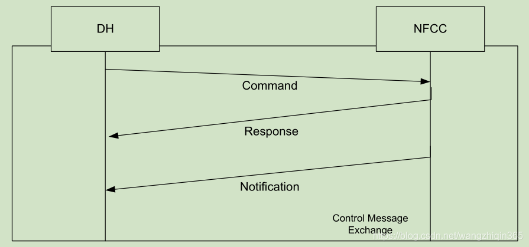
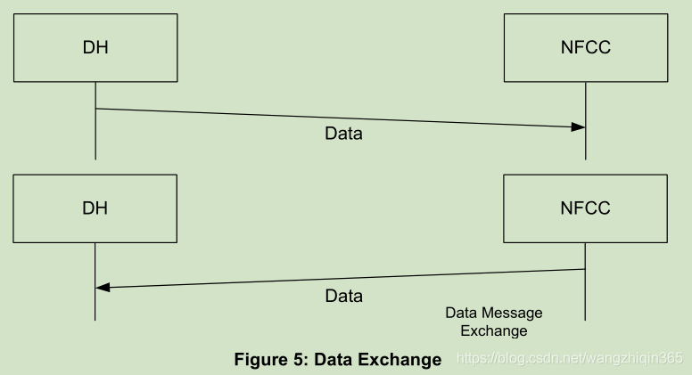

# 概要

因为nfc的指令,基本都是通过nci指令跟nfcc沟通.

所以备注nci指令用来查表,还是很有必要

# nci指令类别

nci指令分为控制指令,数据指令

## 控制指令

* cmd, Command

* rsp,Response

* ntf,Notification



## 数据指令

* data



# 指令

* 指令解析


控制Packet Header 3字节长度，主要包含MT、PBF、GID、OID、负载长度字节等组成

    * 前面3bit, 第7 6 5 bit, MT

    * 第4bit, PBF

    * 第3 2 1 0 bit, GID

    * 第2字节的 6-0bit, OID

    * 第三字节,数据长度

```
MT_check =  (unsigned char) ((rxbuf[0] >> 5) & 0x7);
GID_check = (unsigned char) (rxbuf[0]  & 0xF);
OID_check = (unsigned char) (rxbuf[1]  & 0x1F);

if(MT_check == 0)
{
    mycpy(cmd_string,"DATA:");

}
else
{
    if(GID_check == 0x0F)
    {
        mycpy(cmd_string, "NXP_Proprietary:");
    }
    else 
    {
        mycpy(cmd_string, command_tag[GID_check][OID_check][MT_check - 1]);
    }
}
```

```
unsigned char command_tag[3][16][3][50] =  {
    /*GID:0*/
	{
		/*OID:0*/
		{
			"CORE_RESET_CMD",
			"CORE_RESET_RSP",
			"CORE_RESET_NTF"
		},
		{
			"CORE_INIT_CMD",
			"CORE_INIT_RSP",
			""
		},
		{
			"CORE_SET_CONFIG_CMD",
			"CORE_SET_CONFIG_RSP",
			""
		},
		{
			"CORE_GET_CONFIG_CMD",
			"CORE_GET_CONFIG_RSP",
			""
		},
		{
			"CORE_CONN_CREATE_CMD",
			"CORE_CONN_CREATE_RSP",
			""
		},
		{
			"CORE_CONN_CLOSE_CMD",
			"CORE_CONN_CLOSE_RSP",
			""
		},
		{
			"",
			"",
			"CORE_CONN_CREDITS_NTF"
		},
		{
			"",
			"",
			"CORE_GENERIC_ERROR_NTF"
		},
		{
			"",
			"",
			"CORE_INTERFACE_ERROR_NTF"
		},
		{
			"RFU",
			"RFU",
			"RFU"
		}
		
	},
	
	/*GID:1*/
	{
		/*OID:0*/
		{
			"RF_DISCOVER_MAP_CMD",
			"RF_DISCOVER_MAP_RSP",
			""
		},
		{
			"RF_SET_LISTEN_MODE_ROUTING_CMD",
			"RF_SET_LISTEN_MODE_ROUTING_RSP",
			""
		},
		{
			"RF_GET_LISTEN_MODE_ROUTING_CMD",
			"RF_GET_LISTEN_MODE_ROUTING_RSP",
			"RF_GET_LISTEN_MODE_ROUTING_NTF"
		},
		{
			"RF_DISCOVER_CMD",
			"RF_DISCOVER_RSP",
			"RF_DISCOVER_NTF"
		},
		{
			"RF_DISCOVER_SELECT_CMD",
			"RF_DISCOVER_SELECT_RSP",
			""
		},
		{
			"",
			"",
			"RF_INTF_ACTIVATED_NTF"
		},
		{
			"RF_DEACTIVATE_CMD",
			"RF_DEACTIVATE_RSP",
			"RF_DEACTIVATE_NTF"
		},
		{
			"",
			"",
			"RF_FIELD_INFO_NTF"
		},
		{
			"RF_T3T_POLLING_CMD",
			"RF_T3T_POLLING_RSP",
			"RF_T3T_POLLING_NTF"
		},
		{
			"",
			"",
			"RF_NFCEE_ACTION_NTF"
		},
		{
			"",
			"",
			"RF_NFCEE_DISCOVERY_REQ_NTF"
		},
		{
			"RF_PARAMETER_UPDATE_CMD",
			"RF_PARAMETER_UPDATE_RSP",
			""
		},
		{
			"RF_LLCP_SYMMETRY_START_CMD",
			"RF_LLCP_SYMMETRY_START_RSP",
			""
		},
		{
			"RF_LLCP_SYMMETRY_STOP_CMD", 
			"RF_LLCP_SYMMETRY_STOP_RSP",
			""
		},
		{
			"RF_AGGREGATE_ABORT_CMD",
			"RF_AGGREGATE_ABORT_RSP",
			""
		},
		{
			"RFU",
			"RFU",
			"RFU"
		}
	},
	/*GID:02*/
	{
		{
			"NFCEE_DISCOVER_CMD",
			"NFCEE_DISCOVER_RSP",
			"NFCEE_DISCOVER_NTF"
		},
		{
			"NFCEE_MODE_SET_CMD",
			"NFCEE_MODE_SET_RSP",
			"NFCEE_MODE_SET_NTF"
		},
		{
			"RFU",
			"RFU",
			"RFU"
		}
	}
	
};
```


* cmd[0] == 0x20 && cmd[1] == 0x09

screenStateCommand = true;

    * 2009

* cmd[0] == 0x20 && cmd[1] == 0x09 && (cmd[3] == 0x00 || cmd[3] == 0x02)

Command for Screen State On-Locked or Unlocked

    * 200900

    * 200902

* cmd[0] == 0x20 && cmd[1] == 0x09 && (cmd[3] == 0x01 || cmd[3] == 0x03)

Command for Screen State OFF-locked or Unlocked

    * 200901

    * 200903

* cmd[0] == 0x20 && cmd[1] == 0x02 && cmd[2] == 0x05 && cmd[3] == 0x01 && cmd[4] == 0x00 && cmd[5] == 0x02

Command to update duration of discovery loop

    * 200205010002

* NCI_INIT_CMD

static uint8_t cmd_init_nci[] = {0x20, 0x01, 0x00};

    * 200100

* NCI_RESET_CMD

static uint8_t cmd_reset_nci[] = {0x20, 0x00, 0x01, 0x00};

    * 20000100

* NCI2_0_INIT_CMD

static uint8_t cmd_init_nci2_0[] = {0x20, 0x01, 0x02, 0x00, 0x00};

    * 2001020000