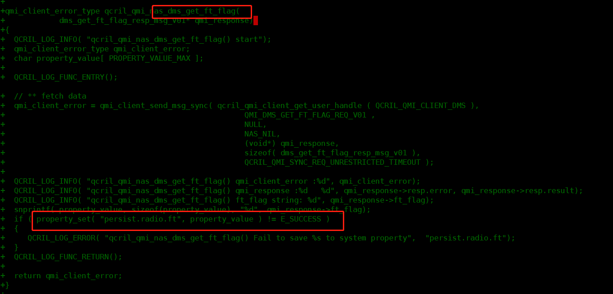

# 读取nvram

高通平台,要从nv里面读取校准,综测,耦合等nv参数,来判断机器是否耦合过,校准过,综测达标等

# 方法

## 美格

通过 开机时：通过qril-qmi接口去读取，同时是指对应属性值

* vendor/qcom/proprietary/qcril-hal/modules/nas/src/qcril_qmi_nas.cpp



## 移远

移远明确提出不支持读取nvram的支持

## 广和通

广和通提供了对nv的读取方法,nvctrl_read

看起来广和通的AutoMmiTool测试,也是通过nvcrtl_read读取的

* HardwareTestApplication.java

```
    public String getNvSN() {
        String ret = "UNKNOWN";

        if (nvctrlInit() >= 0) {
            ret = getSN();
            nvctrlDeinit();
        }
        return ret;
    }
```

* autommi.cpp

```
extern "C" JNIEXPORT jint JNICALL Java_com_fibocom_autommi_HardwareTestApplication_nvctrlInit(JNIEnv *env, jclass thiz) {
	XLOGI("%s Starting...", __FUNCTION__);
    if (!Diag_LSM_Init(NULL)) {
        XLOGE("fastmmi Test App: Diag_LSM_Init() failed. \n");
        goto err_1;
    }

    XLOGI("fastmmi Test App: Diag_LSM_Init() succeeded. \n");
    register_callback();

    handle = dlopen("/system/lib64/libmmi.so", RTLD_LAZY);
    if (!handle) {
        XLOGE("Function: %s, Line: %d, NULL == handle. \n", __FUNCTION__, __LINE__);
        goto err_2;
    }

    nvread = (nvctrl_t) dlsym(handle, "_Z12diag_nv_read18nv_items_enum_typePhi"/* "diag_nv_read" */);
    if (!nvread) {
        XLOGE("Function: %s, Line: %d, NULL == nvread. \n", __FUNCTION__, __LINE__);
        goto err_3;
    }
    nvwrite = (nvctrl_t) dlsym(handle, "_Z13diag_nv_write18nv_items_enum_typePhi"/* "diag_nv_write" */);
    if (!nvwrite) {
        XLOGE("Function: %s, Line: %d, NULL == nvwrite. \n", __FUNCTION__, __LINE__);
        goto err_3;
    }
    XLOGI("%s Finished. <Success>", __FUNCTION__);
    return SUCCESS;

err_3:
    if (handle) {
        dlclose(handle);
    }
err_2:
    Diag_LSM_DeInit();
err_1:
    XLOGI("%s Finished. <Failed>", __FUNCTION__);
    return FAILED;
}

```

```
################综测#######################
extern "C" JNIEXPORT jint JNICALL Java_com_fibocom_autommi_HardwareTestApplication_isNvComprehensive(JNIEnv *env, jclass thiz) {
    int ret = 0;
    unsigned char nv_read[128] = {0};

    XLOGI("%s Starting...", __FUNCTION__);
    ret = nvctrl_read(NV_FACTORY_DATA_2_I, nv_read, sizeof(nv_read));
    if (SUCCESS == ret) {
        XLOGI("NV[34]: %d.\n", nv_read[3]);
        ret = ((nv_read[3] == 'P') ? PASS : ((nv_read[3] == 'F') ? FAIL : UNKNOWN));
        return ret;
    }
    return UNKNOWN;
}
```

# 完整实现

开机,运行一个c应用,调用广和通的nv接口,读取需要的nv,然后配置到对应的属性

## selinux

```
diff --git a/QSSI.12/system/sepolicy/prebuilts/api/31.0/private/compat/26.0/26.0.ignore.cil b/QSSI.12/system/sepolicy/prebuilts/api/31.0/private/compat/26.0/26.0.ignore.cil
index 926adc1e924..b071a2e6821 100755
--- a/QSSI.12/system/sepolicy/prebuilts/api/31.0/private/compat/26.0/26.0.ignore.cil
+++ b/QSSI.12/system/sepolicy/prebuilts/api/31.0/private/compat/26.0/26.0.ignore.cil
@@ -273,7 +273,9 @@
     sysfs_authinfo
     vendor_snapcam_app
     systool_binder_service
-    pax_nvram_device))
+    pax_nvram_device
+    paxreadnvram
+    paxreadnvram_exec))
 
 ;; private_objects - a collection of types that were labeled differently in
 ;;     older policy, but that should not remain accessible to vendor policy.
diff --git a/QSSI.12/system/sepolicy/prebuilts/api/31.0/private/compat/27.0/27.0.ignore.cil b/QSSI.12/system/sepolicy/prebuilts/api/31.0/private/compat/27.0/27.0.ignore.cil
index a318cd6f716..17442dd6ca8 100755
--- a/QSSI.12/system/sepolicy/prebuilts/api/31.0/private/compat/27.0/27.0.ignore.cil
+++ b/QSSI.12/system/sepolicy/prebuilts/api/31.0/private/compat/27.0/27.0.ignore.cil
@@ -296,7 +296,9 @@
     sysfs_authinfo
     vendor_snapcam_app
     systool_binder_service
-    pax_nvram_device))
+    pax_nvram_device
+    paxreadnvram
+    paxreadnvram_exec))
 
 ;; private_objects - a collection of types that were labeled differently in
 ;;     older policy, but that should not remain accessible to vendor policy.
diff --git a/QSSI.12/system/sepolicy/prebuilts/api/31.0/private/compat/28.0/28.0.ignore.cil b/QSSI.12/system/sepolicy/prebuilts/api/31.0/private/compat/28.0/28.0.ignore.cil
index 06cdfa5efd4..9966bcd0a98 100755
--- a/QSSI.12/system/sepolicy/prebuilts/api/31.0/private/compat/28.0/28.0.ignore.cil
+++ b/QSSI.12/system/sepolicy/prebuilts/api/31.0/private/compat/28.0/28.0.ignore.cil
@@ -205,4 +205,6 @@
     sysfs_authinfo
     vendor_snapcam_app
     systool_binder_service
-    pax_nvram_device))
+    pax_nvram_device
+    paxreadnvram
+    paxreadnvram_exec))
diff --git a/QSSI.12/system/sepolicy/prebuilts/api/31.0/private/compat/29.0/29.0.ignore.cil b/QSSI.12/system/sepolicy/prebuilts/api/31.0/private/compat/29.0/29.0.ignore.cil
index 11883a0bb76..06d0206eb1d 100755
--- a/QSSI.12/system/sepolicy/prebuilts/api/31.0/private/compat/29.0/29.0.ignore.cil
+++ b/QSSI.12/system/sepolicy/prebuilts/api/31.0/private/compat/29.0/29.0.ignore.cil
@@ -175,4 +175,6 @@
     sysfs_authinfo
     vendor_snapcam_app
     systool_binder_service
-    pax_nvram_device))
+    pax_nvram_device
+    paxreadnvram
+    paxreadnvram_exec))
diff --git a/QSSI.12/system/sepolicy/prebuilts/api/31.0/private/compat/30.0/30.0.ignore.cil b/QSSI.12/system/sepolicy/prebuilts/api/31.0/private/compat/30.0/30.0.ignore.cil
index 93482887ded..3ad2e7ea5eb 100755
--- a/QSSI.12/system/sepolicy/prebuilts/api/31.0/private/compat/30.0/30.0.ignore.cil
+++ b/QSSI.12/system/sepolicy/prebuilts/api/31.0/private/compat/30.0/30.0.ignore.cil
@@ -199,4 +199,6 @@
     sysfs_authinfo
     vendor_snapcam_app
     systool_binder_service
-    pax_nvram_device))
+    pax_nvram_device
+    paxreadnvram
+    paxreadnvram_exec))
diff --git a/QSSI.12/system/sepolicy/prebuilts/api/31.0/private/domain.te b/QSSI.12/system/sepolicy/prebuilts/api/31.0/private/domain.te
index be5c5eb232e..d6633a6a036 100755
--- a/QSSI.12/system/sepolicy/prebuilts/api/31.0/private/domain.te
+++ b/QSSI.12/system/sepolicy/prebuilts/api/31.0/private/domain.te
@@ -368,6 +368,7 @@ neverallow ~{
   auth_bpadownload
   logkit-init
   paxdroid_logd
+  paxreadnvram
 } self:global_capability_class_set dac_override;
 # Since the kernel checks dac_read_search before dac_override, domains that
 # have dac_override should also have dac_read_search to eliminate spurious
diff --git a/QSSI.12/system/sepolicy/prebuilts/api/31.0/private/file_contexts b/QSSI.12/system/sepolicy/prebuilts/api/31.0/private/file_contexts
index 5055d00674b..be8ba363951 100755
--- a/QSSI.12/system/sepolicy/prebuilts/api/31.0/private/file_contexts
+++ b/QSSI.12/system/sepolicy/prebuilts/api/31.0/private/file_contexts
@@ -854,3 +854,4 @@
 #[FEATURE]-Add-BEGIN by xielianxiong@paxsz.com, 2023/02/21, for authinfo
 /dev/block/by-name/pax_nvram            u:object_r:pax_nvram_device:s0
 #[FEATURE]-Add-end by xielianxiong@paxsz.com, 2023/02/21, for authinfo
+/system/bin/paxreadnvram u:object_r:paxreadnvram_exec:s0
diff --git a/QSSI.12/system/sepolicy/prebuilts/api/31.0/private/init.te b/QSSI.12/system/sepolicy/prebuilts/api/31.0/private/init.te
index b25df872e0f..65be6b19a29 100644
--- a/QSSI.12/system/sepolicy/prebuilts/api/31.0/private/init.te
+++ b/QSSI.12/system/sepolicy/prebuilts/api/31.0/private/init.te
@@ -81,6 +81,9 @@ allow init ota_metadata_file:dir lock;
 allow init vd_device:blk_file relabelto;
 allow init block_device:lnk_file relabelfrom;
 allow init pax_nvram_device:lnk_file relabelto;
+# [FEATURE]-Add-BEGIN by (xielianxiong@paxsz.com),2023/06/07,fix selinux issue.
+allow init paxreadnvram_exec:file { execute read open getattr map };
+# [FEATURE]-Add-end by (xielianxiong@paxsz.com),2023/06/07,fix selinux issue.
 
 # Only init is allowed to set the sysprop indicating whether perf_event_open()
 # SELinux hooks were detected.
diff --git a/QSSI.12/system/sepolicy/private/compat/26.0/26.0.ignore.cil b/QSSI.12/system/sepolicy/private/compat/26.0/26.0.ignore.cil
index 926adc1e924..b071a2e6821 100755
--- a/QSSI.12/system/sepolicy/private/compat/26.0/26.0.ignore.cil
+++ b/QSSI.12/system/sepolicy/private/compat/26.0/26.0.ignore.cil
@@ -273,7 +273,9 @@
     sysfs_authinfo
     vendor_snapcam_app
     systool_binder_service
-    pax_nvram_device))
+    pax_nvram_device
+    paxreadnvram
+    paxreadnvram_exec))
 
 ;; private_objects - a collection of types that were labeled differently in
 ;;     older policy, but that should not remain accessible to vendor policy.
diff --git a/QSSI.12/system/sepolicy/private/compat/27.0/27.0.ignore.cil b/QSSI.12/system/sepolicy/private/compat/27.0/27.0.ignore.cil
index a318cd6f716..17442dd6ca8 100755
--- a/QSSI.12/system/sepolicy/private/compat/27.0/27.0.ignore.cil
+++ b/QSSI.12/system/sepolicy/private/compat/27.0/27.0.ignore.cil
@@ -296,7 +296,9 @@
     sysfs_authinfo
     vendor_snapcam_app
     systool_binder_service
-    pax_nvram_device))
+    pax_nvram_device
+    paxreadnvram
+    paxreadnvram_exec))
 
 ;; private_objects - a collection of types that were labeled differently in
 ;;     older policy, but that should not remain accessible to vendor policy.
diff --git a/QSSI.12/system/sepolicy/private/compat/28.0/28.0.ignore.cil b/QSSI.12/system/sepolicy/private/compat/28.0/28.0.ignore.cil
index 06cdfa5efd4..9966bcd0a98 100755
--- a/QSSI.12/system/sepolicy/private/compat/28.0/28.0.ignore.cil
+++ b/QSSI.12/system/sepolicy/private/compat/28.0/28.0.ignore.cil
@@ -205,4 +205,6 @@
     sysfs_authinfo
     vendor_snapcam_app
     systool_binder_service
-    pax_nvram_device))
+    pax_nvram_device
+    paxreadnvram
+    paxreadnvram_exec))
diff --git a/QSSI.12/system/sepolicy/private/compat/29.0/29.0.ignore.cil b/QSSI.12/system/sepolicy/private/compat/29.0/29.0.ignore.cil
index 11883a0bb76..06d0206eb1d 100755
--- a/QSSI.12/system/sepolicy/private/compat/29.0/29.0.ignore.cil
+++ b/QSSI.12/system/sepolicy/private/compat/29.0/29.0.ignore.cil
@@ -175,4 +175,6 @@
     sysfs_authinfo
     vendor_snapcam_app
     systool_binder_service
-    pax_nvram_device))
+    pax_nvram_device
+    paxreadnvram
+    paxreadnvram_exec))
diff --git a/QSSI.12/system/sepolicy/private/compat/30.0/30.0.ignore.cil b/QSSI.12/system/sepolicy/private/compat/30.0/30.0.ignore.cil
index 93482887ded..3ad2e7ea5eb 100755
--- a/QSSI.12/system/sepolicy/private/compat/30.0/30.0.ignore.cil
+++ b/QSSI.12/system/sepolicy/private/compat/30.0/30.0.ignore.cil
@@ -199,4 +199,6 @@
     sysfs_authinfo
     vendor_snapcam_app
     systool_binder_service
-    pax_nvram_device))
+    pax_nvram_device
+    paxreadnvram
+    paxreadnvram_exec))
diff --git a/QSSI.12/system/sepolicy/private/domain.te b/QSSI.12/system/sepolicy/private/domain.te
index be5c5eb232e..d6633a6a036 100755
--- a/QSSI.12/system/sepolicy/private/domain.te
+++ b/QSSI.12/system/sepolicy/private/domain.te
@@ -368,6 +368,7 @@ neverallow ~{
   auth_bpadownload
   logkit-init
   paxdroid_logd
+  paxreadnvram
 } self:global_capability_class_set dac_override;
 # Since the kernel checks dac_read_search before dac_override, domains that
 # have dac_override should also have dac_read_search to eliminate spurious
diff --git a/QSSI.12/system/sepolicy/private/file_contexts b/QSSI.12/system/sepolicy/private/file_contexts
index 5055d00674b..be8ba363951 100755
--- a/QSSI.12/system/sepolicy/private/file_contexts
+++ b/QSSI.12/system/sepolicy/private/file_contexts
@@ -854,3 +854,4 @@
 #[FEATURE]-Add-BEGIN by xielianxiong@paxsz.com, 2023/02/21, for authinfo
 /dev/block/by-name/pax_nvram            u:object_r:pax_nvram_device:s0
 #[FEATURE]-Add-end by xielianxiong@paxsz.com, 2023/02/21, for authinfo
+/system/bin/paxreadnvram u:object_r:paxreadnvram_exec:s0
diff --git a/QSSI.12/system/sepolicy/private/init.te b/QSSI.12/system/sepolicy/private/init.te
index b25df872e0f..65be6b19a29 100644
--- a/QSSI.12/system/sepolicy/private/init.te
+++ b/QSSI.12/system/sepolicy/private/init.te
@@ -81,6 +81,9 @@ allow init ota_metadata_file:dir lock;
 allow init vd_device:blk_file relabelto;
 allow init block_device:lnk_file relabelfrom;
 allow init pax_nvram_device:lnk_file relabelto;
+# [FEATURE]-Add-BEGIN by (xielianxiong@paxsz.com),2023/06/07,fix selinux issue.
+allow init paxreadnvram_exec:file { execute read open getattr map };
+# [FEATURE]-Add-end by (xielianxiong@paxsz.com),2023/06/07,fix selinux issue.
 
 # Only init is allowed to set the sysprop indicating whether perf_event_open()
 # SELinux hooks were detected.

```

## paxreadnvram.cpp

```
#include <stdio.h>
#include <stdlib.h>
#include <string.h>
#include <dlfcn.h> 
#include <android/log.h>
#include <android-base/properties.h>

#include "nv.h"
#include "diagcmd.h"

#define XLOG_TAG                        "paxreadnvram"
#define XLOGI(...)                      ( (void) __android_log_print(ANDROID_LOG_INFO, XLOG_TAG, __VA_ARGS__) )
#define XLOGW(...)                      ( (void) __android_log_print(ANDROID_LOG_WARN, XLOG_TAG, __VA_ARGS__) )
#define XLOGD(...)                      ( (void) __android_log_print(ANDROID_LOG_DEBUG, XLOG_TAG, __VA_ARGS__) )
#define XLOGE(...)                      ( (void) __android_log_print(ANDROID_LOG_ERROR, XLOG_TAG, __VA_ARGS__) )

#define SUCCESS                         ( 0 )
#define FAILED                          ( -1 )

#define PASS                            ( 1 )
#define FAIL                            ( -1 )
#define UNKNOWN                         ( 0 )

#define NV_QCSN_CONFIG_I				( 5291 )

#define CHAR_PTR(var)                   ( (unsigned char *) &(var) )

typedef int (*nvctrl_t)(nv_items_enum_type, unsigned char *, int);
static void *handle = NULL;
static nvctrl_t nvread = NULL;
static nvctrl_t nvwrite = NULL;

static void nv_revert_transfer(unsigned char *nv_ptr, int nv_len) {
    int id = 0;
    unsigned char *p_transfer = (unsigned char *)malloc(nv_len + 1);

    if (p_transfer != NULL) {
        memcpy(p_transfer, nv_ptr, nv_len);
        memset(nv_ptr, 0, nv_len);
        for (int i = 0; i < nv_len; i++) {
            if(p_transfer[i] == 0x7D) {
                nv_ptr[id++] = p_transfer[++i] + 0x20;
            } else {
                nv_ptr[id++] = p_transfer[i];
            }
        }
        free(p_transfer);
        p_transfer = NULL;
    }
}

static int nvctrl_read(nv_items_enum_type item,     /*!< Which NV item to read */
                       unsigned char *data_ptr,     /*!< buffer pointer to put the read data */
                       int len) {                   /*!< size of read buffer */
    unsigned char reply_buf[len + 3];
    int retry = 0;

    if (nvread) {
        do {
            memset(reply_buf, 0, sizeof(reply_buf));
            nvread(item, reply_buf, sizeof(reply_buf));
            if (reply_buf[0] == DIAG_NV_READ_F
                    && reply_buf[1] == CHAR_PTR(item)[0]
                    && reply_buf[2] == CHAR_PTR(item)[1]) {
                nv_revert_transfer(&reply_buf[3], len);
                memcpy(data_ptr, &reply_buf[3], len);
                return SUCCESS;
            }
            usleep(100 * 1000);
        } while (++retry < 10);
    }
    return FAILED;
}

static int nvctrl_write(nv_items_enum_type item,    /*!< Which NV item to write */
                        unsigned char *data_ptr,    /*!< buffer pointer pointing to the data to be written */
                        int len) {                  /*!< size of write data */
    int ret = 0;
	if (nvwrite) {
        ret = nvwrite(item, data_ptr, len);
		XLOGI("nvwrite ret = %d.\n", ret);
		return  ret;
    }
	XLOGI("nvwrite failed.\n");
    return FAILED;
}

static int nvctrlInit(void) {
    XLOGI("%s Starting...", __FUNCTION__);
    if (!Diag_LSM_Init(NULL)) {
        XLOGE("fastmmi Test App: Diag_LSM_Init() failed. \n");
        goto err_1;
    }

    XLOGI("fastmmi Test App: Diag_LSM_Init() succeeded. \n");
    register_callback();

    //handle = dlopen("/system/lib64/libmmi.so", RTLD_LAZY);
    handle = dlopen("/system_ext/lib/libmmi.so", RTLD_LAZY);
    if (!handle) {
        XLOGE("Function: %s, Line: %d, NULL == handle. \n", __FUNCTION__, __LINE__);
        goto err_2;
    }

    nvread = (nvctrl_t) dlsym(handle, "_Z12diag_nv_read18nv_items_enum_typePhi"/* "diag_nv_read" */);
    if (!nvread) {
        XLOGE("Function: %s, Line: %d, NULL == nvread. \n", __FUNCTION__, __LINE__);
        goto err_3;
    }
    nvwrite = (nvctrl_t) dlsym(handle, "_Z13diag_nv_write18nv_items_enum_typePhi"/* "diag_nv_write" */);
    if (!nvwrite) {
        XLOGE("Function: %s, Line: %d, NULL == nvwrite. \n", __FUNCTION__, __LINE__);
        goto err_3;
    }
    XLOGI("%s Finished. <Success>", __FUNCTION__);
    return SUCCESS;

err_3:
    if (handle) {
        dlclose(handle);
    }
err_2:
    Diag_LSM_DeInit();
err_1:
    XLOGI("%s Finished. <Failed>", __FUNCTION__);
    return FAILED;
}

static int nvctrlDeinit(void) {
    XLOGI("%s Starting...", __FUNCTION__);
    if (handle) {
        dlclose(handle);
    }
    Diag_LSM_DeInit();
    XLOGI("%s Finished. <Success>", __FUNCTION__);
    return SUCCESS;
}
//NV_FACTORY_DATA_2_I 2498
int main() {
    int ret = 0;
    unsigned char nv_read[128] = {0};

    XLOGD("%s Starting...", __FUNCTION__);
    if(nvctrlInit() >= 0){
        ret = nvctrl_read(NV_FACTORY_DATA_2_I, nv_read, sizeof(nv_read));
        if (SUCCESS == ret) {
            XLOGD("calibration NV[1]: %d.\n", nv_read[1]);
            if('P' == nv_read[1]){
                android::base::SetProperty("persist.radio.cal", "1");
            }
            XLOGD("comprehensive test NV[3]: %d.\n", nv_read[3]);
            if('P' == nv_read[3]){
                android::base::SetProperty("persist.radio.ft", "1");
            }
            XLOGD("coupling test NV[30]: %d.\n", nv_read[30]);
            if('P' == nv_read[30]){
                android::base::SetProperty("persist.radio.coupling", "1");
            }
        }else{
            XLOGE("nvctrl_read failed,ret = %d,\n", ret);
        }
    }else{
        XLOGE("paxreadnvram run failed");
    }
    nvctrlDeinit();
    return 0;
}
```

## paxreadnvram.rc

```
on property:sys.boot_completed=1
    start paxreadnvram

service paxreadnvram /system/bin/paxreadnvram
    class main
    user root
    group root
    oneshot
    disabled
```

## Android.mk

```
#---------------------------------

LOCAL_PATH := $(call my-dir)

include $(CLEAR_VARS)

LOCAL_SRC_FILES := paxreadnvram.cpp

LOCAL_SHARED_LIBRARIES := libdl libmmi libdiag_system liblog libbase

LOCAL_MODULE := paxreadnvram

LOCAL_PROPRIETARY_MODULE := false

LOCAL_CERTIFICATE := platform

LOCAL_MODULE_TAGS := optional

LOCAL_INIT_RC := paxreadnvram.rc

LOCAL_CFLAGS := -Wall

LOCAL_C_INCLUDES := $(LOCAL_PATH)/../../../qcom/proprietary/commonsys/fastmmi/libmmi/ \
					$(LOCAL_PATH)/../../../qcom/proprietary/commonsys/coretech-config-commonsys/diag/include/ \
					$(LOCAL_PATH)/../../../qcom/proprietary/common/inc/

include $(BUILD_EXECUTABLE)
```

# 问题点

## rc文件不跑

* 配置成以下配置就跑了,不能带有disabled,否则默认不跑

    ```
    on property:sys.boot_completed=1
        start paxreadnvram

    service paxreadnvram /system/bin/paxreadnvram
        class main
        user root
        group root
        oneshot
        disabled
    ```

* 并且selinux要配对,应该是没有一下这句导致不跑

    ```
    init_daemon_domain(paxreadnvram)
    ```

## 初始化失败Diag_LSM_Init

也是selinux问题

## selinux

### 运行报错,提示selinux缺失

Could not start service 'paxreadnvram' as part of class 'late_start': File /system/bin/paxreadnvram(labeled "u:object_r:system_file:s0") has incorrect label or no domain transition from u:r:init:s0 to another SELinux domain defined. Have you configured your service correctly?

* 修改方法,添加实体

    ```
    type paxreadnvram_exec, system_file_type, exec_type, file_type;
    type paxreadnvram,domain;
    # New added for move to /system
    typeattribute paxreadnvram coredomain;

    init_daemon_domain(paxreadnvram)

    allow paxreadnvram self:capability { dac_override };
    allow paxreadnvram property_socket:sock_file {  getattr read write };
    allow paxreadnvram init:unix_stream_socket { connectto };
    allow paxreadnvram radio_prop:property_service { set };
    ```

### 新增实体,提示旧版本兼容问题

FAILED: out/soong/.intermediates/system/sepolicy/plat_mapping_file/android_common/31.0.cil
out/soong/host/linux-x86/bin/version_policy -b out/soong/.intermediates/system/sepolicy/plat_pub_policy.cil/android_common/plat_pub_policy.cil -n 31.0 -o out/soong/.intermediates/system/sepolicy/plat_mapping_file/android_common/31.0.cil -m # hash of input list: 049668e46e420014f4f0809f7d85e403c7a447413e6140793dd87329e99423ff
typetransition unsupported statement in attributee policy (line 10947)
Unable to extract attributizable elements from source db.

* 修改方法,添加新增的实体,paxreadnvram,paxreadnvram_exec

    ```
	modified:   QSSI.12/system/sepolicy/prebuilts/api/31.0/private/compat/26.0/26.0.ignore.cil
	modified:   QSSI.12/system/sepolicy/prebuilts/api/31.0/private/compat/27.0/27.0.ignore.cil
	modified:   QSSI.12/system/sepolicy/prebuilts/api/31.0/private/compat/28.0/28.0.ignore.cil
	modified:   QSSI.12/system/sepolicy/prebuilts/api/31.0/private/compat/29.0/29.0.ignore.cil
	modified:   QSSI.12/system/sepolicy/prebuilts/api/31.0/private/compat/30.0/30.0.ignore.cil
	modified:   QSSI.12/system/sepolicy/prebuilts/api/31.0/private/domain.te
	modified:   QSSI.12/system/sepolicy/prebuilts/api/31.0/private/file_contexts
	modified:   QSSI.12/system/sepolicy/prebuilts/api/31.0/private/init.te
	modified:   QSSI.12/system/sepolicy/private/compat/26.0/26.0.ignore.cil
	modified:   QSSI.12/system/sepolicy/private/compat/27.0/27.0.ignore.cil
	modified:   QSSI.12/system/sepolicy/private/compat/28.0/28.0.ignore.cil
	modified:   QSSI.12/system/sepolicy/private/compat/29.0/29.0.ignore.cil
	modified:   QSSI.12/system/sepolicy/private/compat/30.0/30.0.ignore.cil
	modified:   QSSI.12/system/sepolicy/private/domain.te
	modified:   QSSI.12/system/sepolicy/private/file_contexts
	modified:   QSSI.12/system/sepolicy/private/init.te
    ```

# 技巧总结

* setprop ctl.start paxreadnvram

    可以打印selinux权限,setprop ctl.start 可以启动服务 start service

* ./system/bin/paxreadnvram

    不会打印selinux权限

# pax属性定义

* 校准,persist.radio.cal

* 综测,persist.radio.ft

* 耦合,persist.radio.coupling

# nvwrite 的接口

```
typedef int (*nvctrl_t)(nv_items_enum_type, unsigned char *, int);
static void *handle = NULL;
static nvctrl_t nvread = NULL;
static nvctrl_t nvwrite = NULL;

static int nvctrl_write(nv_items_enum_type item,    /*!< Which NV item to write */
                        unsigned char *data_ptr,    /*!< buffer pointer pointing to the data to be written */
                        int len) {                  /*!< size of write data */
    int ret = 0;
    if (nvwrite) {
        ret = nvwrite(item, data_ptr, len);
        XLOGI("nvwrite ret = %d.\n", ret);
        return  ret;
    }
    XLOGI("nvwrite failed.\n");
    return FAILED;
}


extern "C" JNIEXPORT jint JNICALL Java_com_fibocom_autommi_HardwareTestApplication_setNvTestResult(JNIEnv *env, jclass thiz, jboolean result, jboolean isLandiEdition) {
    int ret = 0;
    unsigned char nv_read[128] = {0};

    XLOGI("%s Starting...", __FUNCTION__);
    ret = nvctrl_read(NV_FACTORY_DATA_3_I, nv_read, sizeof(nv_read));
    if (SUCCESS == ret) {
        if (isLandiEdition) {
            for (int i = 0; i < 7; i++) {
                nv_read[i] = result ? 0xFF : 0x00;
            }
        } else {
            nv_read[35] = (result) ? 'P' : 'F';
        }
        ret = nvctrl_write(NV_FACTORY_DATA_3_I, nv_read, sizeof(nv_read));
        XLOGI("%s Finished. <ret = %d>", __FUNCTION__, ret);
        return ret;
    }
    XLOGI("%s Finished. <Failed>", __FUNCTION__);
    return FAILED;
}
```