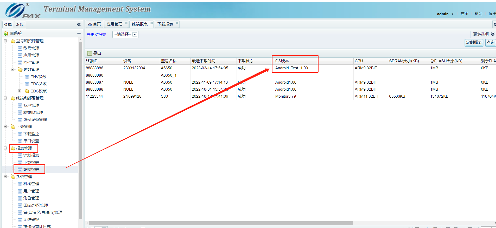
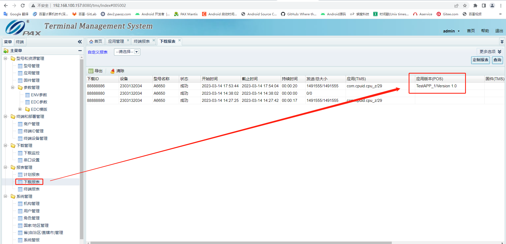
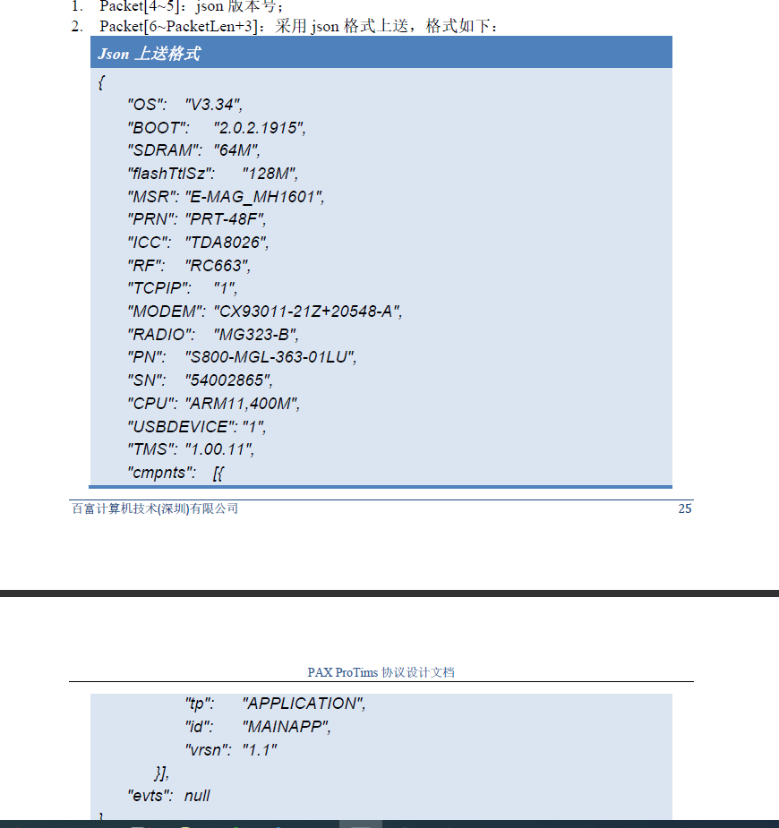
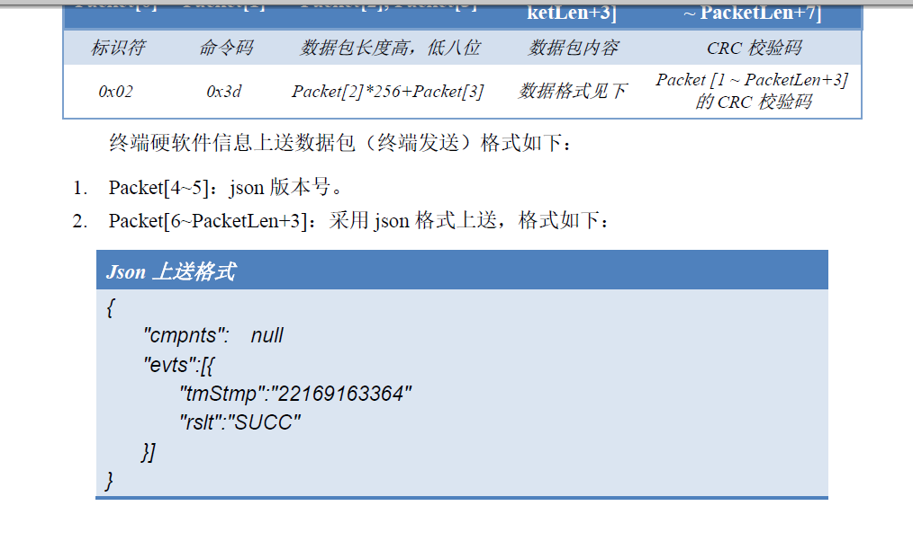

# README

protims是pax配合tms nextgen的一个实现库,原本应该主要适配prolin或者monitor产品的.后续加了android产品的一些兼容

后来android用maxstore,protims基本没有用了

但是旧客户(www.vietnatech.com)用开了protims就不想切换,所以后续有一些protims的维护需求

protims 下载地址,git@172.16.2.83:protims/protims-project.git

# 下载流程

* activity: mProtims.ProTimsRemoteLoadApp(mPara);

* protims_jni.c: Java_com_example_pax_protims_remotedownload_Protims_protimsRemoteLoadAppNative

* tms_setting.c: int ProtimsRemoteLoadEx( T_INCOMMPARA *ptCommPara, T_CalBckFuncs *ptCalBackFuncs)

* protimssetting.c: int ProTimsRemoteLoadApp(T_INCOMMPARA *ptCommPara, T_CalBckFuncs *ptCalBckFuncs) {

* protimsex.c: int ProTimsDownload(T_INCOMMPARA *ptInPara)

    * ProTimsHandshake

    * Authenticate

    * Uploading Info

    * ProTimsMultiGetTask

    * ProTimsParseRemoteTaskTable

    * start download

    * Uploading Info

    * ProTimsEnd

# 字段对应

## protims_comm.c

* OS版本

    ```
    //Android ver
        memset(ele_value, 0x00, sizeof(ele_value));
    -    sprintf((char *) ele_value, "Android%d.%02d", sVerInfo[1], sVerInfo[2]);
    +    sprintf((char *) ele_value, "Android_Test_%d.%02d", sVerInfo[1], sVerInfo[2]);^M
        cJSON_AddItemToObject(root, "OS", cJSON_CreateString(ele_value));
    ```

    

* 应用版本

    ```
        cJSON_AddItemToObject(root, "evts", evts = cJSON_CreateNull());

    -/*     *//*****************************************************************//*
    -       for(i = 0; i< 24; i++)
    -       {
    +^M
    +       //for(i = 0; i< 24; i++)^M
    +       //{^M
                    //iRet = ReadAppInfo(i, &AllApp[i]);
    -               if (iRet != PROTIMS_SUCCESS)
    -                       continue;
    -               else
    -               {
    +               //if (iRet != PROTIMS_SUCCESS)^M
    +                       //continue;^M
    +               //else^M
    +               //{^M
                            cJSON_AddItemToArray(cmpnts, fld = cJSON_CreateObject());
    -                       cJSON_AddStringToObject(fld, "tp", AllApp[i].AppName);
    -                       cJSON_AddStringToObject(fld, "id", AllApp[i].AID);
    -                       cJSON_AddStringToObject(fld, "vrsn", AllApp[i].AppVer);
    -               }
    -       }*/
    +                       cJSON_AddStringToObject(fld, "tp", "AndoridApplication");//AllApp[i].AppName^M
    +                       cJSON_AddStringToObject(fld, "id", "TestAPP_1");//AllApp[i].AID^M
    +                       cJSON_AddStringToObject(fld, "vrsn", "Version 1.0");//AllApp[i].AppVer^M
    +               //}^M
    +       //}^M

        char *p = cJSON_Print(root);
    ```

    

# 协议字段

* 下载前

    

* 下载后

    