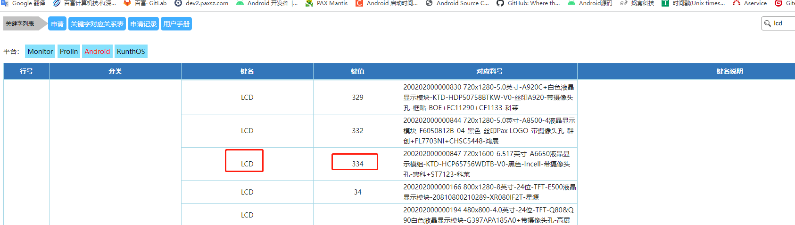
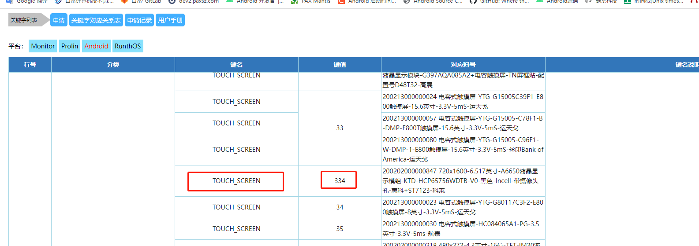
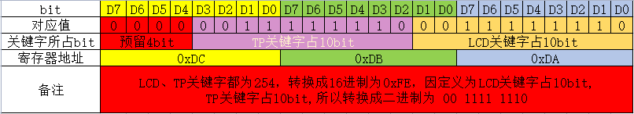
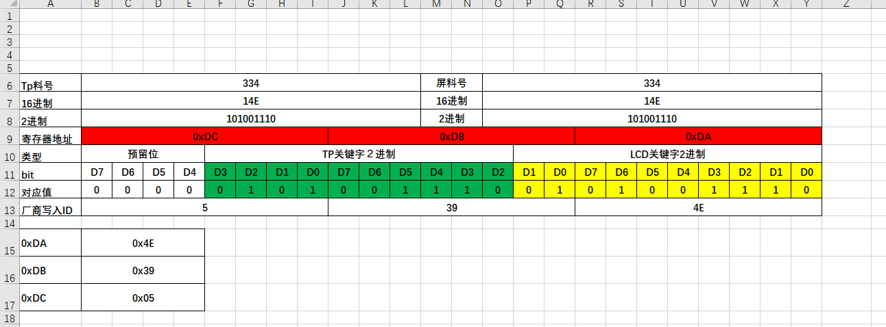

# 文档概要

pax 采取自定义的lcd id 跟tp id方法,下面介绍lcd id ,tp id的方法

# 查询料号

* 先从info,找到对应物料的关键字,研发与工程-> 终端资源配置-> 配置文件关键字, 点击Android.搜索需要关键字,lcd

    

* 同理查询tp,

    

# 生成id

pax标准屏的0xDA,0xDB,0xDC 三个寄存器分别存入关键字的2进制

规则如下

# 计算

所以只要查询到到物料号,换成2进制,一个个对应就可以

# 自动化excel表格

已经把excel表格自动化制作了.直接把查询到的10进制料号,写一下,就会自动化生成

[pax_lcd_id生成表格](files/pax_lcd_id%E7%94%9F%E6%88%90%E8%A1%A8%E6%A0%BC_20230612.xlsx)