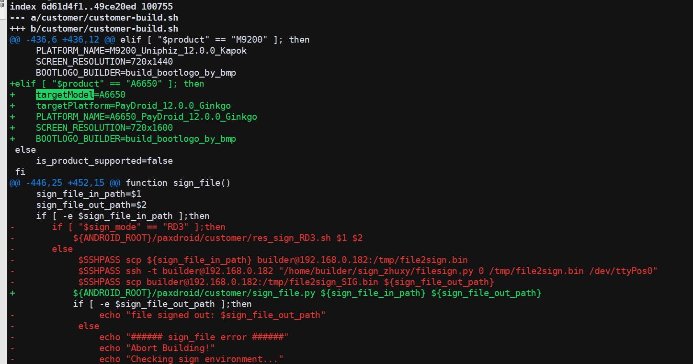

# 概要

客户资源包制作方法,原理介绍

# 原理介绍

通过新建/pax分区,并且烧录的时候,把文件系统烧录进去,pax.img 烧录到pax分区,把cache分区link到pax分区,

烧录客户资源包的时候,在cache目录,创建customer文件夹,并且里面,配对有bin,etc,app等目录,代码运行的时候,根据对应目录,安装对应文件.

或者过滤文件安装,安装完成后,创建APP_INSTALLED 等文件,写入app_installed 等字样,代表 客户资源包的app已经安装过

# 资源包制作

* 修改概要,以Smartweb 客户资源包举例

    

* customer/customer-build.sh

    添加项目的targetModel,平台代号,logo制作方法等,还可以直接指定签名脚本(上图的sign_file.py),默认的脚本签名对于某些服务器可能没适配

    

* customer/Smartweb/A6650/

    添加项目的文件夹,添加需要的资源包文件,包括填写OWNER_VERSION

    

* customer/Smartweb/Smartweb-A6650.sh

    填写具体的资源包制作脚本,注意CUSTOMER 要填写对于对应的客户名字,创建具体目录等

    

* 制作命令

    * ./paxdroid/customer/customer-build.sh A6650 customer_res Smartweb

* 生成文件在W:\ssdCode\a6650_1\QSSI.12\paxdroid\customer\pack\customer_res

    有客户资源包,还有ota包,都是可以使用paydroid tool导入

    