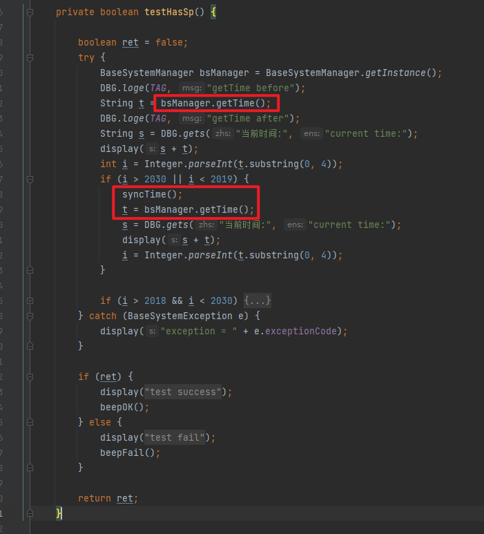
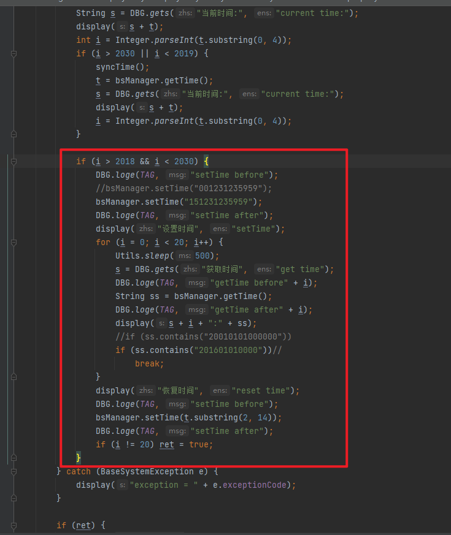

# 概要

项目需要发招标样机

# 关键字

ftest time,测试时间失败, gettime,getTime

# ftest测试原理

没有详细去跟,看是看起来就是从sp获取时间,如果时间范围少于2019,大于2030,就同步电脑时间

如果时间, 在 2018到2030之间,就调用setTime接口,设置sp时间.

其实就是测试setTime跟getTime接口是否有问题





# Log

看起来cong sp获取时间有问题

```
10-24 10:39:38.484  1865  2054 W PaxSPManager/SetApTimeService: paxTimeZone: Asia/Shanghai
10-24 10:39:38.484  1865  2054 W PaxSPManager/SetApTimeService: setTimeBasedTZ
10-24 10:39:38.485  1865  2054 W PaxSPManager/SetApTimeService: ++++++++++ap time millis = 1698115178485
10-24 10:39:38.485  1865  2054 W PaxSPManager/SetApTimeService: year = 2023 month=9  day=24  hour=10  minute=39   second=38
10-24 10:39:38.485  1865  2054 W PaxSPManager/SetApTimeService: +++gmtOffset=480
10-24 10:39:38.486  1865  2054 W PaxSPManager/SetApTimeService: +++newGmtOffset=480
10-24 10:39:38.514   671  2166 E spc     : ros_dev_ctl(686) info:ret:0
10-24 10:39:38.516  1865  2054 W PaxSPManager/SetApTimeService: ++++++++++sp time millis = -125158329484
10-24 10:39:38.516  1865  2054 W PaxSPManager/SetApTimeService: year = 1966 month=0  day=13  hour=17  minute=47   second=50
10-24 10:39:38.673   747  1375 D GNSSMGT : parse_rmc_token: in RMC, fixStatus=V
10-24 10:39:38.831  1832  1832 D charge_mgr: <charge_check, 760> current mode:1
10-24 10:39:38.998   747  1381 D GNSSMGT : watchdog: PowerState[CP WORKED], gps_flag[2], readcount[361], idle time = 0, HeartCount = 0
```

# 调用流程

OsPaxApi.GetTime(tmpTime);

* idh.code/paxdroid/external/pax/lib/libpaxapisvr/basesys/basesyssp.cpp

`baseSysFuncs->_GetTime = sp_GetTime;`

* idh.code/paxdroid/external/pax/lib/librunthosspdev/spdevapi_Sys_Fun.c

runthos sp是调用这支文件,非runthos是另外文件

```
/**************************************************************
Function: Spdev_GetTime(uchar *str)
Called By: sp_GetTime
Input:  str
Output: void
Others: 主副命令(00, 04)
Modify: 2021-09-30
**************************************************************/
void Spdev_GetTime(uchar *str)
{
    struct timeval tv;
    struct tm *timeinfo;
    struct RTC_TIME  time;

    spc_get_time(&tv);
    timeinfo = gmtime(&tv.tv_sec);

    time.Year = 1900 + timeinfo->tm_year - 2000;
    time.Month = timeinfo->tm_mon + 1; 
    time.Day = timeinfo->tm_mday;
    time.Hour = timeinfo->tm_hour;
    time.Minute = timeinfo->tm_min;
    time.Second = timeinfo->tm_sec;
    if(timeinfo->tm_wday != 0){
        time.DayOfWeek = timeinfo->tm_wday;
    }else {
        time.DayOfWeek = 7; 
    }    
    str[0] = vByteToBcd(time.Year);
    str[1] = vByteToBcd(time.Month);
    str[2] = vByteToBcd(time.Day);
    str[3] = vByteToBcd(time.Hour);
    str[4] = vByteToBcd(time.Minute);
    str[5] = vByteToBcd(time.Second);
    str[6] = vByteToBcd(time.DayOfWeek);
}
```

* idh.code/paxdroid/packages/PaxSPManager/src/com/pax/daemon/server/SetApTimeService.java

设置时间的时候会`getNewTime` ,如果返回复数,直接return,不会再跑下面的`setSpTime`

getNewTime函数会直接getSpTime获取时间,如果是少于0,就返回少于0

```
/** 
     * 根据新时区的时间，设置AP和SP的时间
     * @return
     */
    private  boolean setTimeBasedTZ() {
        long millis = getNewTime();
        if(millis < 0){ 
            return false;
        }   
        if ((millis / 1000) < Integer.MAX_VALUE) {
            PaxLog.w(TAG, "setCurrentTimeMillis");
            boolean setTimeResult=false;
            try {
                String spStatus = SystemProperties.get(PaxProperties.PROPERTY_SP_INTEGRATED);
                if(!spStatus.equals("1")){
                    if (isContainMethod(IALARMMANAGER_CLASS_NAME, SET_TIME_ORIGIN_CLASS_NAME)){
                        setTimeResult =  setTimeOrigin(millis);
                    }else{
                        setTimeResult =  SystemClock.setCurrentTimeMillis(millis);
                    }   
                }else{
                    if (isContainMethod(IALARMMANAGER_CLASS_NAME, SET_TIME_ORIGIN_CLASS_NAME)){
                        setTimeResult =  setTimeOrigin(millis) && setSpTime(millis);
                    }else{
                        setTimeResult =  SystemClock.setCurrentTimeMillis(millis) && setSpTime(millis);
                    }   
                }   
            } catch (Exception e) {
                PaxLog.e(TAG, "Unable to set RTC", e); 
            }   
            PaxLog.w(TAG,"setCurrentTimeMillis result :" + setTimeResult);
            PaxLog.w(TAG,"The current time is ="+Calendar.getInstance().getTimeInMillis() );
                return setTimeResult;
        } else {
            PaxLog.e(TAG, "setCurrentTimeMillis failed");
            return false;
        }
    }


//根据sp的时区，时间，计算出新时区对应的新时间
    private long getNewTime() {
        PaxLog.w(TAG, "++++++++++ap time millis = " + System.currentTimeMillis());
        millisToDate(System.currentTimeMillis());

        TimeZone zone = TimeZone.getTimeZone(SystemProperties.get(PAX_TIMEZONE_PROPERTY));
        TimeZone newZone = TimeZone.getTimeZone(SystemProperties.get(TIMEZONE_PROPERTY));

        int gmtOffset = zone.getOffset(System.currentTimeMillis());
        PaxLog.w(TAG,"+++gmtOffset="+(gmtOffset / 60000));

        int newGmtOffset = newZone.getOffset(System.currentTimeMillis());
        PaxLog.w(TAG,"+++newGmtOffset="+(newGmtOffset / 60000));

        long millis = getSpTime();
        if ((millis / 1000) >= Integer.MAX_VALUE) {
            return Integer.MAX_VALUE;
        } else if(millis < 0){
            return millis;
        }

        millis = millis - gmtOffset + newGmtOffset;
        PaxLog.w(TAG,"+++++calculate new time is ++++++++");
        millisToDate(millis);
        return millis;
    
```